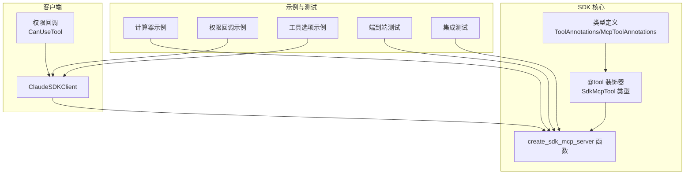
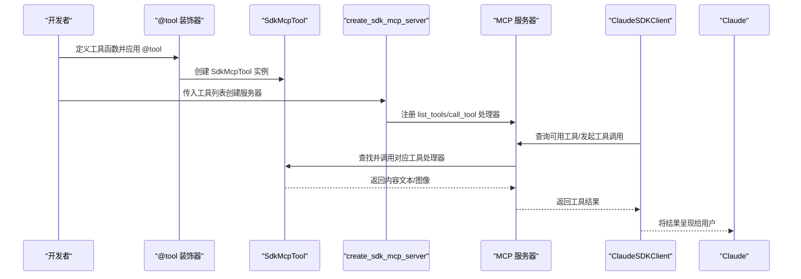
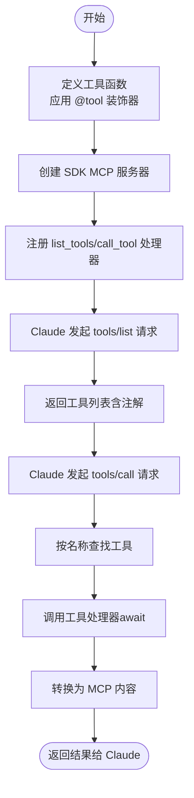
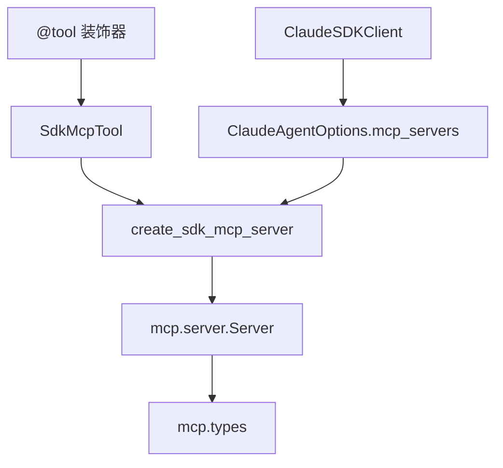

# 工具装饰器系统

<cite>
**本文档引用的文件**
- [src/claude_agent_sdk/__init__.py](file://src/claude_agent_sdk/__init__.py)
- [src/claude_agent_sdk/types.py](file://src/claude_agent_sdk/types.py)
- [src/claude_agent_sdk/client.py](file://src/claude_agent_sdk/client.py)
- [examples/mcp_calculator.py](file://examples/mcp_calculator.py)
- [examples/tool_permission_callback.py](file://examples/tool_permission_callback.py)
- [examples/tools_option.py](file://examples/tools_option.py)
- [e2e-tests/test_sdk_mcp_tools.py](file://e2e-tests/test_sdk_mcp_tools.py)
- [tests/test_sdk_mcp_integration.py](file://tests/test_sdk_mcp_integration.py)
</cite>

## 目录
1. [简介](#简介)
2. [项目结构](#项目结构)
3. [核心组件](#核心组件)
4. [架构总览](#架构总览)
5. [详细组件分析](#详细组件分析)
6. [依赖关系分析](#依赖关系分析)
7. [性能考虑](#性能考虑)
8. [故障排除指南](#故障排除指南)
9. [结论](#结论)
10. [附录](#附录)

## 简介
本文件系统性地阐述 Claude Agent SDK 中的“工具装饰器系统”，重点围绕 @tool 装饰器的使用方法、工具函数签名规范、参数类型验证与返回值格式要求、异步处理机制与错误处理策略，以及工具的注册、发现与调用的完整流程。文档同时提供多种工具实现示例，帮助开发者快速上手并正确集成自定义工具。

## 项目结构
该系统主要由以下模块组成：
- 装饰器与服务器：在主包中定义 @tool 装饰器、SdkMcpTool 类型、create_sdk_mcp_server 函数等
- 类型定义：在 types 模块中定义工具相关的类型（如 ToolAnnotations、McpToolAnnotations 等）
- 客户端与会话：在 client 模块中封装与 Claude 的交互、权限控制、MCP 服务器状态管理等
- 示例与测试：examples 与 tests 目录提供了丰富的使用示例与端到端测试

图表来源
- [src/claude_agent_sdk/__init__.py:111-340](file://src/claude_agent_sdk/__init__.py#L111-L340)
- [src/claude_agent_sdk/types.py:572-589](file://src/claude_agent_sdk/types.py#L572-L589)
- [src/claude_agent_sdk/client.py:21-500](file://src/claude_agent_sdk/client.py#L21-L500)

章节来源
- [src/claude_agent_sdk/__init__.py:1-445](file://src/claude_agent_sdk/__init__.py#L1-L445)
- [src/claude_agent_sdk/types.py:1-800](file://src/claude_agent_sdk/types.py#L1-L800)
- [src/claude_agent_sdk/client.py:1-500](file://src/claude_agent_sdk/client.py#L1-L500)

## 核心组件
- @tool 装饰器：用于声明工具，接收工具名称、描述、输入模式（字典或类型化模式）与可选注解，并返回 SdkMcpTool 实例
- SdkMcpTool：承载工具元数据（名称、描述、输入模式、处理器、注解）的类型化容器
- create_sdk_mcp_server：创建内联 MCP 服务器，注册 list_tools 与 call_tool 处理器，暴露工具给 Claude 使用
- ToolAnnotations/McpToolAnnotations：工具注解类型，支持只读、破坏性、开放世界等标注
- ClaudeSDKClient：与 Claude 进行交互的客户端，支持权限回调、MCP 服务器状态查询与工具调用

章节来源
- [src/claude_agent_sdk/__init__.py:100-176](file://src/claude_agent_sdk/__init__.py#L100-L176)
- [src/claude_agent_sdk/__init__.py:178-340](file://src/claude_agent_sdk/__init__.py#L178-L340)
- [src/claude_agent_sdk/types.py:572-589](file://src/claude_agent_sdk/types.py#L572-L589)
- [src/claude_agent_sdk/client.py:21-500](file://src/claude_agent_sdk/client.py#L21-L500)

## 架构总览
下图展示了工具装饰器系统在 SDK 中的整体架构与交互路径：

图表来源
- [src/claude_agent_sdk/__init__.py:111-176](file://src/claude_agent_sdk/__init__.py#L111-L176)
- [src/claude_agent_sdk/__init__.py:178-340](file://src/claude_agent_sdk/__init__.py#L178-L340)
- [src/claude_agent_sdk/client.py:143-180](file://src/claude_agent_sdk/client.py#L143-L180)

## 详细组件分析

### @tool 装饰器详解
- 功能：为工具函数添加元数据与类型安全包装，返回 SdkMcpTool 实例
- 参数
  - name：工具唯一标识，用于被 Claude 调用时识别
  - description：工具用途描述，帮助 Claude 判断何时调用
  - input_schema：输入模式，支持三类形式
    - 字典映射：键为参数名，值为类型（str/int/float/bool 等）
    - 类型化模式：如 TypedDict 或其他类型（内部会生成基础 JSON Schema）
    - JSON Schema 字典：直接提供完整 JSON Schema
  - annotations：可选工具注解（如只读、破坏性、开放世界）
- 返回：SdkMcpTool 实例，包含 name、description、input_schema、handler、annotations
- 使用要点
  - 工具函数必须是异步函数（async def）
  - 接收单一字典参数（包含所有输入参数）
  - 返回字典，其中必须包含 "content" 键；内容为文本或图像条目列表
  - 可通过 "is_error": True 表示错误响应

章节来源
- [src/claude_agent_sdk/__init__.py:111-176](file://src/claude_agent_sdk/__init__.py#L111-L176)

### SdkMcpTool 数据模型
- 字段
  - name：工具名称
  - description：工具描述
  - input_schema：输入模式（类型或字典/JSON Schema）
  - handler：异步处理器函数
  - annotations：可选注解
- 作用：作为工具定义的载体，供 create_sdk_mcp_server 注册与调用

章节来源
- [src/claude_agent_sdk/__init__.py:100-109](file://src/claude_agent_sdk/__init__.py#L100-L109)

### create_sdk_mcp_server 服务器注册
- 功能：创建内联 MCP 服务器实例，注册工具发现与调用处理器
- 注册的处理器
  - list_tools：将工具定义转换为 MCP Tool 结构，包含名称、描述、输入 Schema 与注解
  - call_tool：根据名称查找工具，调用其 handler，将返回内容转换为 MCP 文本/图像内容
- 输入 Schema 转换规则
  - 若为字典映射：自动推断类型并生成 JSON Schema（字符串/整数/数字/布尔），必填字段为全部参数
  - 若为 JSON Schema 字典：直接使用
  - 其他类型：生成基础对象 Schema
- 返回：McpSdkServerConfig（包含 type="sdk"、name、instance）

章节来源
- [src/claude_agent_sdk/__init__.py:178-340](file://src/claude_agent_sdk/__init__.py#L178-L340)

### 工具函数签名规范与返回值格式
- 签名规范
  - 必须为异步函数（async def）
  - 接收单一字典参数（包含所有输入参数）
  - 返回字典，必须包含 "content" 键
- 返回值格式
  - content：列表，元素为文本或图像内容对象
    - 文本内容：包含 type="text" 与 text 字段
    - 图像内容：包含 type="image"、data、mimeType 字段
  - 错误标记：可通过 "is_error": True 标识错误响应
- 异常处理
  - 工具函数抛出异常会被服务器捕获并转换为错误结果返回给 Claude

章节来源
- [src/claude_agent_sdk/__init__.py:138-162](file://src/claude_agent_sdk/__init__.py#L138-L162)
- [src/claude_agent_sdk/__init__.py:308-338](file://src/claude_agent_sdk/__init__.py#L308-L338)

### 参数类型验证与输入模式
- 支持的输入模式
  - 字典映射：键为参数名，值为 Python 类型（str/int/float/bool 等）
  - JSON Schema 字典：直接提供完整 JSON Schema
  - 其他类型：生成基础对象 Schema
- 验证与转换
  - list_tools 处理器会将输入模式转换为 MCP Tool 的 inputSchema
  - 对于字典映射，自动推断类型并设置为必填
- TypedDict/复杂模式
  - 当 input_schema 为非字典映射时，生成基础对象 Schema，便于统一处理

章节来源
- [src/claude_agent_sdk/__init__.py:267-296](file://src/claude_agent_sdk/__init__.py#L267-L296)

### 工具注解（ToolAnnotations）
- 类型定义
  - ToolAnnotations：装饰器层使用的注解类型
  - McpToolAnnotations：MCP 服务器状态返回的注解类型
- 支持的注解
  - readOnly：只读工具
  - destructive：可能破坏性操作
  - openWorld：开放世界工具（可访问外部资源）
- 流转
  - @tool 的 annotations 会存储在 SdkMcpTool 上
  - list_tools 处理器会将注解写入 MCP Tool
  - JSONRPC tools/list 响应中包含注解字段

章节来源
- [src/claude_agent_sdk/types.py:572-589](file://src/claude_agent_sdk/types.py#L572-L589)
- [src/claude_agent_sdk/__init__.py:111-116](file://src/claude_agent_sdk/__init__.py#L111-L116)
- [tests/test_sdk_mcp_integration.py:269-381](file://tests/test_sdk_mcp_integration.py#L269-L381)

### 异步处理机制与错误处理策略
- 异步执行
  - 工具函数必须为异步函数
  - call_tool 处理器通过 await 调用工具处理器
- 错误处理
  - 工具函数内部异常会被服务器捕获并转换为错误结果
  - 工具函数可通过返回 "is_error": True 显式标记错误
  - 返回内容会被转换为 MCP 文本/图像内容对象

章节来源
- [src/claude_agent_sdk/__init__.py:308-338](file://src/claude_agent_sdk/__init__.py#L308-L338)
- [tests/test_sdk_mcp_integration.py:120-149](file://tests/test_sdk_mcp_integration.py#L120-L149)

### 工具注册、发现与调用流程
- 注册
  - 使用 @tool 定义工具，返回 SdkMcpTool
  - 通过 create_sdk_mcp_server 传入工具列表创建服务器
  - 服务器注册 list_tools 与 call_tool 处理器
- 发现
  - Claude 通过 tools/list 请求获取可用工具列表
  - 服务器返回工具名称、描述、输入 Schema 与注解
- 调用
  - Claude 通过 tools/call 请求调用指定工具
  - 服务器根据名称查找工具并调用其处理器
  - 返回内容转换为 MCP 文本/图像内容

图表来源
- [src/claude_agent_sdk/__init__.py:178-340](file://src/claude_agent_sdk/__init__.py#L178-L340)

章节来源
- [src/claude_agent_sdk/__init__.py:178-340](file://src/claude_agent_sdk/__init__.py#L178-L340)

### 权限控制与工具调用
- 权限回调
  - 可配置 can_use_tool 回调，在每次工具调用前进行权限决策
  - 支持允许、拒绝、修改输入等行为
- 工具白名单/黑名单
  - 通过 allowed_tools/disallowed_tools 控制工具可用性
  - 未显式授权的工具不会被执行

章节来源
- [examples/tool_permission_callback.py:26-94](file://examples/tool_permission_callback.py#L26-L94)
- [e2e-tests/test_sdk_mcp_tools.py:54-95](file://e2e-tests/test_sdk_mcp_tools.py#L54-L95)

### 完整工具定义示例
- 计算器工具（多参数、错误处理）
  - 包含加减乘除、开方、幂运算等工具
  - 展示了异步函数、返回值格式与错误标记的使用
- 端到端测试工具
  - 验证工具执行、权限控制、多工具序列调用等场景
- 集成测试工具
  - 验证注解流转、JSONRPC 响应、错误处理等

章节来源
- [examples/mcp_calculator.py:24-98](file://examples/mcp_calculator.py#L24-L98)
- [e2e-tests/test_sdk_mcp_tools.py:25-49](file://e2e-tests/test_sdk_mcp_tools.py#L25-L49)
- [tests/test_sdk_mcp_integration.py:27-98](file://tests/test_sdk_mcp_integration.py#L27-L98)

## 依赖关系分析
- 组件耦合
  - @tool 与 SdkMcpTool：强耦合，装饰器返回工具定义
  - create_sdk_mcp_server 与 mcp.server.Server：通过装饰器生成的工具注册处理器
  - ClaudeSDKClient 与服务器配置：通过 options.mcp_servers 传递服务器配置
- 外部依赖
  - mcp.types：提供 Tool、CallToolRequest、ListToolsRequest 等类型
  - typing_extensions：提供 NotRequired 等类型特性

图表来源
- [src/claude_agent_sdk/__init__.py:111-176](file://src/claude_agent_sdk/__init__.py#L111-L176)
- [src/claude_agent_sdk/__init__.py:178-340](file://src/claude_agent_sdk/__init__.py#L178-L340)
- [src/claude_agent_sdk/client.py:143-180](file://src/claude_agent_sdk/client.py#L143-L180)

章节来源
- [src/claude_agent_sdk/__init__.py:1-445](file://src/claude_agent_sdk/__init__.py#L1-L445)
- [src/claude_agent_sdk/client.py:1-500](file://src/claude_agent_sdk/client.py#L1-L500)

## 性能考虑
- 内联服务器优势
  - 服务器运行在同一进程，避免 IPC 开销，提升性能
  - 更简单的部署与调试体验
- 处理器实现
  - list_tools 与 call_tool 采用轻量级处理器，减少额外转换成本
- 建议
  - 在工具函数中尽量避免阻塞操作，保持异步特性
  - 合理设计输入模式，避免过深的嵌套结构

[本节为通用指导，无需特定文件来源]

## 故障排除指南
- 工具未被调用
  - 检查是否在 allowed_tools 中显式授权
  - 确认服务器已正确注册且未被禁用
- 返回内容格式错误
  - 确保返回字典包含 "content" 键
  - content 中的条目需为文本或图像对象
- 注解未生效
  - 确认 @tool 的 annotations 参数正确传入
  - 检查 list_tools 响应中是否包含注解字段
- 权限问题
  - 如启用 can_use_tool 回调，确保回调逻辑正确返回允许/拒绝/修改后的输入

章节来源
- [e2e-tests/test_sdk_mcp_tools.py:54-95](file://e2e-tests/test_sdk_mcp_tools.py#L54-L95)
- [tests/test_sdk_mcp_integration.py:269-381](file://tests/test_sdk_mcp_integration.py#L269-L381)

## 结论
工具装饰器系统通过 @tool 装饰器与 create_sdk_mcp_server 提供了简洁而强大的工具定义与执行框架。它支持灵活的输入模式、完善的注解体系、严格的异步与错误处理机制，并与 ClaudeSDKClient 的权限控制无缝集成。开发者可以基于本文档提供的规范与示例，快速构建高质量的自定义工具并安全地交付给 Claude 使用。

[本节为总结，无需特定文件来源]

## 附录

### 工具函数签名与返回值规范速查
- 签名：async def handler(args: dict[str, Any]) -> dict[str, Any]
- 输入：args 为工具参数字典
- 输出：必须包含 "content" 键，值为文本/图像条目列表
- 错误：可通过 "is_error": True 标记错误

章节来源
- [src/claude_agent_sdk/__init__.py:138-162](file://src/claude_agent_sdk/__init__.py#L138-L162)

### 工具注解类型速查
- ToolAnnotations：装饰器层注解类型
- McpToolAnnotations：MCP 服务器状态返回注解类型
- 支持字段：readOnly、destructive、openWorld

章节来源
- [src/claude_agent_sdk/types.py:572-589](file://src/claude_agent_sdk/types.py#L572-L589)

### 示例与测试参考
- 计算器示例：展示多参数工具与错误处理
- 权限回调示例：展示 can_use_tool 回调的使用
- 工具选项示例：展示 tools 数组与预设工具
- 端到端测试：验证工具执行与权限控制
- 集成测试：验证注解流转与 JSONRPC 响应

章节来源
- [examples/mcp_calculator.py:1-194](file://examples/mcp_calculator.py#L1-L194)
- [examples/tool_permission_callback.py:1-159](file://examples/tool_permission_callback.py#L1-L159)
- [examples/tools_option.py:1-112](file://examples/tools_option.py#L1-L112)
- [e2e-tests/test_sdk_mcp_tools.py:1-169](file://e2e-tests/test_sdk_mcp_tools.py#L1-L169)
- [tests/test_sdk_mcp_integration.py:1-200](file://tests/test_sdk_mcp_integration.py#L1-L200)