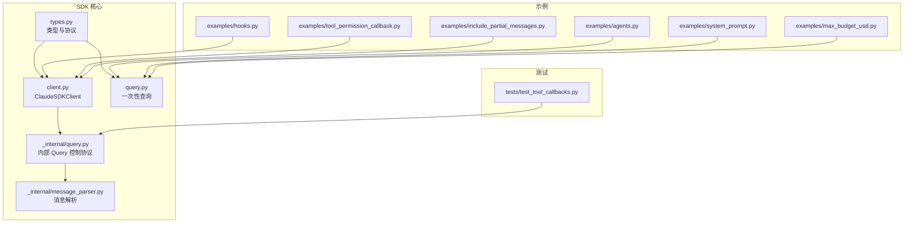
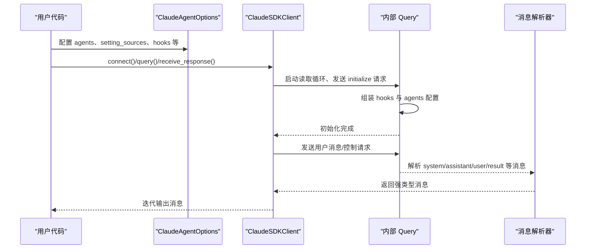
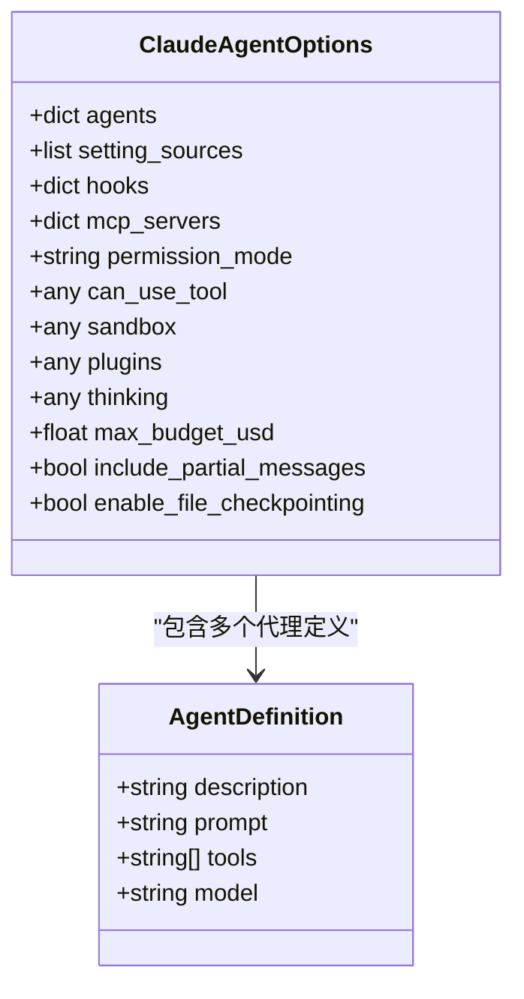
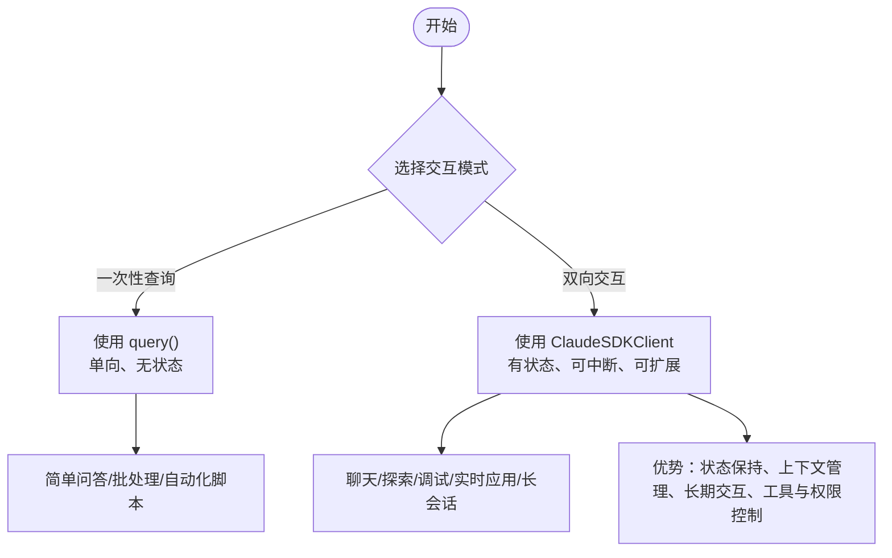
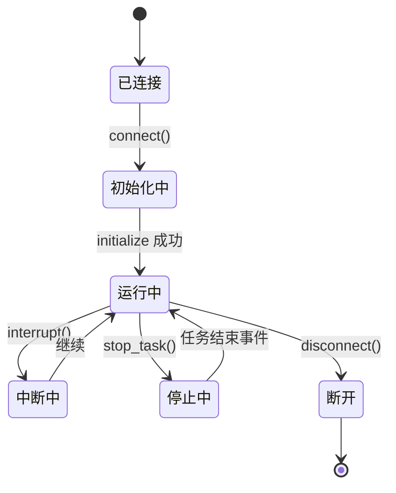
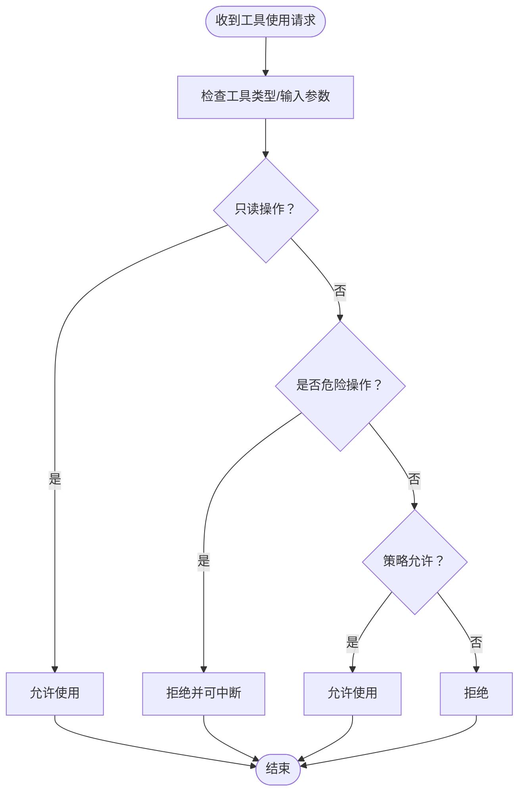
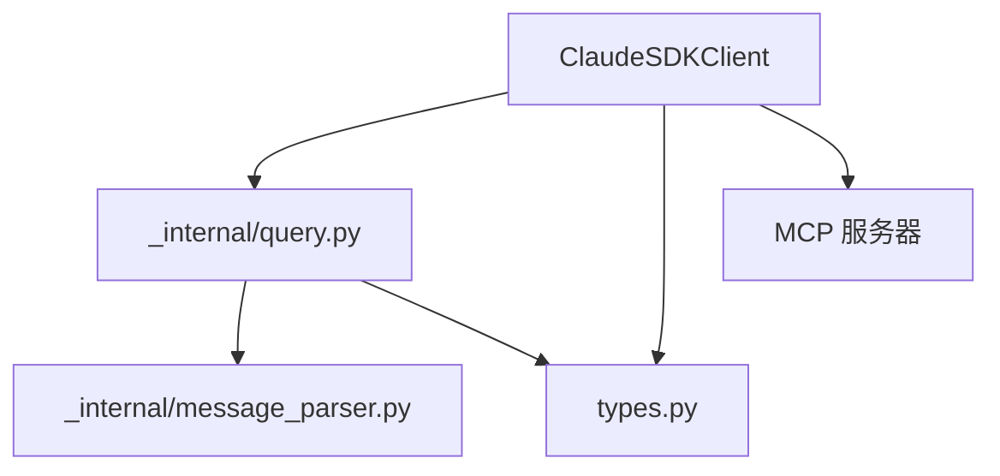

# 代理定义

<cite>
**本文引用的文件**
- [src/claude_agent_sdk/types.py](file://src/claude_agent_sdk/types.py)
- [src/claude_agent_sdk/client.py](file://src/claude_agent_sdk/client.py)
- [src/claude_agent_sdk/query.py](file://src/claude_agent_sdk/query.py)
- [src/claude_agent_sdk/_internal/query.py](file://src/claude_agent_sdk/_internal/query.py)
- [src/claude_agent_sdk/_internal/message_parser.py](file://src/claude_agent_sdk/_internal/message_parser.py)
- [examples/agents.py](file://examples/agents.py)
- [examples/system_prompt.py](file://examples/system_prompt.py)
- [examples/hooks.py](file://examples/hooks.py)
- [examples/tool_permission_callback.py](file://examples/tool_permission_callback.py)
- [examples/include_partial_messages.py](file://examples/include_partial_messages.py)
- [examples/max_budget_usd.py](file://examples/max_budget_usd.py)
- [tests/test_tool_callbacks.py](file://tests/test_tool_callbacks.py)
</cite>

## 目录
1. [简介](#简介)
2. [项目结构](#项目结构)
3. [核心组件](#核心组件)
4. [架构总览](#架构总览)
5. [详细组件分析](#详细组件分析)
6. [依赖分析](#依赖分析)
7. [性能考虑](#性能考虑)
8. [故障排查指南](#故障排查指南)
9. [结论](#结论)
10. [附录](#附录)

## 简介
本文件面向希望使用 Claude Agent SDK 构建“代理”的开发者，系统性阐述代理定义 AgentDefinition 的结构、配置与使用方式，以及其与传统一次性查询（query）的区别与优势：包括状态保持、上下文管理、长期交互能力；并覆盖代理的创建与配置流程、生命周期管理（启动、运行、暂停与停止）、复杂行为实现（多步骤任务、条件判断与决策树）、与外部系统的集成（API、数据库、文件系统），以及最佳实践、性能优化、测试与调试方法。

## 项目结构
围绕代理定义与使用的相关模块与示例分布如下：
- 类型与协议定义：types.py
- 客户端与控制协议：client.py、_internal/query.py
- 一次性查询接口：query.py
- 消息解析与类型：_internal/message_parser.py
- 示例：agents.py、system_prompt.py、hooks.py、tool_permission_callback.py、include_partial_messages.py、max_budget_usd.py
- 测试：tests/test_tool_callbacks.py



**图表来源**
- [src/claude_agent_sdk/types.py:42-50](file://src/claude_agent_sdk/types.py#L42-L50)
- [src/claude_agent_sdk/client.py:21-60](file://src/claude_agent_sdk/client.py#L21-L60)
- [src/claude_agent_sdk/query.py:12-20](file://src/claude_agent_sdk/query.py#L12-L20)
- [src/claude_agent_sdk/_internal/query.py:128-155](file://src/claude_agent_sdk/_internal/query.py#L128-L155)
- [src/claude_agent_sdk/_internal/message_parser.py:141-170](file://src/claude_agent_sdk/_internal/message_parser.py#L141-L170)
- [examples/agents.py:23-50](file://examples/agents.py#L23-L50)
- [examples/system_prompt.py:14-55](file://examples/system_prompt.py#L14-L55)
- [examples/hooks.py:156-193](file://examples/hooks.py#L156-L193)
- [examples/tool_permission_callback.py:96-159](file://examples/tool_permission_callback.py#L96-L159)
- [examples/include_partial_messages.py:28-57](file://examples/include_partial_messages.py#L28-L57)
- [examples/max_budget_usd.py:15-77](file://examples/max_budget_usd.py#L15-L77)
- [tests/test_tool_callbacks.py:511-549](file://tests/test_tool_callbacks.py#L511-L549)

**章节来源**
- [src/claude_agent_sdk/types.py:42-50](file://src/claude_agent_sdk/types.py#L42-L50)
- [src/claude_agent_sdk/client.py:21-60](file://src/claude_agent_sdk/client.py#L21-L60)
- [src/claude_agent_sdk/query.py:12-20](file://src/claude_agent_sdk/query.py#L12-L20)

## 核心组件
- AgentDefinition：代理定义的核心数据结构，包含描述、提示词、工具集与模型选择等字段。
- ClaudeAgentOptions：代理相关的全局配置，支持 agents 字典、setting_sources、hooks、mcp_servers、permission_mode 等。
- ClaudeSDKClient：双向交互客户端，支持流式输入、中断、权限模式切换、MCP 服务器管理、任务停止、文件回溯等。
- query：一次性查询接口，适合简单、无状态、单向的交互场景。
- 内部 Query 与消息解析：负责初始化、控制协议、钩子回调、消息分发与解析。

**章节来源**
- [src/claude_agent_sdk/types.py:42-50](file://src/claude_agent_sdk/types.py#L42-L50)
- [src/claude_agent_sdk/types.py:1030-1099](file://src/claude_agent_sdk/types.py#L1030-L1099)
- [src/claude_agent_sdk/client.py:21-60](file://src/claude_agent_sdk/client.py#L21-L60)
- [src/claude_agent_sdk/query.py:12-20](file://src/claude_agent_sdk/query.py#L12-L20)
- [src/claude_agent_sdk/_internal/query.py:128-155](file://src/claude_agent_sdk/_internal/query.py#L128-L155)
- [src/claude_agent_sdk/_internal/message_parser.py:141-170](file://src/claude_agent_sdk/_internal/message_parser.py#L141-L170)

## 架构总览
下图展示了代理定义在 SDK 中的端到端调用链路：从用户侧的 ClaudeAgentOptions 配置，到客户端连接、内部 Query 初始化、控制协议下发代理定义，再到消息解析与响应返回。



**图表来源**
- [src/claude_agent_sdk/client.py:94-180](file://src/claude_agent_sdk/client.py#L94-L180)
- [src/claude_agent_sdk/_internal/query.py:128-155](file://src/claude_agent_sdk/_internal/query.py#L128-L155)
- [src/claude_agent_sdk/_internal/message_parser.py:141-170](file://src/claude_agent_sdk/_internal/message_parser.py#L141-L170)

## 详细组件分析

### AgentDefinition 结构与配置
- 字段说明
  - description：代理用途与角色描述
  - prompt：代理提示词
  - tools：可选工具列表或预设
  - model：可选模型标识（如 sonnet/opus/haiku/inherit）
- 使用方式
  - 在 ClaudeAgentOptions.agents 中以键值对形式注册多个自定义代理
  - 可结合 setting_sources 控制设置来源（user/project/local）



**图表来源**
- [src/claude_agent_sdk/types.py:42-50](file://src/claude_agent_sdk/types.py#L42-L50)
- [src/claude_agent_sdk/types.py:1030-1099](file://src/claude_agent_sdk/types.py#L1030-L1099)

**章节来源**
- [src/claude_agent_sdk/types.py:42-50](file://src/claude_agent_sdk/types.py#L42-L50)
- [src/claude_agent_sdk/types.py:1030-1099](file://src/claude_agent_sdk/types.py#L1030-L1099)
- [examples/agents.py:23-50](file://examples/agents.py#L23-L50)

### 与一次性查询的区别与优势
- 一次性查询（query）
  - 单向、无状态、一次性交互
  - 适合简单问题、批处理、CI/CD 自动化
- 双向交互客户端（ClaudeSDKClient）
  - 支持会话状态保持、上下文累积、动态消息发送
  - 支持中断、权限模式切换、MCP 服务器管理、任务停止、文件回溯
  - 更适合长期交互、复杂工作流与实时应用



**图表来源**
- [src/claude_agent_sdk/query.py:18-44](file://src/claude_agent_sdk/query.py#L18-L44)
- [src/claude_agent_sdk/client.py:21-60](file://src/claude_agent_sdk/client.py#L21-L60)

**章节来源**
- [src/claude_agent_sdk/query.py:18-44](file://src/claude_agent_sdk/query.py#L18-L44)
- [src/claude_agent_sdk/client.py:21-60](file://src/claude_agent_sdk/client.py#L21-L60)

### 代理创建与配置流程
- 步骤
  - 定义 AgentDefinition 并放入 ClaudeAgentOptions.agents
  - 可选：设置 setting_sources、hooks、mcp_servers、permission_mode、tools 等
  - 通过 query 或 ClaudeSDKClient 使用代理
- 示例参考
  - 多代理示例：agents.py
  - 系统提示配置：system_prompt.py
  - 钩子与权限回调：hooks.py、tool_permission_callback.py

```mermaid
sequenceDiagram
participant Dev as "开发者"
participant Opt as "ClaudeAgentOptions"
participant Cli as "ClaudeSDKClient"
participant IQ as "内部 Query"
Dev->>Opt : 创建 agents、setting_sources、hooks 等
Dev->>Cli : connect()
Cli->>IQ : 发送 initialize 请求含 agents
IQ-->>Cli : 初始化成功
Dev->>Cli : query()/receive_response()
Cli-->>Dev : 返回消息流
```

**图表来源**
- [examples/agents.py:82-101](file://examples/agents.py#L82-L101)
- [examples/system_prompt.py:42-68](file://examples/system_prompt.py#L42-L68)
- [src/claude_agent_sdk/client.py:94-180](file://src/claude_agent_sdk/client.py#L94-L180)
- [src/claude_agent_sdk/_internal/query.py:128-155](file://src/claude_agent_sdk/_internal/query.py#L128-L155)

**章节来源**
- [examples/agents.py:23-101](file://examples/agents.py#L23-L101)
- [examples/system_prompt.py:14-75](file://examples/system_prompt.py#L14-L75)
- [src/claude_agent_sdk/client.py:94-180](file://src/claude_agent_sdk/client.py#L94-L180)
- [src/claude_agent_sdk/_internal/query.py:128-155](file://src/claude_agent_sdk/_internal/query.py#L128-L155)

### 生命周期管理
- 启动：connect() 建立连接并初始化，内部发送 initialize 请求，注册 agents 与 hooks
- 运行：query() 发送消息；receive_messages()/receive_response() 接收消息流
- 暂停/中断：interrupt() 发送中断信号（仅流式模式）
- 停止：stop_task() 停止指定任务；disconnect() 断开连接
- 其他：set_permission_mode() 切换权限模式；set_model() 切换模型；rewind_files() 回溯文件变更



**图表来源**
- [src/claude_agent_sdk/client.py:94-180](file://src/claude_agent_sdk/client.py#L94-L180)
- [src/claude_agent_sdk/client.py:228-383](file://src/claude_agent_sdk/client.py#L228-L383)

**章节来源**
- [src/claude_agent_sdk/client.py:94-180](file://src/claude_agent_sdk/client.py#L94-L180)
- [src/claude_agent_sdk/client.py:228-383](file://src/claude_agent_sdk/client.py#L228-L383)

### 复杂行为实现：多步骤任务、条件判断与决策树
- 多步骤任务
  - 使用 TaskStartedMessage/TaskProgressMessage/TaskNotificationMessage 进行进度与结果跟踪
  - 通过 stop_task() 对任务进行控制
- 条件判断与决策树
  - PreToolUse 钩子：基于工具名与输入内容进行允许/拒绝/询问
  - PostToolUse 钩子：根据工具输出提供反馈、附加上下文或系统消息
  - UserPromptSubmit 钩子：在提交时注入上下文信息
- 权限回调
  - can_use_tool：在工具使用前动态决定是否允许、修改输入或更新权限建议



**图表来源**
- [examples/hooks.py:46-135](file://examples/hooks.py#L46-L135)
- [examples/tool_permission_callback.py:26-94](file://examples/tool_permission_callback.py#L26-L94)
- [src/claude_agent_sdk/_internal/message_parser.py:141-170](file://src/claude_agent_sdk/_internal/message_parser.py#L141-L170)

**章节来源**
- [examples/hooks.py:156-301](file://examples/hooks.py#L156-L301)
- [examples/tool_permission_callback.py:26-94](file://examples/tool_permission_callback.py#L26-L94)
- [src/claude_agent_sdk/_internal/message_parser.py:141-170](file://src/claude_agent_sdk/_internal/message_parser.py#L141-L170)

### 与外部系统集成
- 文件系统与命令执行
  - Read/Grep/Glob/Write/Edit/Bash 等工具用于文件读写与命令执行
  - 可通过 hooks 与权限回调限制危险命令或重定向输出路径
- MCP 服务器
  - 通过 mcp_servers 注册本地/HTTP/SSE/SDK 类型的 MCP 服务
  - get_mcp_status()/reconnect_mcp_server()/toggle_mcp_server() 管理连接状态
- 数据库与 API
  - 通过 Bash 或自定义 MCP 工具对接外部系统；注意权限与安全策略

**章节来源**
- [examples/tool_permission_callback.py:48-81](file://examples/tool_permission_callback.py#L48-L81)
- [src/claude_agent_sdk/client.py:385-416](file://src/claude_agent_sdk/client.py#L385-L416)
- [src/claude_agent_sdk/client.py:314-360](file://src/claude_agent_sdk/client.py#L314-L360)

### 最佳实践与性能优化
- 性能
  - 合理设置 include_partial_messages 提升交互体验，但注意消息解析与渲染开销
  - 使用 max_budget_usd 控制成本，避免超支
  - 适当调整 thinking 配置与最大思考令牌数，平衡深度与延迟
- 安全
  - 使用 can_use_tool 与 hooks 对危险操作进行拦截与改写
  - 严格限制工具白名单与目录权限
- 可靠性
  - 使用 enable_file_checkpointing 与 rewind_files 回溯文件变更
  - 监控 MCP 服务器状态，及时重连或禁用失败服务

**章节来源**
- [examples/include_partial_messages.py:28-57](file://examples/include_partial_messages.py#L28-L57)
- [examples/max_budget_usd.py:15-77](file://examples/max_budget_usd.py#L15-L77)
- [examples/tool_permission_callback.py:26-94](file://examples/tool_permission_callback.py#L26-L94)
- [src/claude_agent_sdk/client.py:282-313](file://src/claude_agent_sdk/client.py#L282-L313)
- [src/claude_agent_sdk/client.py:385-416](file://src/claude_agent_sdk/client.py#L385-L416)

### 测试与调试
- 单元测试
  - 使用测试框架验证钩子回调、权限决策与消息解析
- 调试技巧
  - 开启 stderr 回调或日志记录，观察控制协议与消息流转
  - 使用 include_partial_messages 观察增量输出
  - 通过 get_mcp_status() 检查 MCP 服务器健康状况

**章节来源**
- [tests/test_tool_callbacks.py:511-549](file://tests/test_tool_callbacks.py#L511-L549)
- [examples/include_partial_messages.py:28-57](file://examples/include_partial_messages.py#L28-L57)
- [src/claude_agent_sdk/client.py:418-441](file://src/claude_agent_sdk/client.py#L418-L441)

## 依赖分析
- 组件耦合
  - ClaudeSDKClient 依赖内部 Query 与传输层，负责控制协议与消息分发
  - AgentDefinition 通过 ClaudeAgentOptions 注入内部 Query 的初始化请求
  - 钩子与权限回调通过内部 Query 的控制通道进行交互
- 外部依赖
  - MCP 服务器（stdio/sse/http/sdk/proxy）由客户端统一管理
  - CLI 作为后端执行引擎，SDK 通过控制协议与其通信



**图表来源**
- [src/claude_agent_sdk/client.py:94-180](file://src/claude_agent_sdk/client.py#L94-L180)
- [src/claude_agent_sdk/_internal/query.py:128-155](file://src/claude_agent_sdk/_internal/query.py#L128-L155)
- [src/claude_agent_sdk/_internal/message_parser.py:141-170](file://src/claude_agent_sdk/_internal/message_parser.py#L141-L170)
- [src/claude_agent_sdk/types.py:1030-1099](file://src/claude_agent_sdk/types.py#L1030-L1099)

**章节来源**
- [src/claude_agent_sdk/client.py:94-180](file://src/claude_agent_sdk/client.py#L94-L180)
- [src/claude_agent_sdk/_internal/query.py:128-155](file://src/claude_agent_sdk/_internal/query.py#L128-L155)
- [src/claude_agent_sdk/_internal/message_parser.py:141-170](file://src/claude_agent_sdk/_internal/message_parser.py#L141-L170)
- [src/claude_agent_sdk/types.py:1030-1099](file://src/claude_agent_sdk/types.py#L1030-L1099)

## 性能考虑
- 流式与部分消息：启用 include_partial_messages 可改善感知延迟，但需权衡 CPU 与内存占用
- 成本控制：max_budget_usd 在每次 API 调用完成后检查，最终可能略超预算
- 思考深度：合理设置 thinking 与最大思考令牌数，避免过度消耗
- 工具白名单：最小化允许工具集，减少不必要的网络与文件系统访问

[本节为通用指导，无需特定文件来源]

## 故障排查指南
- 无法连接或初始化失败
  - 检查 CLI 是否正确安装与可执行
  - 查看 stderr 回调或日志输出
- MCP 服务器连接异常
  - 使用 get_mcp_status() 获取状态，必要时 reconnect_mcp_server()/toggle_mcp_server()
- 工具被拒绝
  - 检查 can_use_tool 与 hooks 的决策逻辑
  - 确认 permission_mode 与权限规则
- 任务未停止或卡住
  - 使用 stop_task() 并监听 task_notification 事件确认状态

**章节来源**
- [src/claude_agent_sdk/client.py:385-416](file://src/claude_agent_sdk/client.py#L385-L416)
- [src/claude_agent_sdk/client.py:314-360](file://src/claude_agent_sdk/client.py#L314-L360)
- [examples/tool_permission_callback.py:26-94](file://examples/tool_permission_callback.py#L26-L94)

## 结论
通过 AgentDefinition 与 ClaudeAgentOptions，开发者可以灵活地定义多种代理角色，并借助 ClaudeSDKClient 实现具备状态保持、上下文管理与长期交互能力的智能体。配合 hooks、权限回调、MCP 服务器与文件回溯机制，可构建从简单问答到复杂任务编排的多样化应用场景。遵循本文的最佳实践与性能优化建议，可在保证安全性的同时提升交互体验与系统稳定性。

[本节为总结性内容，无需特定文件来源]

## 附录
- 快速上手
  - 定义 AgentDefinition 并注册到 options.agents
  - 通过 query 或 ClaudeSDKClient 使用代理
  - 结合 hooks 与权限回调实现安全可控的工具使用
- 参考示例
  - 多代理与系统提示：examples/agents.py、examples/system_prompt.py
  - 钩子与权限：examples/hooks.py、examples/tool_permission_callback.py
  - 部分消息与成本控制：examples/include_partial_messages.py、examples/max_budget_usd.py

[本节为概览性内容，无需特定文件来源]