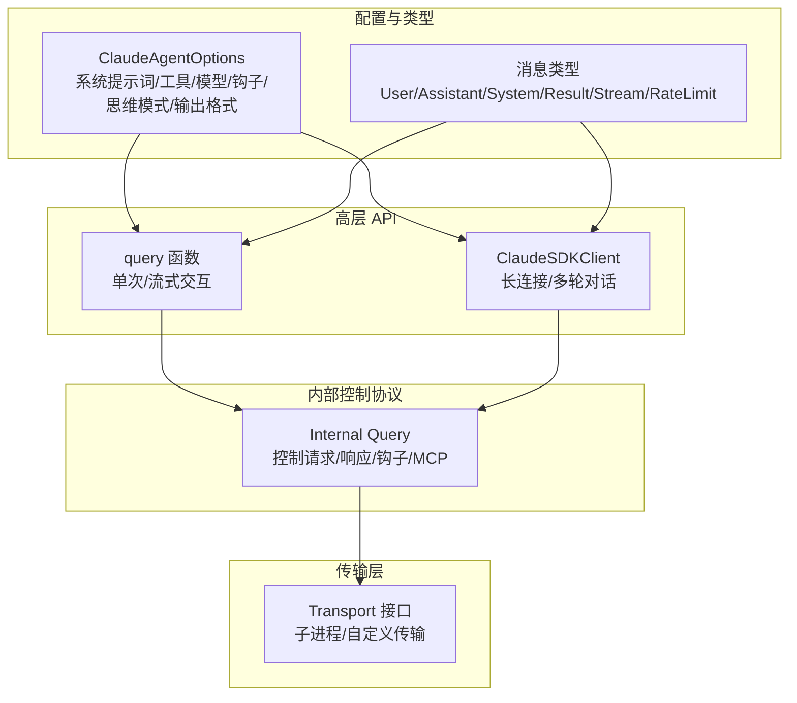
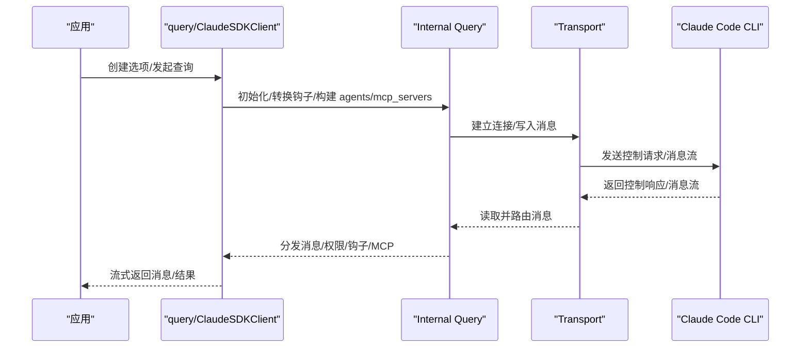
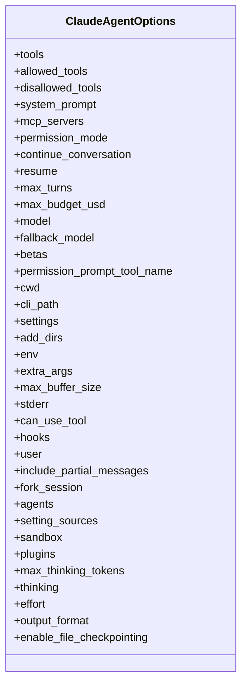
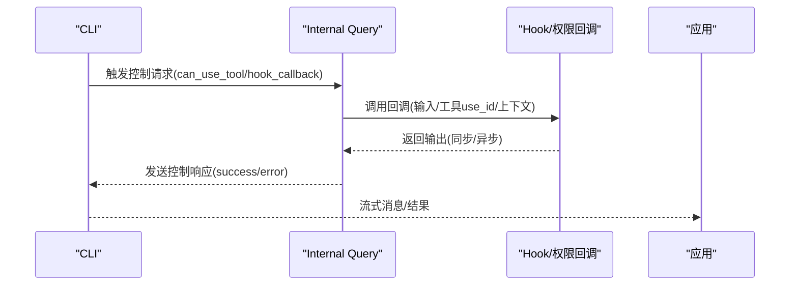
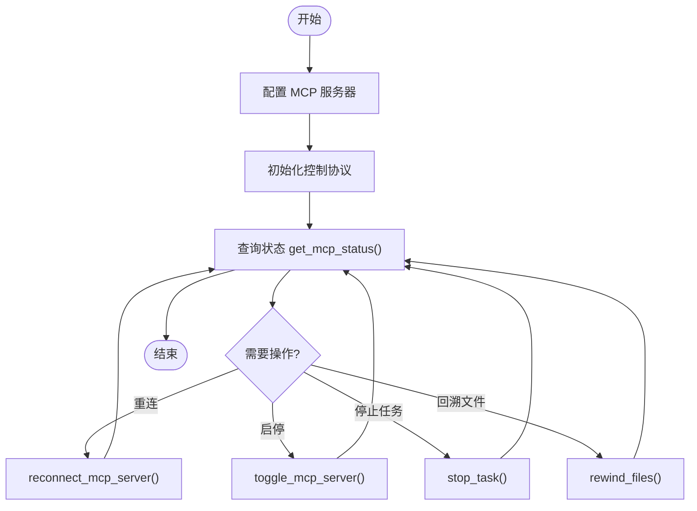
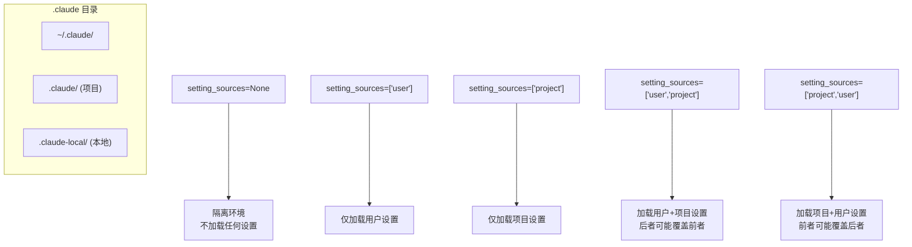
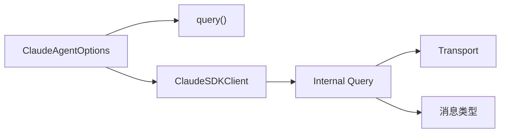

# 代理设置

<cite>
**本文引用的文件**
- [settings.json](file://.claude/settings.json)
- [client.py](file://src/claude_agent_sdk/client.py)
- [query.py](file://src/claude_agent_sdk/query.py)
- [types.py](file://src/claude_agent_sdk/types.py)
- [_errors.py](file://src/claude_agent_sdk/_errors.py)
- [_internal/query.py](file://src/claude_agent_sdk/_internal/query.py)
- [system_prompt.py](file://examples/system_prompt.py)
- [setting_sources.py](file://examples/setting_sources.py)
- [tools_option.py](file://examples/tools_option.py)
- [max_budget_usd.py](file://examples/max_budget_usd.py)
- [plugin_example.py](file://examples/plugin_example.py)
</cite>

## 目录
1. [简介](#简介)
2. [项目结构](#项目结构)
3. [核心组件](#核心组件)
4. [架构总览](#架构总览)
5. [详细组件分析](#详细组件分析)
6. [依赖分析](#依赖分析)
7. [性能考虑](#性能考虑)
8. [故障排查指南](#故障排查指南)
9. [结论](#结论)
10. [附录](#附录)

## 简介
本文件面向“代理设置系统”的使用者与维护者，系统性梳理代理配置选项、系统提示词定制、思维模式（thinking）配置、输出格式与内容过滤、代理行为个性化与配置文件管理、设置来源优先级与继承关系，以及配置验证与错误处理的最佳实践。文档以仓库中的类型定义、客户端实现、内部控制协议与示例为依据，辅以可视化图示帮助理解。

## 项目结构
该 SDK 将“高层 API”与“底层传输/控制协议”分层设计：
- 高层 API：对外暴露的查询与客户端接口，负责会话管理、工具权限回调、钩子、MCP 服务器等。
- 内部控制协议：封装与 CLI 的双向通信，负责初始化、权限决策、钩子回调、MCP 消息桥接等。
- 类型与配置：集中定义代理选项、消息类型、钩子与权限规则、思维模式与输出格式等。

**图表来源**
- [client.py:21-500](file://src/claude_agent_sdk/client.py#L21-L500)
- [_internal/query.py:53-679](file://src/claude_agent_sdk/_internal/query.py#L53-L679)
- [query.py:12-127](file://src/claude_agent_sdk/query.py#L12-L127)
- [types.py:1029-1199](file://src/claude_agent_sdk/types.py#L1029-L1199)

**章节来源**
- [client.py:21-500](file://src/claude_agent_sdk/client.py#L21-L500)
- [_internal/query.py:53-679](file://src/claude_agent_sdk/_internal/query.py#L53-L679)
- [query.py:12-127](file://src/claude_agent_sdk/query.py#L12-L127)
- [types.py:1029-1199](file://src/claude_agent_sdk/types.py#L1029-L1199)

## 核心组件
- 代理选项（ClaudeAgentOptions）
  - 系统提示词：字符串或预设（含可选追加片段）
  - 工具集：数组或预设；也可通过 allowed_tools/disallowed_tools 细化
  - 权限模式：default/acceptEdits/plan/bypassPermissions
  - 模型选择：model/fallback_model
  - 钩子：hooks（事件到匹配器/回调列表）
  - MCP 服务器：mcp_servers（支持 stdio/sse/http/sdk/proxy）
  - 思维模式：thinking（adaptive/enabled/disabled 及预算）
  - 输出格式：output_format（结构化输出 JSON Schema 等）
  - 设置来源：setting_sources（user/project/local）
  - 其他：cwd、env、extra_args、max_budget_usd、include_partial_messages、agents、plugins、sandbox、enable_file_checkpointing 等
- 控制协议（Query）
  - 初始化、权限决策、钩子回调、MCP 桥接、中断、模型切换、任务控制、文件回溯等
- 客户端（ClaudeSDKClient）
  - 连接/断开、查询、接收消息、修改权限模式/模型、MCP 状态与重连、任务停止、文件回溯等
- 错误体系（ClaudeSDKError 系列）
  - CLI 连接失败、CLI 未找到、进程错误、JSON 解码失败、消息解析失败等

**章节来源**
- [types.py:1029-1199](file://src/claude_agent_sdk/types.py#L1029-L1199)
- [_internal/query.py:53-679](file://src/claude_agent_sdk/_internal/query.py#L53-L679)
- [client.py:21-500](file://src/claude_agent_sdk/client.py#L21-L500)
- [_errors.py:6-57](file://src/claude_agent_sdk/_errors.py#L6-L57)

## 架构总览
下图展示从高层 API 到内部控制协议再到传输层的整体调用链路，以及关键配置如何注入到控制协议中。

**图表来源**
- [client.py:94-185](file://src/claude_agent_sdk/client.py#L94-L185)
- [_internal/query.py:119-171](file://src/claude_agent_sdk/_internal/query.py#L119-L171)
- [query.py:12-127](file://src/claude_agent_sdk/query.py#L12-L127)

**章节来源**
- [client.py:94-185](file://src/claude_agent_sdk/client.py#L94-L185)
- [_internal/query.py:119-171](file://src/claude_agent_sdk/_internal/query.py#L119-L171)
- [query.py:12-127](file://src/claude_agent_sdk/query.py#L12-L127)

## 详细组件分析

### 代理配置选项与系统提示词定制
- 系统提示词（system_prompt）
  - 字符串：直接作为系统提示词
  - 预设：{"type":"preset","preset":"claude_code"}，可选 "append" 追加片段
  - 示例参考：examples/system_prompt.py 展示了不同系统提示词配置的效果
- 工具集（tools）
  - 数组：仅允许指定工具
  - 预设：{"type":"preset","preset":"claude_code"} 使用默认工具集
  - 限制：allowed_tools/disallowed_tools 可与 tools 协同使用
  - 示例参考：examples/tools_option.py 展示了工具数组、空数组禁用工具、预设工具集的行为
- 权限模式（permission_mode）
  - default：危险工具需 CLI 提示确认
  - acceptEdits：自动接受文件编辑
  - plan：仅计划不执行
  - bypassPermissions：允许所有工具（谨慎使用）
  - 说明：ClaudeSDKClient.set_permission_mode() 支持运行时切换
- 模型选择（model/fallback_model）
  - ClaudeSDKClient.set_model() 支持在会话中动态切换模型
- 设置来源（setting_sources）
  - ["user"]、["project"]、["user","project"] 等组合
  - 默认 None 表示不加载任何设置，形成隔离环境
  - 示例参考：examples/setting_sources.py 展示了不同来源组合对斜杠命令的影响
- 输出格式（output_format）
  - 结构化输出（如 JSON Schema），与 Messages API 结构一致
- 思维模式（thinking）
  - adaptive/enabled/disabled
  - enabled 时可设置预算令牌数
  - 与已废弃的 max_thinking_tokens 共存，后者被前者覆盖
- 其他重要选项
  - max_budget_usd：成本上限，超支时返回特定状态
  - include_partial_messages：是否包含部分消息更新
  - agents：自定义代理定义
  - plugins：本地插件路径
  - sandbox：沙箱网络与违规忽略策略
  - enable_file_checkpointing：启用文件检查点以便回溯

**图表来源**
- [types.py:1029-1199](file://src/claude_agent_sdk/types.py#L1029-L1199)

**章节来源**
- [types.py:1029-1199](file://src/claude_agent_sdk/types.py#L1029-L1199)
- [system_prompt.py:14-87](file://examples/system_prompt.py#L14-L87)
- [tools_option.py:16-112](file://examples/tools_option.py#L16-L112)
- [setting_sources.py:47-134](file://examples/setting_sources.py#L47-L134)
- [max_budget_usd.py:15-96](file://examples/max_budget_usd.py#L15-L96)

### 钩子（Hooks）与权限回调
- 钩子事件类型：PreToolUse、PostToolUse、PostToolUseFailure、UserPromptSubmit、Stop、SubagentStop、PreCompact、Notification、SubagentStart、PermissionRequest
- 匹配器（HookMatcher）：按工具名或组合（如 "Write|MultiEdit"）匹配，支持超时
- 回调输出：同步输出（continue_/suppressOutput/stopReason/decision/systemMessage/reason/hookSpecificOutput）与异步输出（async_）
- 权限回调（can_use_tool）：在工具调用前进行决策，返回允许/拒绝及可选更新

**图表来源**
- [_internal/query.py:236-346](file://src/claude_agent_sdk/_internal/query.py#L236-L346)
- [types.py:160-473](file://src/claude_agent_sdk/types.py#L160-L473)

**章节来源**
- [_internal/query.py:236-346](file://src/claude_agent_sdk/_internal/query.py#L236-L346)
- [types.py:160-473](file://src/claude_agent_sdk/types.py#L160-L473)

### MCP 服务器配置与状态
- 配置类型：stdio/sse/http/sdk/proxy
- 运行时状态：get_mcp_status() 返回每个服务器的连接状态、工具清单、作用域等
- 动态操作：重连、启停、任务停止、文件回溯等

**图表来源**
- [client.py:314-416](file://src/claude_agent_sdk/client.py#L314-L416)
- [_internal/query.py:532-612](file://src/claude_agent_sdk/_internal/query.py#L532-L612)

**章节来源**
- [client.py:314-416](file://src/claude_agent_sdk/client.py#L314-L416)
- [_internal/query.py:532-612](file://src/claude_agent_sdk/_internal/query.py#L532-L612)

### 文件检查点与回溯
- 启用条件：enable_file_checkpointing=True，extra_args 中包含 replay-user-messages
- 使用场景：保存用户消息的 UUID，后续通过 rewind_files 回溯到该状态
- 注意：需要在会话中跟踪文件变更

**章节来源**
- [client.py:282-313](file://src/claude_agent_sdk/client.py#L282-L313)

### 配置文件与设置来源优先级
- 用户设置：~/.claude/
- 项目设置：.claude/（仓库根目录）
- 本地设置：.claude-local/（git 忽略）
- 优先级与继承
  - setting_sources 显式指定来源；默认 None 时不加载任何设置，形成隔离
  - 可组合加载（如 ["user","project"]），后加载的来源通常覆盖先加载的同名键（具体取决于 CLI 实现）
  - .claude/settings.json 展示了权限与钩子的配置结构

**图表来源**
- [setting_sources.py:8-26](file://examples/setting_sources.py#L8-L26)
- [settings.json:1-25](file://.claude/settings.json#L1-L25)

**章节来源**
- [setting_sources.py:8-26](file://examples/setting_sources.py#L8-L26)
- [settings.json:1-25](file://.claude/settings.json#L1-L25)

### 输出格式控制与内容过滤
- 输出格式（output_format）
  - 用于结构化输出（如 JSON Schema），与 Messages API 结构一致
- 内容过滤
  - 通过权限规则（Read/Write/WebFetch）与沙箱策略（sandbox）实现文件系统与网络访问控制
  - 钩子可在 PostToolUse/PostToolUseFailure 等阶段进行内容改写或补充上下文

**章节来源**
- [types.py:1092-1094](file://src/claude_agent_sdk/types.py#L1092-L1094)
- [types.py:683-727](file://src/claude_agent_sdk/types.py#L683-L727)

### 代理行为个性化与配置管理
- 自定义代理（agents）
  - 通过 AgentDefinition 描述代理的描述、提示词、工具集合与模型继承策略
- 插件（plugins）
  - 本地插件通过 SdkPluginConfig 加载，示例展示了如何在系统初始化消息中验证插件加载
- 配置持久化与覆盖
  - settings.json 提供权限与钩子的用户级配置模板
  - setting_sources 控制加载范围，避免意外覆盖

**章节来源**
- [types.py:42-50](file://src/claude_agent_sdk/types.py#L42-L50)
- [plugin_example.py:23-72](file://examples/plugin_example.py#L23-L72)
- [settings.json:1-25](file://.claude/settings.json#L1-L25)

## 依赖分析
- 类型与选项
  - ClaudeAgentOptions 是所有配置的聚合入口，贯穿 query 与 ClaudeSDKClient
- 控制协议与传输
  - Internal Query 负责控制请求/响应、钩子与 MCP 消息桥接
  - Transport 抽象了与 CLI 的通信
- 客户端与高层 API
  - ClaudeSDKClient 在 streaming 模式下提供更丰富的运行时控制能力

**图表来源**
- [types.py:1029-1199](file://src/claude_agent_sdk/types.py#L1029-L1199)
- [query.py:12-127](file://src/claude_agent_sdk/query.py#L12-L127)
- [client.py:21-500](file://src/claude_agent_sdk/client.py#L21-L500)
- [_internal/query.py:53-679](file://src/claude_agent_sdk/_internal/query.py#L53-L679)

**章节来源**
- [types.py:1029-1199](file://src/claude_agent_sdk/types.py#L1029-L1199)
- [query.py:12-127](file://src/claude_agent_sdk/query.py#L12-L127)
- [client.py:21-500](file://src/claude_agent_sdk/client.py#L21-L500)
- [_internal/query.py:53-679](file://src/claude_agent_sdk/_internal/query.py#L53-L679)

## 性能考虑
- 流式模式与内存缓冲
  - include_partial_messages 与 max_buffer_size 影响内存占用与延迟
- 初始化超时
  - CLAUDE_CODE_STREAM_CLOSE_TIMEOUT 环境变量影响初始化等待时间
- MCP 服务器
  - SDK MCP 服务器在初始化时直接桥接，避免额外传输抽象开销
- 模型切换与任务控制
  - set_model/interrupt/stop_task 等控制请求应按需使用，避免频繁切换造成额外开销

[本节为通用建议，无需特定文件引用]

## 故障排查指南
- 常见错误类型
  - CLIConnectionError：无法连接 CLI 或 CLI 未找到
  - ProcessError：CLI 进程失败，附带退出码与标准错误
  - CLIJSONDecodeError：无法解码 CLI 输出的 JSON
  - MessageParseError：无法解析消息
- 定位与处理建议
  - 检查 CLI 是否安装、路径是否正确、环境变量是否设置
  - 开启 stderr 回调捕获 CLI 输出，定位异常
  - 对于钩子与权限回调，确保字段命名符合 SDK 要求（async_、continue_）
  - 对于 MCP 服务器，使用 get_mcp_status() 获取状态，必要时重连或禁用

**章节来源**
- [_errors.py:6-57](file://src/claude_agent_sdk/_errors.py#L6-L57)
- [_internal/query.py:34-50](file://src/claude_agent_sdk/_internal/query.py#L34-L50)

## 结论
本代理设置系统通过 ClaudeAgentOptions 提供了对系统提示词、工具集、权限模式、模型、钩子、MCP 服务器、思维模式、输出格式、设置来源、沙箱与插件等全方位的配置能力。结合 ClaudeSDKClient 与 Internal Query 的运行时控制，用户可以在不同场景下灵活定制代理行为，并通过设置来源与配置文件实现可复用、可继承的个性化方案。建议在生产环境中明确设置来源、严格控制权限与输出格式，并通过钩子与 MCP 扩展代理能力。

## 附录
- 配置验证要点
  - 确认 setting_sources 与期望一致，避免意外加载项目设置
  - 系统提示词使用预设时，append 片段不会覆盖默认提示词，仅追加
  - 权限模式与 can_use_tool 不可同时使用
  - 钩子匹配器的工具名组合需与实际工具名称一致
- 最佳实践
  - 使用 include_partial_messages 时关注内存占用
  - 为 MCP 服务器设置合理超时与重连策略
  - 通过 max_budget_usd 控制成本，注意最终费用可能略高于阈值
  - 启用 enable_file_checkpointing 并记录用户消息 UUID，便于回溯

[本节为通用建议，无需特定文件引用]