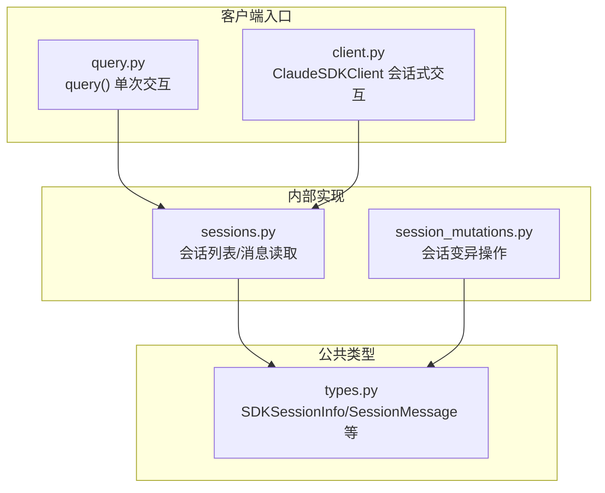
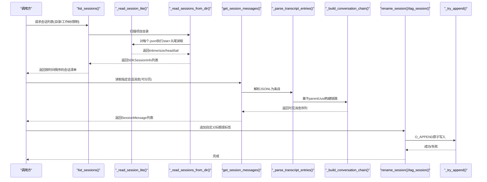
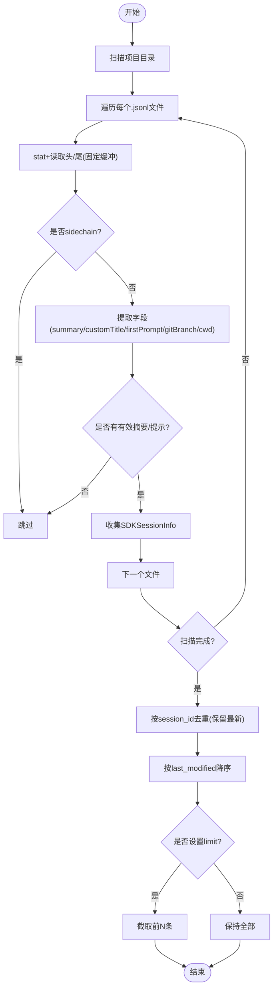
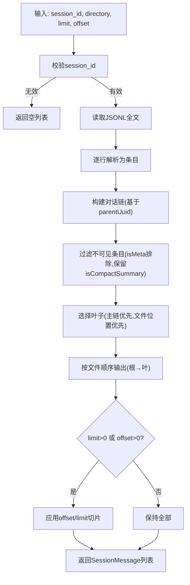
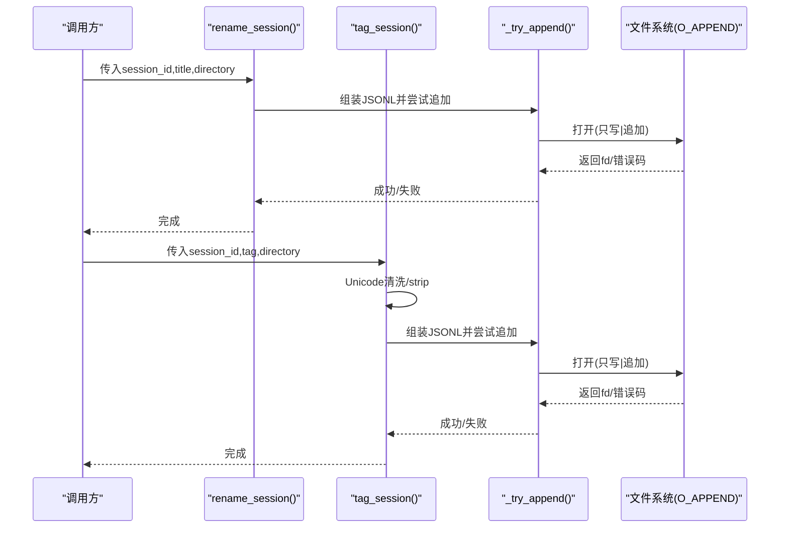
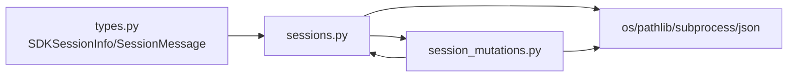

# 会话管理

<cite>
**本文引用的文件**
- [sessions.py](file://src/claude_agent_sdk/_internal/sessions.py)
- [session_mutations.py](file://src/claude_agent_sdk/_internal/session_mutations.py)
- [types.py](file://src/claude_agent_sdk/types.py)
- [client.py](file://src/claude_agent_sdk/client.py)
- [query.py](file://src/claude_agent_sdk/query.py)
- [test_sessions.py](file://tests/test_sessions.py)
- [test_session_mutations.py](file://tests/test_session_mutations.py)
</cite>

## 目录
1. [简介](#简介)
2. [项目结构](#项目结构)
3. [核心组件](#核心组件)
4. [架构总览](#架构总览)
5. [详细组件分析](#详细组件分析)
6. [依赖分析](#依赖分析)
7. [性能考量](#性能考量)
8. [故障排查指南](#故障排查指南)
9. [结论](#结论)
10. [附录](#附录)

## 简介
本文件面向开发者，系统性阐述 Claude Agent SDK 的会话管理能力，覆盖以下主题：
- 会话生命周期与存储：会话文件组织、目录解析、工作树扫描、路径规范化与哈希策略
- 会话列表与元数据：list_sessions 的轻量元数据提取、去重与排序、Git 分支与工作目录识别
- 消息检索与重建：get_session_messages 的完整转录解析、链路构建、可见性过滤与分页
- 会话变异操作：rename_session 与 tag_session 的写入策略、并发安全与冲突处理
- 数据结构与消息格式：SDKSessionInfo、SessionMessage 等类型定义与字段语义
- 并发与一致性：O_APPEND 原子追加、CLI 写入器协同、尾部扫描与缓存合并
- 最佳实践：内存与性能优化、数据清理、迁移与备份建议

## 项目结构
围绕会话管理的关键模块与职责如下：
- _internal/sessions.py：会话列表、消息读取、路径解析、工作树检测、轻量元数据提取
- _internal/session_mutations.py：会话重命名与标签写入、并发安全策略、Unicode 清洗
- types.py：SDKSessionInfo、SessionMessage 等类型定义
- client.py 与 query.py：会话交互入口（非本节重点），但与会话 ID、会话上下文相关

**图表来源**
- [sessions.py:592-635](file://src/claude_agent_sdk/_internal/sessions.py#L592-L635)
- [session_mutations.py:42-95](file://src/claude_agent_sdk/_internal/session_mutations.py#L42-L95)
- [types.py:960-1011](file://src/claude_agent_sdk/types.py#L960-L1011)
- [query.py:12-127](file://src/claude_agent_sdk/query.py#L12-L127)
- [client.py:21-500](file://src/claude_agent_sdk/client.py#L21-L500)

**章节来源**
- [sessions.py:592-635](file://src/claude_agent_sdk/_internal/sessions.py#L592-L635)
- [session_mutations.py:42-95](file://src/claude_agent_sdk/_internal/session_mutations.py#L42-L95)
- [types.py:960-1011](file://src/claude_agent_sdk/types.py#L960-L1011)
- [query.py:12-127](file://src/claude_agent_sdk/query.py#L12-L127)
- [client.py:21-500](file://src/claude_agent_sdk/client.py#L21-L500)

## 核心组件
- 会话列表与元数据
  - list_sessions：基于 stat + 头尾截断读取，提取摘要、自定义标题、首条用户提示、Git 分支、工作目录等；支持按目录与 Git 工作树扫描；去重与降序排序；可限制数量
  - 轻量读取：_read_session_lite 使用固定缓冲区读取头尾，避免全文件解析
  - 路径与工作树：_canonicalize_path、_find_project_dir、_get_worktree_paths 支持长路径哈希前缀匹配与跨工作树定位
- 会话消息读取
  - get_session_messages：全量 JSONL 解析，基于 parentUuid 构建对话链，过滤不可见消息，输出有序 SessionMessage 列表，支持 offset/limit 分页
- 会话变异操作
  - rename_session：追加 custom-title 元数据，最后写入生效
  - tag_session：追加 tag 元数据，空标签表示清除；Unicode 清洗后存储
  - 并发安全：_try_append 使用 O_WRONLY|O_APPEND，避免 TOCTOU；CLI 写入器在尾部扫描阶段吸收 SDK 写入

**章节来源**
- [sessions.py:592-635](file://src/claude_agent_sdk/_internal/sessions.py#L592-L635)
- [sessions.py:869-927](file://src/claude_agent_sdk/_internal/sessions.py#L869-L927)
- [session_mutations.py:42-161](file://src/claude_agent_sdk/_internal/session_mutations.py#L42-L161)

## 架构总览
下图展示会话管理从“列出”到“读取消息”再到“写入元数据”的端到端流程。

**图表来源**
- [sessions.py:592-635](file://src/claude_agent_sdk/_internal/sessions.py#L592-L635)
- [sessions.py:335-363](file://src/claude_agent_sdk/_internal/sessions.py#L335-L363)
- [sessions.py:403-471](file://src/claude_agent_sdk/_internal/sessions.py#L403-L471)
- [sessions.py:869-927](file://src/claude_agent_sdk/_internal/sessions.py#L869-L927)
- [sessions.py:713-744](file://src/claude_agent_sdk/_internal/sessions.py#L713-L744)
- [sessions.py:747-800](file://src/claude_agent_sdk/_internal/sessions.py#L747-L800)
- [session_mutations.py:168-220](file://src/claude_agent_sdk/_internal/session_mutations.py#L168-L220)

## 详细组件分析

### 会话列表与元数据：list_sessions
- 轻量元数据提取
  - 通过_stat + 固定大小头/尾读取，避免全文件解析
  - 提取字段：summary/custom_title/first_prompt/git_branch/cwd/file_size/last_modified
- 过滤规则
  - 排除 sidechain 会话与仅含元数据的会话
- 路径与工作树
  - 支持 Git 工作树扫描，长路径采用前缀+哈希匹配策略
- 去重与排序
  - 按 session_id 去重，保留 last_modified 最新的记录
  - 结果按 last_modified 降序返回，支持 limit

**图表来源**
- [sessions.py:403-471](file://src/claude_agent_sdk/_internal/sessions.py#L403-L471)
- [sessions.py:473-493](file://src/claude_agent_sdk/_internal/sessions.py#L473-L493)
- [sessions.py:495-574](file://src/claude_agent_sdk/_internal/sessions.py#L495-L574)

**章节来源**
- [sessions.py:592-635](file://src/claude_agent_sdk/_internal/sessions.py#L592-L635)
- [sessions.py:403-471](file://src/claude_agent_sdk/_internal/sessions.py#L403-L471)
- [sessions.py:473-493](file://src/claude_agent_sdk/_internal/sessions.py#L473-L493)
- [sessions.py:495-574](file://src/claude_agent_sdk/_internal/sessions.py#L495-L574)

### 会话消息读取：get_session_messages
- 全量解析
  - 读取完整 JSONL，逐行解析为条目集合
  - 仅保留具备 uuid 且类型为 user/assistant/progress/system/attachment 的条目
- 链路构建
  - 基于 parentUuid 构建从叶回溯至根的链路
  - 可见性过滤：排除 isMeta 条目，保留 isCompactSummary（压缩摘要）
  - 选择主链：优先非 sidechain 叶子；若存在多个，按文件位置较晚者优先
- 输出与分页
  - 输出为 SessionMessage 列表，按时间顺序（根→叶）
  - 支持 offset/limit 分页

**图表来源**
- [sessions.py:869-927](file://src/claude_agent_sdk/_internal/sessions.py#L869-L927)
- [sessions.py:713-744](file://src/claude_agent_sdk/_internal/sessions.py#L713-L744)
- [sessions.py:747-800](file://src/claude_agent_sdk/_internal/sessions.py#L747-L800)
- [sessions.py:800-868](file://src/claude_agent_sdk/_internal/sessions.py#L800-L868)

**章节来源**
- [sessions.py:869-927](file://src/claude_agent_sdk/_internal/sessions.py#L869-L927)
- [sessions.py:713-744](file://src/claude_agent_sdk/_internal/sessions.py#L713-L744)
- [sessions.py:747-800](file://src/claude_agent_sdk/_internal/sessions.py#L747-L800)
- [sessions.py:800-868](file://src/claude_agent_sdk/_internal/sessions.py#L800-L868)

### 会话变异操作：rename_session 与 tag_session
- 写入策略
  - 追加 JSONL 元数据行（custom-title/tag），紧凑格式（无多余空格）
  - 使用 O_WRONLY|O_APPEND 原子追加，避免存在性检查（TOCTOU 风险）
  - 0 字节文件被视为“占位/未找到”，用于跨工作树场景的搜索引导
- 并发与冲突
  - CLI 写入器在尾部扫描阶段会吸收 SDK 写入，保证“最后写入者获胜”
  - 重复调用安全：list_sessions 读取尾部最后一个 custom-title/tag
- Unicode 清洗（tag）
  - NFKC 规范化 + 移除危险 Unicode 类别与显式范围字符
  - 最终 strip 后必须非空（None 表示清空）

**图表来源**
- [session_mutations.py:42-95](file://src/claude_agent_sdk/_internal/session_mutations.py#L42-L95)
- [session_mutations.py:97-161](file://src/claude_agent_sdk/_internal/session_mutations.py#L97-L161)
- [session_mutations.py:168-220](file://src/claude_agent_sdk/_internal/session_mutations.py#L168-L220)
- [session_mutations.py:222-256](file://src/claude_agent_sdk/_internal/session_mutations.py#L222-L256)

**章节来源**
- [session_mutations.py:42-95](file://src/claude_agent_sdk/_internal/session_mutations.py#L42-L95)
- [session_mutations.py:97-161](file://src/claude_agent_sdk/_internal/session_mutations.py#L97-L161)
- [session_mutations.py:168-220](file://src/claude_agent_sdk/_internal/session_mutations.py#L168-L220)
- [session_mutations.py:222-256](file://src/claude_agent_sdk/_internal/session_mutations.py#L222-L256)

### 数据结构与消息格式
- SDKSessionInfo
  - 字段：session_id、summary、last_modified、file_size、custom_title、first_prompt、git_branch、cwd
  - 用途：list_sessions 返回的轻量元数据载体
- SessionMessage
  - 字段：type、uuid、session_id、message、parent_tool_use_id（始终为 None）
  - 用途：get_session_messages 返回的历史消息载体
- 类型定义来源
  - SDKSessionInfo、SessionMessage、Message 等类型均在 types.py 中定义

**章节来源**
- [types.py:960-1011](file://src/claude_agent_sdk/types.py#L960-L1011)
- [types.py:945-952](file://src/claude_agent_sdk/types.py#L945-L952)

### 会话存储与持久化机制
- 文件布局
  - 存储于 ~/.claude/projects/<project_path_sanitized>/<session_id>.jsonl
  - 项目目录按路径规范化与长度限制进行命名，长路径带哈希后缀
- 写入模型
  - 仅追加：所有元数据变更均以新行形式追加，不修改既有行
  - 原子性：O_APPEND 保证内核级原子追加
- 读取模型
  - list_sessions：stat + 头/尾截断读取，避免全文件解析
  - get_session_messages：全量 JSONL 解析，重建对话链
- 工作树支持
  - 通过 git worktree list 发现多工作树路径，按前缀匹配与哈希兼容策略定位会话文件

**章节来源**
- [sessions.py:114-128](file://src/claude_agent_sdk/_internal/sessions.py#L114-L128)
- [sessions.py:129-167](file://src/claude_agent_sdk/_internal/sessions.py#L129-L167)
- [sessions.py:370-396](file://src/claude_agent_sdk/_internal/sessions.py#L370-L396)
- [sessions.py:660-710](file://src/claude_agent_sdk/_internal/sessions.py#L660-L710)

### 会话分支与并行对话管理
- 分支识别
  - sidechain 标记：isSidechain=true 的会话在列表中被过滤
  - 叶子选择：当存在多条主链叶子时，优先非 sidechain；若仍冲突，按文件位置较晚者优先
- 并行会话
  - 不同会话 ID 对应独立 .jsonl 文件，互不影响
  - 通过 session_id 区分不同并行对话

**章节来源**
- [sessions.py:432-436](file://src/claude_agent_sdk/_internal/sessions.py#L432-L436)
- [sessions.py:831-866](file://src/claude_agent_sdk/_internal/sessions.py#L831-L866)
- [sessions.py:867-895](file://src/claude_agent_sdk/_internal/sessions.py#L867-L895)

### 会话状态同步与并发访问控制
- 写入并发
  - O_APPEND 原子追加，避免竞态条件
  - 0 字节文件作为“占位/未找到”信号，帮助搜索在工作树间继续推进
- 读写协同
  - CLI 写入器在尾部扫描阶段会吸收 SDK 写入，确保“最后写入者获胜”
- 读取一致性
  - list_sessions 仅读取 stat+头/尾，不解析正文，避免与写入竞争
  - get_session_messages 在读取时不会修改文件，解析过程线程安全

**章节来源**
- [session_mutations.py:222-256](file://src/claude_agent_sdk/_internal/session_mutations.py#L222-L256)
- [sessions.py:335-363](file://src/claude_agent_sdk/_internal/sessions.py#L335-L363)

## 依赖分析
- 组件耦合
  - sessions.py 与 types.py：前者依赖后者中的 SDKSessionInfo、SessionMessage 类型
  - session_mutations.py 与 sessions.py：复用路径解析、工作树检测、项目目录定位等工具函数
- 外部依赖
  - 文件系统：os、pathlib、subprocess（git）
  - JSON 解析：json
  - Unicode 规范化：unicodedata

**图表来源**
- [types.py:960-1011](file://src/claude_agent_sdk/types.py#L960-L1011)
- [sessions.py:592-635](file://src/claude_agent_sdk/_internal/sessions.py#L592-L635)
- [session_mutations.py:29-36](file://src/claude_agent_sdk/_internal/session_mutations.py#L29-L36)

**章节来源**
- [types.py:960-1011](file://src/claude_agent_sdk/types.py#L960-L1011)
- [sessions.py:592-635](file://src/claude_agent_sdk/_internal/sessions.py#L592-L635)
- [session_mutations.py:29-36](file://src/claude_agent_sdk/_internal/session_mutations.py#L29-L36)

## 性能考量
- 列表读取
  - stat + 头/尾截断读取，时间复杂度近似 O(N)，N 为项目目录下 .jsonl 数量
  - 避免全文件解析，显著降低 I/O 与 CPU 开销
- 消息读取
  - 全量 JSONL 解析，时间复杂度 O(M)，M 为消息行数
  - 链路构建使用字典索引与集合，查找父节点平均 O(1)
- 写入
  - O_APPEND 原子写入，避免存在性检查带来的额外系统调用
  - 追加元数据为常量时间写入，不触发文件重排
- 缓存与扫描
  - CLI 尾部扫描阶段会吸收 SDK 写入，减少重复解析成本

[本节为通用指导，无需特定文件引用]

## 故障排查指南
- 会话未出现在 list_sessions 中
  - 检查是否为 sidechain 或仅含元数据的会话（会被过滤）
  - 确认 session_id 是否为有效 UUID
  - 若使用工作树，确认项目目录名规范化与哈希后缀匹配
- get_session_messages 返回空
  - 确认 session_id 有效且文件存在
  - 检查是否存在可见消息（isMeta 会被过滤，仅 progress/system 会被过滤）
- rename_session/tag_session 报错
  - session_id 必须为有效 UUID
  - 标题/标签不能为空（strip 后为空则报错）
  - 文件不存在或为 0 字节时会抛出 FileNotFoundError
- 并发写入冲突
  - 由于 O_APPEND 原子性，通常不会出现数据损坏
  - 如需强一致，建议在业务层引入锁或等待 CLI 写入完成后再读取

**章节来源**
- [test_sessions.py:242-554](file://tests/test_sessions.py#L242-L554)
- [test_session_mutations.py:113-417](file://tests/test_session_mutations.py#L113-L417)
- [session_mutations.py:74-81](file://src/claude_agent_sdk/_internal/session_mutations.py#L74-L81)
- [session_mutations.py:140-146](file://src/claude_agent_sdk/_internal/session_mutations.py#L140-L146)

## 结论
Claude Agent SDK 的会话管理以“轻读取、全解析、追加写入”为核心设计：
- list_sessions 通过 stat+头/尾截断读取实现高效列表
- get_session_messages 通过 parentUuid 链路重建对话，支持分页与可见性过滤
- rename_session/tag_session 采用 O_APPEND 原子追加，配合 CLI 尾部扫描吸收，实现最终一致
- 路径与工作树策略保障跨工作树与长路径场景的稳定性
遵循本文最佳实践，可在保证性能与一致性的前提下，构建健壮的会话管理方案。

[本节为总结，无需特定文件引用]

## 附录

### API 一览与使用要点
- 列出会话
  - list_sessions(directory=None, limit=None, include_worktrees=True)
  - 返回 SDKSessionInfo 列表，按 last_modified 降序
- 读取消息
  - get_session_messages(session_id, directory=None, limit=None, offset=0)
  - 返回 SessionMessage 列表，按时间顺序（根→叶）
- 重命名会话
  - rename_session(session_id, title, directory=None)
  - 追加 custom-title 元数据，最后写入生效
- 标签会话
  - tag_session(session_id, tag, directory=None)
  - 追加 tag 元数据；tag=None 表示清空标签

**章节来源**
- [sessions.py:592-635](file://src/claude_agent_sdk/_internal/sessions.py#L592-L635)
- [sessions.py:869-927](file://src/claude_agent_sdk/_internal/sessions.py#L869-L927)
- [session_mutations.py:42-95](file://src/claude_agent_sdk/_internal/session_mutations.py#L42-L95)
- [session_mutations.py:97-161](file://src/claude_agent_sdk/_internal/session_mutations.py#L97-L161)

### 最佳实践
- 内存管理
  - 列表读取避免全文件解析，适合大规模会话目录
  - 消息读取支持分页，避免一次性加载过多历史消息
- 性能优化
  - 优先使用 list_sessions 获取摘要，再按需调用 get_session_messages
  - 避免频繁重命名/打标签，批量写入更高效
- 数据清理
  - 删除会话文件即可移除对应会话；注意工作树下的同名文件
- 迁移与备份
  - 备份 ~/.claude/projects 下的对应项目目录
  - 迁移时保持目录名规范化与哈希后缀一致，确保工作树兼容

[本节为通用指导，无需特定文件引用]