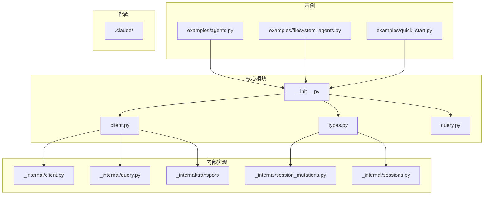
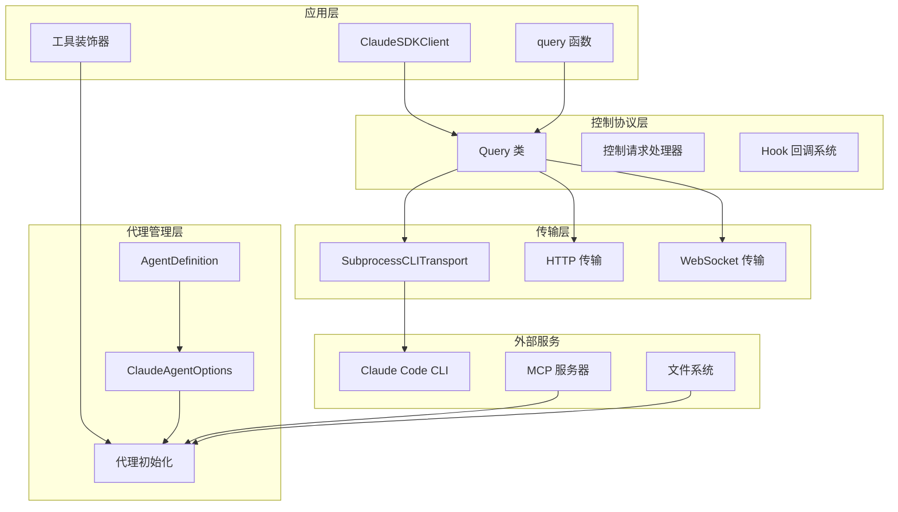
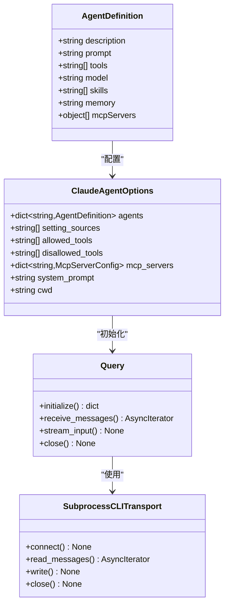
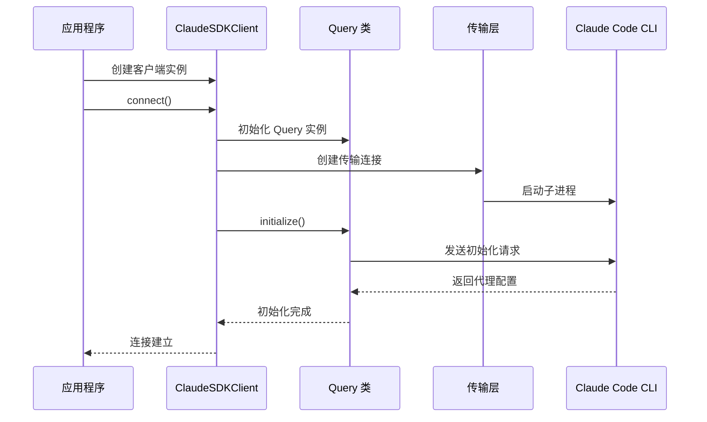
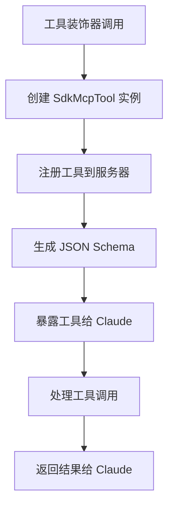
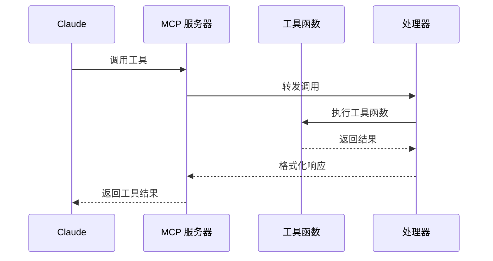
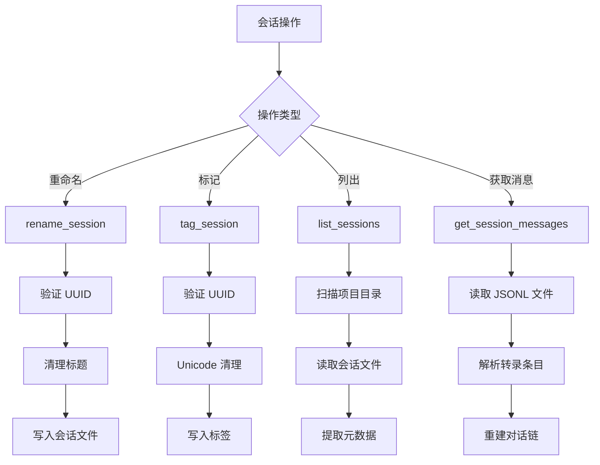
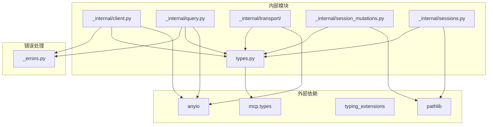

# 增强的代理定义

<cite>
**本文档引用的文件**
- [__init__.py](file://src/claude_agent_sdk/__init__.py)
- [client.py](file://src/claude_agent_sdk/client.py)
- [types.py](file://src/claude_agent_sdk/types.py)
- [query.py](file://src/claude_agent_sdk/query.py)
- [subprocess_cli.py](file://src/claude_agent_sdk/_internal/transport/subprocess_cli.py)
- [client.py（内部）](file://src/claude_agent_sdk/_internal/client.py)
- [query.py（内部）](file://src/claude_agent_sdk/_internal/query.py)
- [session_mutations.py](file://src/claude_agent_sdk/_internal/session_mutations.py)
- [sessions.py](file://src/claude_agent_sdk/_internal/sessions.py)
- [README.md](file://README.md)
- [agents.py](file://examples/agents.py)
- [filesystem_agents.py](file://examples/filesystem_agents.py)
- [quick_start.py](file://examples/quick_start.py)
</cite>

## 目录
1. [简介](#简介)
2. [项目结构](#项目结构)
3. [核心组件](#核心组件)
4. [架构概览](#架构概览)
5. [详细组件分析](#详细组件分析)
6. [依赖关系分析](#依赖关系分析)
7. [性能考虑](#性能考虑)
8. [故障排除指南](#故障排除指南)
9. [结论](#结论)

## 简介

Claude Agent SDK 是一个强大的 Python 库，为与 Claude Code 进行交互提供了完整的工具集。该项目的核心特性是支持自定义代理定义，允许开发者创建具有特定功能、工具和模型的智能代理。

本文档深入分析了代理定义系统的设计和实现，包括其架构模式、数据结构、处理逻辑和集成点。重点涵盖了增强的代理定义功能，该功能允许开发者创建复杂的、可定制的代理来执行各种任务。

## 项目结构

项目采用模块化设计，主要包含以下核心目录和文件：

**图表来源**
- [__init__.py:1-445](file://src/claude_agent_sdk/__init__.py#L1-L445)
- [client.py:1-499](file://src/claude_agent_sdk/client.py#L1-L499)

**章节来源**
- [__init__.py:1-445](file://src/claude_agent_sdk/__init__.py#L1-L445)
- [README.md:1-360](file://README.md#L1-L360)

## 核心组件

### 代理定义系统

代理定义系统是整个 SDK 的核心功能之一，它允许开发者创建具有特定配置的智能代理。主要组件包括：

#### AgentDefinition 类
这是代理定义的核心数据结构，支持以下配置选项：
- **description**: 代理的描述信息
- **prompt**: 代理的初始提示词
- **tools**: 可用工具列表
- **model**: AI 模型选择
- **skills**: 技能配置
- **memory**: 内存设置
- **mcpServers**: MCP 服务器配置

#### ClaudeAgentOptions 配置类
提供全面的代理配置选项：
- **agents**: 代理定义字典
- **setting_sources**: 设置源配置
- **allowed_tools**: 允许使用的工具
- **disallowed_tools**: 禁止使用的工具
- **mcp_servers**: MCP 服务器配置
- **system_prompt**: 系统提示词
- **cwd**: 工作目录

**章节来源**
- [types.py:42-54](file://src/claude_agent_sdk/types.py#L42-L54)
- [types.py:1035-1103](file://src/claude_agent_sdk/types.py#L1035-L1103)

### 传输层系统

传输层负责与 Claude Code CLI 的通信，支持多种传输方式：

#### SubprocessCLITransport
- 使用子进程与 CLI 通信
- 支持流式消息传输
- 自动处理命令构建和参数传递
- 支持错误处理和重连机制

#### Transport 接口
定义了统一的传输抽象，支持不同的实现方式：
- 子进程传输
- HTTP 传输
- WebSocket 传输

**章节来源**
- [subprocess_cli.py:33-200](file://src/claude_agent_sdk/_internal/transport/subprocess_cli.py#L33-L200)
- [client.py:21-499](file://src/claude_agent_sdk/client.py#L21-L499)

## 架构概览

代理定义系统的整体架构采用分层设计，确保了良好的可扩展性和维护性：

**图表来源**
- [client.py:21-499](file://src/claude_agent_sdk/client.py#L21-L499)
- [query.py（内部）:53-679](file://src/claude_agent_sdk/_internal/query.py#L53-L679)
- [subprocess_cli.py:33-200](file://src/claude_agent_sdk/_internal/transport/subprocess_cli.py#L33-L200)

## 详细组件分析

### 代理定义类分析

**图表来源**
- [types.py:42-54](file://src/claude_agent_sdk/types.py#L42-L54)
- [types.py:1035-1103](file://src/claude_agent_sdk/types.py#L1035-L1103)
- [query.py（内部）:53-164](file://src/claude_agent_sdk/_internal/query.py#L53-L164)
- [subprocess_cli.py:33-200](file://src/claude_agent_sdk/_internal/transport/subprocess_cli.py#L33-L200)

#### 代理初始化流程

**图表来源**
- [client.py:93-184](file://src/claude_agent_sdk/client.py#L93-L184)
- [query.py（内部）:119-163](file://src/claude_agent_sdk/_internal/query.py#L119-L163)

**章节来源**
- [types.py:42-54](file://src/claude_agent_sdk/types.py#L42-L54)
- [client.py:93-184](file://src/claude_agent_sdk/client.py#L93-L184)
- [query.py（内部）:119-163](file://src/claude_agent_sdk/_internal/query.py#L119-L163)

### 工具装饰器系统

SDK 提供了强大的工具装饰器系统，允许开发者轻松创建自定义工具：

#### 工具装饰器实现

**图表来源**
- [__init__.py:100-176](file://src/claude_agent_sdk/__init__.py#L100-L176)

#### 工具执行流程

**图表来源**
- [__init__.py:178-340](file://src/claude_agent_sdk/__init__.py#L178-L340)

**章节来源**
- [__init__.py:100-176](file://src/claude_agent_sdk/__init__.py#L100-L176)
- [__init__.py:178-340](file://src/claude_agent_sdk/__init__.py#L178-L340)

### 会话管理系统

会话管理系统提供了完整的会话生命周期管理功能：

#### 会话操作流程

**图表来源**
- [session_mutations.py:42-161](file://src/claude_agent_sdk/_internal/session_mutations.py#L42-L161)
- [sessions.py:593-634](file://src/claude_agent_sdk/_internal/sessions.py#L593-L634)

**章节来源**
- [session_mutations.py:42-161](file://src/claude_agent_sdk/_internal/session_mutations.py#L42-L161)
- [sessions.py:593-634](file://src/claude_agent_sdk/_internal/sessions.py#L593-L634)

## 依赖关系分析

项目采用松耦合的设计，通过接口和抽象类实现模块间的解耦：

**图表来源**
- [types.py:1-16](file://src/claude_agent_sdk/types.py#L1-L16)
- [client.py（内部）:1-18](file://src/claude_agent_sdk/_internal/client.py#L1-L18)

**章节来源**
- [types.py:1-16](file://src/claude_agent_sdk/types.py#L1-L16)
- [client.py（内部）:1-18](file://src/claude_agent_sdk/_internal/client.py#L1-L18)

## 性能考虑

### 传输层优化

传输层采用了多种优化策略来提高性能：

1. **流式处理**: 使用异步流处理大量数据，避免内存峰值
2. **缓冲区管理**: 动态调整缓冲区大小以适应不同负载
3. **连接复用**: 在可能的情况下复用传输连接
4. **超时控制**: 合理设置超时时间，避免长时间阻塞

### 代理初始化优化

代理初始化过程经过专门优化：

1. **延迟加载**: 仅在需要时加载代理定义
2. **缓存机制**: 缓存已加载的代理配置
3. **并发处理**: 支持多个代理的并发初始化
4. **资源管理**: 有效管理代理相关的系统资源

## 故障排除指南

### 常见问题及解决方案

#### 代理定义相关问题

1. **代理未正确加载**
   - 检查 AgentDefinition 字段是否正确设置
   - 验证代理名称的唯一性
   - 确认代理配置的 JSON 序列化正确

2. **工具调用失败**
   - 检查工具装饰器的参数类型
   - 验证工具函数的异步声明
   - 确认工具权限配置正确

#### 传输层问题

1. **CLI 连接失败**
   - 验证 Claude Code CLI 是否正确安装
   - 检查 CLI 路径配置
   - 确认网络连接正常

2. **消息传输中断**
   - 检查缓冲区配置
   - 验证超时设置
   - 确认异步任务状态

**章节来源**
- [subprocess_cli.py:88-95](file://src/claude_agent_sdk/_internal/transport/subprocess_cli.py#L88-L95)
- [client.py:112-130](file://src/claude_agent_sdk/client.py#L112-L130)

## 结论

Claude Agent SDK 的代理定义系统展现了现代软件架构的最佳实践。通过模块化设计、清晰的抽象层次和完善的错误处理机制，该系统为开发者提供了强大而灵活的代理创建能力。

主要优势包括：

1. **高度可扩展性**: 支持自定义代理、工具和服务器
2. **强大的配置能力**: 丰富的配置选项满足各种使用场景
3. **优秀的性能表现**: 优化的传输层和资源管理
4. **完善的错误处理**: 全面的异常处理和恢复机制
5. **易于使用**: 直观的 API 设计和丰富的示例

该系统为构建复杂的 AI 代理应用奠定了坚实的基础，无论是简单的工具调用还是复杂的多代理协作场景都能得到很好的支持。