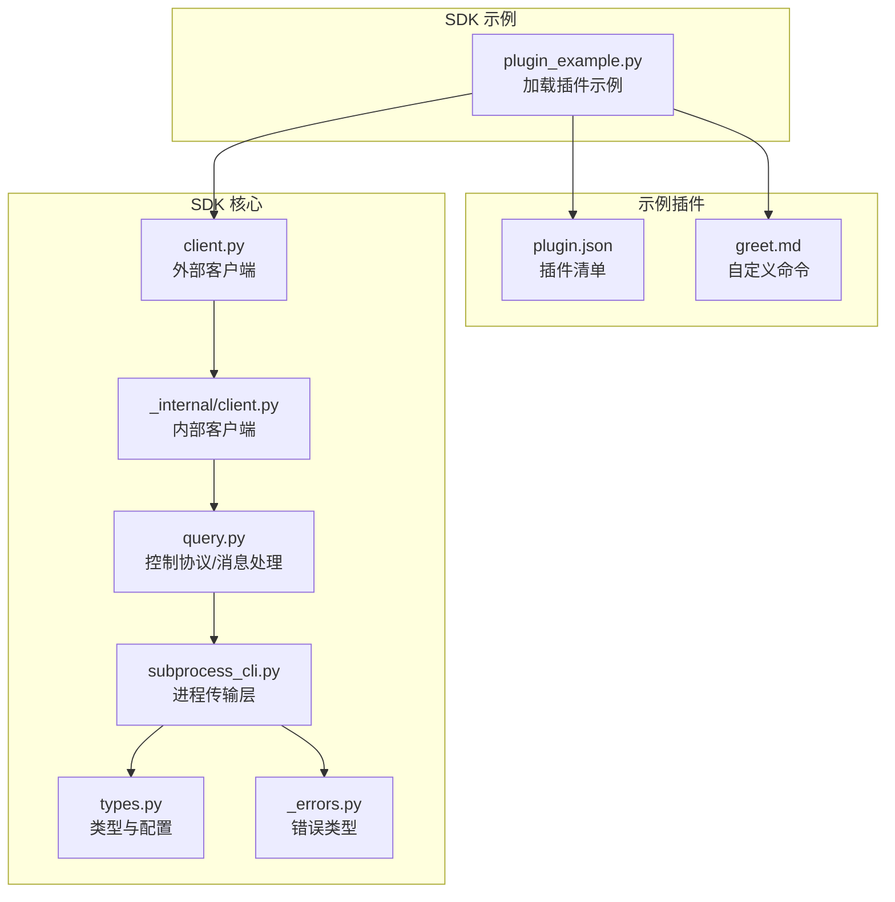
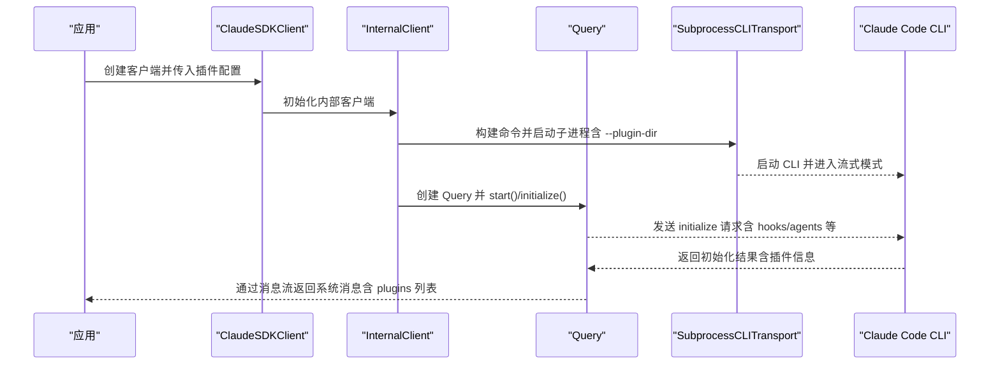
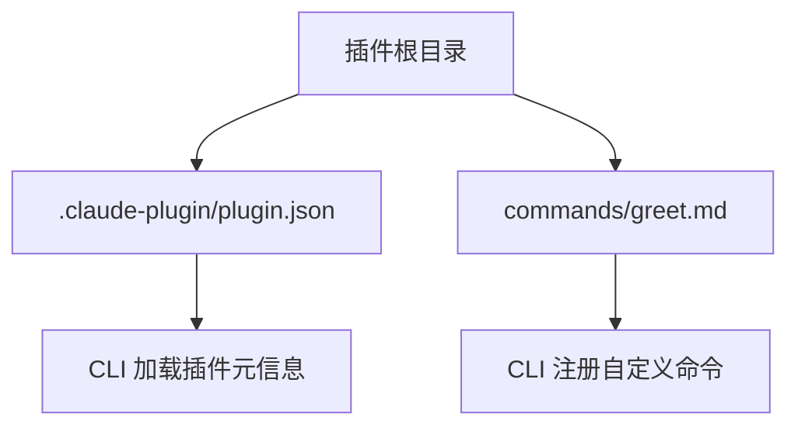
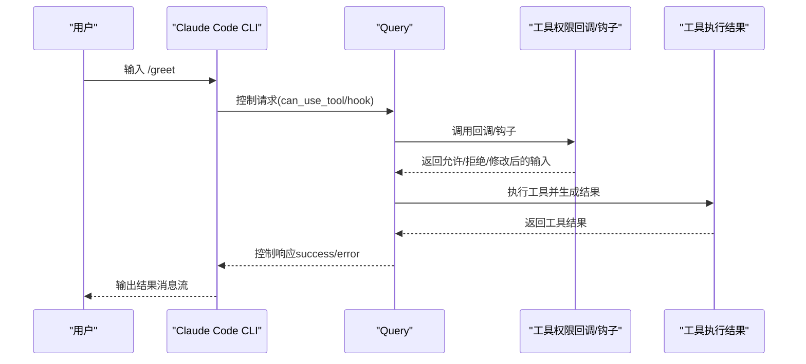
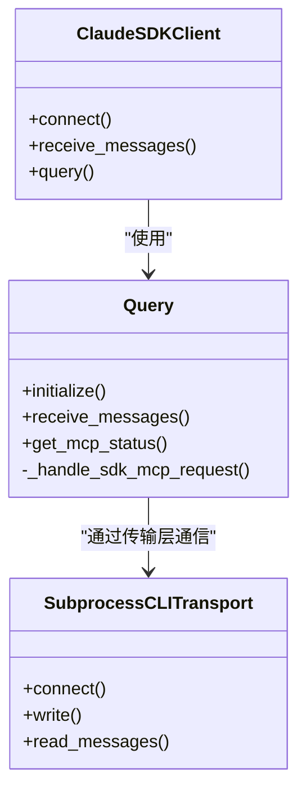
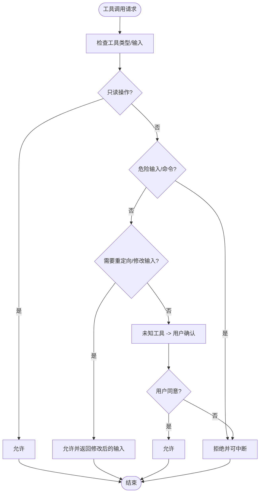
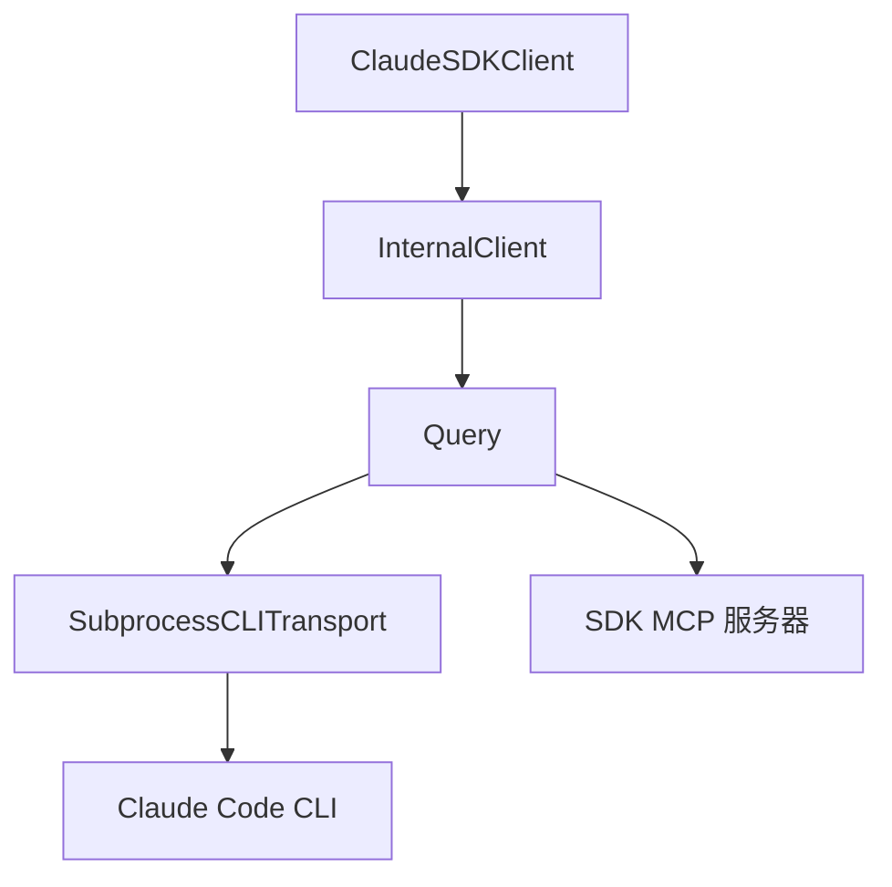

# 插件支持

<cite>
**本文引用的文件**
- [examples/plugins/demo-plugin/.claude-plugin/plugin.json](file://examples/plugins/demo-plugin/.claude-plugin/plugin.json)
- [examples/plugins/demo-plugin/commands/greet.md](file://examples/plugins/demo-plugin/commands/greet.md)
- [examples/plugin_example.py](file://examples/plugin_example.py)
- [src/claude_agent_sdk/client.py](file://src/claude_agent_sdk/client.py)
- [src/claude_agent_sdk/_internal/client.py](file://src/claude_agent_sdk/_internal/client.py)
- [src/claude_agent_sdk/_internal/query.py](file://src/claude_agent_sdk/_internal/query.py)
- [src/claude_agent_sdk/_internal/transport/subprocess_cli.py](file://src/claude_agent_sdk/_internal/transport/subprocess_cli.py)
- [src/claude_agent_sdk/types.py](file://src/claude_agent_sdk/types.py)
- [src/claude_agent_sdk/_errors.py](file://src/claude_agent_sdk/_errors.py)
- [examples/tool_permission_callback.py](file://examples/tool_permission_callback.py)
</cite>

## 目录
1. [简介](#简介)
2. [项目结构](#项目结构)
3. [核心组件](#核心组件)
4. [架构总览](#架构总览)
5. [详细组件分析](#详细组件分析)
6. [依赖分析](#依赖分析)
7. [性能考虑](#性能考虑)
8. [故障排查指南](#故障排查指南)
9. [结论](#结论)
10. [附录](#附录)

## 简介
本章节面向希望在 Claude Agent SDK 中使用“插件”能力的开发者，系统性讲解插件的集成机制、配置方式、命令定义与注册流程、与 SDK 的交互方式（命令调用、参数传递、结果返回）、安全模型与权限控制，以及从创建到部署测试的完整工作流。文档同时提供最佳实践、调试技巧与可复用的模板与示例路径，帮助你快速构建自定义插件功能。

## 项目结构
围绕插件支持的关键目录与文件如下：
- 示例插件：examples/plugins/demo-plugin
  - 插件清单：examples/plugins/demo-plugin/.claude-plugin/plugin.json
  - 自定义命令：examples/plugins/demo-plugin/commands/greet.md
- SDK 示例：examples/plugin_example.py 展示如何加载本地插件并验证其生效
- SDK 内部实现：
  - 客户端封装：src/claude_agent_sdk/client.py
  - 内部客户端：src/claude_agent_sdk/_internal/client.py
  - 控制协议与消息处理：src/claude_agent_sdk/_internal/query.py
  - 进程传输层（CLI 交互）：src/claude_agent_sdk/_internal/transport/subprocess_cli.py
  - 类型与配置：src/claude_agent_sdk/types.py
  - 错误类型：src/claude_agent_sdk/_errors.py
- 权限回调示例：examples/tool_permission_callback.py



**图表来源**
- [examples/plugin_example.py:23-62](file://examples/plugin_example.py#L23-L62)
- [src/claude_agent_sdk/client.py:94-180](file://src/claude_agent_sdk/client.py#L94-L180)
- [src/claude_agent_sdk/_internal/client.py:44-146](file://src/claude_agent_sdk/_internal/client.py#L44-L146)
- [src/claude_agent_sdk/_internal/query.py:119-180](file://src/claude_agent_sdk/_internal/query.py#L119-L180)
- [src/claude_agent_sdk/_internal/transport/subprocess_cli.py:335-395](file://src/claude_agent_sdk/_internal/transport/subprocess_cli.py#L335-L395)
- [src/claude_agent_sdk/types.py:642-650](file://src/claude_agent_sdk/types.py#L642-L650)
- [src/claude_agent_sdk/_errors.py:10-23](file://src/claude_agent_sdk/_errors.py#L10-L23)
- [examples/plugins/demo-plugin/.claude-plugin/plugin.json:1-9](file://examples/plugins/demo-plugin/.claude-plugin/plugin.json#L1-L9)
- [examples/plugins/demo-plugin/commands/greet.md:1-6](file://examples/plugins/demo-plugin/commands/greet.md#L1-L6)

**章节来源**
- [examples/plugin_example.py:23-62](file://examples/plugin_example.py#L23-L62)
- [src/claude_agent_sdk/client.py:94-180](file://src/claude_agent_sdk/client.py#L94-L180)
- [src/claude_agent_sdk/_internal/client.py:44-146](file://src/claude_agent_sdk/_internal/client.py#L44-L146)
- [src/claude_agent_sdk/_internal/query.py:119-180](file://src/claude_agent_sdk/_internal/query.py#L119-L180)
- [src/claude_agent_sdk/_internal/transport/subprocess_cli.py:335-395](file://src/claude_agent_sdk/_internal/transport/subprocess_cli.py#L335-L395)
- [src/claude_agent_sdk/types.py:642-650](file://src/claude_agent_sdk/types.py#L642-L650)
- [src/claude_agent_sdk/_errors.py:10-23](file://src/claude_agent_sdk/_errors.py#L10-L23)
- [examples/plugins/demo-plugin/.claude-plugin/plugin.json:1-9](file://examples/plugins/demo-plugin/.claude-plugin/plugin.json#L1-L9)
- [examples/plugins/demo-plugin/commands/greet.md:1-6](file://examples/plugins/demo-plugin/commands/greet.md#L1-L6)

## 核心组件
- 外部客户端 ClaudeSDKClient
  - 负责连接 Claude Code、启动控制协议、发送/接收消息、管理会话与权限模式、查询 MCP 服务器状态等
- 内部客户端 InternalClient
  - 封装传输层与 Query 的组合逻辑，统一处理初始化、输入流、消息解析与关闭
- 控制协议与消息处理 Query
  - 实现双向控制协议，处理 can_use_tool、hook_callback、mcp_message 等控制请求；桥接 SDK MCP 服务器
- 进程传输层 SubprocessCLITransport
  - 启动 Claude Code CLI 子进程，构建命令行参数（含 --plugin-dir），读写 stdout/stdin/stderr
- 类型与配置 types.py
  - 定义插件配置类型 SdkPluginConfig、MCP 服务器配置与状态、权限规则、Hook 输入输出等
- 错误类型 _errors.py
  - 统一异常体系，便于定位 CLI 连接、进程、JSON 解析等问题

**章节来源**
- [src/claude_agent_sdk/client.py:21-500](file://src/claude_agent_sdk/client.py#L21-L500)
- [src/claude_agent_sdk/_internal/client.py:20-146](file://src/claude_agent_sdk/_internal/client.py#L20-L146)
- [src/claude_agent_sdk/_internal/query.py:53-679](file://src/claude_agent_sdk/_internal/query.py#L53-L679)
- [src/claude_agent_sdk/_internal/transport/subprocess_cli.py:33-630](file://src/claude_agent_sdk/_internal/transport/subprocess_cli.py#L33-L630)
- [src/claude_agent_sdk/types.py:642-650](file://src/claude_agent_sdk/types.py#L642-L650)
- [src/claude_agent_sdk/_errors.py:6-57](file://src/claude_agent_sdk/_errors.py#L6-L57)

## 架构总览
下图展示了从应用发起插件加载，到 CLI 接收并初始化插件，再到 SDK 通过控制协议进行交互的整体流程。



**图表来源**
- [src/claude_agent_sdk/client.py:94-180](file://src/claude_agent_sdk/client.py#L94-L180)
- [src/claude_agent_sdk/_internal/client.py:44-146](file://src/claude_agent_sdk/_internal/client.py#L44-L146)
- [src/claude_agent_sdk/_internal/query.py:119-180](file://src/claude_agent_sdk/_internal/query.py#L119-L180)
- [src/claude_agent_sdk/_internal/transport/subprocess_cli.py:335-395](file://src/claude_agent_sdk/_internal/transport/subprocess_cli.py#L335-L395)

## 详细组件分析

### 插件清单与命令文件
- 插件清单 plugin.json
  - 字段说明（示例路径）：name、description、version、author
  - 作用：描述插件元数据，供 CLI 识别与加载
- 自定义命令文件 greet.md
  - 作用：定义一个 /greet 命令的说明与行为描述，由插件目录下的 commands 子目录提供



**图表来源**
- [examples/plugins/demo-plugin/.claude-plugin/plugin.json:1-9](file://examples/plugins/demo-plugin/.claude-plugin/plugin.json#L1-L9)
- [examples/plugins/demo-plugin/commands/greet.md:1-6](file://examples/plugins/demo-plugin/commands/greet.md#L1-L6)

**章节来源**
- [examples/plugins/demo-plugin/.claude-plugin/plugin.json:1-9](file://examples/plugins/demo-plugin/.claude-plugin/plugin.json#L1-L9)
- [examples/plugins/demo-plugin/commands/greet.md:1-6](file://examples/plugins/demo-plugin/commands/greet.md#L1-L6)

### 插件配置与加载流程
- 配置类型 SdkPluginConfig
  - 当前仅支持本地插件（type: "local"），通过 path 指定插件目录
- 加载流程
  - 在 ClaudeAgentOptions 中设置 plugins 列表
  - SubprocessCLITransport 在构建 CLI 命令时追加 --plugin-dir 参数
  - CLI 初始化后，Query 通过 initialize 返回系统消息，其中包含 plugins 数据

```mermaid
sequenceDiagram
participant App as "应用"
participant Opt as "ClaudeAgentOptions"
participant T as "SubprocessCLITransport"
participant CLI as "Claude Code CLI"
participant Q as "Query"
App->>Opt : 设置 plugins=[{type : "local", path : "..."}]
Opt-->>T : 传入 options
T->>T : _build_command() 添加 --plugin-dir
T->>CLI : 启动 CLI
Q->>CLI : initialize 请求
CLI-->>Q : 返回系统消息含 plugins
```

**图表来源**
- [src/claude_agent_sdk/types.py:642-650](file://src/claude_agent_sdk/types.py#L642-L650)
- [src/claude_agent_sdk/_internal/transport/subprocess_cli.py:283-290](file://src/claude_agent_sdk/_internal/transport/subprocess_cli.py#L283-L290)
- [src/claude_agent_sdk/_internal/query.py:119-163](file://src/claude_agent_sdk/_internal/query.py#L119-L163)

**章节来源**
- [src/claude_agent_sdk/types.py:642-650](file://src/claude_agent_sdk/types.py#L642-L650)
- [src/claude_agent_sdk/_internal/transport/subprocess_cli.py:283-290](file://src/claude_agent_sdk/_internal/transport/subprocess_cli.py#L283-L290)
- [src/claude_agent_sdk/_internal/query.py:119-163](file://src/claude_agent_sdk/_internal/query.py#L119-L163)
- [examples/plugin_example.py:31-62](file://examples/plugin_example.py#L31-L62)

### 命令调用、参数传递与结果返回
- 命令触发
  - 用户在对话中输入 /greet 或其他自定义命令
  - CLI 将命令解析为工具调用请求，通过控制协议通知 SDK
- 参数传递
  - 工具输入以 JSON 形式随控制请求下发至 SDK
  - SDK 通过 can_use_tool 回调或 Hook 机制进行处理
- 结果返回
  - SDK 处理完成后，将工具结果封装为消息返回给 CLI，最终由 SDK 的消息流返回给应用



**图表来源**
- [src/claude_agent_sdk/_internal/query.py:236-346](file://src/claude_agent_sdk/_internal/query.py#L236-L346)
- [src/claude_agent_sdk/_internal/query.py:478-510](file://src/claude_agent_sdk/_internal/query.py#L478-L510)

**章节来源**
- [src/claude_agent_sdk/_internal/query.py:236-346](file://src/claude_agent_sdk/_internal/query.py#L236-L346)
- [src/claude_agent_sdk/_internal/query.py:478-510](file://src/claude_agent_sdk/_internal/query.py#L478-L510)

### 插件与 SDK 的交互方式
- 初始化阶段
  - Query.initialize() 发送 hooks/agents 等配置，CLI 返回支持的命令与输出样式等信息
- 运行阶段
  - SDK 通过 Query.receive_messages() 持续接收消息，包括系统消息（含 plugins）、助手消息、结果消息等
- MCP 服务器桥接
  - 对于 SDK MCP 服务器，Query._handle_sdk_mcp_request() 将 JSON-RPC 方法映射到对应处理逻辑（tools/list、tools/call 等）



**图表来源**
- [src/claude_agent_sdk/_internal/query.py:119-180](file://src/claude_agent_sdk/_internal/query.py#L119-L180)
- [src/claude_agent_sdk/_internal/query.py:648-679](file://src/claude_agent_sdk/_internal/query.py#L648-L679)
- [src/claude_agent_sdk/_internal/transport/subprocess_cli.py:335-395](file://src/claude_agent_sdk/_internal/transport/subprocess_cli.py#L335-L395)
- [src/claude_agent_sdk/client.py:94-180](file://src/claude_agent_sdk/client.py#L94-L180)

**章节来源**
- [src/claude_agent_sdk/_internal/query.py:119-180](file://src/claude_agent_sdk/_internal/query.py#L119-L180)
- [src/claude_agent_sdk/_internal/query.py:648-679](file://src/claude_agent_sdk/_internal/query.py#L648-L679)
- [src/claude_agent_sdk/_internal/transport/subprocess_cli.py:335-395](file://src/claude_agent_sdk/_internal/transport/subprocess_cli.py#L335-L395)
- [src/claude_agent_sdk/client.py:94-180](file://src/claude_agent_sdk/client.py#L94-L180)

### 安全模型与权限控制
- 工具权限回调
  - 可通过 ClaudeAgentOptions.can_use_tool 提供回调，在每次工具调用前决定是否允许、拒绝或修改输入
  - 回调返回 PermissionResultAllow 或 PermissionResultDeny，支持附加更新后的输入与权限建议
- 权限模式
  - 支持 default、acceptEdits、bypassPermissions 等模式，可在运行时动态切换
- 沙箱与网络限制
  - 通过 SandboxSettings 控制 bash 命令沙箱、排除命令、网络代理等，结合权限规则实现更细粒度的隔离



**图表来源**
- [examples/tool_permission_callback.py:26-94](file://examples/tool_permission_callback.py#L26-L94)
- [src/claude_agent_sdk/types.py:60-121](file://src/claude_agent_sdk/types.py#L60-L121)

**章节来源**
- [examples/tool_permission_callback.py:26-94](file://examples/tool_permission_callback.py#L26-L94)
- [src/claude_agent_sdk/types.py:60-121](file://src/claude_agent_sdk/types.py#L60-L121)

### 开发工作流与最佳实践
- 创建插件
  - 在插件根目录下创建 .claude-plugin/plugin.json 与 commands 子目录
  - 在 commands 下新增 Markdown 命令文件，描述命令用途与行为
- 配置与加载
  - 在 ClaudeAgentOptions.plugins 中添加本地插件配置（type: "local", path: "...")
  - 使用 examples/plugin_example.py 的方式验证插件已加载（检查系统消息中的 plugins 字段）
- 测试与调试
  - 使用 examples/tool_permission_callback.py 的回调策略进行安全测试
  - 关注 stderr 输出与日志，必要时开启调试模式
- 部署与维护
  - 将插件目录作为本地资源分发，确保路径正确
  - 在 CI/CD 中校验插件清单与命令文件格式

**章节来源**
- [examples/plugin_example.py:31-62](file://examples/plugin_example.py#L31-L62)
- [examples/tool_permission_callback.py:96-159](file://examples/tool_permission_callback.py#L96-L159)
- [src/claude_agent_sdk/_internal/transport/subprocess_cli.py:412-439](file://src/claude_agent_sdk/_internal/transport/subprocess_cli.py#L412-L439)

## 依赖分析
- 组件耦合
  - ClaudeSDKClient 依赖 InternalClient 与 Query
  - InternalClient 依赖 Transport 与 Query
  - Query 依赖 Transport 与 MCP 服务器（SDK 类型）
  - Transport 依赖 CLI 可执行文件与环境变量
- 外部依赖
  - Claude Code CLI 版本要求与最小版本检查
  - MCP 协议（JSON-RPC）方法映射（tools/list、tools/call 等）



**图表来源**
- [src/claude_agent_sdk/client.py:94-180](file://src/claude_agent_sdk/client.py#L94-L180)
- [src/claude_agent_sdk/_internal/client.py:104-113](file://src/claude_agent_sdk/_internal/client.py#L104-L113)
- [src/claude_agent_sdk/_internal/query.py:394-531](file://src/claude_agent_sdk/_internal/query.py#L394-L531)
- [src/claude_agent_sdk/_internal/transport/subprocess_cli.py:335-395](file://src/claude_agent_sdk/_internal/transport/subprocess_cli.py#L335-L395)

**章节来源**
- [src/claude_agent_sdk/client.py:94-180](file://src/claude_agent_sdk/client.py#L94-L180)
- [src/claude_agent_sdk/_internal/client.py:104-113](file://src/claude_agent_sdk/_internal/client.py#L104-L113)
- [src/claude_agent_sdk/_internal/query.py:394-531](file://src/claude_agent_sdk/_internal/query.py#L394-L531)
- [src/claude_agent_sdk/_internal/transport/subprocess_cli.py:335-395](file://src/claude_agent_sdk/_internal/transport/subprocess_cli.py#L335-L395)

## 性能考虑
- 流式模式
  - SDK 默认使用流式模式，提高交互延迟与吞吐量
- 缓冲区与超时
  - 传输层对 stdout JSON 解析采用缓冲策略，并设置最大缓冲大小与超时
- MCP 服务器
  - 初始化时长可能受外部 MCP 服务器影响，Query 提供较长初始化超时
- 文件检查点
  - 可启用文件检查点以支持回溯，但需注意额外的 IO 成本

**章节来源**
- [src/claude_agent_sdk/_internal/transport/subprocess_cli.py:515-565](file://src/claude_agent_sdk/_internal/transport/subprocess_cli.py#L515-L565)
- [src/claude_agent_sdk/_internal/query.py:115-118](file://src/claude_agent_sdk/_internal/query.py#L115-L118)
- [src/claude_agent_sdk/client.py:150-156](file://src/claude_agent_sdk/client.py#L150-L156)

## 故障排查指南
- CLI 未找到或版本过低
  - 现象：启动失败或提示最低版本不满足
  - 处理：安装或升级 Claude Code CLI，或通过 options.cli_path 指定路径
- 进程提前退出
  - 现象：exit code 非零
  - 处理：查看 stderr 输出，检查工作目录、权限与插件路径
- JSON 解码错误
  - 现象：消息过大或截断导致 JSON 解码失败
  - 处理：增大 max_buffer_size 或优化输出
- 插件未生效
  - 现象：系统消息中未显示 plugins
  - 处理：确认 --plugin-dir 是否正确传入，插件目录结构是否符合规范

**章节来源**
- [src/claude_agent_sdk/_internal/transport/subprocess_cli.py:88-95](file://src/claude_agent_sdk/_internal/transport/subprocess_cli.py#L88-L95)
- [src/claude_agent_sdk/_internal/transport/subprocess_cli.py:572-586](file://src/claude_agent_sdk/_internal/transport/subprocess_cli.py#L572-L586)
- [src/claude_agent_sdk/_internal/transport/subprocess_cli.py:546-554](file://src/claude_agent_sdk/_internal/transport/subprocess_cli.py#L546-L554)
- [examples/plugin_example.py:49-62](file://examples/plugin_example.py#L49-L62)

## 结论
通过本指南，你可以基于 Claude Agent SDK 完成插件的创建、配置、加载与验证，并理解插件与 SDK 的交互机制、命令定义与注册流程、以及安全模型与权限控制。结合示例与最佳实践，你可以快速构建稳定、可维护且安全的插件功能。

## 附录
- 插件模板与示例路径
  - 插件清单：examples/plugins/demo-plugin/.claude-plugin/plugin.json
  - 自定义命令：examples/plugins/demo-plugin/commands/greet.md
  - 插件加载示例：examples/plugin_example.py
  - 工具权限回调示例：examples/tool_permission_callback.py
- 关键类型参考
  - 插件配置：SdkPluginConfig
  - MCP 服务器配置与状态：McpServerConfig、McpStatusResponse
  - 权限规则与模式：PermissionUpdate、PermissionMode
- 错误类型参考
  - CLIConnectionError、CLINotFoundError、ProcessError、CLIJSONDecodeError、MessageParseError

**章节来源**
- [examples/plugins/demo-plugin/.claude-plugin/plugin.json:1-9](file://examples/plugins/demo-plugin/.claude-plugin/plugin.json#L1-L9)
- [examples/plugins/demo-plugin/commands/greet.md:1-6](file://examples/plugins/demo-plugin/commands/greet.md#L1-L6)
- [examples/plugin_example.py:23-62](file://examples/plugin_example.py#L23-L62)
- [examples/tool_permission_callback.py:96-159](file://examples/tool_permission_callback.py#L96-L159)
- [src/claude_agent_sdk/types.py:642-650](file://src/claude_agent_sdk/types.py#L642-L650)
- [src/claude_agent_sdk/types.py:532-641](file://src/claude_agent_sdk/types.py#L532-L641)
- [src/claude_agent_sdk/types.py:17-121](file://src/claude_agent_sdk/types.py#L17-L121)
- [src/claude_agent_sdk/_errors.py:10-23](file://src/claude_agent_sdk/_errors.py#L10-L23)