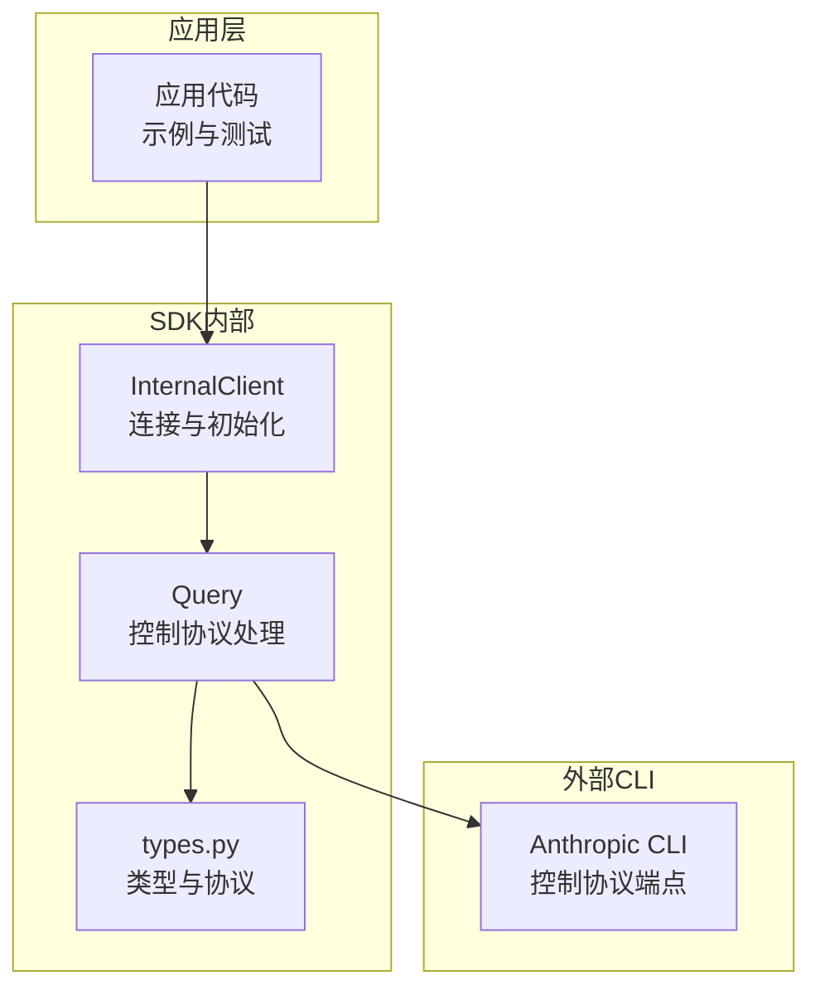
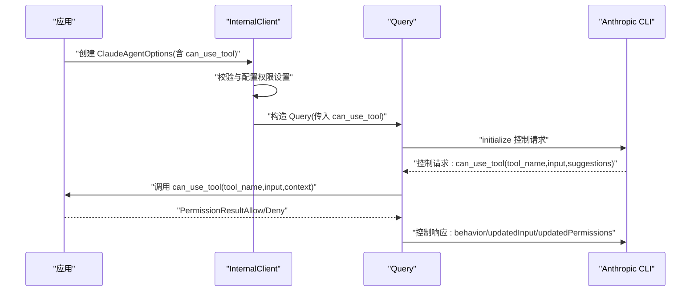
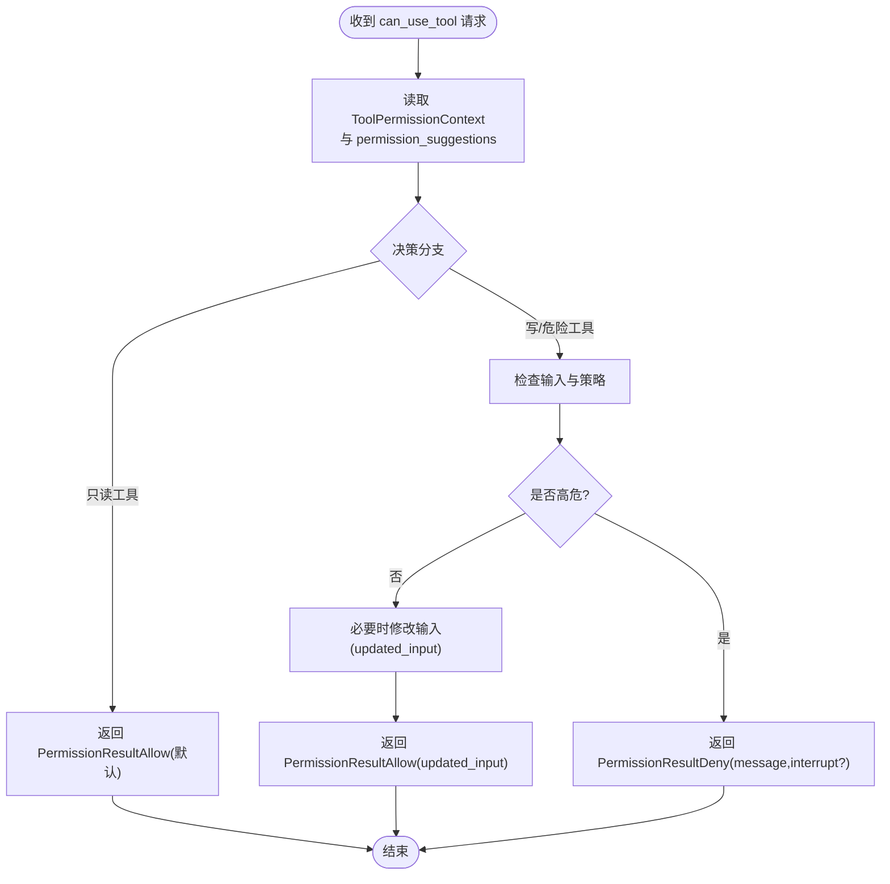
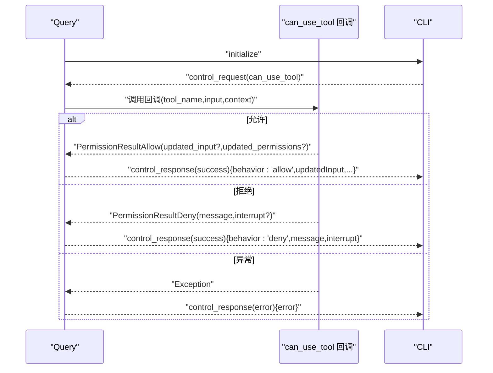
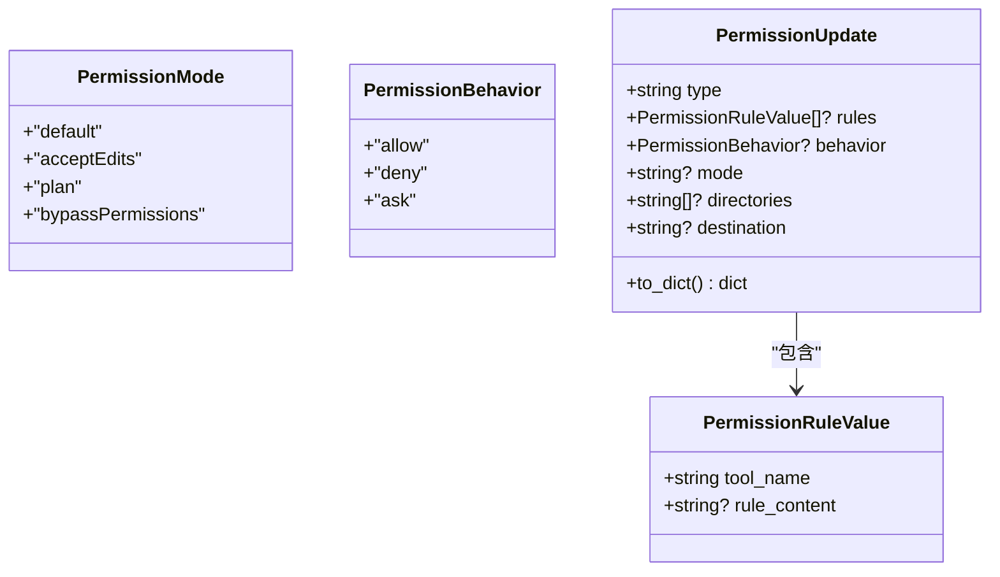
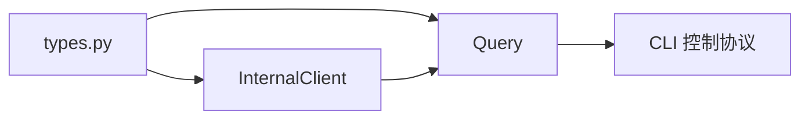

# 权限管理

<cite>
**本文引用的文件列表**
- [tool_permission_callback.py](file://examples/tool_permission_callback.py)
- [test_tool_permissions.py](file://e2e-tests/test_tool_permissions.py)
- [types.py](file://src/claude_agent_sdk/types.py)
- [client.py](file://src/claude_agent_sdk/_internal/client.py)
- [query.py](file://src/claude_agent_sdk/_internal/query.py)
- [test_tool_callbacks.py](file://tests/test_tool_callbacks.py)
</cite>

## 目录
1. [简介](#简介)
2. [项目结构与角色定位](#项目结构与角色定位)
3. [核心组件](#核心组件)
4. [架构总览](#架构总览)
5. [详细组件分析](#详细组件分析)
6. [依赖关系分析](#依赖关系分析)
7. [性能与安全考量](#性能与安全考量)
8. [故障排查指南](#故障排查指南)
9. [结论](#结论)
10. [附录：最佳实践与安全建议](#附录最佳实践与安全建议)

## 简介
本文件系统化阐述该 SDK 的工具权限控制系统，包括：
- 安全机制与访问控制模型
- 工具权限回调函数的实现与权限决策逻辑
- allowed_tools 列表的作用与工具标识符命名规则
- 动态权限控制与权限继承（通过 PermissionUpdate）的实现方法
- 权限审计与日志记录的指导

目标是帮助开发者在不牺牲安全性的前提下，灵活、可审计地控制工具调用行为。

## 项目结构与角色定位
- SDK 类型与协议定义位于 types.py，涵盖权限模式、权限结果、工具权限上下文、控制协议消息等。
- 内部客户端与查询类负责将应用层选项转换为控制协议请求，并处理来自 CLI 的控制请求（如 can_use_tool）。
- 示例与端到端测试展示了工具权限回调的实际使用方式与期望行为。

图表来源
- [client.py:44-146](file://src/claude_agent_sdk/_internal/client.py#L44-L146)
- [query.py:53-118](file://src/claude_agent_sdk/_internal/query.py#L53-L118)
- [types.py:1030-1199](file://src/claude_agent_sdk/types.py#L1030-L1199)

章节来源
- [client.py:44-146](file://src/claude_agent_sdk/_internal/client.py#L44-L146)
- [query.py:53-118](file://src/claude_agent_sdk/_internal/query.py#L53-L118)
- [types.py:1030-1199](file://src/claude_agent_sdk/types.py#L1030-L1199)

## 核心组件
- 权限模式与规则
  - 权限模式：default、acceptEdits、plan、bypassPermissions
  - 规则类型：addRules、replaceRules、removeRules、setMode、addDirectories、removeDirectories
  - 行为：allow、deny、ask
- 工具权限回调
  - 回调签名：接收 tool_name、input_data、ToolPermissionContext，返回 PermissionResultAllow 或 PermissionResultDeny
  - 可选修改输入与动态更新权限
- 控制协议
  - can_use_tool 请求由 CLI 发起，SDK 内部 Query 处理并调用回调
  - 返回格式包含 behavior、updatedInput、updatedPermissions 或 deny 的 message/interrupt

章节来源
- [types.py:17-18](file://src/claude_agent_sdk/types.py#L17-L18)
- [types.py:57-121](file://src/claude_agent_sdk/types.py#L57-L121)
- [types.py:124-157](file://src/claude_agent_sdk/types.py#L124-L157)
- [types.py:1106-1199](file://src/claude_agent_sdk/types.py#L1106-L1199)
- [query.py:236-346](file://src/claude_agent_sdk/_internal/query.py#L236-L346)

## 架构总览
工具权限控制的关键流程如下：
- 应用通过 ClaudeAgentOptions 指定 can_use_tool 回调
- InternalClient 在启动时校验并配置权限设置（如互斥性、自动设置 permission_prompt_tool_name）
- Query 初始化并进入流式控制协议
- 当 CLI 需要确认工具使用时，发送 can_use_tool 控制请求
- Query 调用回调，根据返回值允许或拒绝，并可附带 updatedInput/updatedPermissions
- SDK 将结果以控制响应返回 CLI

图表来源
- [client.py:44-113](file://src/claude_agent_sdk/_internal/client.py#L44-L113)
- [query.py:236-346](file://src/claude_agent_sdk/_internal/query.py#L236-L346)
- [types.py:1106-1199](file://src/claude_agent_sdk/types.py#L1106-L1199)

## 详细组件分析

### 组件A：工具权限回调与决策逻辑
- 回调签名与职责
  - 接收 tool_name、input_data、ToolPermissionContext
  - 返回 PermissionResultAllow 或 PermissionResultDeny
  - 可选：修改输入（updated_input）、动态建议（updated_permissions）
- 决策逻辑要点
  - 允许/拒绝：基于工具类型、输入内容、上下文策略
  - 输入修改：对高风险工具进行路径重定向、参数净化
  - 中断执行：deny 时可选择中断（interrupt）
- 上下文与建议
  - ToolPermissionContext.suggestions 提供 CLI 的权限建议（PermissionUpdate 列表）

图表来源
- [query.py:245-286](file://src/claude_agent_sdk/_internal/query.py#L245-L286)
- [types.py:124-157](file://src/claude_agent_sdk/types.py#L124-L157)

章节来源
- [tool_permission_callback.py:26-94](file://examples/tool_permission_callback.py#L26-L94)
- [query.py:245-286](file://src/claude_agent_sdk/_internal/query.py#L245-L286)
- [types.py:124-157](file://src/claude_agent_sdk/types.py#L124-L157)

### 组件B：控制协议与内部处理
- 初始化与钩子注册
  - Query.initialize 会将 hooks 配置转换为 CLI 可识别格式
- can_use_tool 处理
  - 解析请求、构建 ToolPermissionContext、调用回调
  - 将 PermissionResult 转换为控制响应（behavior、updatedInput、updatedPermissions）
- 错误处理
  - 回调异常会被捕获并返回错误控制响应
  - 不支持的控制请求类型会抛出异常

图表来源
- [query.py:119-163](file://src/claude_agent_sdk/_internal/query.py#L119-L163)
- [query.py:236-346](file://src/claude_agent_sdk/_internal/query.py#L236-L346)

章节来源
- [query.py:119-163](file://src/claude_agent_sdk/_internal/query.py#L119-L163)
- [query.py:236-346](file://src/claude_agent_sdk/_internal/query.py#L236-L346)

### 组件C：权限模式与规则
- 权限模式
  - default：CLI 对危险工具进行提示
  - acceptEdits：自动接受文件编辑
  - plan：计划模式（用于任务规划）
  - bypassPermissions：绕过权限（谨慎使用）
- 规则与更新
  - addRules/replaceRules/removeRules：按工具名与规则内容增删改
  - setMode：切换模式
  - addDirectories/removeDirectories：目录白名单/黑名单
  - PermissionUpdate.to_dict：序列化为 CLI 控制协议格式

图表来源
- [types.py:17-18](file://src/claude_agent_sdk/types.py#L17-L18)
- [types.py:57-121](file://src/claude_agent_sdk/types.py#L57-L121)

章节来源
- [types.py:17-18](file://src/claude_agent_sdk/types.py#L17-L18)
- [types.py:57-121](file://src/claude_agent_sdk/types.py#L57-L121)

### 组件D：allowed_tools 列表与工具标识符命名
- allowed_tools 列表
  - 限制可用工具集合；仅允许出现在列表中的工具被激活
  - 与 disallowed_tools 协同工作，后者优先级更高
- 工具标识符命名规则
  - 建议使用清晰、稳定的名称，避免特殊字符
  - 与 MCP 工具名称保持一致，便于映射与审计
  - 若工具来自插件或 MCP 服务器，需确保名称与服务器返回一致

章节来源
- [types.py](file://src/claude_agent_sdk/types.py#L1034)
- [types.py](file://src/claude_agent_sdk/types.py#L1042)

### 组件E：动态权限控制与权限继承
- 动态权限控制
  - 回调中可返回 updated_permissions，即时更新规则（如添加/移除规则、切换模式、增减目录）
  - 适用于基于上下文的临时授权（例如某次任务期间开放特定目录）
- 权限继承
  - CLI 层面的权限建议（permission_suggestions）可通过 ToolPermissionContext.suggestions 注入
  - 回调可读取并采纳这些建议，形成“建议-决策”的继承链

章节来源
- [types.py:129-131](file://src/claude_agent_sdk/types.py#L129-L131)
- [query.py:252-286](file://src/claude_agent_sdk/_internal/query.py#L252-L286)

## 依赖关系分析
- InternalClient 与 Query 的耦合
  - InternalClient 负责选项校验与传输初始化，Query 负责控制协议处理
  - 二者通过 can_use_tool 回调建立运行时依赖
- 类型与协议的契约
  - types.py 定义了 PermissionResult、PermissionUpdate、控制协议消息等强类型
  - Query 严格遵循这些类型进行序列化与反序列化

图表来源
- [client.py:44-113](file://src/claude_agent_sdk/_internal/client.py#L44-L113)
- [query.py:53-118](file://src/claude_agent_sdk/_internal/query.py#L53-L118)
- [types.py:1030-1199](file://src/claude_agent_sdk/types.py#L1030-L1199)

章节来源
- [client.py:44-113](file://src/claude_agent_sdk/_internal/client.py#L44-L113)
- [query.py:53-118](file://src/claude_agent_sdk/_internal/query.py#L53-L118)
- [types.py:1030-1199](file://src/claude_agent_sdk/types.py#L1030-L1199)

## 性能与安全考量
- 性能
  - can_use_tool 回调必须异步且快速；复杂检查应尽早短路
  - 流式模式下，回调阻塞会影响整体吞吐
- 安全
  - bypassPermissions 模式仅在受控环境下使用
  - 对高危命令（如 rm -rf、sudo、mkfs 等）应严格拒绝
  - 输入修改仅用于安全重定向，不应改变语义
- 可靠性
  - 回调异常会被捕获并返回错误响应，避免崩溃
  - 建议在回调中记录审计日志，便于追踪

[本节为通用指导，无需特定文件引用]

## 故障排查指南
- 回调未触发
  - 确认 options.permission_mode 与 can_use_tool 的组合正确
  - 确认 prompt 为 AsyncIterable（流式模式），否则会报错
- 回调冲突
  - can_use_tool 与 permission_prompt_tool_name 互斥，同时设置会报错
- 回调异常
  - 回调抛出异常会被转换为控制响应错误；检查日志定位问题
- 规则未生效
  - 确认 updated_permissions.to_dict 输出符合 CLI 控制协议格式
  - 确认 destination 与 type 匹配

章节来源
- [client.py:54-71](file://src/claude_agent_sdk/_internal/client.py#L54-L71)
- [query.py:283-286](file://src/claude_agent_sdk/_internal/query.py#L283-L286)
- [test_tool_callbacks.py:176-210](file://tests/test_tool_callbacks.py#L176-L210)

## 结论
该 SDK 通过强类型的权限模型与回调机制，提供了细粒度的工具权限控制能力。结合 allowed_tools 列表、动态权限更新与审计日志，可以在保证安全的前提下实现灵活的工具使用策略。建议在生产环境中采用 default 模式配合严格的回调策略，并对高危操作进行输入净化与路径重定向。

[本节为总结，无需特定文件引用]

## 附录：最佳实践与安全建议
- 最佳实践
  - 使用 default 模式，对高危工具显式拒绝
  - 对写操作进行路径白名单校验与安全重定向
  - 在回调中记录工具名、输入摘要、决策原因与时间戳
  - 使用 updated_permissions 实现临时授权，任务结束后恢复
- 安全建议
  - 严禁使用 bypassPermissions 模式于生产环境
  - 对命令行工具输入进行严格白名单过滤
  - 对文件系统操作进行最小权限原则（仅授予必要目录）
  - 定期审查 allowed_tools 与 disallowed_tools 列表
- 审计与日志
  - 在 can_use_tool 回调中记录决策轨迹
  - 使用 PermissionUpdate 记录规则变更事件
  - 结合 CLI 日志与 SDK 日志进行交叉验证

[本节为通用指导，无需特定文件引用]