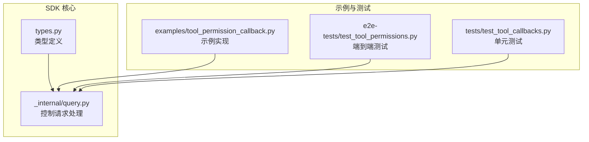
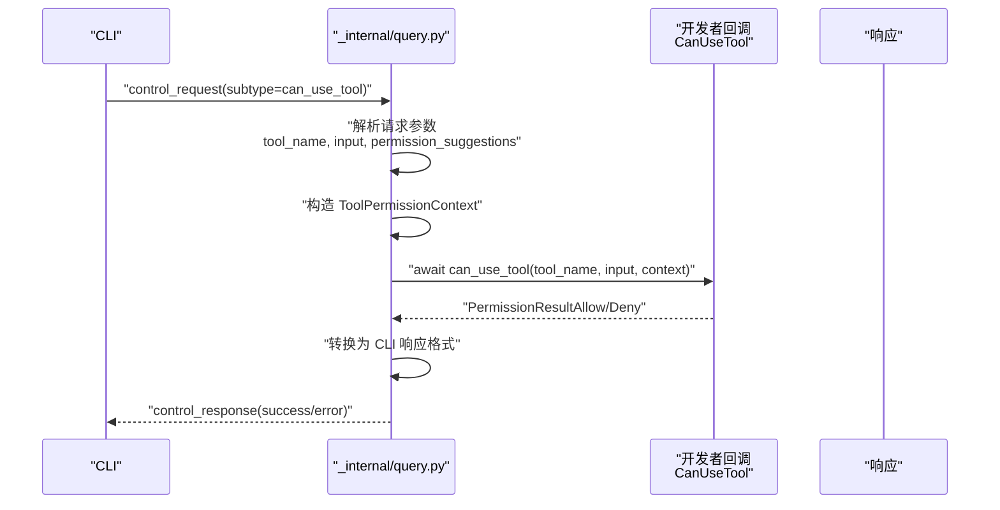
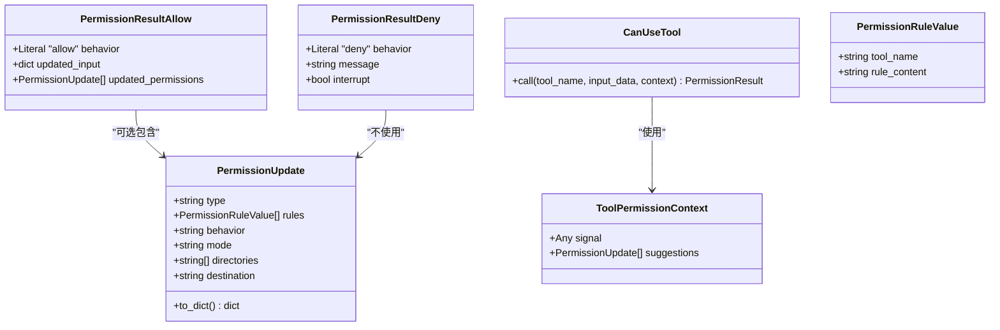

# 权限回调函数

<cite>
**本文引用的文件**
- [types.py](file://src/claude_agent_sdk/types.py)
- [query.py](file://src/claude_agent_sdk/_internal/query.py)
- [tool_permission_callback.py](file://examples/tool_permission_callback.py)
- [test_tool_permissions.py](file://e2e-tests/test_tool_permissions.py)
- [test_tool_callbacks.py](file://tests/test_tool_callbacks.py)
- [README.md](file://README.md)
</cite>

## 目录
1. [简介](#简介)
2. [项目结构](#项目结构)
3. [核心组件](#核心组件)
4. [架构总览](#架构总览)
5. [详细组件分析](#详细组件分析)
6. [依赖分析](#依赖分析)
7. [性能考虑](#性能考虑)
8. [故障排查指南](#故障排查指南)
9. [结论](#结论)
10. [附录](#附录)

## 简介
本文件面向希望在 Claude Agent SDK 中实现“工具权限回调”（CanUseTool）的开发者，系统性地介绍以下内容：
- CanUseTool 类型定义与签名
- ToolPermissionContext 参数结构及其字段语义
- PermissionResult 的两种返回类型：PermissionResultAllow 与 PermissionResultDeny 的字段含义、使用场景与协议映射
- 权限回调函数的异步执行机制与参数传递流程
- 完整的实现示例（允许/拒绝/输入修改/中断）
- ToolPermissionContext 中 signal 与 suggestions 字段的作用
- 错误处理与异常情况
- 性能优化建议与最佳实践

## 项目结构
围绕权限回调的核心代码位于 SDK 的类型定义与内部查询处理模块中，并通过示例与测试验证行为。

图表来源
- [types.py:123-157](file://src/claude_agent_sdk/types.py#L123-L157)
- [query.py:236-286](file://src/claude_agent_sdk/_internal/query.py#L236-L286)
- [tool_permission_callback.py:26-94](file://examples/tool_permission_callback.py#L26-L94)
- [test_tool_permissions.py:17-66](file://e2e-tests/test_tool_permissions.py#L17-L66)
- [test_tool_callbacks.py:56-173](file://tests/test_tool_callbacks.py#L56-L173)

章节来源
- [types.py:123-157](file://src/claude_agent_sdk/types.py#L123-L157)
- [query.py:236-286](file://src/claude_agent_sdk/_internal/query.py#L236-L286)
- [tool_permission_callback.py:26-94](file://examples/tool_permission_callback.py#L26-L94)
- [test_tool_permissions.py:17-66](file://e2e-tests/test_tool_permissions.py#L17-L66)
- [test_tool_callbacks.py:56-173](file://tests/test_tool_callbacks.py#L56-L173)

## 核心组件
- CanUseTool 类型定义：用于声明工具权限回调函数的签名，接收工具名、输入数据与上下文，返回 PermissionResult。
- ToolPermissionContext：权限回调的上下文对象，包含 signal（未来支持取消信号）与 suggestions（来自 CLI 的权限建议列表）。
- PermissionResult：联合类型，包含 PermissionResultAllow 与 PermissionResultDeny 两种结果。
- PermissionResultAllow：允许工具执行，可选返回 updated_input（修改后的输入）与 updated_permissions（动态更新的权限规则）。
- PermissionResultDeny：拒绝工具执行，必须提供 message；可选 interrupt 控制是否中断当前任务。

章节来源
- [types.py:123-157](file://src/claude_agent_sdk/types.py#L123-L157)
- [types.py:124-153](file://src/claude_agent_sdk/types.py#L124-L153)

## 架构总览
权限回调在 SDK 内部的调用链路如下：当 CLI 发出 can_use_tool 控制请求时，SDK 查询处理器解析请求并构造 ToolPermissionContext，随后异步调用开发者提供的 can_use_tool 回调，最后将 PermissionResult 转换为 CLI 协议期望的响应格式。

图表来源
- [query.py:236-286](file://src/claude_agent_sdk/_internal/query.py#L236-L286)
- [types.py:123-157](file://src/claude_agent_sdk/types.py#L123-L157)

## 详细组件分析

### CanUseTool 类型定义
- 函数签名：接收三个参数：tool_name（字符串）、input_data（字典）、context（ToolPermissionContext），返回值为 PermissionResult（即 PermissionResultAllow 或 PermissionResultDeny）。
- 返回值要求：必须严格返回上述两种类型之一，否则会触发类型错误。
- 异步特性：回调是异步的，SDK 使用 await 等待其完成。

章节来源
- [types.py:155-157](file://src/claude_agent_sdk/types.py#L155-L157)
- [query.py:258-262](file://src/claude_agent_sdk/_internal/query.py#L258-L262)

### ToolPermissionContext 参数结构
- 字段
  - signal：保留字段，未来用于支持取消信号（abort signal）。当前为 None。
  - suggestions：来自 CLI 的权限建议列表，元素类型为 PermissionUpdate。
- 作用
  - signal：可用于在回调中检查是否被外部取消（预留能力）。
  - suggestions：提供 CLI 当前可用的权限建议，便于在回调中生成更合适的 updated_permissions。

章节来源
- [types.py:124-131](file://src/claude_agent_sdk/types.py#L124-L131)
- [query.py:252-256](file://src/claude_agent_sdk/_internal/query.py#L252-L256)

### PermissionResult 的两种返回类型

#### PermissionResultAllow
- 字段
  - behavior：固定为 "allow"
  - updated_input：可选，修改后的输入字典；若未提供则沿用原始输入
  - updated_permissions：可选，一组 PermissionUpdate，用于动态调整权限策略
- 使用场景
  - 允许工具执行，并对输入进行安全加固或路径重定向
  - 动态授予/撤销某些权限规则，提升交互灵活性

章节来源
- [types.py:135-142](file://src/claude_agent_sdk/types.py#L135-L142)
- [query.py:265-278](file://src/claude_agent_sdk/_internal/query.py#L265-L278)

#### PermissionResultDeny
- 字段
  - behavior：固定为 "deny"
  - message：拒绝原因（必填）
  - interrupt：可选布尔值，为真时表示中断当前任务
- 使用场景
  - 检测到危险命令或越权操作时直接拒绝
  - 需要立即停止后续流程时设置 interrupt

章节来源
- [types.py:144-151](file://src/claude_agent_sdk/types.py#L144-L151)
- [query.py:279-282](file://src/claude_agent_sdk/_internal/query.py#L279-L282)

### 权限回调的异步执行机制与参数传递
- 触发时机：CLI 在需要对工具使用做出决策时，向 SDK 发送 subtype 为 "can_use_tool" 的控制请求。
- 参数构造：SDK 解析请求中的 tool_name、input、permission_suggestions，并构造 ToolPermissionContext。
- 回调调用：SDK 异步等待 can_use_tool 返回 PermissionResult。
- 响应转换：SDK 将 PermissionResult 转换为 CLI 可识别的响应格式（含 behavior、updatedInput、updatedPermissions、message、interrupt 等）。

章节来源
- [query.py:236-286](file://src/claude_agent_sdk/_internal/query.py#L236-L286)

### 完整实现示例
以下示例展示了如何实现一个具备“自动放行只读工具、拒绝写入系统目录、重定向写入路径、拦截危险 Bash 命令、未知工具提示用户确认”的权限回调。该示例同时演示了如何记录工具使用日志与 suggestions。

- 示例文件路径：[tool_permission_callback.py:26-94](file://examples/tool_permission_callback.py#L26-L94)
- 关键点
  - 自动放行：Read/Glob/Grep 等只读工具
  - 写入限制：禁止写入 /etc/ 与 /usr/ 系统目录
  - 路径重定向：将非 tmp/ 与 ./ 的写入重定向到 ./safe_output/ 下的安全位置
  - 命令拦截：检测 rm -rf、sudo、chmod 777、dd if=、mkfs 等危险模式
  - 未知工具：交互式询问用户是否允许
  - 日志记录：记录 tool_name、input、suggestions

章节来源
- [tool_permission_callback.py:26-94](file://examples/tool_permission_callback.py#L26-L94)

### 权限回调的错误处理与异常情况
- 回调抛出异常：SDK 捕获异常并返回 subtype 为 "error" 的控制响应，错误消息来自异常字符串。
- 返回类型错误：若回调返回既不是 PermissionResultAllow 也不是 PermissionResultDeny，SDK 抛出类型错误并返回错误响应。
- 超时处理：控制请求发送后，SDK 会在超时时间内等待响应，超时将抛出异常并终止等待。

章节来源
- [test_tool_callbacks.py:175-210](file://tests/test_tool_callbacks.py#L175-L210)
- [query.py:283-286](file://src/claude_agent_sdk/_internal/query.py#L283-L286)
- [query.py:389-392](file://src/claude_agent_sdk/_internal/query.py#L389-L392)

### 端到端与单元测试验证
- 端到端测试：验证 can_use_tool 回调在非只读命令（如 Bash）上被正确调用，并返回允许结果。
- 单元测试：覆盖允许、拒绝、输入修改、异常处理等场景，确保响应格式符合预期。

章节来源
- [test_tool_permissions.py:17-66](file://e2e-tests/test_tool_permissions.py#L17-L66)
- [test_tool_callbacks.py:56-173](file://tests/test_tool_callbacks.py#L56-L173)

## 依赖分析
- 类型层依赖：types.py 定义了 CanUseTool、ToolPermissionContext、PermissionResultAllow、PermissionResultDeny、PermissionUpdate 等类型，供 query.py 使用。
- 执行层依赖：query.py 在收到 CLI 的 can_use_tool 控制请求时，负责构造上下文、调用回调并转换响应。
- 示例与测试：examples 与 tests 提供了行为验证与最佳实践参考。

图表来源
- [types.py:124-153](file://src/claude_agent_sdk/types.py#L124-L153)
- [types.py:68-121](file://src/claude_agent_sdk/types.py#L68-L121)

## 性能考虑
- 回调实现应尽量保持轻量与快速：避免阻塞式 I/O、网络请求或长耗时计算。
- 对于需要外部确认的场景，建议采用超时与并发控制，防止阻塞主事件循环。
- 输入修改与权限更新应最小化：仅在必要时修改 input 或返回 updated_permissions，减少不必要的变更。
- 合理利用 suggestions：基于 CLI 提供的建议生成 updated_permissions，可降低重复判断成本。
- 注意错误处理开销：异常捕获与错误响应会增加往返时间，应在回调内尽早失败并返回明确错误信息。

## 故障排查指南
- 回调未被调用
  - 确认已通过 ClaudeAgentOptions 指定 can_use_tool，并设置合适的 permission_mode（例如 "default"）。
  - 参考端到端测试用例，验证非只读命令会触发回调。
- 返回类型错误
  - 确保回调严格返回 PermissionResultAllow 或 PermissionResultDeny。
- 响应不符合预期
  - 检查 updated_input 是否正确传回；若未提供则沿用原始输入。
  - 若使用 updated_permissions，请确保其 to_dict() 输出符合 CLI 协议。
- 超时问题
  - 回调应尽快返回；必要时缩短 permission_mode 或在回调中快速决策。
- 中断行为
  - 若设置了 interrupt=true，CLI 将中断当前任务；请谨慎使用。

章节来源
- [test_tool_permissions.py:17-66](file://e2e-tests/test_tool_permissions.py#L17-L66)
- [query.py:265-282](file://src/claude_agent_sdk/_internal/query.py#L265-L282)

## 结论
通过本文档，开发者可以：
- 明确 CanUseTool 的签名与返回值约束
- 正确理解 ToolPermissionContext 的字段语义与使用方式
- 掌握 PermissionResultAllow 与 PermissionResultDeny 的字段与使用场景
- 实现从简单放行到复杂策略控制的权限回调
- 在保证安全性的同时，兼顾性能与用户体验

## 附录

### 字段与协议映射速查
- PermissionResultAllow
  - behavior → "allow"
  - updated_input → 若未提供则使用原始 input
  - updated_permissions → 转换为 CLI 协议格式（调用 PermissionUpdate.to_dict()）
- PermissionResultDeny
  - behavior → "deny"
  - message → 必填
  - interrupt → 可选，为真时中断当前任务

章节来源
- [query.py:265-282](file://src/claude_agent_sdk/_internal/query.py#L265-L282)
- [types.py:68-121](file://src/claude_agent_sdk/types.py#L68-L121)