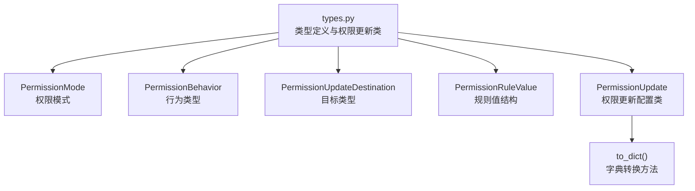
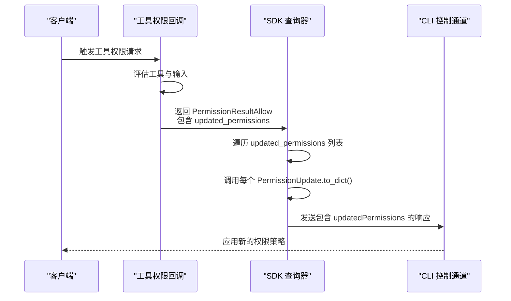
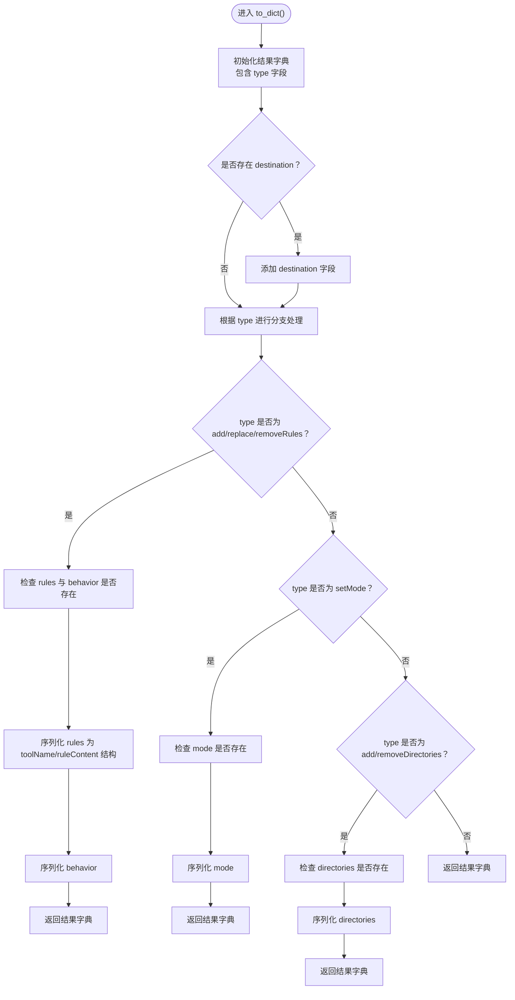
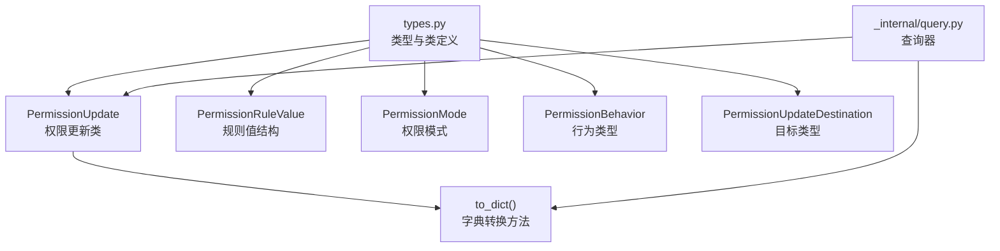

# 权限更新机制

<cite>
**本文档引用的文件**
- [types.py](file://src/claude_agent_sdk/types.py)
- [query.py](file://src/claude_agent_sdk/_internal/query.py)
- [tool_permission_callback.py](file://examples/tool_permission_callback.py)
- [test_tool_permissions.py](file://e2e-tests/test_tool_permissions.py)
- [test_tool_callbacks.py](file://tests/test_tool_callbacks.py)
</cite>

## 目录
1. [简介](#简介)
2. [项目结构](#项目结构)
3. [核心组件](#核心组件)
4. [架构概览](#架构概览)
5. [详细组件分析](#详细组件分析)
6. [依赖关系分析](#依赖关系分析)
7. [性能考虑](#性能考虑)
8. [故障排除指南](#故障排除指南)
9. [结论](#结论)
10. [附录](#附录)

## 简介
本文件系统性地阐述 Claude Agent SDK 的权限更新机制，重点围绕 PermissionUpdate 类与 PermissionRuleValue 结构展开，详细说明各类更新类型（addRules、replaceRules、removeRules、setMode、addDirectories、removeDirectories）、目标类型（userSettings、projectSettings、localSettings、session）与行为类型（allow、deny、ask），并深入解析权限更新的字典转换机制及 to_dict() 方法实现。同时，文档涵盖权限更新在不同作用域中的应用与优先级、权限更新与权限模式的关系与相互影响，提供实际使用示例与配置方法，并总结安全考虑与最佳实践，帮助开发者全面理解并正确使用权限更新功能。

## 项目结构
权限更新相关的核心代码集中在 types.py 中，涉及以下关键类型与数据结构：
- PermissionMode：权限模式枚举，支持 default、acceptEdits、plan、bypassPermissions
- PermissionBehavior：行为类型枚举，支持 allow、deny、ask
- PermissionUpdateDestination：目标类型枚举，支持 userSettings、projectSettings、localSettings、session
- PermissionRuleValue：规则值结构，包含工具名称与规则内容
- PermissionUpdate：权限更新配置类，包含类型、规则列表、行为、模式、目录列表与目标等字段，并提供 to_dict() 方法用于序列化

**图表来源**
- [types.py:17-131](file://src/claude_agent_sdk/types.py#L17-L131)

**章节来源**
- [types.py:17-131](file://src/claude_agent_sdk/types.py#L17-L131)

## 核心组件
本节对权限更新机制的核心组件进行深入分析，包括各类型定义、数据结构与序列化逻辑。

- PermissionMode（权限模式）
  - 支持四种模式：default（默认）、acceptEdits（接受编辑）、plan（计划）、bypassPermissions（绕过权限）
  - 与权限更新的 setMode 类型配合使用，用于整体权限策略的调整

- PermissionBehavior（行为类型）
  - 支持三种行为：allow（允许）、deny（拒绝）、ask（询问）
  - 在规则类更新中用于指定规则的执行行为

- PermissionUpdateDestination（目标类型）
  - 支持四种目标：userSettings（用户设置）、projectSettings（项目设置）、localSettings（本地设置）、session（会话）
  - 指定权限更新生效的作用域

- PermissionRuleValue（规则值结构）
  - 字段：tool_name（工具名称）、rule_content（规则内容，可选）
  - 作为规则列表的基本单元，用于 addRules、replaceRules、removeRules 类型的权限更新

- PermissionUpdate（权限更新配置类）
  - 关键字段：type（更新类型）、rules（规则列表，可选）、behavior（行为，可选）、mode（模式，可选）、directories（目录列表，可选）、destination（目标，可选）
  - 提供 to_dict() 方法，将对象转换为与 TypeScript 控制协议匹配的字典格式

- to_dict() 方法实现要点
  - 始终包含 type 字段
  - 若存在 destination，则添加 destination 字段
  - 根据 type 分支处理：
    - addRules/replaceRules/removeRules：需要 rules 和 behavior；若提供则序列化为包含 toolName 与 ruleContent 的结构
    - setMode：需要 mode；若提供则序列化为 mode 字段
    - addDirectories/removeDirectories：需要 directories；若提供则序列化为 directories 字段
  - 返回最终字典结果

**章节来源**
- [types.py:17-131](file://src/claude_agent_sdk/types.py#L17-L131)
- [types.py:60-131](file://src/claude_agent_sdk/types.py#L60-L131)

## 架构概览
权限更新机制在 SDK 中的调用链路如下：当工具权限回调返回包含 updated_permissions 的 PermissionResultAllow 时，SDK 会将这些权限更新通过 to_dict() 序列化后发送给 CLI 控制通道，从而动态调整权限策略。

**图表来源**
- [query.py:264-286](file://src/claude_agent_sdk/_internal/query.py#L264-L286)
- [types.py:68-131](file://src/claude_agent_sdk/types.py#L68-L131)

**章节来源**
- [query.py:264-286](file://src/claude_agent_sdk/_internal/query.py#L264-L286)
- [types.py:68-131](file://src/claude_agent_sdk/types.py#L68-L131)

## 详细组件分析

### PermissionUpdate 类与 to_dict() 方法
- 类设计
  - 使用 dataclass 定义，字段明确且可选，便于灵活组合不同类型的权限更新
  - type 字段限定为预定义的六种类型之一，确保类型安全
  - destination 字段可选，用于指定更新生效的作用域

- to_dict() 方法流程
  - 初始化结果字典，包含 type 字段
  - 若 destination 存在，添加 destination 字段
  - 根据 type 进行分支处理：
    - 规则类更新：校验 rules 与 behavior，序列化为包含 toolName 与 ruleContent 的结构
    - 模式更新：校验 mode，序列化为 mode 字段
    - 目录类更新：校验 directories，序列化为 directories 字段
  - 返回最终字典

**图表来源**
- [types.py:68-131](file://src/claude_agent_sdk/types.py#L68-L131)

**章节来源**
- [types.py:68-131](file://src/claude_agent_sdk/types.py#L68-L131)

### PermissionRuleValue 结构
- 字段说明
  - tool_name：工具名称，用于标识规则适用的工具
  - rule_content：规则内容，可选字符串，具体语法由底层系统定义
- 用途
  - 作为规则列表的基本元素，参与 addRules、replaceRules、removeRules 类型的权限更新

**章节来源**
- [types.py:60-66](file://src/claude_agent_sdk/types.py#L60-L66)

### 权限更新类型详解
- addRules
  - 用途：向指定目标添加一组新规则
  - 必需字段：rules（规则列表）、behavior（行为）
  - 可选字段：destination（目标）
  - 序列化：生成包含 rules 与 behavior 的字典条目

- replaceRules
  - 用途：替换指定目标的现有规则集
  - 必需字段：rules（规则列表）、behavior（行为）
  - 可选字段：destination（目标）
  - 序列化：生成包含 rules 与 behavior 的字典条目

- removeRules
  - 用途：从指定目标移除一组规则
  - 必需字段：rules（规则列表）
  - 可选字段：destination（目标）
  - 序列化：仅生成包含 rules 的字典条目

- setMode
  - 用途：设置指定目标的权限模式
  - 必需字段：mode（模式）
  - 可选字段：destination（目标）
  - 序列化：生成包含 mode 的字典条目

- addDirectories
  - 用途：向指定目标添加可访问的目录路径
  - 必需字段：directories（目录列表）
  - 可选字段：destination（目标）
  - 序列化：生成包含 directories 的字典条目

- removeDirectories
  - 用途：从指定目标移除可访问的目录路径
  - 必需字段：directories（目录列表）
  - 可选字段：destination（目标）
  - 序列化：生成包含 directories 的字典条目

**章节来源**
- [types.py:68-84](file://src/claude_agent_sdk/types.py#L68-L84)

### 目标类型与作用域
- userSettings
  - 作用域：用户级全局设置
  - 特点：跨项目持久生效，适合通用安全策略

- projectSettings
  - 作用域：当前项目设置
  - 特点：仅在当前项目内生效，适合项目特定策略

- localSettings
  - 作用域：本地机器设置
  - 特点：与用户和项目分离，适合本地环境定制

- session
  - 作用域：当前会话
  - 特点：仅在本次会话有效，适合临时策略调整

**章节来源**
- [types.py:52-55](file://src/claude_agent_sdk/types.py#L52-L55)

### 行为类型与权限决策
- allow
  - 含义：直接允许工具执行
  - 适用：低风险或已授权的工具与操作

- deny
  - 含义：直接拒绝工具执行
  - 适用：高风险或被禁止的工具与操作

- ask
  - 含义：交由用户交互决定
  - 适用：不确定或需要人工审核的操作

**章节来源**
- [types.py:57](file://src/claude_agent_sdk/types.py#L57)

### 权限更新与权限模式的关系
- setMode 与 PermissionMode 的关系
  - setMode 类型用于整体调整权限模式
  - 支持的模式包括 default、acceptEdits、plan、bypassPermissions
  - 不同模式会影响工具权限回调的触发频率与默认行为

- 模式对权限更新的影响
  - default：标准权限控制，工具权限回调按需触发
  - acceptEdits：接受编辑模式，可能放宽某些规则
  - plan：计划模式，侧重规划阶段的权限控制
  - bypassPermissions：绕过权限，通常用于特殊场景

**章节来源**
- [types.py:17-18](file://src/claude_agent_sdk/types.py#L17-L18)
- [types.py:68-84](file://src/claude_agent_sdk/types.py#L68-L84)

### 实际使用示例与配置方法
- 工具权限回调示例
  - 示例展示了如何基于工具类型与输入内容进行权限判断，包括自动允许只读操作、拒绝写入系统目录、重定向写入到安全目录、检测危险命令等
  - 回调可通过返回 PermissionResultAllow 或 PermissionResultDeny 来控制工具执行
  - 示例还演示了如何修改工具输入以增强安全性

- 端到端测试示例
  - 测试验证了 can_use_tool 回调在非只读命令（如 Bash）上会被正确调用
  - 通过构造特定的工具输入，确保回调得到触发并返回允许结果

- 单元测试示例
  - 测试覆盖了权限回调的允许、拒绝、输入修改、异常处理等场景
  - 验证了回调函数的参数传递与返回值格式

**章节来源**
- [tool_permission_callback.py:26-94](file://examples/tool_permission_callback.py#L26-L94)
- [test_tool_permissions.py:17-66](file://e2e-tests/test_tool_permissions.py#L17-L66)
- [test_tool_callbacks.py:56-210](file://tests/test_tool_callbacks.py#L56-L210)

## 依赖关系分析
权限更新机制的依赖关系主要体现在类型定义与序列化逻辑之间：

**图表来源**
- [types.py:17-131](file://src/claude_agent_sdk/types.py#L17-L131)
- [query.py:264-286](file://src/claude_agent_sdk/_internal/query.py#L264-L286)

**章节来源**
- [types.py:17-131](file://src/claude_agent_sdk/types.py#L17-L131)
- [query.py:264-286](file://src/claude_agent_sdk/_internal/query.py#L264-L286)

## 性能考虑
- 序列化开销
  - to_dict() 方法对每个 PermissionUpdate 进行字典转换，复杂度为 O(n)，其中 n 为规则数量
  - 当 updated_permissions 列表较大时，建议批量处理以减少序列化次数

- 回调执行频率
  - 权限模式（如 default）会按需触发工具权限回调，避免不必要的检查
  - 在高频工具调用场景下，合理设置权限模式可平衡安全与性能

- 内存占用
  - PermissionUpdate 对象包含多个可选字段，建议仅在必要时提供非空值，以减少内存占用

## 故障排除指南
- 回调未触发
  - 确认权限模式设置为 default，以确保回调被触发
  - 检查工具是否为只读操作（某些只读操作可能被 CLI 自动允许）

- 序列化错误
  - 确保 PermissionUpdate 的必需字段满足类型要求
  - 对于规则类更新，必须提供 rules 与 behavior；对于模式更新，必须提供 mode；对于目录类更新，必须提供 directories

- 权限更新未生效
  - 检查 destination 设置是否正确，确认目标类型与期望的作用域一致
  - 验证权限模式是否与预期相符，特别是 bypassPermissions 模式下的特殊行为

**章节来源**
- [test_tool_callbacks.py:175-210](file://tests/test_tool_callbacks.py#L175-L210)
- [query.py:264-286](file://src/claude_agent_sdk/_internal/query.py#L264-L286)

## 结论
Claude Agent SDK 的权限更新机制通过 PermissionUpdate 与 PermissionRuleValue 提供了灵活而强大的权限控制能力。开发者可以基于不同的更新类型、目标类型与行为类型，精确地调整权限策略。结合权限模式与工具权限回调，可以在保证安全性的同时提升开发体验。建议在实际项目中遵循最小权限原则，合理设置权限模式与目标范围，并通过测试验证权限更新的效果。

## 附录
- 最佳实践
  - 使用最小权限原则：仅授予完成任务所需的最低权限
  - 明确目标范围：根据策略需求选择合适的 destination（userSettings、projectSettings、localSettings、session）
  - 统一行为规范：在规则类更新中明确 behavior（allow、deny、ask），避免歧义
  - 安全优先：对高风险操作采用 deny 或 ask，对低风险操作采用 allow
  - 可审计性：记录权限变更历史，便于问题追踪与合规审计

- 常见配置示例
  - 添加规则：使用 addRules 类型，提供 rules 与 behavior，设置目标为 userSettings 或 projectSettings
  - 替换模式：使用 setMode 类型，提供 mode（如 default、bypassPermissions），设置目标为 session 以临时调整
  - 管理目录：使用 addDirectories/removeDirectories 类型，提供 directories 列表，设置目标为 projectSettings