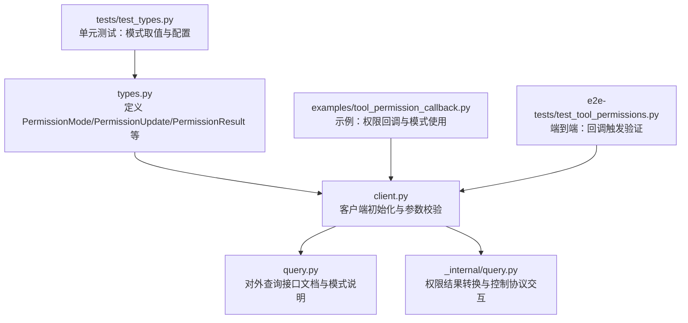
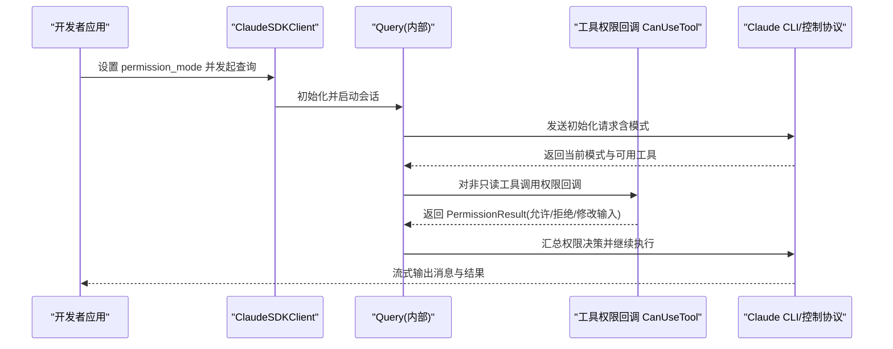
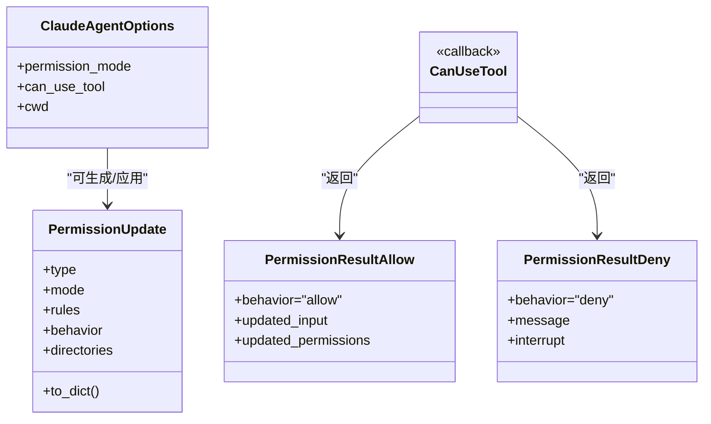
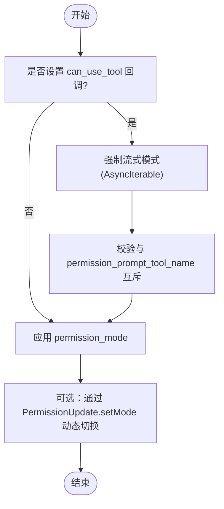
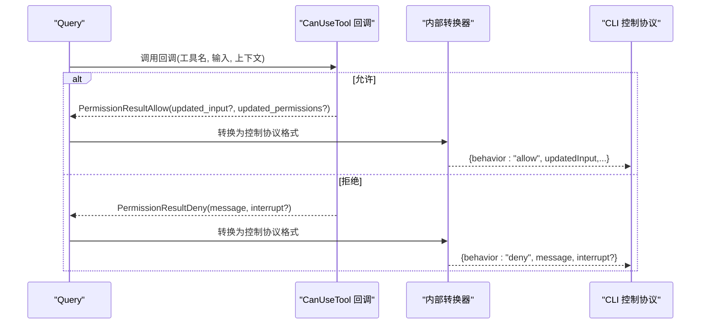
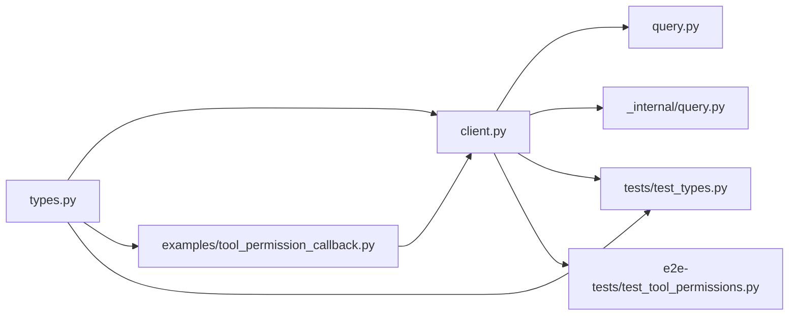

# 权限模式

<cite>
**本文引用的文件**
- [src/claude_agent_sdk/types.py](file://src/claude_agent_sdk/types.py)
- [examples/tool_permission_callback.py](file://examples/tool_permission_callback.py)
- [tests/test_types.py](file://tests/test_types.py)
- [e2e-tests/test_tool_permissions.py](file://e2e-tests/test_tool_permissions.py)
- [src/claude_agent_sdk/query.py](file://src/claude_agent_sdk/query.py)
- [src/claude_agent_sdk/_internal/query.py](file://src/claude_agent_sdk/_internal/query.py)
- [src/claude_agent_sdk/client.py](file://src/claude_agent_sdk/client.py)
</cite>

## 目录
1. [简介](#简介)
2. [项目结构](#项目结构)
3. [核心组件](#核心组件)
4. [架构总览](#架构总览)
5. [详细组件分析](#详细组件分析)
6. [依赖关系分析](#依赖关系分析)
7. [性能考量](#性能考量)
8. [故障排查指南](#故障排查指南)
9. [结论](#结论)
10. [附录](#附录)

## 简介
本文件围绕 Claude Agent SDK 的权限模式进行系统化说明，重点覆盖以下内容：
- 权限模式枚举 PermissionMode 的四种取值：default、acceptEdits、plan、bypassPermissions 的行为特征与适用场景
- 权限模式如何影响工具调用的执行流程与权限检查过程
- 权限模式与工具权限系统（规则、回调、建议）的关系
- 权限模式切换的实现方式与注意事项
- 面向开发者的最佳实践与常见问题排查

## 项目结构
与权限模式直接相关的代码主要分布在以下模块：
- 类型定义与权限系统：src/claude_agent_sdk/types.py
- 示例与用法演示：examples/tool_permission_callback.py
- 单元测试与端到端测试：tests/test_types.py、e2e-tests/test_tool_permissions.py
- 查询与客户端集成：src/claude_agent_sdk/query.py、src/claude_agent_sdk/_internal/query.py、src/claude_agent_sdk/client.py

图表来源
- [src/claude_agent_sdk/types.py:17-18](file://src/claude_agent_sdk/types.py#L17-L18)
- [src/claude_agent_sdk/client.py:112-131](file://src/claude_agent_sdk/client.py#L112-L131)
- [src/claude_agent_sdk/query.py:56-60](file://src/claude_agent_sdk/query.py#L56-L60)
- [src/claude_agent_sdk/_internal/query.py:264-286](file://src/claude_agent_sdk/_internal/query.py#L264-L286)

章节来源
- [src/claude_agent_sdk/types.py:17-18](file://src/claude_agent_sdk/types.py#L17-L18)
- [src/claude_agent_sdk/client.py:112-131](file://src/claude_agent_sdk/client.py#L112-L131)
- [src/claude_agent_sdk/query.py:56-60](file://src/claude_agent_sdk/query.py#L56-L60)
- [src/claude_agent_sdk/_internal/query.py:264-286](file://src/claude_agent_sdk/_internal/query.py#L264-L286)

## 核心组件
- 权限模式枚举 PermissionMode：用于控制工具调用时的权限检查策略
- 工具权限回调 CanUseTool：在工具调用前由 SDK 触发，允许或拒绝并可修改输入
- 权限结果 PermissionResult：包含允许/拒绝两类返回，支持更新输入与建议
- 权限更新 PermissionUpdate：用于动态调整权限模式、规则与目录范围
- 客户端选项 ClaudeAgentOptions：通过 permission_mode 字段设置当前模式

章节来源
- [src/claude_agent_sdk/types.py:17-18](file://src/claude_agent_sdk/types.py#L17-L18)
- [src/claude_agent_sdk/types.py:155-157](file://src/claude_agent_sdk/types.py#L155-L157)
- [src/claude_agent_sdk/types.py:135-153](file://src/claude_agent_sdk/types.py#L135-L153)
- [src/claude_agent_sdk/types.py:69-84](file://src/claude_agent_sdk/types.py#L69-L84)
- [src/claude_agent_sdk/client.py:112-131](file://src/claude_agent_sdk/client.py#L112-L131)

## 架构总览
下图展示了权限模式在工具调用链路中的作用位置与交互关系。

图表来源
- [src/claude_agent_sdk/client.py:112-131](file://src/claude_agent_sdk/client.py#L112-L131)
- [src/claude_agent_sdk/_internal/query.py:264-286](file://src/claude_agent_sdk/_internal/query.py#L264-L286)
- [src/claude_agent_sdk/query.py:56-60](file://src/claude_agent_sdk/query.py#L56-L60)

## 详细组件分析

### 权限模式枚举与行为特征
- default（默认模式）
  - 行为特征：对非只读工具触发权限回调；对危险命令进行提示或拦截
  - 使用场景：需要对工具调用进行细粒度控制与安全审查
  - 注意事项：需配合 can_use_tool 回调使用，否则无法生效
- acceptEdits（编辑接受模式）
  - 行为特征：自动接受文件读写类工具（如 Write/Edit/MultiEdit），减少交互成本
  - 使用场景：以文件编辑为主的工作流，希望降低交互频率
  - 注意事项：仍可能触发回调，但对编辑类工具通常直接放行
- plan（计划模式）
  - 行为特征：侧重“计划—执行”路径，工具调用前会进行更严格的权限评估
  - 使用场景：需要在执行前明确工具使用意图与范围
  - 注意事项：与回调机制协同工作，确保计划阶段的权限透明
- bypassPermissions（绕过权限模式）
  - 行为特征：允许所有工具调用，不进行额外权限检查
  - 使用场景：受控环境下的自动化脚本或内部测试
  - 注意事项：存在安全风险，应谨慎使用，并限制在可信上下文

章节来源
- [src/claude_agent_sdk/types.py:17-18](file://src/claude_agent_sdk/types.py#L17-L18)
- [src/claude_agent_sdk/query.py:56-60](file://src/claude_agent_sdk/query.py#L56-L60)
- [tests/test_types.py:104-116](file://tests/test_types.py#L104-L116)

### 权限模式与工具权限系统的关联
- 模式通过 ClaudeAgentOptions.permission_mode 注入到会话初始化中
- 当设置了 can_use_tool 回调时，SDK 会强制使用“流式模式”，并在工具调用前触发回调
- 回调返回 PermissionResultAllow/PermissionResultDeny，内部会转换为控制协议期望的数据格式
- 可通过 PermissionUpdate 动态调整模式、规则与目录范围

图表来源
- [src/claude_agent_sdk/types.py:69-84](file://src/claude_agent_sdk/types.py#L69-L84)
- [src/claude_agent_sdk/types.py:135-153](file://src/claude_agent_sdk/types.py#L135-L153)
- [src/claude_agent_sdk/types.py:155-157](file://src/claude_agent_sdk/types.py#L155-L157)

章节来源
- [src/claude_agent_sdk/types.py:69-84](file://src/claude_agent_sdk/types.py#L69-L84)
- [src/claude_agent_sdk/types.py:135-153](file://src/claude_agent_sdk/types.py#L135-L153)
- [src/claude_agent_sdk/types.py:155-157](file://src/claude_agent_sdk/types.py#L155-L157)

### 权限模式切换的实现方式与注意事项
- 切换方式
  - 在 ClaudeAgentOptions 中设置 permission_mode 字段
  - 通过 PermissionUpdate(type="setMode", mode=...) 动态更新
- 注意事项
  - 若设置了 can_use_tool 回调，必须使用流式模式（AsyncIterable prompt），否则会抛出异常
  - can_use_tool 与 permission_prompt_tool_name 互斥，不可同时使用
  - 不同模式下回调的触发频率与策略不同，需结合业务场景选择

图表来源
- [src/claude_agent_sdk/client.py:112-131](file://src/claude_agent_sdk/client.py#L112-L131)
- [src/claude_agent_sdk/types.py:69-84](file://src/claude_agent_sdk/types.py#L69-L84)

章节来源
- [src/claude_agent_sdk/client.py:112-131](file://src/claude_agent_sdk/client.py#L112-L131)
- [src/claude_agent_sdk/types.py:69-84](file://src/claude_agent_sdk/types.py#L69-L84)

### 实际应用场景与最佳实践
- default 模式
  - 场景：通用对话与任务执行，需要对危险操作进行审慎处理
  - 最佳实践：实现细粒度的 can_use_tool 回调，针对敏感工具（如 Bash、文件写入）进行严格校验
- acceptEdits 模式
  - 场景：以文件编辑为主的自动化脚本或代码生成
  - 最佳实践：保留对关键命令的白名单/黑名单策略，必要时对输入进行重定向或清洗
- plan 模式
  - 场景：需要在执行前明确工具使用计划，便于审计与复现
  - 最佳实践：结合日志与权限建议，确保每次工具调用都有据可查
- bypassPermissions 模式
  - 场景：内部受控环境下的快速原型或测试
  - 最佳实践：仅在隔离环境中使用，避免在生产或共享环境启用

章节来源
- [examples/tool_permission_callback.py:40-93](file://examples/tool_permission_callback.py#L40-L93)
- [tests/test_types.py:104-116](file://tests/test_types.py#L104-L116)

### 权限检查流程与回调交互
- 当工具调用发生时，若处于 default/plan 模式且工具非只读，SDK 将触发 can_use_tool 回调
- 回调返回 PermissionResultAllow 时，可选择更新输入或附加权限建议
- 回调返回 PermissionResultDeny 时，可中断执行并给出原因
- 内部将 PermissionResult 转换为控制协议数据格式，再与 CLI 交互

图表来源
- [src/claude_agent_sdk/_internal/query.py:264-286](file://src/claude_agent_sdk/_internal/query.py#L264-L286)

章节来源
- [src/claude_agent_sdk/_internal/query.py:264-286](file://src/claude_agent_sdk/_internal/query.py#L264-L286)

## 依赖关系分析
- 类型层：types.py 定义了 PermissionMode、PermissionUpdate、PermissionResult、CanUseTool 等核心类型
- 客户端层：client.py 在连接阶段对 can_use_tool 与 permission_mode 进行约束与配置
- 查询层：query.py 提供对外文档化的模式说明；_internal/query.py 负责权限结果转换
- 示例与测试：examples 与 tests 验证模式取值与回调触发行为

图表来源
- [src/claude_agent_sdk/types.py:17-18](file://src/claude_agent_sdk/types.py#L17-L18)
- [src/claude_agent_sdk/client.py:112-131](file://src/claude_agent_sdk/client.py#L112-L131)
- [src/claude_agent_sdk/query.py:56-60](file://src/claude_agent_sdk/query.py#L56-L60)
- [src/claude_agent_sdk/_internal/query.py:264-286](file://src/claude_agent_sdk/_internal/query.py#L264-L286)

章节来源
- [src/claude_agent_sdk/types.py:17-18](file://src/claude_agent_sdk/types.py#L17-L18)
- [src/claude_agent_sdk/client.py:112-131](file://src/claude_agent_sdk/client.py#L112-L131)
- [src/claude_agent_sdk/query.py:56-60](file://src/claude_agent_sdk/query.py#L56-L60)
- [src/claude_agent_sdk/_internal/query.py:264-286](file://src/claude_agent_sdk/_internal/query.py#L264-L286)

## 性能考量
- 回调触发频率：default/plan 模式下对非只读工具均会触发回调，acceptEdits 模式对编辑类工具通常不触发
- 流式模式开销：启用 can_use_tool 时需使用流式模式，会引入额外的控制协议往返
- 建议：在高频工具调用场景优先考虑 acceptEdits 或合理设计回调逻辑，减少不必要的阻塞

## 故障排查指南
- 问题：设置了 can_use_tool 但未使用流式模式导致报错
  - 现象：字符串 prompt 传入时报错，提示需使用 AsyncIterable
  - 处理：改为流式模式或移除回调
- 问题：can_use_tool 与 permission_prompt_tool_name 同时设置
  - 现象：抛出互斥错误
  - 处理：二选一，不要同时使用
- 问题：bypassPermissions 下仍被拦截
  - 现象：某些受保护的系统级操作仍被阻止
  - 处理：确认运行环境与 CLI 版本，确保模式正确传递

章节来源
- [src/claude_agent_sdk/client.py:112-131](file://src/claude_agent_sdk/client.py#L112-L131)
- [e2e-tests/test_tool_permissions.py:19-60](file://e2e-tests/test_tool_permissions.py#L19-L60)

## 结论
- 权限模式是 Claude Agent SDK 控制工具调用安全边界的关键开关
- 不同模式在“交互频率、安全强度、易用性”之间权衡，应按场景选择
- 通过 can_use_tool 回调与 PermissionUpdate，可在运行时灵活调整策略
- 生产环境建议优先采用 default/plan 模式，谨慎使用 bypassPermissions

## 附录
- 模式取值验证参考：tests/test_types.py
- 回调触发端到端验证：e2e-tests/test_tool_permissions.py
- 示例：examples/tool_permission_callback.py 展示了回调与模式的组合使用