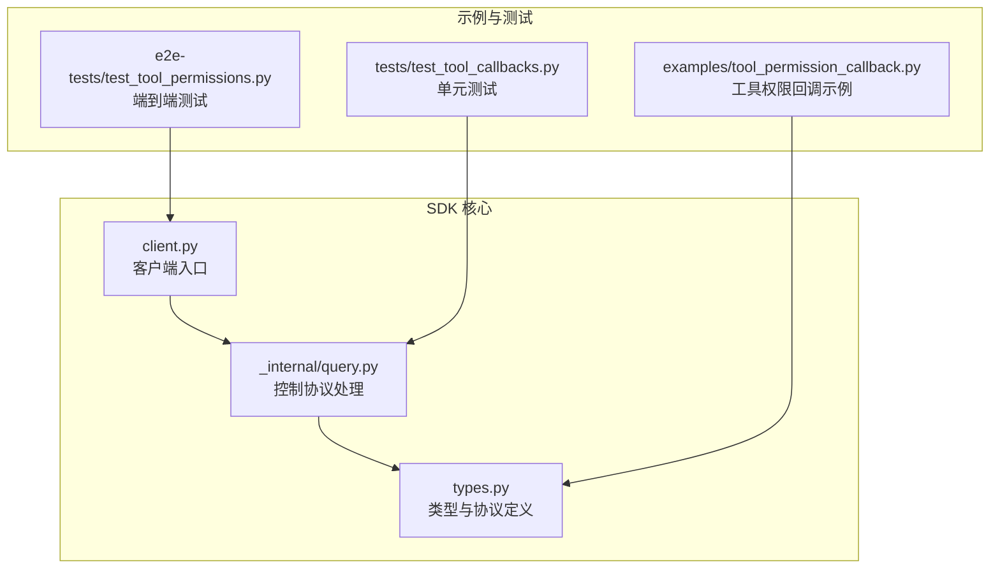
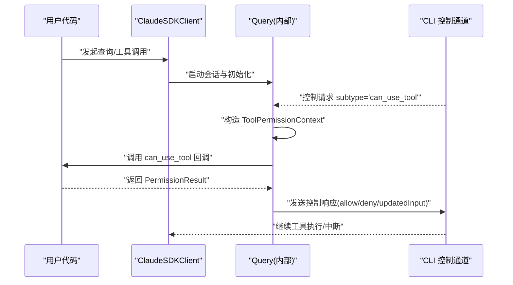
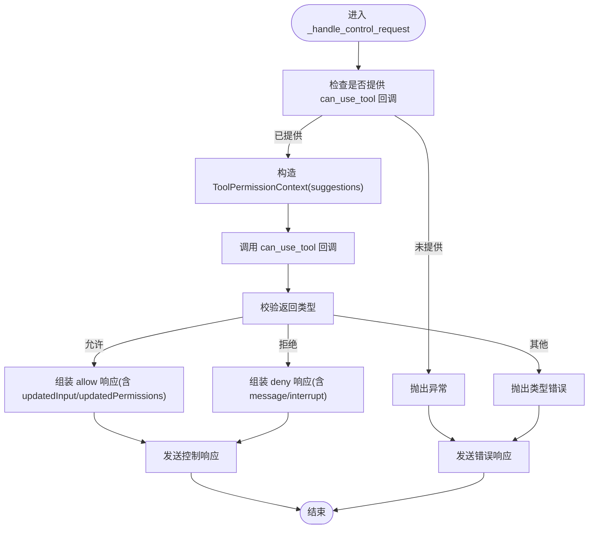
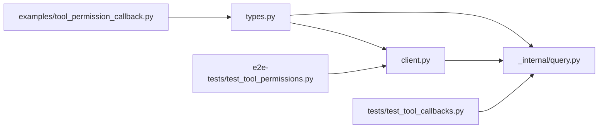

# 权限系统

<cite>
**本文引用的文件**
- [types.py](file://src/claude_agent_sdk/types.py)
- [client.py](file://src/claude_agent_sdk/client.py)
- [query.py](file://src/claude_agent_sdk/_internal/query.py)
- [tool_permission_callback.py](file://examples/tool_permission_callback.py)
- [test_tool_permissions.py](file://e2e-tests/test_tool_permissions.py)
- [test_tool_callbacks.py](file://tests/test_tool_callbacks.py)
- [README.md](file://README.md)
</cite>

## 目录
1. [简介](#简介)
2. [项目结构](#项目结构)
3. [核心组件](#核心组件)
4. [架构总览](#架构总览)
5. [详细组件分析](#详细组件分析)
6. [依赖分析](#依赖分析)
7. [性能考量](#性能考量)
8. [故障排查指南](#故障排查指南)
9. [结论](#结论)
10. [附录](#附录)

## 简介
本文件面向开发者，系统性阐述 Claude Agent SDK 的权限系统，重点覆盖工具权限控制的完整机制与实现细节。内容包括：
- 工具权限回调函数的类型定义、参数与返回值
- 权限决策流程与错误处理
- 动态权限控制与实时调整能力
- 基于上下文的权限判断与建议机制
- 与工具调用流程的集成方式
- 最佳实践与安全考虑
- 复杂策略示例（基于角色、时间限制、资源配额等）

## 项目结构
围绕权限系统的关键代码分布在以下模块：
- 类型与协议定义：types.py
- 客户端入口与运行时控制：client.py
- 控制协议处理与回调执行：_internal/query.py
- 示例与测试：examples/tool_permission_callback.py、e2e-tests/test_tool_permissions.py、tests/test_tool_callbacks.py

图表来源
- [client.py:112-176](file://src/claude_agent_sdk/client.py#L112-L176)
- [query.py:236-333](file://src/claude_agent_sdk/_internal/query.py#L236-L333)
- [types.py:17-157](file://src/claude_agent_sdk/types.py#L17-L157)

章节来源
- [client.py:112-176](file://src/claude_agent_sdk/client.py#L112-L176)
- [query.py:236-333](file://src/claude_agent_sdk/_internal/query.py#L236-L333)
- [types.py:17-157](file://src/claude_agent_sdk/types.py#L17-L157)

## 核心组件
- 权限模式枚举：用于控制默认行为与自动放行策略
- 工具权限回调类型：CanUseTool、ToolPermissionContext、PermissionResult（含允许/拒绝）
- 权限更新结构：PermissionUpdate 及其规则值 PermissionRuleValue
- 控制请求处理：在内部查询器中接收并处理 can_use_tool 请求
- 客户端接口：支持在运行时切换权限模式

章节来源
- [types.py:17-157](file://src/claude_agent_sdk/types.py#L17-L157)
- [query.py:236-333](file://src/claude_agent_sdk/_internal/query.py#L236-L333)
- [client.py:234-256](file://src/claude_agent_sdk/client.py#L234-L256)

## 架构总览
工具权限控制在 SDK 中通过“控制协议”驱动，核心流程如下：
- 客户端以流式模式连接 CLI，并注册 can_use_tool 回调
- 当 CLI 需要对某个工具调用进行权限决策时，向 SDK 发送控制请求 subtype="can_use_tool"
- SDK 内部查询器解析请求，构造 ToolPermissionContext，调用用户提供的回调
- 回调返回 PermissionResultAllow 或 PermissionResultDeny，SDK 将结果转换为 CLI 协议格式并回传

图表来源
- [client.py:112-176](file://src/claude_agent_sdk/client.py#L112-L176)
- [query.py:236-333](file://src/claude_agent_sdk/_internal/query.py#L236-L333)
- [types.py:123-157](file://src/claude_agent_sdk/types.py#L123-L157)

## 详细组件分析

### 权限模式与更新机制
- 权限模式（PermissionMode）：用于控制 CLI 的默认行为，常见取值包括 default、acceptEdits、plan、bypassPermissions 等
- 权限行为（PermissionBehavior）：allow、deny、ask
- 权限更新（PermissionUpdate）：支持添加/替换/移除规则、设置模式、增删目录等操作；可携带目标位置（userSettings、projectSettings、localSettings、session）
- 规则值（PermissionRuleValue）：包含工具名与规则内容

这些类型共同构成“规则驱动”的权限控制基础，允许在运行时通过回调返回 PermissionResultAllow.updated_permissions 推送新的权限配置。

章节来源
- [types.py:17-121](file://src/claude_agent_sdk/types.py#L17-L121)
- [types.py:123-157](file://src/claude_agent_sdk/types.py#L123-L157)

### 工具权限回调：CanUseTool、ToolPermissionContext、PermissionResult
- CanUseTool：异步回调签名，接收工具名、输入字典与上下文，返回 PermissionResultAllow 或 PermissionResultDeny
- ToolPermissionContext：包含 suggestions（来自 CLI 的权限建议）与 signal（预留取消信号）
- PermissionResultAllow/Deny：允许时可返回 updated_input 与 updated_permissions；拒绝时可附带 message 与 interrupt 标记

SDK 在处理 can_use_tool 请求时：
- 若未提供回调，抛出异常
- 构造 ToolPermissionContext（包含 permission_suggestions 字段）
- 调用回调并校验返回值类型
- 将 PermissionResult 转换为 CLI 协议期望的字典格式

章节来源
- [types.py:123-157](file://src/claude_agent_sdk/types.py#L123-L157)
- [query.py:236-333](file://src/claude_agent_sdk/_internal/query.py#L236-L333)
- [query.py:264-286](file://src/claude_agent_sdk/_internal/query.py#L264-L286)

### 权限决策流程与错误处理
- 允许：返回 PermissionResultAllow，SDK 会将 updated_input 作为最终输入传递给工具；若包含 updated_permissions，则一并回传给 CLI
- 拒绝：返回 PermissionResultDeny，SDK 会将 message 与 interrupt 标记回传 CLI
- 错误处理：回调类型不匹配或异常会被捕获并转换为错误响应

图表来源
- [query.py:236-333](file://src/claude_agent_sdk/_internal/query.py#L236-L333)
- [query.py:264-286](file://src/claude_agent_sdk/_internal/query.py#L264-L286)

### 动态权限控制与实时调整
- 运行时切换权限模式：客户端提供 set_permission_mode，可在会话中动态调整模式
- 回调返回 updated_permissions：允许在决策的同时推送新的规则或模式变更，实现“边执行边调整”
- 上下文感知：ToolPermissionContext.suggestions 提供 CLI 的建议，可用于引导策略或审计

章节来源
- [client.py:234-256](file://src/claude_agent_sdk/client.py#L234-L256)
- [types.py:69-121](file://src/claude_agent_sdk/types.py#L69-L121)
- [query.py:264-286](file://src/claude_agent_sdk/_internal/query.py#L264-L286)

### 与工具调用流程的集成
- 客户端连接时，若配置了 can_use_tool，SDK 会强制使用流式模式，并将 permission_prompt_tool_name 设置为 "stdio" 以启用控制协议
- 流式模式下，SDK 通过内部查询器持续监听控制请求并在需要时触发回调
- 回调返回后，SDK 将结果转换为 CLI 协议格式并回传，从而无缝衔接工具执行链路

章节来源
- [client.py:112-131](file://src/claude_agent_sdk/client.py#L112-L131)
- [query.py:236-333](file://src/claude_agent_sdk/_internal/query.py#L236-L333)

### 示例与测试验证
- 示例：tool_permission_callback.py 展示了如何基于工具类型、输入内容与上下文进行允许/拒绝与输入修改
- 单元测试：test_tool_callbacks.py 验证了允许、拒绝、输入修改、异常处理等场景
- 端到端测试：test_tool_permissions.py 验证了 can_use_tool 回调在真实 CLI 交互中的调用路径

章节来源
- [tool_permission_callback.py:26-94](file://examples/tool_permission_callback.py#L26-L94)
- [test_tool_callbacks.py:56-173](file://tests/test_tool_callbacks.py#L56-L173)
- [test_tool_permissions.py:17-65](file://e2e-tests/test_tool_permissions.py#L17-L65)

## 依赖分析
- 类型依赖：所有权限相关结构均定义在 types.py 中，供 client.py 与 query.py 使用
- 运行时依赖：client.py 在 connect 时根据是否提供 can_use_tool 决定模式与提示工具名，并创建 Query 实例
- 控制协议依赖：query.py 的 _handle_control_request 专门处理 subtype="can_use_tool" 的请求

图表来源
- [types.py:17-157](file://src/claude_agent_sdk/types.py#L17-L157)
- [client.py:112-176](file://src/claude_agent_sdk/client.py#L112-L176)
- [query.py:236-333](file://src/claude_agent_sdk/_internal/query.py#L236-L333)

章节来源
- [types.py:17-157](file://src/claude_agent_sdk/types.py#L17-L157)
- [client.py:112-176](file://src/claude_agent_sdk/client.py#L112-L176)
- [query.py:236-333](file://src/claude_agent_sdk/_internal/query.py#L236-L333)

## 性能考量
- 回调执行为异步，需避免阻塞；建议在回调中仅做必要判定与轻量级输入修改
- updated_permissions 的批量推送可能带来额外序列化开销，建议按需使用
- 流式模式下的控制请求往返延迟直接影响用户体验，应尽量缩短回调耗时

## 故障排查指南
- 回调未被调用
  - 确认已提供 can_use_tool 且使用流式模式
  - 检查是否与 permission_prompt_tool_name 冲突
- 回调返回类型错误
  - 必须返回 PermissionResultAllow 或 PermissionResultDeny
- 权限更新未生效
  - 确认 updated_permissions 的字段与目标位置正确
  - 检查 CLI 是否接受该更新类型
- 运行时切换模式无效
  - 确认当前处于流式模式并已连接

章节来源
- [client.py:112-131](file://src/claude_agent_sdk/client.py#L112-L131)
- [query.py:264-286](file://src/claude_agent_sdk/_internal/query.py#L264-L286)
- [types.py:69-121](file://src/claude_agent_sdk/types.py#L69-L121)

## 结论
Claude Agent SDK 的权限系统以“控制协议 + 回调 + 规则更新”为核心，既保证了灵活性（可动态调整），又维持了安全性（细粒度输入修改与拒绝）。通过 ToolPermissionContext.suggestions 与 PermissionResult.updated_permissions，开发者可以构建从简单白名单到复杂策略（角色、时间、配额）的多层权限体系，并与工具调用流程无缝集成。

## 附录

### 权限模式与行为速览
- 权限模式（PermissionMode）：default、acceptEdits、plan、bypassPermissions 等
- 权限行为（PermissionBehavior）：allow、deny、ask
- 更新类型（PermissionUpdate.type）：addRules、replaceRules、removeRules、setMode、addDirectories、removeDirectories

章节来源
- [types.py:17-121](file://src/claude_agent_sdk/types.py#L17-L121)

### 最佳实践与安全考虑
- 优先使用最小权限原则：仅授予必要工具与目录
- 输入校验与净化：在回调中对输入进行严格校验与必要修改
- 审计与日志：记录工具使用与权限决策，便于追踪
- 分层策略：结合 allowed_tools/disallowed_tools 与 can_use_tool 回调，形成“预批准 + 动态决策”的组合拳
- 安全边界：避免在回调中执行高风险命令，必要时引入沙箱或只读模式

章节来源
- [README.md:57-73](file://README.md#L57-L73)
- [tool_permission_callback.py:26-94](file://examples/tool_permission_callback.py#L26-L94)