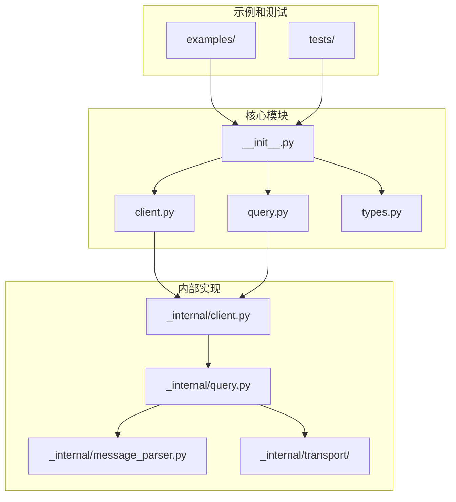
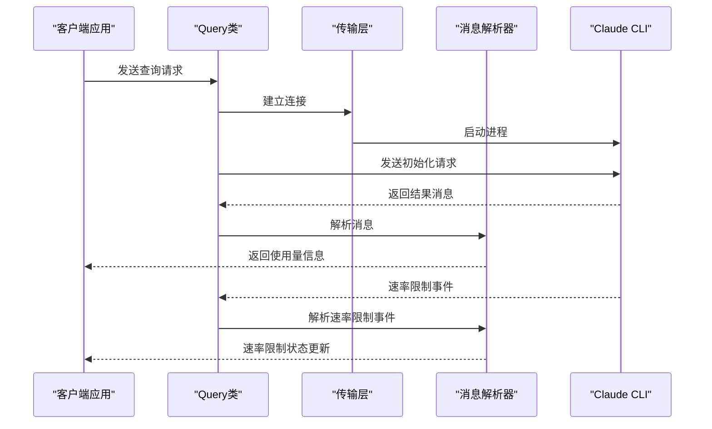
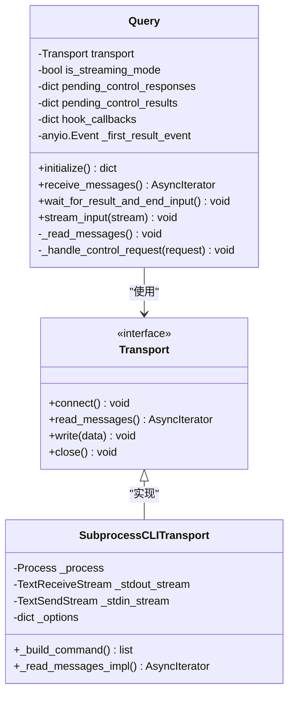
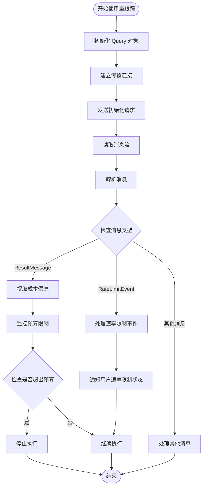
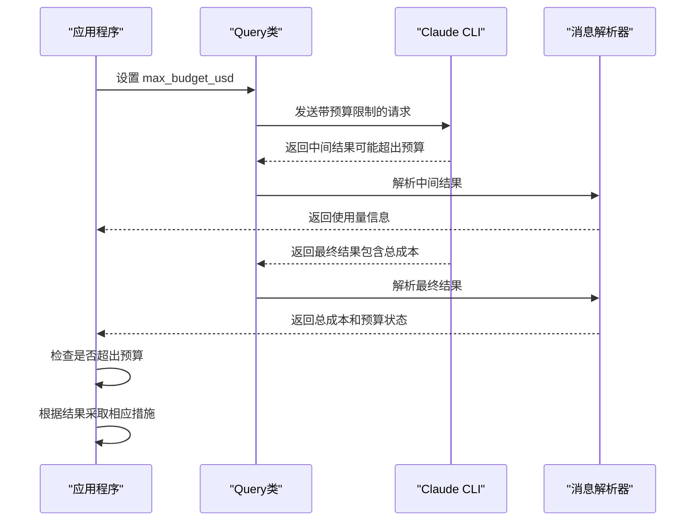
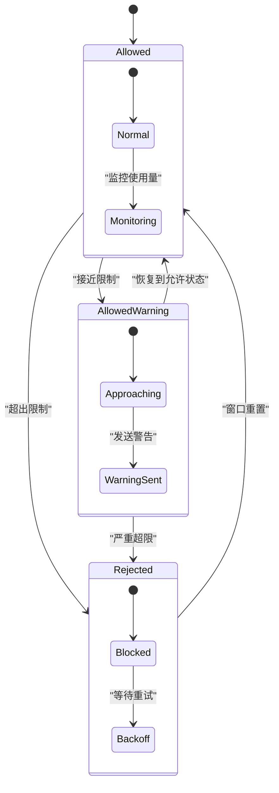
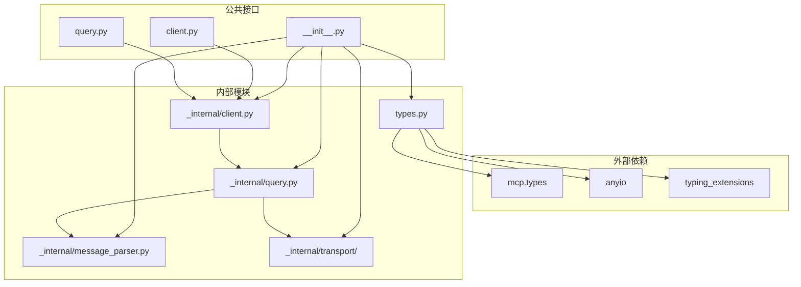

# 每轮次使用量跟踪

<cite>
**本文档引用的文件**
- [src/claude_agent_sdk/__init__.py](file://src/claude_agent_sdk/__init__.py)
- [src/claude_agent_sdk/client.py](file://src/claude_agent_sdk/client.py)
- [src/claude_agent_sdk/query.py](file://src/claude_agent_sdk/query.py)
- [src/claude_agent_sdk/types.py](file://src/claude_agent_sdk/types.py)
- [src/claude_agent_sdk/_internal/client.py](file://src/claude_agent_sdk/_internal/client.py)
- [src/claude_agent_sdk/_internal/query.py](file://src/claude_agent_sdk/_internal/query.py)
- [src/claude_agent_sdk/_internal/message_parser.py](file://src/claude_agent_sdk/_internal/message_parser.py)
- [src/claude_agent_sdk/_internal/transport/subprocess_cli.py](file://src/claude_agent_sdk/_internal/transport/subprocess_cli.py)
- [examples/max_budget_usd.py](file://examples/max_budget_usd.py)
- [tests/test_integration.py](file://tests/test_integration.py)
- [tests/test_rate_limit_event_repro.py](file://tests/test_rate_limit_event_repro.py)
</cite>

## 目录
1. [简介](#简介)
2. [项目结构](#项目结构)
3. [核心组件](#核心组件)
4. [架构概览](#架构概览)
5. [详细组件分析](#详细组件分析)
6. [依赖关系分析](#依赖关系分析)
7. [性能考虑](#性能考虑)
8. [故障排除指南](#故障排除指南)
9. [结论](#结论)

## 简介

本文档深入分析 Claude Agent SDK 中的"每轮次使用量跟踪"功能。该功能允许开发者监控和控制每次对话轮次中的资源使用情况，包括成本控制、令牌使用统计和速率限制管理。

Claude Agent SDK 提供了完整的使用量跟踪机制，通过多种数据类型和事件来报告每次交互的成本、使用情况和限制状态。这使得开发者能够构建智能的应用程序，根据使用量动态调整行为或提供用户反馈。

## 项目结构

该项目采用模块化架构设计，主要包含以下核心目录和文件：

**图表来源**
- [src/claude_agent_sdk/__init__.py:1-445](file://src/claude_agent_sdk/__init__.py#L1-L445)
- [src/claude_agent_sdk/client.py:1-499](file://src/claude_agent_sdk/client.py#L1-L499)
- [src/claude_agent_sdk/_internal/client.py:1-146](file://src/claude_agent_sdk/_internal/client.py#L1-L146)

**章节来源**
- [src/claude_agent_sdk/__init__.py:1-445](file://src/claude_agent_sdk/__init__.py#L1-L445)
- [src/claude_agent_sdk/client.py:1-499](file://src/claude_agent_sdk/client.py#L1-L499)

## 核心组件

### 使用量跟踪数据模型

SDK 定义了完整的使用量跟踪数据结构，主要包括：

1. **ResultMessage** - 包含每次交互的最终结果和使用量信息
2. **RateLimitEvent** - 速率限制状态变化事件
3. **TaskUsage** - 任务执行使用量统计
4. **ClaudeAgentOptions** - 配置选项，支持预算限制

### 关键特性

- **成本控制**：通过 `max_budget_usd` 选项限制单次交互的最大成本
- **实时监控**：通过 `ResultMessage.total_cost_usd` 实时获取当前成本
- **速率限制通知**：通过 `RateLimitEvent` 获取速率限制状态变化
- **令牌使用统计**：通过 `usage` 字段获取详细的令牌使用情况

**章节来源**
- [src/claude_agent_sdk/types.py:876-948](file://src/claude_agent_sdk/types.py#L876-L948)
- [src/claude_agent_sdk/types.py:1035-1104](file://src/claude_agent_sdk/types.py#L1035-L1104)

## 架构概览

**图表来源**
- [src/claude_agent_sdk/_internal/query.py:119-163](file://src/claude_agent_sdk/_internal/query.py#L119-L163)
- [src/claude_agent_sdk/_internal/transport/subprocess_cli.py:335-413](file://src/claude_agent_sdk/_internal/transport/subprocess_cli.py#L335-L413)
- [src/claude_agent_sdk/_internal/message_parser.py:29-252](file://src/claude_agent_sdk/_internal/message_parser.py#L29-L252)

## 详细组件分析

### Query 类 - 使用量跟踪核心

Query 类是使用量跟踪的核心组件，负责处理与 Claude CLI 的双向通信：

**图表来源**
- [src/claude_agent_sdk/_internal/query.py:53-118](file://src/claude_agent_sdk/_internal/query.py#L53-L118)
- [src/claude_agent_sdk/_internal/transport/subprocess_cli.py:33-63](file://src/claude_agent_sdk/_internal/transport/subprocess_cli.py#L33-L63)

**章节来源**
- [src/claude_agent_sdk/_internal/query.py:53-679](file://src/claude_agent_sdk/_internal/query.py#L53-L679)
- [src/claude_agent_sdk/_internal/transport/subprocess_cli.py:33-632](file://src/claude_agent_sdk/_internal/transport/subprocess_cli.py#L33-L632)

### 使用量跟踪流程

**图表来源**
- [src/claude_agent_sdk/_internal/message_parser.py:29-252](file://src/claude_agent_sdk/_internal/message_parser.py#L29-L252)
- [src/claude_agent_sdk/_internal/query.py:172-235](file://src/claude_agent_sdk/_internal/query.py#L172-L235)

### 成本控制实现

SDK 提供了完整的成本控制机制：

**图表来源**
- [src/claude_agent_sdk/_internal/transport/subprocess_cli.py:166-333](file://src/claude_agent_sdk/_internal/transport/subprocess_cli.py#L166-L333)
- [examples/max_budget_usd.py:1-96](file://examples/max_budget_usd.py#L1-L96)

**章节来源**
- [examples/max_budget_usd.py:1-96](file://examples/max_budget_usd.py#L1-L96)
- [tests/test_integration.py:234-308](file://tests/test_integration.py#L234-L308)

### 速率限制监控

SDK 提供了实时的速率限制监控功能：

**图表来源**
- [src/claude_agent_sdk/types.py:904-948](file://src/claude_agent_sdk/types.py#L904-L948)
- [tests/test_rate_limit_event_repro.py:34-68](file://tests/test_rate_limit_event_repro.py#L34-L68)

**章节来源**
- [src/claude_agent_sdk/types.py:904-948](file://src/claude_agent_sdk/types.py#L904-L948)
- [tests/test_rate_limit_event_repro.py:34-68](file://tests/test_rate_limit_event_repro.py#L34-L68)

## 依赖关系分析

**图表来源**
- [src/claude_agent_sdk/__init__.py:1-25](file://src/claude_agent_sdk/__init__.py#L1-L25)
- [src/claude_agent_sdk/_internal/client.py:1-18](file://src/claude_agent_sdk/_internal/client.py#L1-L18)

**章节来源**
- [src/claude_agent_sdk/__init__.py:1-25](file://src/claude_agent_sdk/__init__.py#L1-L25)
- [src/claude_agent_sdk/_internal/client.py:1-18](file://src/claude_agent_sdk/_internal/client.py#L1-L18)

## 性能考虑

### 内存使用优化

- **流式处理**：使用异步迭代器处理消息流，避免一次性加载大量数据
- **缓冲区限制**：默认最大缓冲区大小为 1MB，防止内存溢出
- **增量解析**：消息解析器只解析必要的字段，减少内存占用

### 并发处理

- **异步任务组**：使用 anyio 的任务组管理并发操作
- **非阻塞 I/O**：所有 I/O 操作都是异步的，提高响应性
- **连接池**：复用传输连接，减少系统调用开销

### 错误处理策略

- **超时机制**：为每个操作设置合理的超时时间
- **优雅降级**：在网络异常时提供回退机制
- **资源清理**：确保所有资源都能正确释放

## 故障排除指南

### 常见问题及解决方案

1. **预算超限错误**
   - 现象：`error_max_budget_usd` 状态
   - 解决方案：增加预算限制或优化提示词

2. **速率限制错误**
   - 现象：`RateLimitEvent` 状态为 `rejected`
   - 解决方案：等待限制窗口重置或降低请求频率

3. **连接失败**
   - 现象：`CLIConnectionError`
   - 解决方案：检查 Claude CLI 是否正确安装和配置

### 调试技巧

- 启用详细日志记录
- 使用 `stderr` 回调捕获 CLI 输出
- 监控 `total_cost_usd` 和 `usage` 字段

**章节来源**
- [src/claude_agent_sdk/_internal/transport/subprocess_cli.py:414-441](file://src/claude_agent_sdk/_internal/transport/subprocess_cli.py#L414-L441)
- [src/claude_agent_sdk/_internal/message_parser.py:29-51](file://src/claude_agent_sdk/_internal/message_parser.py#L29-L51)

## 结论

Claude Agent SDK 的每轮次使用量跟踪功能提供了全面的资源监控和控制能力。通过 `ResultMessage`、`RateLimitEvent` 和 `ClaudeAgentOptions` 等组件，开发者可以精确控制每次交互的成本、监控速率限制状态，并根据使用量动态调整应用程序行为。

该系统的优点包括：
- **实时监控**：提供即时的使用量反馈
- **灵活配置**：支持多种预算和限制策略
- **错误处理**：完善的异常处理和恢复机制
- **性能优化**：高效的内存使用和并发处理

对于需要精细控制 API 使用成本和资源消耗的应用程序，这个使用量跟踪系统是一个强大的工具，可以帮助开发者构建更加高效和可控的 AI 应用。