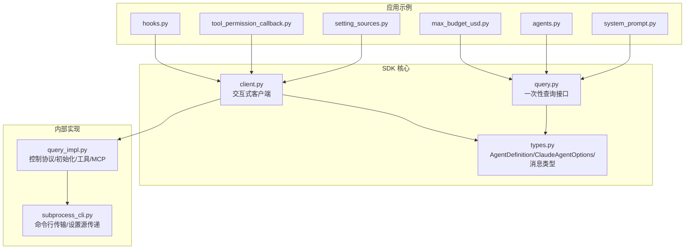
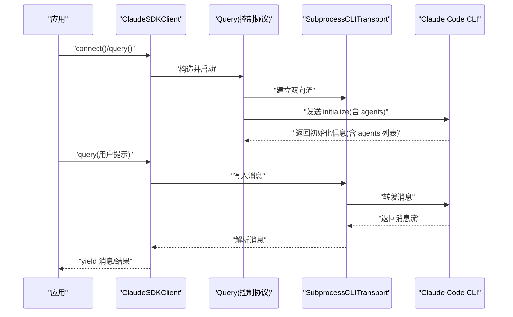
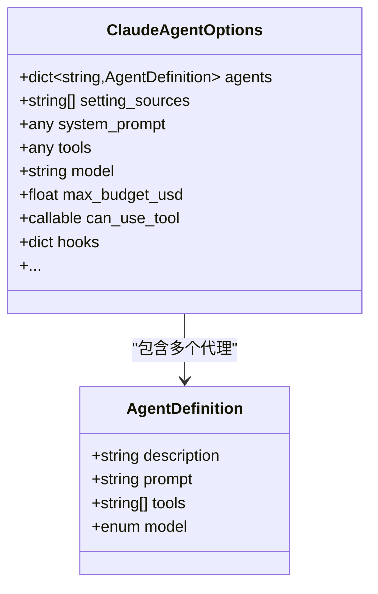
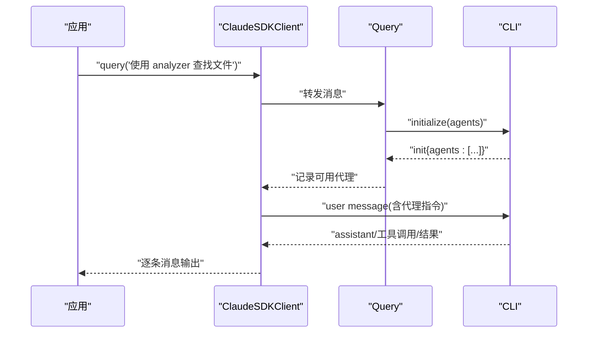
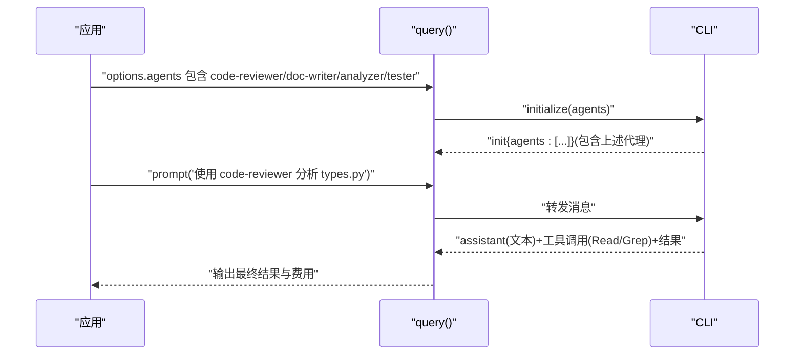
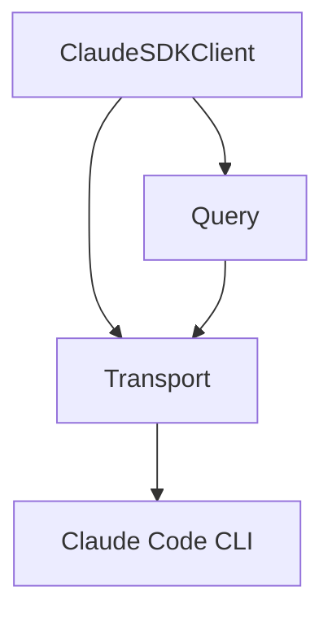

# 系统提示和代理配置

<cite>
**本文引用的文件**
- [types.py](file://src/claude_agent_sdk/types.py)
- [client.py](file://src/claude_agent_sdk/client.py)
- [query.py](file://src/claude_agent_sdk/query.py)
- [system_prompt.py](file://examples/system_prompt.py)
- [agents.py](file://examples/agents.py)
- [setting_sources.py](file://examples/setting_sources.py)
- [max_budget_usd.py](file://examples/max_budget_usd.py)
- [tool_permission_callback.py](file://examples/tool_permission_callback.py)
- [hooks.py](file://examples/hooks.py)
- [_errors.py](file://src/claude_agent_sdk/_errors.py)
- [subprocess_cli.py](file://src/claude_agent_sdk/_internal/transport/subprocess_cli.py)
- [query_impl.py](file://src/claude_agent_sdk/_internal/query.py)
- [test_agents_and_settings.py](file://e2e-tests/test_agents_and_settings.py)
</cite>

## 目录
1. [简介](#简介)
2. [项目结构](#项目结构)
3. [核心组件](#核心组件)
4. [架构总览](#架构总览)
5. [详细组件分析](#详细组件分析)
6. [依赖分析](#依赖分析)
7. [性能考虑](#性能考虑)
8. [故障排除指南](#故障排除指南)
9. [结论](#结论)
10. [附录](#附录)

## 简介
本文件围绕“系统提示与代理配置”主题，系统化梳理 Claude Agent SDK 中的 AgentDefinition 使用方法、提示词模板、工具集合与模型选择；深入解析多代理协作模式（代理选择策略与代理间通信）；阐明设置源控制机制（user、project、local 层级的优先级与加载策略）；提供可直接参考的自定义代理示例（代码审查、文档撰写等）；并给出动态修改与运行时调整的方法、性能优化与成本控制策略。

## 项目结构
本项目采用按职责分层的组织方式：
- 类型与协议：在 types.py 中定义 AgentDefinition、ClaudeAgentOptions、消息类型、Hook 类型、权限与 MCP 配置等核心数据结构。
- 客户端与查询：client.py 提供交互式客户端（支持流式、中断、会话管理），query.py 提供一次性查询接口。
- 示例与用法：examples 下包含系统提示、代理、设置源、预算控制、工具权限回调、钩子等示例。
- 内部实现：_internal 下包含传输层（subprocess_cli.py）与查询控制协议（query.py）实现细节。
- 测试：e2e-tests 覆盖代理与设置源的实际集成场景。



**图表来源**
- [types.py:42-121](file://src/claude_agent_sdk/types.py#L42-L121)
- [client.py:21-180](file://src/claude_agent_sdk/client.py#L21-L180)
- [query.py:12-127](file://src/claude_agent_sdk/query.py#L12-L127)
- [subprocess_cli.py:255-289](file://src/claude_agent_sdk/_internal/transport/subprocess_cli.py#L255-L289)
- [query_impl.py:53-155](file://src/claude_agent_sdk/_internal/query.py#L53-L155)

**章节来源**
- [types.py:42-121](file://src/claude_agent_sdk/types.py#L42-L121)
- [client.py:21-180](file://src/claude_agent_sdk/client.py#L21-L180)
- [query.py:12-127](file://src/claude_agent_sdk/query.py#L12-L127)

## 核心组件
本节聚焦 AgentDefinition 的使用与配置要点，以及与之配套的 ClaudeAgentOptions、系统提示与工具权限体系。

- AgentDefinition
  - 字段说明
    - description：代理的简要描述，用于识别与展示。
    - prompt：提示词模板，决定代理的行为与风格。
    - tools：工具名称列表或预设，限定该代理可用的工具集。
    - model：模型选择，支持 sonnet、opus、haiku、inherit 等。
  - 最佳实践
    - 明确边界：每个代理专注单一领域（如代码审查、文档撰写）。
    - 工具最小化：仅授予必要工具，降低风险与成本。
    - 模型匹配：复杂推理任务倾向更高能力模型，常规任务可选更经济模型。
    - 提示词模板：清晰、可重复、可测试；必要时结合 preset 或 append 扩展默认提示。

- ClaudeAgentOptions
  - 关键字段
    - agents：自定义代理字典，键为代理名，值为 AgentDefinition。
    - setting_sources：设置源列表，控制 user、project、local 的加载顺序与范围。
    - system_prompt：字符串或 preset 结构，用于全局系统提示。
    - tools/tools 预设：统一配置工具集。
    - permission_mode/can_use_tool：权限模式与工具权限回调。
    - hooks：事件驱动的钩子配置（PreToolUse、PostToolUse、UserPromptSubmit 等）。
    - max_budget_usd：成本上限，用于预算控制。
    - cwd/cli_path/settings/plugins/sandbox/thinking 等：工作目录、CLI 路径、插件、沙箱、思考深度等高级选项。

- 系统提示与提示词模板
  - 支持字符串系统提示与 preset（如 claude_code），preset 可通过 append 追加内容。
  - 示例展示了从无系统提示到 preset 与追加内容的多种形态。

- 工具权限与回调
  - can_use_tool 回调允许在工具使用前进行细粒度决策，并可修改输入或建议规则。
  - 权限模式（如 default、acceptEdits、bypassPermissions）影响工具执行策略。

**章节来源**
- [types.py:42-121](file://src/claude_agent_sdk/types.py#L42-L121)
- [types.py:1030-1100](file://src/claude_agent_sdk/types.py#L1030-L1100)
- [system_prompt.py:14-84](file://examples/system_prompt.py#L14-L84)
- [tool_permission_callback.py:26-94](file://examples/tool_permission_callback.py#L26-L94)

## 架构总览
下图展示从应用发起请求到 CLI 控制协议交互的关键路径，以及代理定义如何在初始化阶段注入。



**图表来源**
- [client.py:94-180](file://src/claude_agent_sdk/client.py#L94-L180)
- [query_impl.py:128-155](file://src/claude_agent_sdk/_internal/query.py#L128-L155)
- [subprocess_cli.py:255-289](file://src/claude_agent_sdk/_internal/transport/subprocess_cli.py#L255-L289)

## 详细组件分析

### AgentDefinition 类与属性详解
- 类定义与字段
  - description：用于标识代理用途与边界。
  - prompt：代理行为的核心提示词模板。
  - tools：工具集合，可为空或预设。
  - model：模型选择，inherit 表示继承默认模型策略。
- 典型用法
  - 在 ClaudeAgentOptions.agents 中注册多个代理，键为代理名，值为 AgentDefinition。
  - 通过查询时指定代理名，由 CLI 初始化阶段下发的 agents 列表驱动选择。



**图表来源**
- [types.py:42-121](file://src/claude_agent_sdk/types.py#L42-L121)
- [types.py:1030-1100](file://src/claude_agent_sdk/types.py#L1030-L1100)

**章节来源**
- [types.py:42-121](file://src/claude_agent_sdk/types.py#L42-L121)
- [types.py:1030-1100](file://src/claude_agent_sdk/types.py#L1030-L1100)

### 多代理协作模式
- 代理选择策略
  - 在初始化阶段，Query 将 agents 字典转换为 CLI 的 initialize 请求，CLI 返回的初始化消息中包含已注册的 agents 列表。
  - 应用侧通过查询 prompt 指定目标代理，CLI 基于已注册列表进行路由。
- 代理间通信机制
  - 代理本身不直接通信；跨代理协作通过工具链路与会话上下文实现（例如一个代理生成中间产物，另一个代理消费）。
  - 通过 hooks 与权限回调可实现跨代理的策略一致性（如统一的 Bash 命令策略）。



**图表来源**
- [query_impl.py:128-155](file://src/claude_agent_sdk/_internal/query.py#L128-L155)
- [test_agents_and_settings.py:347-393](file://e2e-tests/test_agents_and_settings.py#L347-L393)

**章节来源**
- [query_impl.py:128-155](file://src/claude_agent_sdk/_internal/query.py#L128-L155)
- [test_agents_and_settings.py:347-393](file://e2e-tests/test_agents_and_settings.py#L347-L393)

### 设置源控制机制（user、project、local）
- setting_sources 作用
  - 控制 CLI 加载哪些设置源：user（全局）、project（项目）、local（本地忽略）。
  - 默认不传入 setting_sources 时，不会自动加载任何自定义配置，形成隔离环境。
- 优先级与组合
  - 通过设置列表顺序体现加载优先级；通常 user 在前，project 在后，local 可覆盖。
  - 示例演示了三种典型场景：默认（无设置）、仅 user、user+project。

```mermaid
flowchart TD
Start(["开始"]) --> CheckSources["检查 setting_sources 列表"]
CheckSources --> |未设置| Isolate["不加载任何自定义设置<br/>隔离环境"]
CheckSources --> |设置为[user]| LoadUser["仅加载 user 设置"]
CheckSources --> |设置为[user,project]| LoadUserProj["先 user 后 project<br/>后者覆盖前者"]
LoadUser --> End(["结束"])
LoadUserProj --> End
Isolate --> End
```

**图表来源**
- [setting_sources.py:47-131](file://examples/setting_sources.py#L47-L131)
- [subprocess_cli.py:276-281](file://src/claude_agent_sdk/_internal/transport/subprocess_cli.py#L276-L281)

**章节来源**
- [setting_sources.py:47-131](file://examples/setting_sources.py#L47-L131)
- [subprocess_cli.py:276-281](file://src/claude_agent_sdk/_internal/transport/subprocess_cli.py#L276-L281)

### 自定义代理完整示例
- 代码审查代理
  - 描述：审查代码最佳实践与潜在问题。
  - 工具：Read、Grep。
  - 模型：sonnet。
- 文档撰写代理
  - 描述：撰写技术文档，强调清晰与完整。
  - 工具：Read、Write、Edit。
  - 模型：sonnet。
- 多代理示例
  - analyzer：Read、Grep、Glob。
  - tester：Read、Write、Bash。
  - setting_sources：["user", "project"]。



**图表来源**
- [agents.py:23-120](file://examples/agents.py#L23-L120)

**章节来源**
- [agents.py:23-120](file://examples/agents.py#L23-L120)

### 动态修改与运行时调整
- 运行时可调用
  - set_permission_mode：切换权限模式（如 default、acceptEdits、bypassPermissions）。
  - set_model：在流式模式下动态切换模型。
  - get_mcp_status：查询 MCP 服务器连接状态，辅助诊断与运维。
  - reconnect_mcp_server：重连失败的 MCP 服务器。
  - toggle_mcp_server：启用/禁用某个 MCP 服务器。
  - stop_task：停止正在运行的任务。
  - rewind_files：回滚文件到指定用户消息时刻（需开启文件检查点）。
- 初始化阶段注入
  - agents 通过 initialize 请求一次性下发至 CLI，后续运行时无法直接修改 agents；如需变更，需重新 connect 并提供新的 agents 配置。

**章节来源**
- [client.py:234-383](file://src/claude_agent_sdk/client.py#L234-L383)
- [client.py:385-416](file://src/claude_agent_sdk/client.py#L385-L416)
- [client.py:418-441](file://src/claude_agent_sdk/client.py#L418-L441)
- [client.py:443-482](file://src/claude_agent_sdk/client.py#L443-L482)
- [query_impl.py:128-155](file://src/claude_agent_sdk/_internal/query.py#L128-L155)

## 依赖分析
- 组件耦合
  - ClaudeSDKClient 依赖 Query 与 Transport，负责连接、消息收发与运行时控制。
  - Query 作为控制协议的桥接层，负责初始化、工具/MCP 请求与钩子回调。
  - Transport 负责与 CLI 的进程通信，处理命令行参数（如 setting_sources、mcp 配置）。
- 外部依赖
  - CLI 作为外部进程，SDK 通过子进程与之交互；CLI 的行为受 setting_sources、agents、hooks、mcp_servers 等参数影响。



**图表来源**
- [client.py:94-180](file://src/claude_agent_sdk/client.py#L94-L180)
- [query_impl.py:53-111](file://src/claude_agent_sdk/_internal/query.py#L53-L111)
- [subprocess_cli.py:255-289](file://src/claude_agent_sdk/_internal/transport/subprocess_cli.py#L255-L289)

**章节来源**
- [client.py:94-180](file://src/claude_agent_sdk/client.py#L94-L180)
- [query_impl.py:53-111](file://src/claude_agent_sdk/_internal/query.py#L53-L111)
- [subprocess_cli.py:255-289](file://src/claude_agent_sdk/_internal/transport/subprocess_cli.py#L255-L289)

## 性能考虑
- 代理数量与大小
  - 大量代理与超长提示词会增加初始化负载；测试用例验证了大规模代理注册的可行性与可观测性。
- 工具与权限
  - 限制工具集可减少不必要的 API 调用与安全检查开销。
  - 使用 can_use_tool 回调在工具调用前快速拒绝高风险操作，避免昂贵的工具执行。
- 模型选择
  - 对于简单任务使用较低成本模型；复杂推理任务再切换到更高能力模型。
- 流式与中断
  - 流式模式支持中断与任务停止，有助于缩短整体等待时间与资源占用。
- 成本控制
  - 使用 max_budget_usd 在每次 API 调用完成后检查预算，避免超支。

**章节来源**
- [test_agents_and_settings.py:19-380](file://e2e-tests/test_agents_and_settings.py#L19-L380)
- [max_budget_usd.py:15-91](file://examples/max_budget_usd.py#L15-L91)
- [client.py:258-280](file://src/claude_agent_sdk/client.py#L258-L280)

## 故障排除指南
- 常见错误类型
  - CLIConnectionError：无法连接 CLI。
  - CLINotFoundError：CLI 未找到或未安装。
  - ProcessError：CLI 进程失败，附带退出码与错误输出。
  - CLIJSONDecodeError：无法解码 CLI 输出中的 JSON。
  - MessageParseError：无法解析来自 CLI 的消息。
- 排查步骤
  - 确认 CLI 安装与路径正确（cli_path）。
  - 检查 setting_sources 是否符合预期，避免意外加载或缺失配置。
  - 观察 MCP 服务器状态（get_mcp_status），必要时重连或禁用异常服务器。
  - 使用 hooks 与 can_use_tool 记录工具调用轨迹，定位阻断点。
  - 在流式模式下使用中断（interrupt）与任务停止（stop_task）控制资源占用。

**章节来源**
- [_errors.py:6-56](file://src/claude_agent_sdk/_errors.py#L6-L56)
- [client.py:228-233](file://src/claude_agent_sdk/client.py#L228-L233)
- [client.py:362-383](file://src/claude_agent_sdk/client.py#L362-L383)

## 结论
通过 AgentDefinition 与 ClaudeAgentOptions，SDK 提供了灵活而强大的系统提示与代理配置能力。配合 setting_sources 的精细控制、hooks 与工具权限回调的安全策略、以及运行时的动态调整与成本控制手段，开发者可以在保证安全性与可控性的前提下，构建高效、可维护的多代理协作系统。建议遵循“单一代理、明确边界、最小工具集、按需模型”的原则，并以预算与权限双轨保障生产可用性。

## 附录
- 系统提示示例
  - 无系统提示、字符串系统提示、preset 系统提示、preset+append 的对比演示。
- 工具权限回调示例
  - 基于工具类型与输入内容的自动允许/拒绝，以及输入修改与建议规则。
- 钩子示例
  - PreToolUse、PostToolUse、UserPromptSubmit 等事件的策略化控制与反馈。
- 预算控制示例
  - max_budget_usd 的使用与预算超支的处理策略。

**章节来源**
- [system_prompt.py:14-84](file://examples/system_prompt.py#L14-L84)
- [tool_permission_callback.py:26-94](file://examples/tool_permission_callback.py#L26-L94)
- [hooks.py:46-153](file://examples/hooks.py#L46-L153)
- [max_budget_usd.py:15-91](file://examples/max_budget_usd.py#L15-L91)