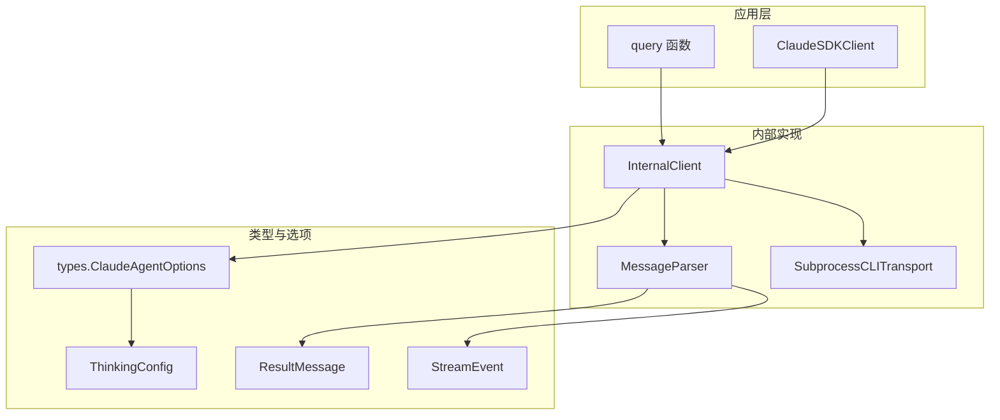
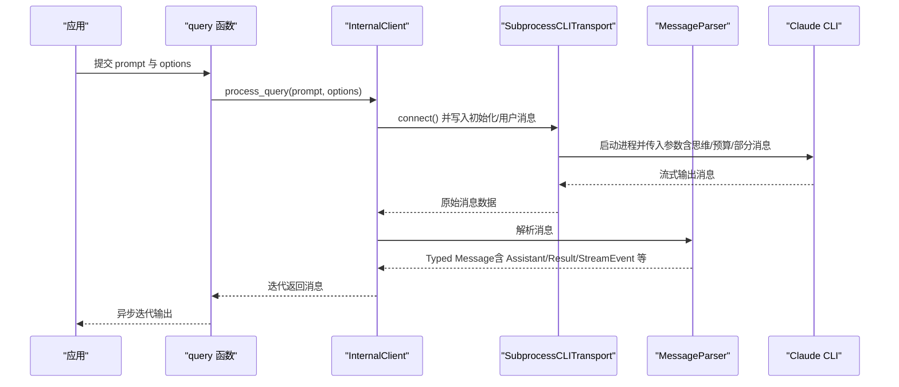
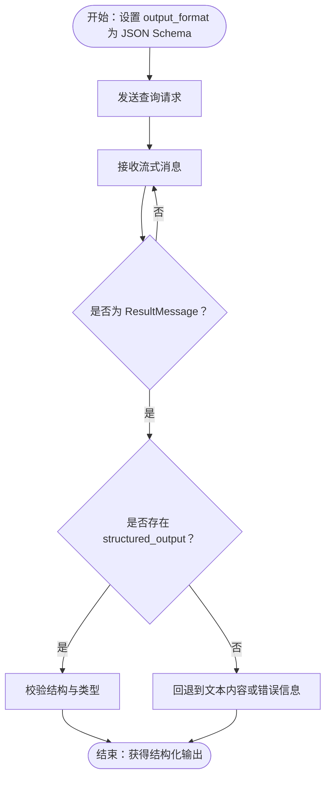
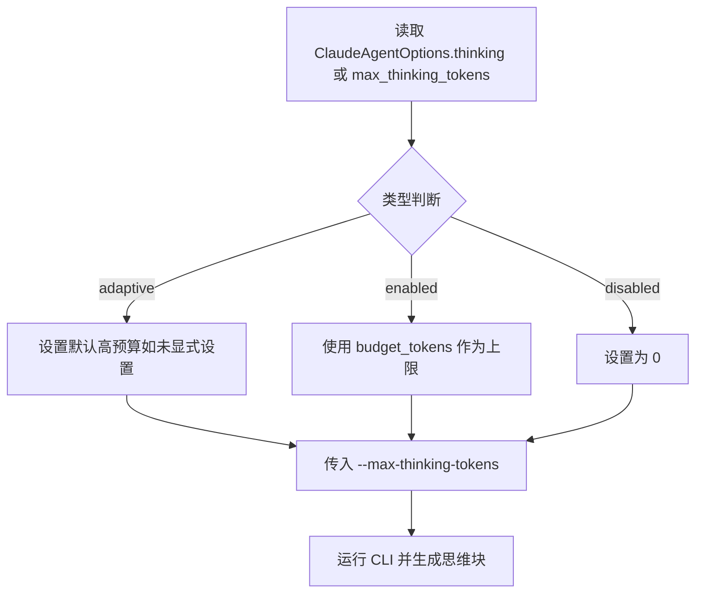
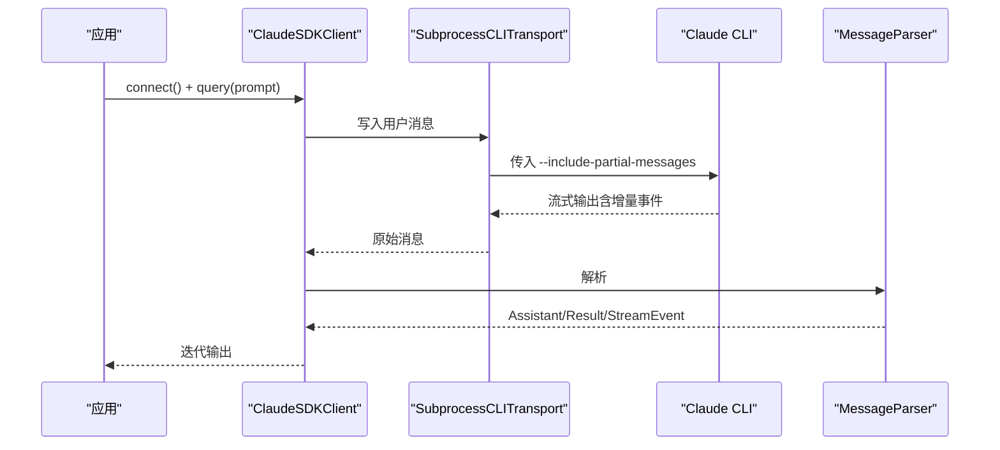
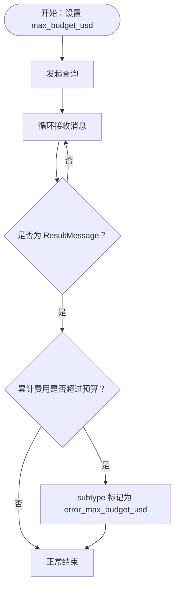
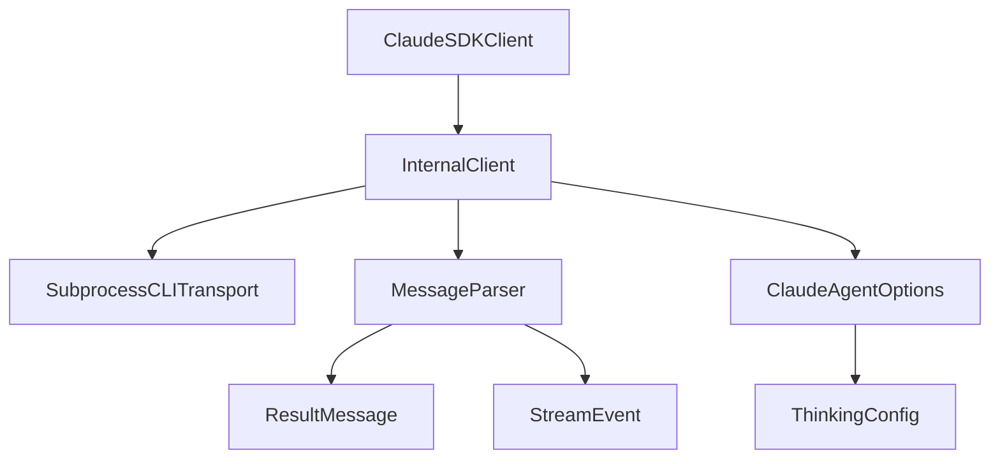

# 输出格式和思维配置

<cite>
**本文引用的文件**
- [types.py](file://src/claude_agent_sdk/types.py)
- [client.py](file://src/claude_agent_sdk/client.py)
- [query.py](file://src/claude_agent_sdk/query.py)
- [_internal/client.py](file://src/claude_agent_sdk/_internal/client.py)
- [_internal/message_parser.py](file://src/claude_agent_sdk/_internal/message_parser.py)
- [_internal/transport/subprocess_cli.py](file://src/claude_agent_sdk/_internal/transport/subprocess_cli.py)
- [examples/include_partial_messages.py](file://examples/include_partial_messages.py)
- [examples/max_budget_usd.py](file://examples/max_budget_usd.py)
- [examples/streaming_mode.py](file://examples/streaming_mode.py)
- [e2e-tests/test_structured_output.py](file://e2e-tests/test_structured_output.py)
- [e2e-tests/test_include_partial_messages.py](file://e2e-tests/test_include_partial_messages.py)
- [tests/test_integration.py](file://tests/test_integration.py)
</cite>

## 目录
1. [简介](#简介)
2. [项目结构](#项目结构)
3. [核心组件](#核心组件)
4. [架构总览](#架构总览)
5. [详细组件分析](#详细组件分析)
6. [依赖分析](#依赖分析)
7. [性能考虑](#性能考虑)
8. [故障排除指南](#故障排除指南)
9. [结论](#结论)
10. [附录](#附录)

## 简介
本文件聚焦于“输出格式与思维配置”的完整说明，涵盖以下主题：
- JSON 模式输出的配置与使用：如何通过 output_format 字段指定 JSON Schema，并在结果中获得结构化输出。
- 思维令牌（Thinking tokens）的配置与使用：如何启用自适应/固定预算/禁用等思维深度策略，并结合 MAX_THINKING_TOKENS 环境变量进行可视化与调试。
- 部分消息（partial messages）机制：include_partial_messages 的启用方式、StreamEvent 的解析与流式增量更新。
- 最大预算 USD 控制：max_budget_usd 的设置、预算监控与超支保护策略。
- 输出格式定制示例：结构化数据输出、流式响应处理与成本控制策略。
- 输出质量与性能平衡：token 使用优化与响应时间控制。
- 调试与故障排除：常见问题定位与建议。

## 项目结构
围绕输出格式与思维配置的关键模块与文件如下：
- 类型定义与选项：types.py 中的 ClaudeAgentOptions、ThinkingConfig、ResultMessage、StreamEvent 等。
- 客户端与查询入口：client.py（ClaudeSDKClient）、query.py（query 函数）。
- 内部实现：_internal/client.py（内部流程封装）、_internal/message_parser.py（消息解析）、_internal/transport/subprocess_cli.py（CLI 参数传递与思维/预算开关）。
- 示例与测试：examples 下的 include_partial_messages.py、max_budget_usd.py、streaming_mode.py；e2e 与集成测试验证行为。

图表来源
- [client.py:21-500](file://src/claude_agent_sdk/client.py#L21-L500)
- [query.py:12-127](file://src/claude_agent_sdk/query.py#L12-L127)
- [_internal/client.py:20-146](file://src/claude_agent_sdk/_internal/client.py#L20-L146)
- [_internal/message_parser.py:29-251](file://src/claude_agent_sdk/_internal/message_parser.py#L29-L251)
- [_internal/transport/subprocess_cli.py:255-316](file://src/claude_agent_sdk/_internal/transport/subprocess_cli.py#L255-L316)
- [types.py:1029-1199](file://src/claude_agent_sdk/types.py#L1029-L1199)

章节来源
- [client.py:21-500](file://src/claude_agent_sdk/client.py#L21-L500)
- [query.py:12-127](file://src/claude_agent_sdk/query.py#L12-L127)
- [_internal/client.py:20-146](file://src/claude_agent_sdk/_internal/client.py#L20-L146)
- [_internal/message_parser.py:29-251](file://src/claude_agent_sdk/_internal/message_parser.py#L29-L251)
- [_internal/transport/subprocess_cli.py:255-316](file://src/claude_agent_sdk/_internal/transport/subprocess_cli.py#L255-L316)
- [types.py:1029-1199](file://src/claude_agent_sdk/types.py#L1029-L1199)

## 核心组件
- ClaudeAgentOptions：统一承载输出格式、思维配置、预算控制、部分消息开关、工具权限、环境变量等选项。
- ThinkingConfig：三种思维深度策略（自适应、启用并设置预算、禁用），优先级高于已弃用的 max_thinking_tokens。
- ResultMessage：承载最终结果、耗时、用量、总费用与结构化输出字段。
- StreamEvent：当启用 include_partial_messages 时，用于携带增量流事件。
- SubprocessCLITransport：负责将选项转换为 CLI 命令行参数，如 --include-partial-messages、--max-thinking-tokens、--effort、--mcp-config 等。

章节来源
- [types.py:1029-1199](file://src/claude_agent_sdk/types.py#L1029-L1199)
- [_internal/transport/subprocess_cli.py:255-316](file://src/claude_agent_sdk/_internal/transport/subprocess_cli.py#L255-L316)
- [_internal/message_parser.py:29-251](file://src/claude_agent_sdk/_internal/message_parser.py#L29-L251)

## 架构总览
从应用层到内部实现的消息流如下：

图表来源
- [query.py:12-127](file://src/claude_agent_sdk/query.py#L12-L127)
- [_internal/client.py:44-146](file://src/claude_agent_sdk/_internal/client.py#L44-L146)
- [_internal/message_parser.py:29-251](file://src/claude_agent_sdk/_internal/message_parser.py#L29-L251)
- [_internal/transport/subprocess_cli.py:255-316](file://src/claude_agent_sdk/_internal/transport/subprocess_cli.py#L255-L316)

## 详细组件分析

### JSON 模式输出与结构化数据
- 配置入口：ClaudeAgentOptions.output_format 支持 {"type": "json_schema", "schema": {...}} 形式。
- 行为特征：当使用 JSON Schema 时，最终 ResultMessage 将包含 structured_output 字段，承载符合 schema 的结构化数据。
- 验证与示例：e2e 测试覆盖了简单对象、嵌套对象、枚举约束等场景，确保结构化输出有效且满足要求。

图表来源
- [types.py:1092-1094](file://src/claude_agent_sdk/types.py#L1092-L1094)
- [e2e-tests/test_structured_output.py:18-135](file://e2e-tests/test_structured_output.py#L18-L135)
- [_internal/message_parser.py:191-210](file://src/claude_agent_sdk/_internal/message_parser.py#L191-L210)

章节来源
- [types.py:1092-1094](file://src/claude_agent_sdk/types.py#L1092-L1094)
- [e2e-tests/test_structured_output.py:18-135](file://e2e-tests/test_structured_output.py#L18-L135)
- [_internal/message_parser.py:191-210](file://src/claude_agent_sdk/_internal/message_parser.py#L191-L210)

### 思维令牌（Thinking tokens）配置与使用
- 配置方式：
  - 新方式：thinking 字段支持 ThinkingConfigAdaptive、ThinkingConfigEnabled、ThinkingConfigDisabled。
  - 兼容方式：max_thinking_tokens 已弃用，但若未设置 thinking，则可回退使用该字段。
- CLI 映射：内部将 thinking 解析为 --max-thinking-tokens 传给 CLI；若为 adaptive 且未显式设置预算，会采用默认高预算。
- 环境变量：可通过 env 设置 MAX_THINKING_TOKENS，以影响 CLI 的最大思维令牌数。
- 可视化与调试：启用 include_partial_messages 时，可在流中看到 ThinkingBlock 的增量内容，便于观察思维过程。

图表来源
- [types.py:1013-1026](file://src/claude_agent_sdk/types.py#L1013-L1026)
- [_internal/transport/subprocess_cli.py:300-316](file://src/claude_agent_sdk/_internal/transport/subprocess_cli.py#L300-L316)
- [examples/include_partial_messages.py:28-57](file://examples/include_partial_messages.py#L28-L57)

章节来源
- [types.py:1013-1026](file://src/claude_agent_sdk/types.py#L1013-L1026)
- [_internal/transport/subprocess_cli.py:300-316](file://src/claude_agent_sdk/_internal/transport/subprocess_cli.py#L300-L316)
- [examples/include_partial_messages.py:28-57](file://examples/include_partial_messages.py#L28-L57)

### 部分消息（include_partial_messages）与流式更新
- 开关：ClaudeAgentOptions.include_partial_messages 控制是否启用部分消息流。
- CLI 传递：当开启时，内部通过 --include-partial-messages 传给 CLI。
- 消息类型：启用后，消息流中会包含 StreamEvent，表示增量事件；未启用则不会出现。
- 实践建议：结合 receive_response 或 receive_messages 循环消费，实时展示文本与思维增量。

图表来源
- [_internal/transport/subprocess_cli.py:267-268](file://src/claude_agent_sdk/_internal/transport/subprocess_cli.py#L267-L268)
- [_internal/message_parser.py:211-222](file://src/claude_agent_sdk/_internal/message_parser.py#L211-L222)
- [e2e-tests/test_include_partial_messages.py:25-88](file://e2e-tests/test_include_partial_messages.py#L25-L88)

章节来源
- [_internal/transport/subprocess_cli.py:267-268](file://src/claude_agent_sdk/_internal/transport/subprocess_cli.py#L267-L268)
- [_internal/message_parser.py:211-222](file://src/claude_agent_sdk/_internal/message_parser.py#L211-L222)
- [e2e-tests/test_include_partial_messages.py:25-88](file://e2e-tests/test_include_partial_messages.py#L25-L88)

### 最大预算 USD 控制（max_budget_usd）
- 配置：ClaudeAgentOptions.max_budget_usd 设置单次调用累计的最大美元预算。
- 行为：每次 API 调用完成后检查累计费用，可能略高于设定值（最多一个调用的差额）。
- 结果：当超过预算时，ResultMessage.subtype 为 error_max_budget_usd，同时 total_cost_usd 仍会返回实际费用。
- 集成测试：验证了预算超限时的行为与传输层正确传递 max_budget_usd。

图表来源
- [types.py:1041](file://src/claude_agent_sdk/types.py#L1041)
- [examples/max_budget_usd.py:15-96](file://examples/max_budget_usd.py#L15-L96)
- [tests/test_integration.py:250-308](file://tests/test_integration.py#L250-L308)

章节来源
- [types.py:1041](file://src/claude_agent_sdk/types.py#L1041)
- [examples/max_budget_usd.py:15-96](file://examples/max_budget_usd.py#L15-L96)
- [tests/test_integration.py:250-308](file://tests/test_integration.py#L250-L308)

### 输出格式定制示例（结构化数据、流式响应、成本控制）
- 结构化输出：通过 output_format 指定 JSON Schema，最终在 ResultMessage.structured_output 中得到验证后的结构化数据。
- 流式响应：使用 ClaudeSDKClient.receive_response 或 receive_messages，结合 include_partial_messages 实时展示增量。
- 成本控制：设置 max_budget_usd 并在 ResultMessage.subtype 中识别超支状态，必要时中断后续操作或调整策略。

章节来源
- [e2e-tests/test_structured_output.py:18-135](file://e2e-tests/test_structured_output.py#L18-L135)
- [examples/streaming_mode.py:59-418](file://examples/streaming_mode.py#L59-L418)
- [examples/max_budget_usd.py:15-96](file://examples/max_budget_usd.py#L15-L96)

### 输出质量与性能平衡（token 使用优化与响应时间控制）
- 思维深度：通过 thinking 自适应/预算/禁用策略平衡思考深度与 token 消耗。
- 效率参数：--effort 参数可用于调节推理效率与质量权衡。
- 流式消费：及时消费消息可缩短感知延迟，配合中断能力提升交互体验。
- 预算与超支：合理设置 max_budget_usd，避免长时间运行导致费用过高。

章节来源
- [_internal/transport/subprocess_cli.py:315-316](file://src/claude_agent_sdk/_internal/transport/subprocess_cli.py#L315-L316)
- [examples/streaming_mode.py:133-173](file://examples/streaming_mode.py#L133-L173)

## 依赖分析
- ClaudeSDKClient 依赖 InternalClient 与 SubprocessCLITransport，负责连接、初始化、消息收发与控制协议。
- InternalClient 依赖 MessageParser 将原始消息映射为 Typed Message。
- ClaudeAgentOptions 作为统一配置载体，贯穿上述组件。

图表来源
- [client.py:21-500](file://src/claude_agent_sdk/client.py#L21-L500)
- [_internal/client.py:20-146](file://src/claude_agent_sdk/_internal/client.py#L20-L146)
- [_internal/message_parser.py:29-251](file://src/claude_agent_sdk/_internal/message_parser.py#L29-L251)
- [types.py:1029-1199](file://src/claude_agent_sdk/types.py#L1029-L1199)

章节来源
- [client.py:21-500](file://src/claude_agent_sdk/client.py#L21-L500)
- [_internal/client.py:20-146](file://src/claude_agent_sdk/_internal/client.py#L20-L146)
- [_internal/message_parser.py:29-251](file://src/claude_agent_sdk/_internal/message_parser.py#L29-L251)
- [types.py:1029-1199](file://src/claude_agent_sdk/types.py#L1029-L1199)

## 性能考虑
- 思维预算：合理设置 thinking.budget_tokens 或使用 adaptive，避免过度消耗 token。
- 流式消费：尽早启动消息消费任务，减少等待时间；必要时使用 interrupt 控制长任务。
- 预算边界：max_budget_usd 仅在调用完成后检查，最终费用可能略超预算，建议在业务层做二次校验与告警。
- 环境变量：通过 env 设置 MAX_THINKING_TOKENS 可快速调整 CLI 的思维上限，便于压测与调试。

## 故障排除指南
- 无法接收 StreamEvent：
  - 确认已启用 include_partial_messages。
  - 确认 CLI 版本支持该特性。
- 超过预算但仍继续：
  - 这是预期行为，最终 ResultMessage.subtype 会标记 error_max_budget_usd。
  - 建议在业务层对 total_cost_usd 做二次检查。
- 思维内容未显示：
  - 检查是否启用了 include_partial_messages。
  - 确认思维配置（thinking 或 max_thinking_tokens）已正确传入 CLI。
- JSON Schema 未生效：
  - 确认 output_format 正确设置为 {"type": "json_schema", "schema": {...}}。
  - 确认最终 ResultMessage.structured_output 存在且非空。

章节来源
- [e2e-tests/test_include_partial_messages.py:25-88](file://e2e-tests/test_include_partial_messages.py#L25-L88)
- [tests/test_integration.py:250-308](file://tests/test_integration.py#L250-L308)
- [examples/max_budget_usd.py:71-77](file://examples/max_budget_usd.py#L71-L77)

## 结论
- JSON Schema 输出通过 output_format 简洁可靠地提供结构化数据，适合自动化与下游系统消费。
- 思维配置（thinking）提供了灵活的深度控制，结合 MAX_THINKING_TOKENS 环境变量可实现可视化与调试。
- include_partial_messages 使流式增量更新成为可能，显著改善用户体验与可观测性。
- max_budget_usd 提供了成本控制的边界保障，配合业务层策略可实现更稳健的成本管理。
- 在实际工程中，应根据任务复杂度与 SLA 要求，平衡思维深度、流式消费与预算控制，以达到最佳的质量与性能。

## 附录
- 关键配置项速览
  - output_format：{"type": "json_schema", "schema": {...}}
  - thinking：adaptive/enabled(disable)/disabled
  - include_partial_messages：布尔开关
  - max_budget_usd：预算上限
  - env：{"MAX_THINKING_TOKENS": "数值"}

章节来源
- [types.py:1092-1094](file://src/claude_agent_sdk/types.py#L1092-L1094)
- [types.py:1085-1089](file://src/claude_agent_sdk/types.py#L1085-L1089)
- [types.py:1070-1071](file://src/claude_agent_sdk/types.py#L1070-L1071)
- [types.py:1041](file://src/claude_agent_sdk/types.py#L1041)
- [_internal/transport/subprocess_cli.py:267-268](file://src/claude_agent_sdk/_internal/transport/subprocess_cli.py#L267-L268)
- [_internal/transport/subprocess_cli.py:300-316](file://src/claude_agent_sdk/_internal/transport/subprocess_cli.py#L300-L316)