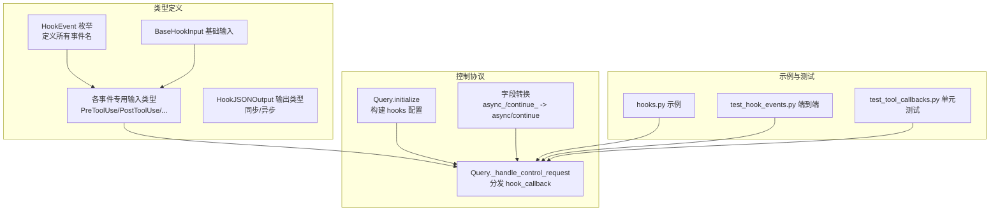
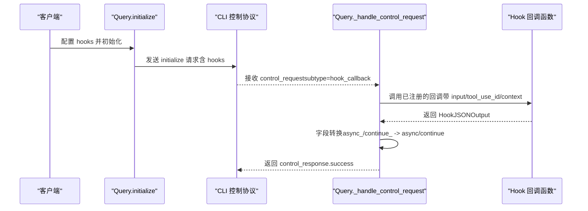
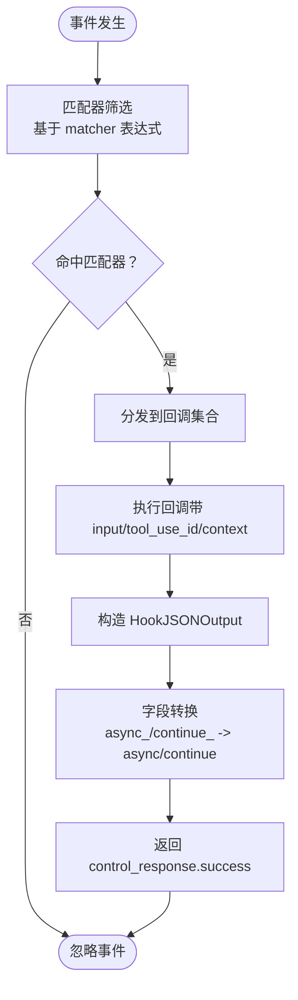
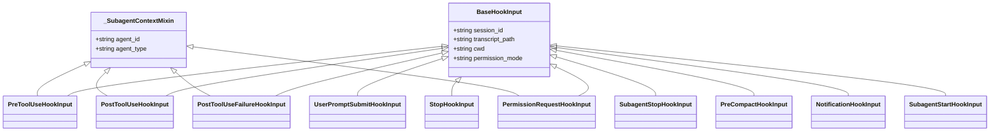
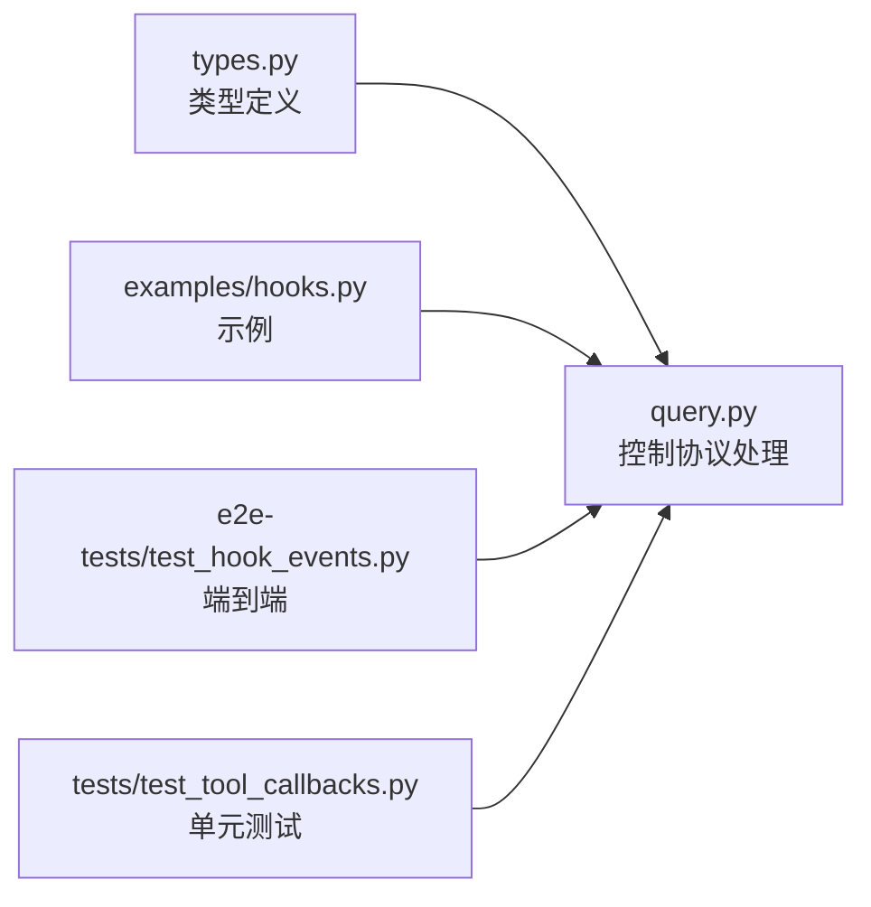

# 钩子事件类型

<cite>
**本文档引用的文件**
- [types.py](file://src/claude_agent_sdk/types.py)
- [query.py](file://src/claude_agent_sdk/_internal/query.py)
- [hooks.py](file://examples/hooks.py)
- [test_hook_events.py](file://e2e-tests/test_hook_events.py)
- [test_tool_callbacks.py](file://tests/test_tool_callbacks.py)
</cite>

## 目录
1. [简介](#简介)
2. [项目结构](#项目结构)
3. [核心组件](#核心组件)
4. [架构总览](#架构总览)
5. [详细组件分析](#详细组件分析)
6. [依赖关系分析](#依赖关系分析)
7. [性能考虑](#性能考虑)
8. [故障排除指南](#故障排除指南)
9. [结论](#结论)
10. [附录](#附录)

## 简介
本文件系统性地梳理 Claude Agent SDK 中的钩子事件类型，覆盖所有可用事件：PreToolUse（工具使用前）、PostToolUse（工具使用后）、PostToolUseFailure（工具使用失败）、UserPromptSubmit（用户提示提交）、Stop（停止）、SubagentStop（子代理停止）、PreCompact（压缩前）、Notification（通知）、SubagentStart（子代理启动）与 PermissionRequest（权限请求）。文档从数据结构、触发时机、适用场景、输入输出模型、过滤与条件匹配、生命周期关系与最佳实践等维度进行深入解析，并提供可视化图示帮助理解。

## 项目结构
钩子事件类型定义集中在类型模块中，控制协议与钩子回调处理由内部查询类负责，示例与端到端测试分别演示了典型用法与真实行为验证。

图表来源
- [types.py:160-310](file://src/claude_agent_sdk/types.py#L160-L310)
- [query.py:119-163](file://src/claude_agent_sdk/_internal/query.py#L119-L163)
- [query.py:288-303](file://src/claude_agent_sdk/_internal/query.py#L288-L303)
- [hooks.py:156-301](file://examples/hooks.py#L156-L301)
- [test_hook_events.py:19-110](file://e2e-tests/test_hook_events.py#L19-L110)

章节来源
- [types.py:160-310](file://src/claude_agent_sdk/types.py#L160-L310)
- [query.py:119-163](file://src/claude_agent_sdk/_internal/query.py#L119-L163)

## 核心组件
- 钩子事件枚举：统一管理所有事件名称，确保类型安全与一致性。
- 基础输入字段：所有事件共享的基础上下文信息，如会话标识、转录路径、工作目录、权限模式等。
- 专用输入类型：针对不同事件的扩展字段，例如工具名、工具输入、错误信息、消息内容等。
- 输出类型：同步输出（可控制继续/中断、显示系统消息、附加上下文）与异步输出（延迟执行）。
- 匹配器与过滤：通过 HookMatcher 的 matcher 字段对事件进行条件匹配（如工具名正则），并支持超时配置。

章节来源
- [types.py:160-310](file://src/claude_agent_sdk/types.py#L160-L310)
- [types.py:452-472](file://src/claude_agent_sdk/types.py#L452-L472)
- [types.py:475-491](file://src/claude_agent_sdk/types.py#L475-L491)

## 架构总览
钩子事件在 SDK 初始化阶段被注册到 CLI 控制协议中；运行时 CLI 将事件回调请求发送给 SDK，SDK 通过回调映射调用对应的 Python 钩子函数，并将返回值转换为 CLI 可识别的格式。

图表来源
- [query.py:119-163](file://src/claude_agent_sdk/_internal/query.py#L119-L163)
- [query.py:288-303](file://src/claude_agent_sdk/_internal/query.py#L288-L303)

章节来源
- [query.py:119-163](file://src/claude_agent_sdk/_internal/query.py#L119-L163)
- [query.py:288-303](file://src/claude_agent_sdk/_internal/query.py#L288-L303)

## 详细组件分析

### 事件总览与生命周期
- PreToolUse：工具调用前，用于权限决策、输入修改、附加上下文。
- PostToolUse：工具调用成功后，用于结果审查、补充上下文、更新输出。
- PostToolUseFailure：工具调用失败后，用于错误处理、中断标记、附加上下文。
- UserPromptSubmit：用户提交提示时，用于注入上下文或策略。
- Stop：会话停止时，用于清理或状态记录。
- SubagentStop：子代理停止时，用于子代理生命周期管理。
- PreCompact：压缩前，用于手动或自动触发的压缩准备。
- Notification：通知事件，用于通用通知与日志。
- SubagentStart：子代理启动时，用于子代理生命周期管理。
- PermissionRequest：权限请求事件，用于细粒度权限决策与建议。

这些事件在代理生命周期中相互配合：PreToolUse 决策是否允许工具执行；PostToolUse/PostToolUseFailure 处理结果与错误；UserPromptSubmit 注入上下文；Stop/SubagentStop/SubagentStart 管理会话与子代理状态；PreCompact 与 Notification 提供额外控制点。

章节来源
- [types.py:160-172](file://src/claude_agent_sdk/types.py#L160-L172)
- [types.py:210-296](file://src/claude_agent_sdk/types.py#L210-L296)

### BaseHookInput 与专用输入类型
- BaseHookInput：所有事件共享的基础字段，包括会话标识、转录路径、工作目录、权限模式等。
- _SubagentContextMixin：可选的子代理上下文字段，用于工具生命周期事件区分不同子代理实例。
- 各事件专用输入类型：
  - PreToolUseHookInput：包含工具名、工具输入、工具使用 ID。
  - PostToolUseHookInput：包含工具名、工具输入、工具响应、工具使用 ID。
  - PostToolUseFailureHookInput：包含工具名、工具输入、工具使用 ID、错误信息、可选中断标志。
  - UserPromptSubmitHookInput：包含用户提示文本。
  - StopHookInput：包含停止钩子激活状态。
  - SubagentStopHookInput：包含停止钩子激活状态、子代理标识、转录路径、代理类型。
  - PreCompactHookInput：包含触发方式（手动/自动）、自定义指令。
  - NotificationHookInput：包含消息体、标题（可选）、通知类型。
  - SubagentStartHookInput：包含子代理标识、代理类型。
  - PermissionRequestHookInput：包含工具名、工具输入、权限建议（可选）。

章节来源
- [types.py:175-208](file://src/claude_agent_sdk/types.py#L175-L208)
- [types.py:210-296](file://src/claude_agent_sdk/types.py#L210-L296)

### 输出类型与控制字段
- AsyncHookJSONOutput：用于异步延迟执行，包含异步开关与可选超时。
- SyncHookJSONOutput：用于同步控制，包含：
  - 继续控制：continue_（默认继续）、抑制输出、停止原因。
  - 决策控制：block 决策、系统消息、原因说明。
  - 事件特定输出：hookSpecificOutput，承载各事件的专用控制字段。

章节来源
- [types.py:393-452](file://src/claude_agent_sdk/types.py#L393-L452)

### 过滤与条件匹配
- HookMatcher：每个事件可配置多个匹配器，每个匹配器包含：
  - matcher：字符串表达式，用于匹配事件目标（如工具名），支持组合匹配。
  - hooks：该匹配器绑定的回调列表。
  - timeout：匹配器级超时设置。
- 初始化流程：Query 在 initialize 时将 hooks 配置序列化为 CLI 可识别格式，分配回调 ID 并建立映射。

章节来源
- [types.py:475-491](file://src/claude_agent_sdk/types.py#L475-L491)
- [query.py:128-147](file://src/claude_agent_sdk/_internal/query.py#L128-L147)

### 典型事件详解与最佳实践

#### PreToolUse（工具使用前）
- 触发时机：工具调用前，用于权限决策与输入调整。
- 适用场景：安全策略、输入校验、动态权限决策。
- 输入字段：工具名、工具输入、工具使用 ID、可选子代理上下文。
- 输出控制：permissionDecision（allow/deny/ask）、permissionDecisionReason、updatedInput、additionalContext。
- 最佳实践：
  - 使用 permissionDecision 替代已弃用的 approve 字段。
  - 对敏感操作（如写文件、删除）采用严格策略。
  - 结合 additionalContext 提供审计线索。

章节来源
- [types.py:210-217](file://src/claude_agent_sdk/types.py#L210-L217)
- [types.py:314-322](file://src/claude_agent_sdk/types.py#L314-L322)
- [hooks.py:46-71](file://examples/hooks.py#L46-L71)
- [hooks.py:105-136](file://examples/hooks.py#L105-L136)

#### PostToolUse（工具使用后）
- 触发时机：工具调用成功后。
- 适用场景：结果审查、错误检测、补充上下文、输出改写。
- 输入字段：工具名、工具输入、工具响应、工具使用 ID、可选子代理上下文。
- 输出控制：additionalContext、updatedMCPToolOutput。
- 最佳实践：
  - 利用 systemMessage 与 reason 提示用户关键信息。
  - 对异常输出添加警告与建议。

章节来源
- [types.py:219-227](file://src/claude_agent_sdk/types.py#L219-L227)
- [types.py:324-330](file://src/claude_agent_sdk/types.py#L324-L330)
- [hooks.py:85-103](file://examples/hooks.py#L85-L103)

#### PostToolUseFailure（工具使用失败）
- 触发时机：工具调用失败后。
- 适用场景：错误分类、中断控制、恢复建议。
- 输入字段：工具名、工具输入、工具使用 ID、错误信息、可选中断标志。
- 输出控制：additionalContext。
- 最佳实践：
  - 对可恢复错误设置 continue_=True，对不可恢复错误设置 continue_=False 并提供 stopReason。

章节来源
- [types.py:229-238](file://src/claude_agent_sdk/types.py#L229-L238)
- [types.py:332-337](file://src/claude_agent_sdk/types.py#L332-L337)
- [hooks.py:138-154](file://examples/hooks.py#L138-L154)

#### UserPromptSubmit（用户提示提交）
- 触发时机：用户提交提示时。
- 适用场景：上下文注入、个性化策略、会话记忆增强。
- 输入字段：提示文本。
- 输出控制：additionalContext。
- 最佳实践：
  - 保持上下文简洁明确，避免过度干扰模型推理。

章节来源
- [types.py:240-245](file://src/claude_agent_sdk/types.py#L240-L245)
- [types.py:339-344](file://src/claude_agent_sdk/types.py#L339-L344)
- [hooks.py:195-216](file://examples/hooks.py#L195-L216)

#### Stop（停止）
- 触发时机：会话停止时。
- 适用场景：资源清理、状态持久化、日志记录。
- 输入字段：停止钩子激活状态。
- 输出控制：通常无需输出，但可结合 additionalContext 记录原因。

章节来源
- [types.py:247-252](file://src/claude_agent_sdk/types.py#L247-L252)

#### SubagentStop（子代理停止）
- 触发时机：子代理停止时。
- 适用场景：子代理生命周期管理、资源回收、状态同步。
- 输入字段：停止钩子激活状态、子代理标识、转录路径、代理类型。
- 输出控制：additionalContext。

章节来源
- [types.py:254-262](file://src/claude_agent_sdk/types.py#L254-L262)
- [test_tool_callbacks.py:599-644](file://tests/test_tool_callbacks.py#L599-L644)

#### PreCompact（压缩前）
- 触发时机：会话压缩前（手动或自动）。
- 适用场景：压缩前准备、清理缓存、生成摘要。
- 输入字段：触发方式（manual/auto）、自定义指令。
- 输出控制：additionalContext。

章节来源
- [types.py:264-270](file://src/claude_agent_sdk/types.py#L264-L270)

#### Notification（通知）
- 触发时机：通用通知事件。
- 适用场景：日志、告警、审计。
- 输入字段：消息体、标题（可选）、通知类型。
- 输出控制：additionalContext。
- 端到端验证：测试确认 Notification 钩子可注册且事件形状正确。

章节来源
- [types.py:272-279](file://src/claude_agent_sdk/types.py#L272-L279)
- [test_hook_events.py:114-157](file://e2e-tests/test_hook_events.py#L114-L157)

#### SubagentStart（子代理启动）
- 触发时机：子代理启动时。
- 适用场景：子代理初始化、策略注入、状态同步。
- 输入字段：子代理标识、代理类型。
- 输出控制：additionalContext。
- 单元测试验证：SubagentStart 钩子回调正常工作。

章节来源
- [types.py:281-287](file://src/claude_agent_sdk/types.py#L281-L287)
- [test_tool_callbacks.py:599-644](file://tests/test_tool_callbacks.py#L599-L644)

#### PermissionRequest（权限请求）
- 触发时机：需要细粒度权限决策时。
- 适用场景：动态权限评估、权限建议、交互式授权。
- 输入字段：工具名、工具输入、权限建议（可选）、可选子代理上下文。
- 输出控制：decision（字典形式的决策结果）。
- 单元测试验证：PermissionRequest 钩子回调返回正确的结构。

章节来源
- [types.py:289-296](file://src/claude_agent_sdk/types.py#L289-L296)
- [test_tool_callbacks.py:591-597](file://tests/test_tool_callbacks.py#L591-L597)

### 数据流与处理逻辑

图表来源
- [query.py:128-147](file://src/claude_agent_sdk/_internal/query.py#L128-L147)
- [query.py:288-303](file://src/claude_agent_sdk/_internal/query.py#L288-L303)

章节来源
- [query.py:128-147](file://src/claude_agent_sdk/_internal/query.py#L128-L147)
- [query.py:288-303](file://src/claude_agent_sdk/_internal/query.py#L288-L303)

### 类型关系图

图表来源
- [types.py:175-208](file://src/claude_agent_sdk/types.py#L175-L208)
- [types.py:210-296](file://src/claude_agent_sdk/types.py#L210-L296)

章节来源
- [types.py:175-208](file://src/claude_agent_sdk/types.py#L175-L208)
- [types.py:210-296](file://src/claude_agent_sdk/types.py#L210-L296)

## 依赖关系分析
- 类型层：HookEvent、BaseHookInput、各事件输入类型、输出类型、HookMatcher、HookCallback 定义于类型模块。
- 控制层：Query 负责初始化时构建 hooks 配置、分发 hook_callback 请求、执行回调并将输出转换为 CLI 可识别格式。
- 示例层：hooks.py 展示了典型用法，包括 PreToolUse、PostToolUse、UserPromptSubmit、决策字段与继续控制。
- 测试层：端到端测试验证 Notification、PreToolUse/PostToolUse 的 tool_use_id 字段、多事件组合；单元测试验证 SubagentStart 与 PermissionRequest 的回调行为。

图表来源
- [types.py:160-310](file://src/claude_agent_sdk/types.py#L160-L310)
- [query.py:119-163](file://src/claude_agent_sdk/_internal/query.py#L119-L163)
- [hooks.py:156-301](file://examples/hooks.py#L156-L301)
- [test_hook_events.py:19-110](file://e2e-tests/test_hook_events.py#L19-L110)
- [test_tool_callbacks.py:599-644](file://tests/test_tool_callbacks.py#L599-L644)

章节来源
- [types.py:160-310](file://src/claude_agent_sdk/types.py#L160-L310)
- [query.py:119-163](file://src/claude_agent_sdk/_internal/query.py#L119-L163)
- [hooks.py:156-301](file://examples/hooks.py#L156-L301)
- [test_hook_events.py:19-110](file://e2e-tests/test_hook_events.py#L19-L110)
- [test_tool_callbacks.py:599-644](file://tests/test_tool_callbacks.py#L599-L644)

## 性能考虑
- 匹配器超时：为每个匹配器设置合理超时，避免阻塞主流程。
- 异步钩子：对耗时操作使用异步输出，避免阻塞 CLI。
- 字段转换开销：字段名转换为 CLI 格式为常量时间操作，影响可忽略。
- 并发子代理：子代理上下文通过 agent_id/agent_type 区分，注意并发场景下的线程安全与状态隔离。

## 故障排除指南
- 回调未触发：检查 HookMatcher 的 matcher 是否与事件目标匹配，确认初始化时 hooks 已正确传入。
- 字段名不生效：Python 使用 async_ 与 continue_，CLI 期望 async 与 continue，确保输出被正确转换。
- 权限决策无效：确认使用 permissionDecision 而非已弃用的 approve 字段。
- 子代理事件缺失：确认事件类型（SubagentStart/SubagentStop）已在 hooks 配置中注册。

章节来源
- [query.py:34-50](file://src/claude_agent_sdk/_internal/query.py#L34-L50)
- [types.py:429-432](file://src/claude_agent_sdk/types.py#L429-L432)

## 结论
本文档系统梳理了 Claude Agent SDK 的钩子事件类型，明确了各事件的触发时机、数据结构、控制字段与最佳实践，并通过初始化与回调处理流程图展示了事件在代理生命周期中的作用与相互关系。结合示例与测试，开发者可以更高效地利用钩子事件实现安全、可控、可观测的代理行为。

## 附录
- 示例参考：hooks.py 展示了 PreToolUse、PostToolUse、UserPromptSubmit 等事件的典型用法。
- 端到端验证：test_hook_events.py 验证了 Notification、PreToolUse/PostToolUse 的 tool_use_id 字段与多事件组合。
- 单元测试：test_tool_callbacks.py 验证了 SubagentStart 与 PermissionRequest 的回调行为。

章节来源
- [hooks.py:156-301](file://examples/hooks.py#L156-L301)
- [test_hook_events.py:19-197](file://e2e-tests/test_hook_events.py#L19-L197)
- [test_tool_callbacks.py:599-644](file://tests/test_tool_callbacks.py#L599-L644)