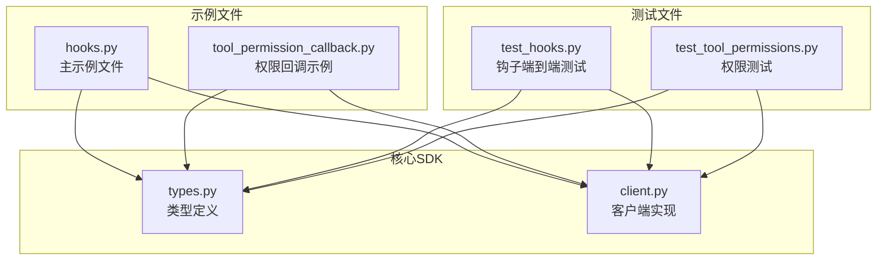
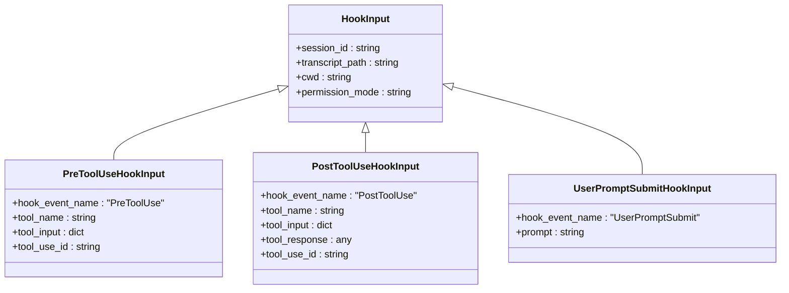
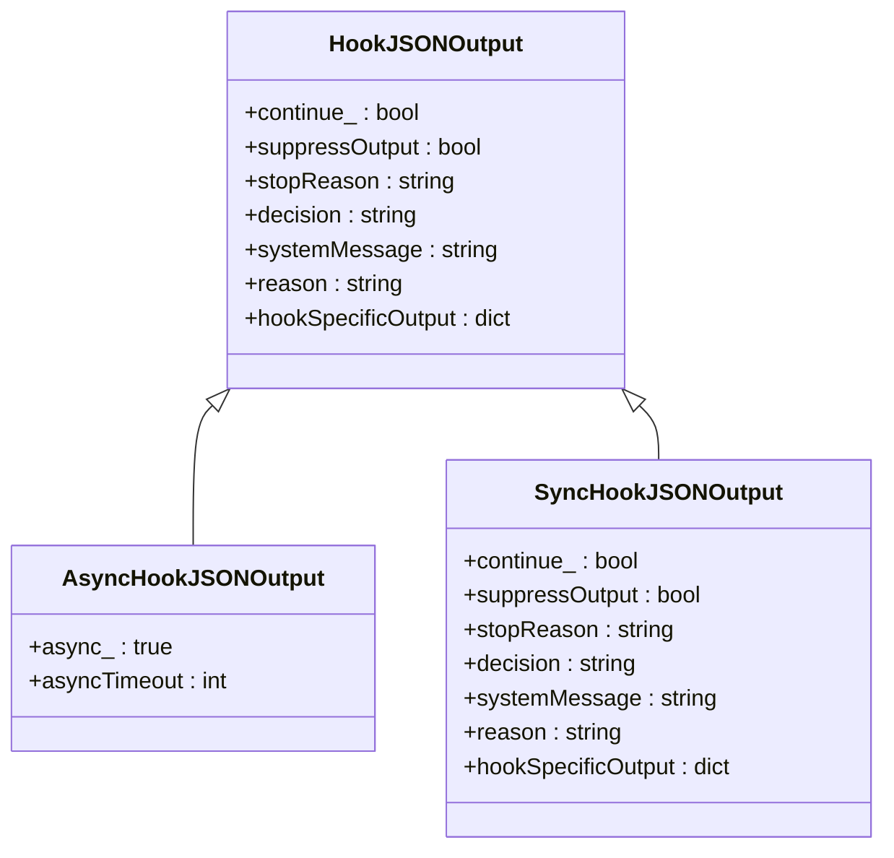
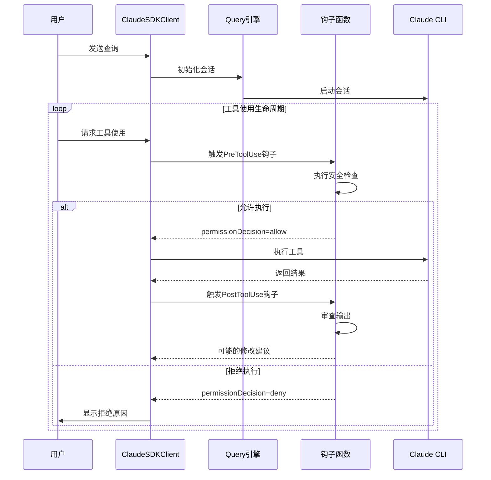
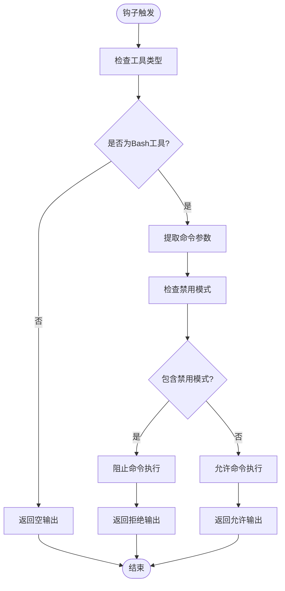
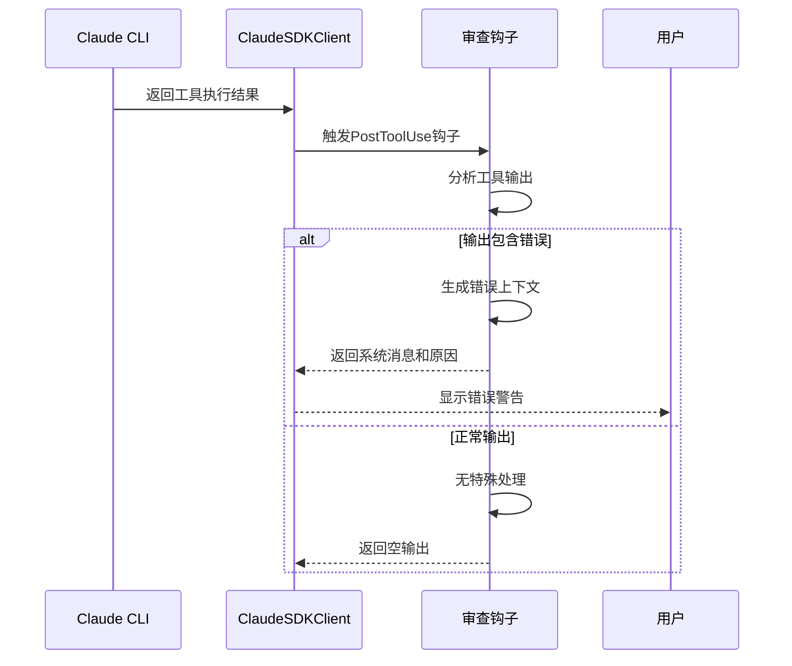
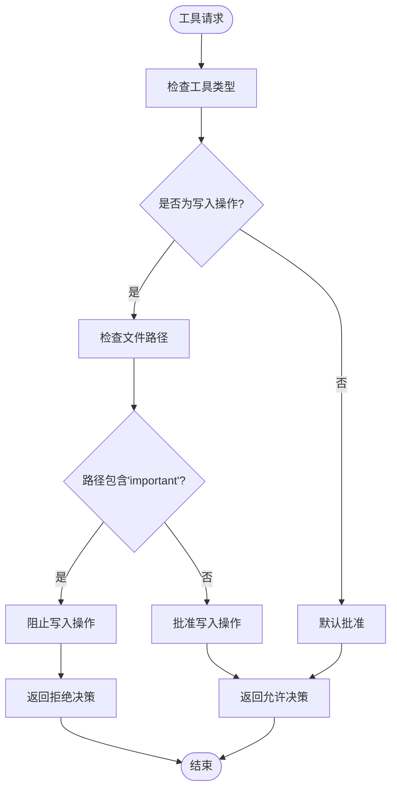
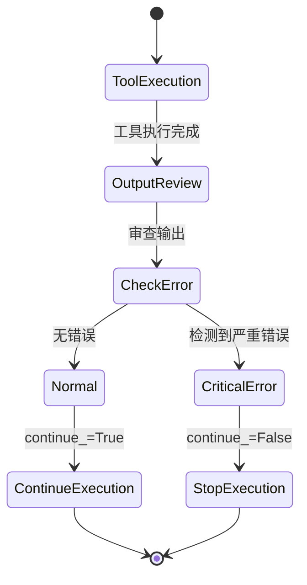
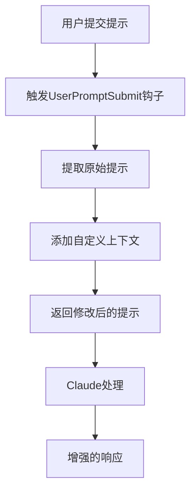
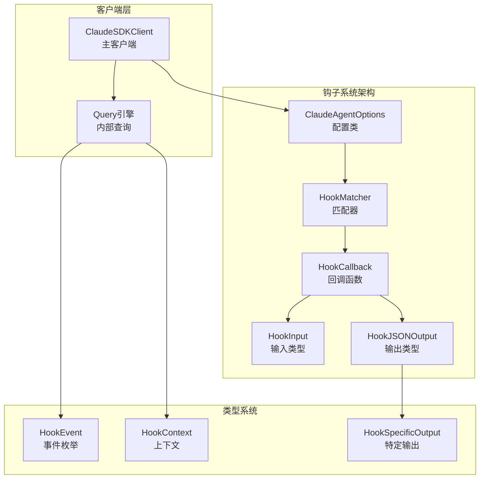

# 钩子使用示例

<cite>
**本文档引用的文件**
- [hooks.py](file://examples/hooks.py)
- [tool_permission_callback.py](file://examples/tool_permission_callback.py)
- [test_hooks.py](file://e2e-tests/test_hooks.py)
- [test_tool_permissions.py](file://e2e-tests/test_tool_permissions.py)
- [types.py](file://src/claude_agent_sdk/types.py)
- [client.py](file://src/claude_agent_sdk/client.py)
</cite>

## 目录
1. [简介](#简介)
2. [项目结构](#项目结构)
3. [核心组件](#核心组件)
4. [架构概览](#架构概览)
5. [详细组件分析](#详细组件分析)
6. [依赖关系分析](#依赖关系分析)
7. [性能考虑](#性能考虑)
8. [故障排除指南](#故障排除指南)
9. [结论](#结论)

## 简介

本文件提供了Claude Agent SDK中钩子系统的完整使用示例文档。钩子是Claude Code应用在特定时间点调用的Python函数，用于拦截和控制代理行为。本文档基于实际的hooks.py示例，详细展示了预工具使用安全检查、工具使用后输出审查、权限决策和执行控制等核心功能的实现方法。

通过本指南，开发者可以：
- 理解钩子系统的工作原理和架构设计
- 掌握各种钩子类型的使用方法和最佳实践
- 学会如何根据实际需求修改和扩展钩子示例
- 解决常见的钩子使用问题和调试技巧

## 项目结构

钩子系统主要分布在以下文件中：

**图表来源**
- [hooks.py:1-351](file://examples/hooks.py#L1-L351)
- [types.py:1029-1199](file://src/claude_agent_sdk/types.py#L1029-L1199)
- [client.py:1-200](file://src/claude_agent_sdk/client.py#L1-L200)

**章节来源**
- [hooks.py:1-351](file://examples/hooks.py#L1-L351)
- [types.py:1029-1199](file://src/claude_agent_sdk/types.py#L1029-L1199)
- [client.py:1-200](file://src/claude_agent_sdk/client.py#L1-L200)

## 核心组件

### 钩子事件类型

钩子系统支持多种事件类型，每种事件都有特定的触发时机和用途：

| 事件类型 | 触发时机 | 主要用途 | 输入数据 |
|---------|---------|---------|---------|
| PreToolUse | 工具使用前 | 安全检查、权限验证 | 工具名称、输入参数、工具使用ID |
| PostToolUse | 工具使用后 | 输出审查、结果处理 | 工具名称、输入参数、响应内容 |
| PostToolUseFailure | 工具使用失败时 | 错误处理、异常恢复 | 工具名称、输入参数、错误信息 |
| UserPromptSubmit | 用户提交提示时 | 添加上下文、自定义指令 | 用户提示内容 |
| Stop | 会话停止时 | 资源清理、状态保存 | 停止状态信息 |
| SubagentStart/Stop | 子代理启动/停止时 | 多代理协调 | 子代理标识、类型信息 |
| PreCompact | 会话压缩前 | 数据优化、清理 | 触发原因、自定义指令 |
| Notification | 通知事件 | 系统通知、状态更新 | 通知消息、类型信息 |
| PermissionRequest | 权限请求时 | 权限管理、策略执行 | 工具名称、输入参数 |

### 钩子输入类型

每个钩子事件都有对应的输入类型，确保类型安全：

**图表来源**
- [types.py:210-296](file://src/claude_agent_sdk/types.py#L210-L296)

### 钩子输出类型

钩子可以返回多种类型的输出来控制执行流程：

**图表来源**
- [types.py:393-452](file://src/claude_agent_sdk/types.py#L393-L452)

**章节来源**
- [types.py:160-472](file://src/claude_agent_sdk/types.py#L160-L472)

## 架构概览

钩子系统采用事件驱动架构，通过匹配器(Matcher)将特定的钩子函数绑定到相应的事件上：

**图表来源**
- [client.py:76-180](file://src/claude_agent_sdk/client.py#L76-L180)
- [hooks.py:46-135](file://examples/hooks.py#L46-L135)

## 详细组件分析

### 预工具使用安全检查示例

这个示例演示了如何在工具执行前进行安全检查，阻止危险命令的执行。

#### 核心实现逻辑

**图表来源**
- [hooks.py:46-71](file://examples/hooks.py#L46-L71)

#### 关键要点

1. **工具类型识别**：只对特定工具（如Bash）执行安全检查
2. **模式匹配**：通过字符串包含检查来识别危险命令
3. **权限决策**：使用`permissionDecision`字段控制工具执行
4. **错误处理**：当检测到危险模式时返回详细的拒绝原因

#### 运行效果

该示例会阻止包含特定模式的bash命令，同时允许其他安全命令正常执行。用户可以看到被阻止的命令会显示警告信息，而安全命令则正常执行。

**章节来源**
- [hooks.py:46-71](file://examples/hooks.py#L46-L71)

### 工具使用后输出审查示例

此示例展示了如何在工具执行后审查输出，并提供额外的上下文或警告信息。

#### 实现机制

**图表来源**
- [hooks.py:85-103](file://examples/hooks.py#L85-L103)

#### 功能特点

1. **错误检测**：自动扫描工具输出中的错误关键词
2. **上下文增强**：为错误情况提供额外的解释和建议
3. **用户反馈**：通过系统消息向用户传达重要信息
4. **非侵入式**：正常情况下不改变原有行为

#### 实际应用场景

- 文件系统操作的错误处理
- 网络请求的异常监控
- 命令行工具的输出分析
- 数据处理过程的完整性检查

**章节来源**
- [hooks.py:85-103](file://examples/hooks.py#L85-L103)

### 权限决策示例

这个示例演示了如何使用`permissionDecision`字段来严格控制工具的执行权限。

#### 决策逻辑

**图表来源**
- [hooks.py:105-135](file://examples/hooks.py#L105-L135)

#### 权限控制策略

1. **工具分类**：区分读取和写入操作的不同处理策略
2. **路径白名单**：允许对特定目录的写入操作
3. **动态重定向**：将不安全的写入重定向到安全位置
4. **明确决策**：使用`permissionDecision`字段提供清晰的权限状态

#### 安全考虑

- 防止对系统关键文件的意外修改
- 限制对敏感配置文件的访问
- 提供透明的权限决策过程
- 支持审计和日志记录

**章节来源**
- [hooks.py:105-135](file://examples/hooks.py#L105-L135)

### 执行控制示例

此示例展示了如何使用`continue_`和`stopReason`字段来控制执行流程。

#### 控制机制

**图表来源**
- [hooks.py:138-153](file://examples/hooks.py#L138-L153)

#### 执行控制场景

1. **错误级别判断**：区分普通错误和严重错误
2. **安全停止**：在检测到关键错误时立即停止执行
3. **用户通知**：通过`stopReason`向用户解释停止原因
4. **资源保护**：防止进一步的潜在损害

#### 最佳实践

- 使用明确的错误分类标准
- 提供有用的停止原因信息
- 确保停止操作不会造成数据丢失
- 考虑优雅的恢复机制

**章节来源**
- [hooks.py:138-153](file://examples/hooks.py#L138-L153)

### 用户提示提交示例

这个示例演示了如何在用户提交提示时添加自定义上下文信息。

#### 上下文注入机制

**图表来源**
- [hooks.py:73-82](file://examples/hooks.py#L73-L82)

#### 应用场景

1. **个性化设置**：根据用户偏好调整响应风格
2. **领域知识**：为特定任务添加专业术语和背景
3. **工作流程**：集成企业内部的流程和规范
4. **多轮对话**：维护对话历史和上下文信息

**章节来源**
- [hooks.py:73-82](file://examples/hooks.py#L73-L82)

## 依赖关系分析

钩子系统的核心依赖关系如下：

**图表来源**
- [types.py:1029-1199](file://src/claude_agent_sdk/types.py#L1029-L1199)
- [client.py:62-180](file://src/claude_agent_sdk/client.py#L62-L180)

### 关键依赖特性

1. **类型安全**：所有钩子输入输出都有严格的类型定义
2. **异步支持**：钩子函数可以是异步的，支持复杂的异步操作
3. **事件驱动**：基于事件的架构设计，便于扩展新的钩子类型
4. **配置灵活**：通过HookMatcher实现精确的事件匹配

**章节来源**
- [types.py:1029-1199](file://src/claude_agent_sdk/types.py#L1029-L1199)
- [client.py:62-180](file://src/claude_agent_sdk/client.py#L62-L180)

## 性能考虑

### 钩子执行性能

1. **异步执行**：钩子函数应设计为异步，避免阻塞主事件循环
2. **超时控制**：合理设置钩子执行超时，防止长时间阻塞
3. **内存管理**：注意钩子函数中的内存使用，避免泄漏
4. **并发处理**：多个钩子同时触发时的性能影响

### 优化建议

1. **轻量级钩子**：尽量保持钩子函数简单高效
2. **缓存机制**：对重复的检查结果进行缓存
3. **批量处理**：合并相似的钩子操作
4. **异步I/O**：使用异步数据库或网络操作

## 故障排除指南

### 常见问题及解决方案

#### 钩子未触发

**问题描述**：配置了钩子但没有被执行

**可能原因**：
1. 事件类型不匹配
2. 工具名称不正确
3. 钩子函数签名错误
4. 配置格式不正确

**解决方案**：
1. 检查事件名称是否正确
2. 验证工具名称与实际使用的工具一致
3. 确认钩子函数签名符合要求
4. 使用调试模式查看配置

#### 权限决策无效

**问题描述**：设置了`permissionDecision`但不起作用

**可能原因**：
1. 字段名拼写错误
2. 事件类型不支持权限决策
3. 钩子返回值格式不正确
4. 权限模式冲突

**解决方案**：
1. 确认使用正确的字段名（`permissionDecision`）
2. 验证事件类型支持权限决策
3. 检查返回值的JSON结构
4. 检查权限模式设置

#### 执行控制失效

**问题描述**：设置`continue_=False`但仍然继续执行

**可能原因**：
1. 字段名使用错误（应为`continue_`）
2. 钩子返回值被覆盖
3. CLI版本不支持该功能
4. 钩子执行顺序问题

**解决方案**：
1. 确保使用正确的字段名
2. 检查钩子链中的其他钩子是否覆盖了设置
3. 更新到支持该功能的CLI版本
4. 调整钩子的执行顺序

### 调试技巧

1. **启用详细日志**：使用`logging`模块记录钩子执行过程
2. **单元测试**：为每个钩子函数编写独立的测试用例
3. **断点调试**：在关键位置设置断点进行调试
4. **配置验证**：使用`jsonschema`验证钩子配置的正确性

**章节来源**
- [test_hooks.py:17-157](file://e2e-tests/test_hooks.py#L17-L157)
- [test_tool_permissions.py:17-66](file://e2e-tests/test_tool_permissions.py#L17-L66)

## 结论

钩子系统为Claude Agent SDK提供了强大的扩展能力，使得开发者可以在不修改核心代码的情况下定制代理的行为。通过本文档的示例，开发者可以：

1. **掌握基本概念**：理解钩子的工作原理和事件类型
2. **学会实际应用**：通过具体示例学习如何实现各种钩子功能
3. **解决常见问题**：了解并解决钩子使用中的典型问题
4. **扩展系统功能**：基于示例代码开发自己的钩子实现

### 最佳实践建议

1. **渐进式开发**：从简单的钩子开始，逐步增加复杂度
2. **充分测试**：为每个钩子编写完整的测试用例
3. **文档记录**：详细记录钩子的功能和配置方法
4. **性能监控**：定期检查钩子对系统性能的影响
5. **安全优先**：始终将安全性放在首位，特别是在权限控制方面

通过遵循这些指导原则，开发者可以充分利用钩子系统的强大功能，构建更加智能和可控的AI代理应用。