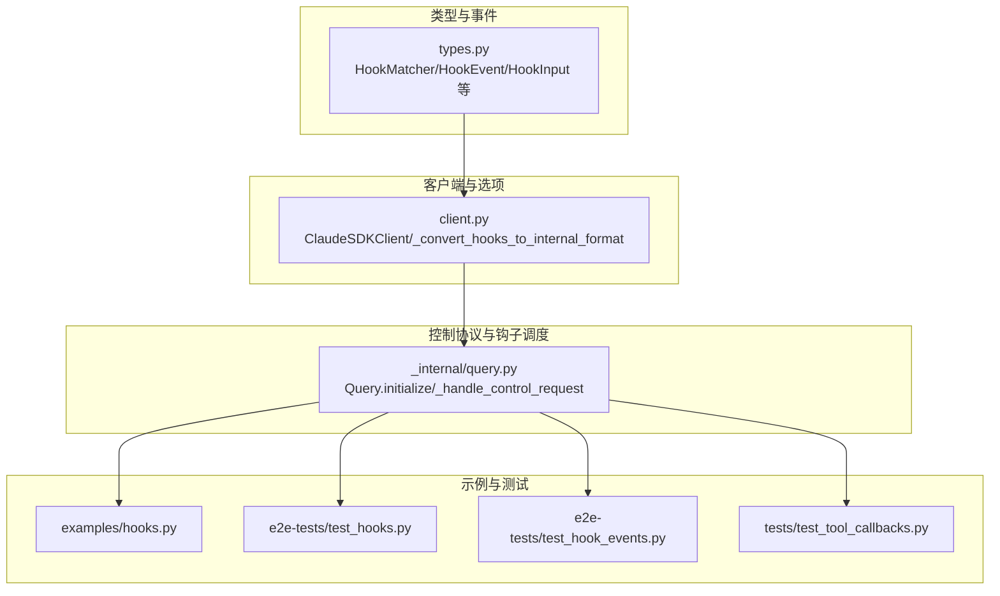
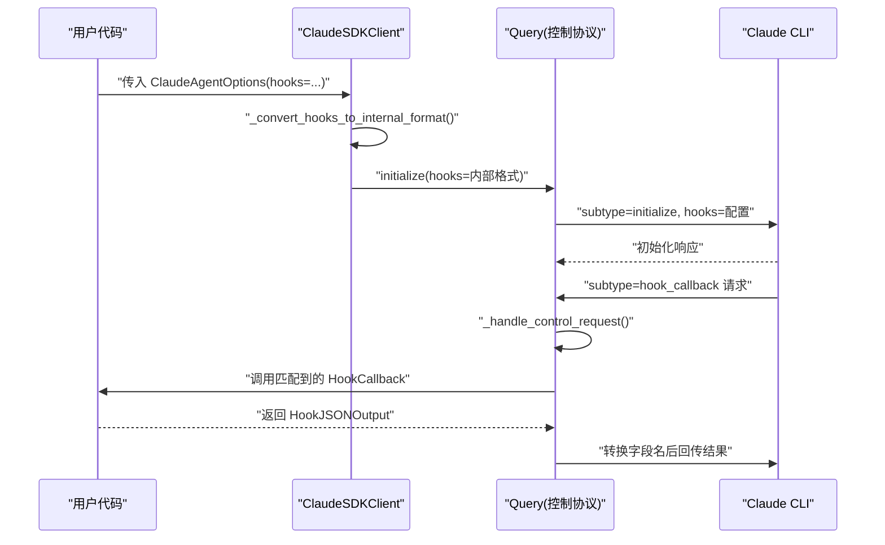
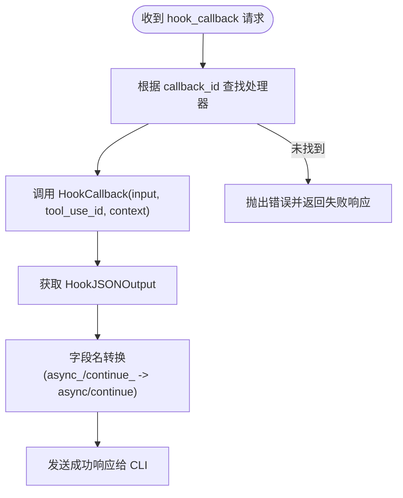
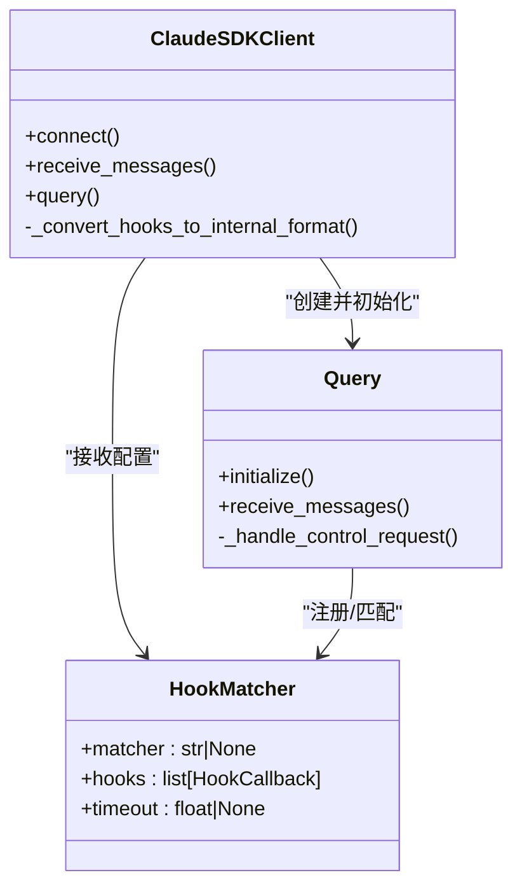

# 钩子匹配器

<cite>
**本文引用的文件**
- [src/claude_agent_sdk/types.py](file://src/claude_agent_sdk/types.py)
- [src/claude_agent_sdk/client.py](file://src/claude_agent_sdk/client.py)
- [src/claude_agent_sdk/_internal/query.py](file://src/claude_agent_sdk/_internal/query.py)
- [examples/hooks.py](file://examples/hooks.py)
- [e2e-tests/test_hooks.py](file://e2e-tests/test_hooks.py)
- [e2e-tests/test_hook_events.py](file://e2e-tests/test_hook_events.py)
- [tests/test_tool_callbacks.py](file://tests/test_tool_callbacks.py)
</cite>

## 目录
1. [简介](#简介)
2. [项目结构](#项目结构)
3. [核心组件](#核心组件)
4. [架构总览](#架构总览)
5. [组件详解](#组件详解)
6. [依赖关系分析](#依赖关系分析)
7. [性能考量](#性能考量)
8. [故障排查指南](#故障排查指南)
9. [结论](#结论)
10. [附录](#附录)

## 简介
本文件系统性阐述 Claude Agent SDK 中的“钩子匹配器”（HookMatcher）：其配置与使用方式、matcher 字段的工具名匹配规则、hooks 列表的组织与优先级、timeout 超时配置对执行的影响与最佳实践，并通过真实示例展示工具名过滤、事件类型筛选与复杂条件匹配。同时解释 HookMatcher 在钩子链中的作用与执行机制，给出性能优化与错误处理策略，并演示动态钩子匹配与条件注册。

## 项目结构
围绕钩子匹配器的关键代码分布在以下模块：
- 类型与事件定义：types.py
- 客户端与选项：client.py
- 控制协议与钩子回调调度：_internal/query.py
- 示例与端到端测试：examples/hooks.py、e2e-tests/test_hooks.py、e2e-tests/test_hook_events.py
- 单元测试与字段转换验证：tests/test_tool_callbacks.py

**图表来源**
- [src/claude_agent_sdk/types.py:160-491](file://src/claude_agent_sdk/types.py#L160-L491)
- [src/claude_agent_sdk/client.py:76-92](file://src/claude_agent_sdk/client.py#L76-L92)
- [src/claude_agent_sdk/_internal/query.py:119-163](file://src/claude_agent_sdk/_internal/query.py#L119-L163)

**章节来源**
- [src/claude_agent_sdk/types.py:160-491](file://src/claude_agent_sdk/types.py#L160-L491)
- [src/claude_agent_sdk/client.py:76-92](file://src/claude_agent_sdk/client.py#L76-L92)
- [src/claude_agent_sdk/_internal/query.py:119-163](file://src/claude_agent_sdk/_internal/query.py#L119-L163)

## 核心组件
- HookMatcher：用于声明“事件 + 匹配条件 + 处理器集合 + 超时”的配置单元。
- HookEvent：受支持的钩子事件枚举（如 PreToolUse、PostToolUse、Notification 等）。
- HookInput：按事件类型强类型的输入数据结构。
- ClaudeSDKClient：负责将 HookMatcher 转换为内部格式并初始化控制协议。
- Query：在控制协议中注册钩子匹配器、分发钩子回调请求并进行字段名转换。

**章节来源**
- [src/claude_agent_sdk/types.py:160-491](file://src/claude_agent_sdk/types.py#L160-L491)
- [src/claude_agent_sdk/client.py:76-92](file://src/claude_agent_sdk/client.py#L76-L92)
- [src/claude_agent_sdk/_internal/query.py:119-163](file://src/claude_agent_sdk/_internal/query.py#L119-L163)

## 架构总览
下图展示了从用户配置 HookMatcher 到 CLI 控制协议回调执行的全链路：

**图表来源**
- [src/claude_agent_sdk/client.py:76-92](file://src/claude_agent_sdk/client.py#L76-L92)
- [src/claude_agent_sdk/_internal/query.py:119-163](file://src/claude_agent_sdk/_internal/query.py#L119-L163)
- [src/claude_agent_sdk/_internal/query.py:288-303](file://src/claude_agent_sdk/_internal/query.py#L288-L303)

## 组件详解

### HookMatcher 配置与字段语义
- matcher: 工具名匹配字符串或 None。当为 None 时代表“匹配所有工具”。当为字符串时，采用“工具名或工具名组合”的形式（例如单个工具名或多个工具名以竖线分隔的组合），用于在 PreToolUse 等生命周期事件上进行工具名过滤。
- hooks: 钩子处理器列表，每个元素满足 HookCallback 签名，异步返回 HookJSONOutput。
- timeout: 整体超时秒数，应用于该匹配器内所有钩子处理器的执行时间上限；未设置时使用默认值（由内部逻辑决定）。

上述字段在类型定义中明确标注，且在客户端与控制协议层均被正确序列化与传递。

**章节来源**
- [src/claude_agent_sdk/types.py:476-491](file://src/claude_agent_sdk/types.py#L476-L491)
- [src/claude_agent_sdk/client.py:76-92](file://src/claude_agent_sdk/client.py#L76-L92)
- [src/claude_agent_sdk/_internal/query.py:141-147](file://src/claude_agent_sdk/_internal/query.py#L141-L147)

### 事件类型与输入模型
- 支持的事件类型：PreToolUse、PostToolUse、PostToolUseFailure、UserPromptSubmit、Stop、SubagentStop、PreCompact、Notification、SubagentStart、PermissionRequest。
- 每个事件对应强类型输入结构，例如 PreToolUseHookInput 包含 tool_name、tool_input、tool_use_id 等；NotificationHookInput 包含 message、title、notification_type 等。
- 这些类型确保在编写钩子处理器时具备准确的输入约束与可选字段提示。

**章节来源**
- [src/claude_agent_sdk/types.py:160-310](file://src/claude_agent_sdk/types.py#L160-L310)

### 钩子处理器注册与优先级
- 注册方式：在 ClaudeAgentOptions.hooks 中，以事件名为键，值为 HookMatcher 列表。
- 执行顺序：同一事件下，按 HookMatcher 列表顺序依次尝试匹配；一旦某匹配器的 matcher 命中，则执行该匹配器内的 hooks 列表（按列表顺序）。
- 匹配规则：
  - matcher 为 None：匹配所有工具。
  - matcher 为字符串：按工具名或“工具A|工具B|...”组合进行匹配；若命中则执行该匹配器内的所有处理器。
- 未显式设置 matcher 的 HookMatcher 将被视为“匹配所有工具”。

**章节来源**
- [src/claude_agent_sdk/client.py:76-92](file://src/claude_agent_sdk/client.py#L76-L92)
- [src/claude_agent_sdk/_internal/query.py:128-147](file://src/claude_agent_sdk/_internal/query.py#L128-L147)
- [examples/hooks.py:161-169](file://examples/hooks.py#L161-L169)

### timeout 超时配置与最佳实践
- 作用范围：timeout 应用于某个 HookMatcher 内的所有钩子处理器的执行时间上限。
- 设置建议：
  - 对耗时钩子（网络请求、外部工具调用）设置合理 timeout，避免阻塞后续事件。
  - 对简单钩子（仅做字段检查）可不设或设较大值。
  - 若多个 HookMatcher 并行存在，注意总等待时间叠加效应，必要时拆分事件或降低超时。
- 字段转换：Python 使用 async_ 与 continue_，内部会转换为 CLI 期望的 async 与 continue，不影响超时行为。

**章节来源**
- [src/claude_agent_sdk/types.py:489-490](file://src/claude_agent_sdk/types.py#L489-L490)
- [src/claude_agent_sdk/_internal/query.py:145-146](file://src/claude_agent_sdk/_internal/query.py#L145-L146)
- [tests/test_tool_callbacks.py:400-459](file://tests/test_tool_callbacks.py#L400-L459)

### 正则表达式语法与工具名匹配规则
- matcher 字段并非正则表达式，而是“工具名或工具名组合”的字符串。
- 工具名组合采用“|”分隔，表示“任一匹配即命中”，例如“Write|MultiEdit|Edit”。
- 当 matcher 为 None 时，表示“匹配所有工具”。

**章节来源**
- [src/claude_agent_sdk/types.py:480-484](file://src/claude_agent_sdk/types.py#L480-L484)
- [examples/hooks.py:161-169](file://examples/hooks.py#L161-L169)

### 钩子匹配器在钩子链中的执行机制
- 初始化阶段：客户端将 HookMatcher 转换为内部字典结构，Query 在 initialize 请求中发送给 CLI。
- 回调阶段：CLI 触发 hook_callback 请求，Query 根据 callback_id 查找已注册的处理器并调用；处理器返回的输出经字段名转换后回传 CLI。
- 输出控制：处理器可通过返回字段控制继续执行、停止、附加上下文等。

**图表来源**
- [src/claude_agent_sdk/_internal/query.py:288-303](file://src/claude_agent_sdk/_internal/query.py#L288-L303)

**章节来源**
- [src/claude_agent_sdk/_internal/query.py:119-163](file://src/claude_agent_sdk/_internal/query.py#L119-L163)
- [src/claude_agent_sdk/_internal/query.py:288-303](file://src/claude_agent_sdk/_internal/query.py#L288-L303)

### 实际使用示例与场景

- 工具名过滤（PreToolUse）
  - 仅对特定工具（如 Bash）生效，其他工具不受影响。
  - 参考路径：[examples/hooks.py:161-169](file://examples/hooks.py#L161-L169)

- 事件类型筛选（Notification）
  - 不指定 matcher，对所有通知事件生效。
  - 参考路径：[e2e-tests/test_hook_events.py:136-142](file://e2e-tests/test_hook_events.py#L136-L142)

- 复杂条件匹配（多事件组合）
  - 同时注册 Notification、PreToolUse、PostToolUse，验证多事件协同。
  - 参考路径：[e2e-tests/test_hook_events.py:176-183](file://e2e-tests/test_hook_events.py#L176-L183)

- 权限决策与理由（PreToolUse）
  - 返回 permissionDecision 与 reason/systemMessage，实现细粒度控制。
  - 参考路径：[e2e-tests/test_hooks.py:50-57](file://e2e-tests/test_hooks.py#L50-L57)

- 执行控制（PostToolUse）
  - 返回 continue_=False 与 stopReason，中断后续流程。
  - 参考路径：[e2e-tests/test_hooks.py:93-100](file://e2e-tests/test_hooks.py#L93-L100)

- 上下文附加（PostToolUse）
  - 返回 hookSpecificOutput.additionalContext，增强可观测性。
  - 参考路径：[e2e-tests/test_hooks.py:137-144](file://e2e-tests/test_hooks.py#L137-L144)

**章节来源**
- [examples/hooks.py:161-169](file://examples/hooks.py#L161-L169)
- [e2e-tests/test_hook_events.py:136-183](file://e2e-tests/test_hook_events.py#L136-L183)
- [e2e-tests/test_hooks.py:50-100](file://e2e-tests/test_hooks.py#L50-L100)

### 动态钩子匹配与条件注册
- 动态注册：可在运行时根据会话状态或外部条件，构造不同 HookMatcher 列表并重新初始化（需结合客户端连接生命周期）。
- 条件注册：通过在 matcher 中使用工具名组合（如“Write|Edit”）实现多工具条件匹配；或在处理器内部基于输入数据进行更复杂的判断。

**章节来源**
- [src/claude_agent_sdk/client.py:76-92](file://src/claude_agent_sdk/client.py#L76-L92)
- [src/claude_agent_sdk/types.py:480-484](file://src/claude_agent_sdk/types.py#L480-L484)

## 依赖关系分析

**图表来源**
- [src/claude_agent_sdk/types.py:476-491](file://src/claude_agent_sdk/types.py#L476-L491)
- [src/claude_agent_sdk/client.py:76-92](file://src/claude_agent_sdk/client.py#L76-L92)
- [src/claude_agent_sdk/_internal/query.py:119-163](file://src/claude_agent_sdk/_internal/query.py#L119-L163)

**章节来源**
- [src/claude_agent_sdk/types.py:476-491](file://src/claude_agent_sdk/types.py#L476-L491)
- [src/claude_agent_sdk/client.py:76-92](file://src/claude_agent_sdk/client.py#L76-L92)
- [src/claude_agent_sdk/_internal/query.py:119-163](file://src/claude_agent_sdk/_internal/query.py#L119-L163)

## 性能考量
- 匹配效率：matcher 为 None 时每次都会尝试，建议在高频事件中尽量缩小匹配范围（设置具体工具名或组合）。
- 超时控制：为耗时钩子设置合理 timeout，避免阻塞后续事件；对简单钩子可放宽限制。
- 并发与顺序：同一事件的多个 HookMatcher 顺序执行，应避免长耗时处理器堆积；必要时拆分为多个事件或异步化处理。
- 字段转换开销：内部字段名转换为常量时间操作，影响可忽略。

[本节为通用指导，无需列出具体文件来源]

## 故障排查指南
- 钩子未触发
  - 检查 matcher 是否正确设置；None 表示匹配所有工具，但需确保事件类型与工具名一致。
  - 确认 HookMatcher 的 hooks 列表非空。
  - 参考：[src/claude_agent_sdk/_internal/query.py:128-147](file://src/claude_agent_sdk/_internal/query.py#L128-L147)

- 回调未找到
  - callback_id 不存在会导致错误；确认客户端已将处理器映射到唯一 ID。
  - 参考：[src/claude_agent_sdk/_internal/query.py:288-294](file://src/claude_agent_sdk/_internal/query.py#L288-L294)

- 字段名不兼容
  - Python 使用 async_ 与 continue_，内部自动转换为 CLI 期望的 async 与 continue。
  - 参考：[src/claude_agent_sdk/_internal/query.py:34-50](file://src/claude_agent_sdk/_internal/query.py#L34-L50)

- 超时问题
  - 若处理器耗时过长，适当提高 timeout 或拆分任务；注意多个匹配器的叠加影响。
  - 参考：[src/claude_agent_sdk/_internal/query.py:145-146](file://src/claude_agent_sdk/_internal/query.py#L145-L146)

**章节来源**
- [src/claude_agent_sdk/_internal/query.py:34-50](file://src/claude_agent_sdk/_internal/query.py#L34-L50)
- [src/claude_agent_sdk/_internal/query.py:128-147](file://src/claude_agent_sdk/_internal/query.py#L128-L147)
- [src/claude_agent_sdk/_internal/query.py:288-294](file://src/claude_agent_sdk/_internal/query.py#L288-L294)

## 结论
HookMatcher 提供了灵活而强大的钩子匹配与执行机制：通过工具名组合实现精准过滤，借助多事件与多处理器实现复杂控制流；timeout 与字段转换保障了稳定性与兼容性。结合示例与测试，开发者可以快速构建安全、可控、可观测的钩子链路。

[本节为总结性内容，无需列出具体文件来源]

## 附录

### 常见事件与典型用途
- PreToolUse：权限决策、输入校验、注入上下文
- PostToolUse：输出审查、错误处理、附加上下文
- Notification：系统通知、审计日志
- UserPromptSubmit：会话上下文注入
- PermissionRequest：动态权限建议与决策

**章节来源**
- [src/claude_agent_sdk/types.py:160-310](file://src/claude_agent_sdk/types.py#L160-L310)