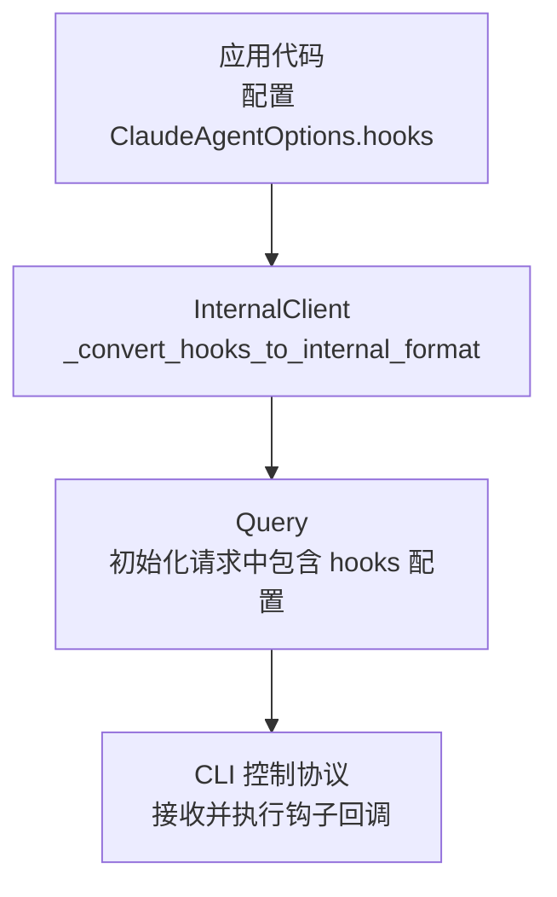
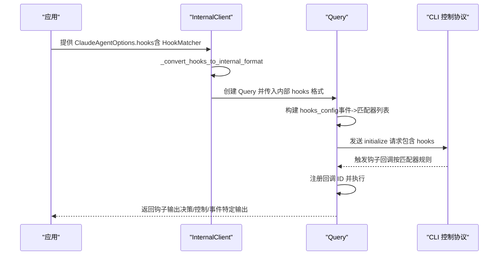
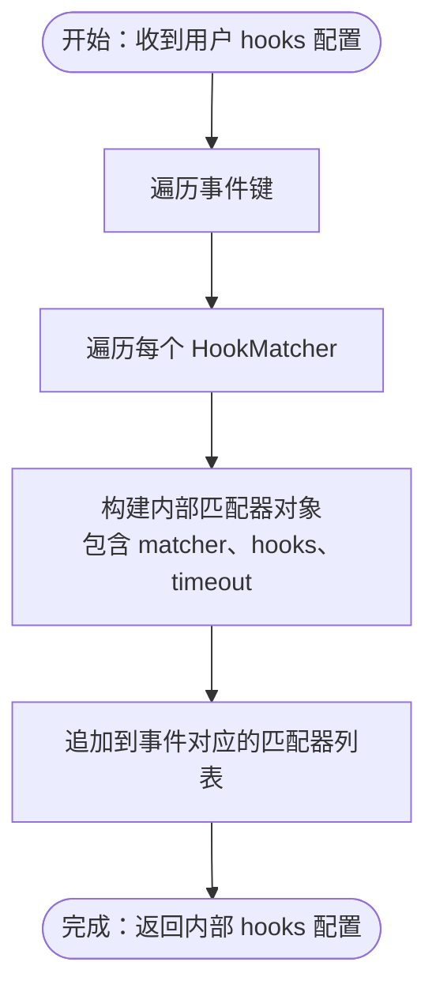
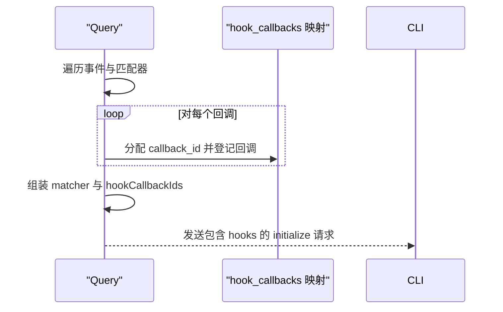

# 钩子匹配器

<cite>
**本文引用的文件**
- [src/claude_agent_sdk/types.py](file://src/claude_agent_sdk/types.py)
- [src/claude_agent_sdk/_internal/client.py](file://src/claude_agent_sdk/_internal/client.py)
- [src/claude_agent_sdk/_internal/query.py](file://src/claude_agent_sdk/_internal/query.py)
- [examples/hooks.py](file://examples/hooks.py)
- [e2e-tests/test_hooks.py](file://e2e-tests/test_hooks.py)
- [e2e-tests/test_hook_events.py](file://e2e-tests/test_hook_events.py)
- [tests/test_tool_callbacks.py](file://tests/test_tool_callbacks.py)
- [tests/test_query.py](file://tests/test_query.py)
</cite>

## 目录
1. [简介](#简介)
2. [项目结构](#项目结构)
3. [核心组件](#核心组件)
4. [架构总览](#架构总览)
5. [详细组件分析](#详细组件分析)
6. [依赖关系分析](#依赖关系分析)
7. [性能考量](#性能考量)
8. [故障排查指南](#故障排查指南)
9. [结论](#结论)
10. [附录](#附录)

## 简介
本文件系统性阐述钩子匹配器 HookMatcher 的工作原理与配置方法，覆盖以下主题：
- matcher 参数的匹配规则：工具名称匹配、复合工具名匹配、以及在部分测试中出现的字典形式匹配对象（如 {"tool": "..."}）。
- 如何通过 matcher 精确控制钩子触发范围与条件。
- 匹配器的超时配置与回调注册流程。
- 使用示例与策略组合：按事件类型分发、按工具名过滤、按事件+工具组合过滤。
- 优先级与冲突处理机制：同一事件下多个匹配器的执行顺序与行为。
- 性能优化建议与调试技巧。

## 项目结构
围绕钩子匹配器的关键代码分布在以下模块：
- 类型与数据结构：HookMatcher、HookEvent、HookCallback、HookJSONOutput 等定义于类型文件。
- 客户端转换逻辑：将用户提供的 HookMatcher 结构转换为内部 Query 初始化参数。
- 查询初始化：在 Query 初始化阶段构建 hooks 配置，注册回调 ID 并下发到 CLI 控制协议。
- 示例与测试：演示不同匹配策略、事件类型与组合使用。



图表来源
- [src/claude_agent_sdk/_internal/client.py:26-42](file://src/claude_agent_sdk/_internal/client.py#L26-L42)
- [src/claude_agent_sdk/_internal/query.py:128-155](file://src/claude_agent_sdk/_internal/query.py#L128-L155)

章节来源
- [src/claude_agent_sdk/types.py:476-491](file://src/claude_agent_sdk/types.py#L476-L491)
- [src/claude_agent_sdk/_internal/client.py:26-42](file://src/claude_agent_sdk/_internal/client.py#L26-L42)
- [src/claude_agent_sdk/_internal/query.py:128-155](file://src/claude_agent_sdk/_internal/query.py#L128-L155)

## 核心组件
- HookMatcher：用于声明“在哪些事件与条件下触发哪些钩子回调”，支持：
  - matcher：字符串或字典形式的匹配条件；字符串时通常为工具名或工具名组合；字典形式在测试中出现（如 {"tool": "..."}）。
  - hooks：回调函数列表。
  - timeout：该匹配器内所有回调的超时秒数。
- HookEvent：钩子事件枚举，包括 PreToolUse、PostToolUse、PostToolUseFailure、UserPromptSubmit、Stop、SubagentStop、PreCompact、Notification、SubagentStart、PermissionRequest。
- HookCallback/HookJSONOutput：钩子输入输出类型与返回值结构，支持决策字段（如 permissionDecision）、控制字段（如 continue_、stopReason）、事件特定输出（如 additionalContext、updatedMCPToolOutput）。

章节来源
- [src/claude_agent_sdk/types.py:160-172](file://src/claude_agent_sdk/types.py#L160-L172)
- [src/claude_agent_sdk/types.py:476-491](file://src/claude_agent_sdk/types.py#L476-L491)
- [src/claude_agent_sdk/types.py:465-472](file://src/claude_agent_sdk/types.py#L465-L472)
- [src/claude_agent_sdk/types.py:408-452](file://src/claude_agent_sdk/types.py#L408-L452)

## 架构总览
HookMatcher 的生命周期从应用配置开始，经由客户端转换，最终在 Query 初始化时下发至 CLI 控制协议。回调在运行期被分配唯一 ID，并在控制请求到达时执行。



图表来源
- [src/claude_agent_sdk/_internal/client.py:26-42](file://src/claude_agent_sdk/_internal/client.py#L26-L42)
- [src/claude_agent_sdk/_internal/query.py:128-155](file://src/claude_agent_sdk/_internal/query.py#L128-L155)

## 详细组件分析

### HookMatcher 数据模型与字段语义
- matcher 字段
  - 字符串：典型用法为工具名（如 "Bash"），或工具名组合（如 "Write|MultiEdit|Edit"）。
  - 字典：在测试中出现 {"tool": "..."} 形式，表示按工具名进行匹配。
  - None：表示匹配所有事件或不进行工具名过滤（例如 UserPromptSubmit 通常不绑定具体工具名）。
- hooks 字段：回调函数列表，每个回调遵循 HookCallback 签名。
- timeout 字段：整体会话中该匹配器内回调的超时时间（秒）。

章节来源
- [src/claude_agent_sdk/types.py:476-491](file://src/claude_agent_sdk/types.py#L476-L491)
- [src/claude_agent_sdk/types.py:480-483](file://src/claude_agent_sdk/types.py#L480-L483)

### 客户端转换逻辑（HookMatcher → 内部格式）
- InternalClient 将用户提供的 HookMatcher 转换为内部 dict 格式，保留 matcher、hooks 列表与可选 timeout。
- 转换后传递给 Query 初始化，Query 再将其序列化为控制协议的 hooks 配置。



图表来源
- [src/claude_agent_sdk/_internal/client.py:26-42](file://src/claude_agent_sdk/_internal/client.py#L26-L42)

章节来源
- [src/claude_agent_sdk/_internal/client.py:26-42](file://src/claude_agent_sdk/_internal/client.py#L26-L42)

### Query 初始化中的 hooks 配置构建
- Query 在初始化时遍历内部 hooks 配置，为每个回调生成唯一 callback_id 并登记到 hook_callbacks 映射。
- 将 matcher 与 callback_id 列表打包为初始化请求的一部分发送给 CLI。



图表来源
- [src/claude_agent_sdk/_internal/query.py:128-155](file://src/claude_agent_sdk/_internal/query.py#L128-L155)

章节来源
- [src/claude_agent_sdk/_internal/query.py:128-155](file://src/claude_agent_sdk/_internal/query.py#L128-L155)

### 匹配规则与使用策略

- 工具名称匹配
  - 字符串形式的 matcher 通常为工具名，如 "Bash" 或 "Write"。
  - 复合工具名：使用竖线分隔的组合，如 "Write|MultiEdit|Edit"。
  - 示例路径：
    - [examples/hooks.py:165-167](file://examples/hooks.py#L165-L167)
    - [examples/hooks.py:226-228](file://examples/hooks.py#L226-L228)
    - [examples/hooks.py:251-253](file://examples/hooks.py#L251-L253)

- 不进行工具名过滤
  - matcher 为 None 时，匹配所有工具调用（适用于 Notification、UserPromptSubmit 等事件）。
  - 示例路径：
    - [examples/hooks.py:202-204](file://examples/hooks.py#L202-L204)

- 字典形式匹配（测试场景）
  - 测试中出现 {"tool": "..."} 的字典匹配对象，用于按工具名筛选。
  - 示例路径：
    - [tests/test_tool_callbacks.py:480-482](file://tests/test_tool_callbacks.py#L480-L482)

- 组合策略
  - 同一事件下配置多个 HookMatcher，分别针对不同工具或条件。
  - 示例路径：
    - [e2e-tests/test_hook_events.py:178-182](file://e2e-tests/test_hook_events.py#L178-L182)

章节来源
- [examples/hooks.py:165-167](file://examples/hooks.py#L165-L167)
- [examples/hooks.py:202-204](file://examples/hooks.py#L202-L204)
- [examples/hooks.py:226-228](file://examples/hooks.py#L226-L228)
- [examples/hooks.py:251-253](file://examples/hooks.py#L251-L253)
- [e2e-tests/test_hook_events.py:178-182](file://e2e-tests/test_hook_events.py#L178-L182)
- [tests/test_tool_callbacks.py:480-482](file://tests/test_tool_callbacks.py#L480-L482)

### 钩子输出与控制字段
- 决策字段：permissionDecision（PreToolUse）、decision（其他事件）等，配合 reason 与 systemMessage 提供反馈。
- 控制字段：continue_、stopReason 控制后续执行流程；suppressOutput 控制输出抑制。
- 事件特定输出：additionalContext、updatedMCPToolOutput 等，用于增强上下文或修改输出。
- 异步钩子：async_ 与 asyncTimeout 用于延迟执行。

章节来源
- [src/claude_agent_sdk/types.py:414-452](file://src/claude_agent_sdk/types.py#L414-L452)
- [src/claude_agent_sdk/types.py:314-383](file://src/claude_agent_sdk/types.py#L314-L383)

### 典型使用示例与策略组合

- PreToolUse：基于工具名过滤并进行权限决策
  - 示例路径：
    - [examples/hooks.py:156-193](file://examples/hooks.py#L156-L193)
    - [e2e-tests/test_hooks.py:17-70](file://e2e-tests/test_hooks.py#L17-L70)

- PostToolUse：对工具输出进行审查并附加上下文
  - 示例路径：
    - [examples/hooks.py:218-240](file://examples/hooks.py#L218-L240)
    - [e2e-tests/test_hooks.py:74-113](file://e2e-tests/test_hooks.py#L74-L113)

- UserPromptSubmit：在提交提示时添加自定义上下文
  - 示例路径：
    - [examples/hooks.py:195-216](file://examples/hooks.py#L195-L216)
    - [e2e-tests/test_hooks.py:115-157](file://e2e-tests/test_hooks.py#L115-L157)

- Notification：全局通知事件监听
  - 示例路径：
    - [e2e-tests/test_hook_events.py:114-157](file://e2e-tests/test_hook_events.py#L114-L157)

- 多事件组合：同时监听 Notification、PreToolUse、PostToolUse
  - 示例路径：
    - [e2e-tests/test_hook_events.py:161-197](file://e2e-tests/test_hook_events.py#L161-L197)

章节来源
- [examples/hooks.py:156-193](file://examples/hooks.py#L156-L193)
- [examples/hooks.py:195-216](file://examples/hooks.py#L195-L216)
- [examples/hooks.py:218-240](file://examples/hooks.py#L218-L240)
- [e2e-tests/test_hooks.py:17-70](file://e2e-tests/test_hooks.py#L17-L70)
- [e2e-tests/test_hooks.py:74-113](file://e2e-tests/test_hooks.py#L74-L113)
- [e2e-tests/test_hooks.py:115-157](file://e2e-tests/test_hooks.py#L115-L157)
- [e2e-tests/test_hook_events.py:114-157](file://e2e-tests/test_hook_events.py#L114-L157)
- [e2e-tests/test_hook_events.py:161-197](file://e2e-tests/test_hook_events.py#L161-L197)

### 优先级与冲突处理机制
- 同一事件下的多个 HookMatcher 按注册顺序依次参与匹配与执行。
- 当多个匹配器均满足条件时，它们会分别被触发；若存在相互冲突的控制字段（如一个设置 continue_=True，另一个设置 continue_=False），需结合业务逻辑评估最终效果。
- 建议：
  - 将互斥的匹配器拆分为不同事件或不同工具名分支，减少冲突。
  - 使用 timeout 控制单个匹配器的执行时限，避免阻塞后续钩子。
  - 对需要严格顺序的场景，考虑在单个匹配器内聚合多个回调，统一管理控制字段。

章节来源
- [src/claude_agent_sdk/_internal/client.py:26-42](file://src/claude_agent_sdk/_internal/client.py#L26-L42)
- [src/claude_agent_sdk/_internal/query.py:128-155](file://src/claude_agent_sdk/_internal/query.py#L128-L155)

## 依赖关系分析

```mermaid
classDiagram
class HookMatcher {
+matcher : str | dict | None
+hooks : list[HookCallback]
+timeout : float | None
}
class HookCallback {
+__call__(input : HookInput, tool_use_id : str | None, context : HookContext) HookJSONOutput
}
class HookEvent {
<<enum>>
"PreToolUse"
"PostToolUse"
"PostToolUseFailure"
"UserPromptSubmit"
"Stop"
"SubagentStop"
"PreCompact"
"Notification"
"SubagentStart"
"PermissionRequest"
}
class InternalClient {
+_convert_hooks_to_internal_format(hooks) dict
}
class Query {
+initialize()
+receive_messages()
}
HookMatcher --> HookCallback : "包含多个回调"
InternalClient --> HookMatcher : "转换为内部格式"
InternalClient --> Query : "传入 hooks 配置"
Query --> HookMatcher : "在初始化时使用"
```

图表来源
- [src/claude_agent_sdk/types.py:476-491](file://src/claude_agent_sdk/types.py#L476-L491)
- [src/claude_agent_sdk/types.py:465-472](file://src/claude_agent_sdk/types.py#L465-L472)
- [src/claude_agent_sdk/types.py:160-172](file://src/claude_agent_sdk/types.py#L160-L172)
- [src/claude_agent_sdk/_internal/client.py:26-42](file://src/claude_agent_sdk/_internal/client.py#L26-L42)
- [src/claude_agent_sdk/_internal/query.py:128-155](file://src/claude_agent_sdk/_internal/query.py#L128-L155)

章节来源
- [src/claude_agent_sdk/types.py:476-491](file://src/claude_agent_sdk/types.py#L476-L491)
- [src/claude_agent_sdk/_internal/client.py:26-42](file://src/claude_agent_sdk/_internal/client.py#L26-L42)
- [src/claude_agent_sdk/_internal/query.py:128-155](file://src/claude_agent_sdk/_internal/query.py#L128-L155)

## 性能考量
- 回调数量与复杂度
  - 单个匹配器内的回调越多，整体执行时间越长；建议拆分职责，减少单次回调的计算量。
- 超时控制
  - 为每个匹配器设置合理的 timeout，避免长时间阻塞后续钩子与主流程。
- 事件选择
  - 仅对必要事件注册 HookMatcher，避免不必要的回调触发。
- 输出控制
  - 使用 suppressOutput 减少不必要的 stdout 输出，降低传输与解析开销。
- 异步钩子
  - 对耗时操作使用异步钩子（async_），并在 asyncTimeout 中设置合理上限，避免阻塞同步执行路径。

## 故障排查指南
- 钩子未触发
  - 检查 matcher 是否正确匹配工具名或事件；对于不绑定工具名的事件（如 Notification、UserPromptSubmit），确保 matcher 为 None 或未指定工具名。
  - 参考示例路径：
    - [examples/hooks.py:202-204](file://examples/hooks.py#L202-L204)
    - [e2e-tests/test_hook_events.py:114-157](file://e2e-tests/test_hook_events.py#L114-L157)
- 权限决策无效
  - 确认在 PreToolUse 事件中使用 permissionDecision 与 permissionDecisionReason，并返回正确的 hookEventName。
  - 参考示例路径：
    - [examples/hooks.py:242-277](file://examples/hooks.py#L242-L277)
    - [e2e-tests/test_hooks.py:17-70](file://e2e-tests/test_hooks.py#L17-L70)
- 执行被意外中断
  - 检查 continue_ 与 stopReason 的使用是否符合预期；多个匹配器可能产生冲突，建议合并或明确优先级。
  - 参考示例路径：
    - [examples/hooks.py:279-301](file://examples/hooks.py#L279-L301)
    - [e2e-tests/test_hooks.py:74-113](file://e2e-tests/test_hooks.py#L74-L113)
- 调试技巧
  - 在回调中记录输入与上下文，验证 tool_use_id、hook_event_name 等字段是否正确传递。
  - 参考测试路径：
    - [tests/test_tool_callbacks.py:520-549](file://tests/test_tool_callbacks.py#L520-L549)
    - [tests/test_tool_callbacks.py:573-596](file://tests/test_tool_callbacks.py#L573-L596)
    - [tests/test_tool_callbacks.py:620-643](file://tests/test_tool_callbacks.py#L620-L643)

章节来源
- [examples/hooks.py:202-204](file://examples/hooks.py#L202-L204)
- [examples/hooks.py:242-277](file://examples/hooks.py#L242-L277)
- [examples/hooks.py:279-301](file://examples/hooks.py#L279-L301)
- [e2e-tests/test_hooks.py:17-70](file://e2e-tests/test_hooks.py#L17-L70)
- [e2e-tests/test_hooks.py:74-113](file://e2e-tests/test_hooks.py#L74-L113)
- [tests/test_tool_callbacks.py:520-549](file://tests/test_tool_callbacks.py#L520-L549)
- [tests/test_tool_callbacks.py:573-596](file://tests/test_tool_callbacks.py#L573-L596)
- [tests/test_tool_callbacks.py:620-643](file://tests/test_tool_callbacks.py#L620-L643)

## 结论
HookMatcher 提供了灵活而强大的钩子触发控制能力：通过工具名匹配、事件类型与组合策略，开发者可以精准地将钩子应用于特定场景。结合超时控制、异步钩子与严格的输出/控制字段管理，可以在保证安全性的同时获得良好的性能与可观测性。建议在实际项目中：
- 明确事件与工具边界，避免过度匹配；
- 合理拆分与聚合回调，减少冲突；
- 使用 timeout 与异步钩子提升稳定性；
- 通过日志与测试验证关键路径的行为。

## 附录

### HookMatcher 字段与默认值速览
- matcher：字符串或字典，或 None（默认 None）
- hooks：回调函数列表（默认空列表）
- timeout：浮点数秒，或 None（默认 None）

章节来源
- [src/claude_agent_sdk/types.py:476-491](file://src/claude_agent_sdk/types.py#L476-L491)