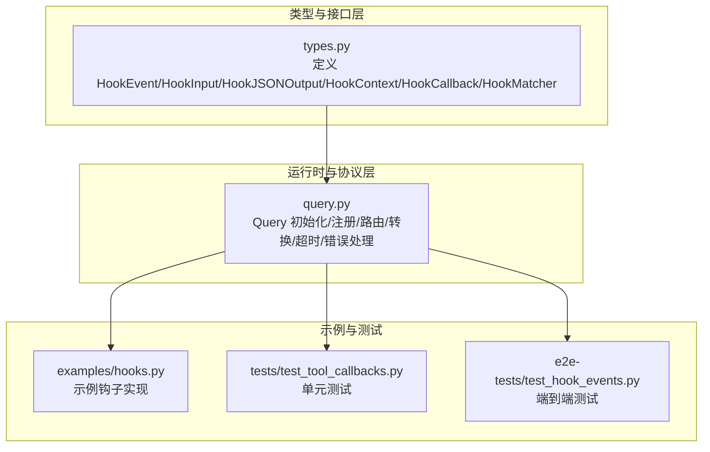
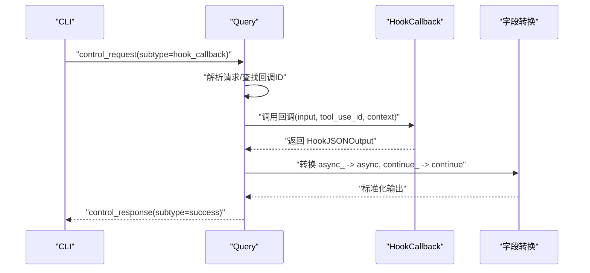
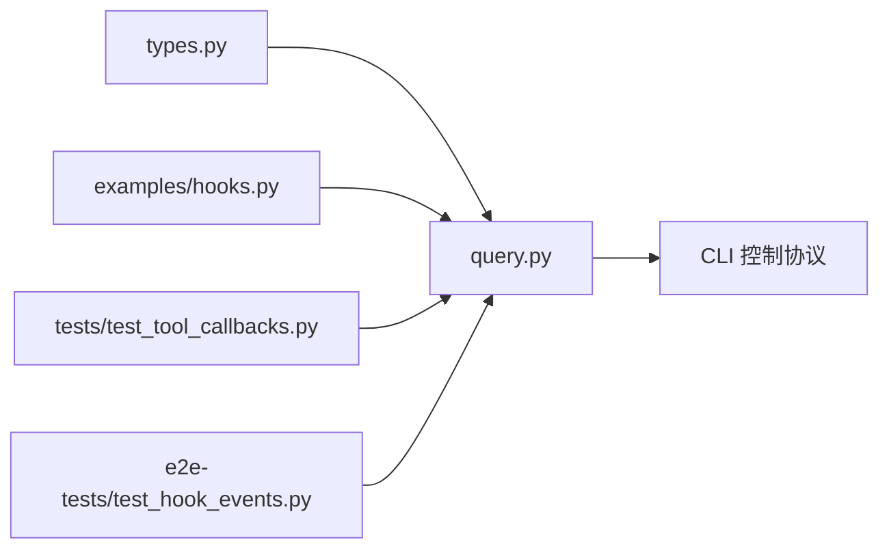

# 钩子回调函数

<cite>
**本文引用的文件列表**
- [types.py](file://src/claude_agent_sdk/types.py)
- [query.py](file://src/claude_agent_sdk/_internal/query.py)
- [hooks.py](file://examples/hooks.py)
- [test_tool_callbacks.py](file://tests/test_tool_callbacks.py)
- [test_hook_events.py](file://e2e-tests/test_hook_events.py)
</cite>

## 目录
1. [简介](#简介)
2. [项目结构与定位](#项目结构与定位)
3. [核心组件总览](#核心组件总览)
4. [架构概览](#架构概览)
5. [详细组件分析](#详细组件分析)
6. [依赖关系分析](#依赖关系分析)
7. [性能与并发特性](#性能与并发特性)
8. [调试与测试指南](#调试与测试指南)
9. [结论](#结论)

## 简介
本章节面向使用 Claude Agent SDK 的开发者，系统性讲解“钩子回调（Hook Callback）”的类型定义、输入输出结构、上下文信息、同步与异步差异、执行顺序与链式调用机制，以及实现模式、最佳实践、错误处理、超时管理与性能考量。文档同时给出多种典型场景的实现思路与参考路径，帮助快速落地安全、可观测、可扩展的钩子体系。

## 项目结构与定位
- 钩子类型与数据结构定义集中在类型模块中，涵盖事件枚举、输入/输出类型、上下文与回调签名。
- 控制协议与钩子回调的注册、分发、转换由内部查询类负责，包括初始化、请求路由、字段名转换、错误处理与超时控制。
- 示例与测试分别覆盖了基础用法、字段转换、异步钩子、多事件组合等关键行为。

图表来源
- [types.py:160-472](file://src/claude_agent_sdk/types.py#L160-L472)
- [query.py:119-163](file://src/claude_agent_sdk/_internal/query.py#L119-L163)
- [query.py:236-345](file://src/claude_agent_sdk/_internal/query.py#L236-L345)
- [hooks.py:1-351](file://examples/hooks.py#L1-L351)
- [test_tool_callbacks.py:212-772](file://tests/test_tool_callbacks.py#L212-L772)
- [test_hook_events.py:17-197](file://e2e-tests/test_hook_events.py#L17-L197)

章节来源
- [types.py:160-472](file://src/claude_agent_sdk/types.py#L160-L472)
- [query.py:119-163](file://src/claude_agent_sdk/_internal/query.py#L119-L163)
- [query.py:236-345](file://src/claude_agent_sdk/_internal/query.py#L236-L345)

## 核心组件总览
- 事件类型：预置了多个钩子事件，如 PreToolUse、PostToolUse、PostToolUseFailure、UserPromptSubmit、Stop、SubagentStop、PreCompact、Notification、SubagentStart、PermissionRequest。
- 输入类型：每个事件对应强类型的输入结构，包含会话标识、转录路径、工作目录、工具名称、工具输入、工具使用标识等。
- 输出类型：分为同步输出与异步输出两类，统一通过 HookJSONOutput 联合类型表达；同步输出支持控制字段（如 continue_、suppressOutput、stopReason）、决策字段（decision、systemMessage、reason）与事件特定输出（hookSpecificOutput）。
- 上下文：HookContext 当前保留 signal 字段用于未来中断信号支持，目前为占位。
- 回调签名：HookCallback 定义为接收 HookInput、可选的 tool_use_id、HookContext，并返回 Awaitable[HookJSONOutput] 的异步函数。

章节来源
- [types.py:160-472](file://src/claude_agent_sdk/types.py#L160-L472)

## 架构概览
钩子在 SDK 中的生命周期：
- 初始化阶段：Query 将用户配置的 hooks 按事件与匹配器进行注册，生成回调 ID 并保存到内存映射中。
- 运行阶段：CLI 通过控制通道下发 hook_callback 请求，Query 根据回调 ID 找到对应回调，调用并等待结果。
- 结果阶段：Query 将 Python 风格字段名（async_、continue_）转换为 CLI 期望格式（async、continue），封装为控制响应返回。

图表来源
- [query.py:288-302](file://src/claude_agent_sdk/_internal/query.py#L288-L302)
- [query.py:34-50](file://src/claude_agent_sdk/_internal/query.py#L34-L50)

章节来源
- [query.py:119-163](file://src/claude_agent_sdk/_internal/query.py#L119-L163)
- [query.py:236-345](file://src/claude_agent_sdk/_internal/query.py#L236-L345)

## 详细组件分析

### 1) HookEvent 与 HookInput
- 事件枚举：涵盖工具生命周期、会话控制、通知与子代理等事件。
- 输入结构：BaseHookInput 提供通用字段；各事件输入在基类基础上扩展，例如 PreToolUseHookInput 包含 tool_name、tool_input、tool_use_id；NotificationHookInput 包含 message、title、notification_type 等。

章节来源
- [types.py:160-310](file://src/claude_agent_sdk/types.py#L160-L310)

### 2) HookJSONOutput 与 HookContext
- 同步输出（SyncHookJSONOutput）：控制字段（continue_、suppressOutput、stopReason）、决策字段（decision、systemMessage、reason）、事件特定输出（hookSpecificOutput）。
- 异步输出（AsyncHookJSONOutput）：async_（必须为真）、asyncTimeout（毫秒级超时）。
- 上下文（HookContext）：当前保留 signal 字段，未来用于中断信号支持。

章节来源
- [types.py:386-472](file://src/claude_agent_sdk/types.py#L386-L472)

### 3) HookCallback 签名与实现要求
- 参数：
  - input：强类型 HookInput，基于 hook_event_name 的判别联合类型。
  - tool_use_id：可选的工具使用标识（在某些事件中可用）。
  - context：HookContext，当前为占位，保留 signal 字段。
- 返回：Awaitable[HookJSONOutput]，即同步或异步输出。
- 实现要点：
  - 严格遵循事件输入结构，避免遗漏必要字段。
  - 在 PreToolUse 中优先使用 permissionDecision 与 permissionDecisionReason 表达许可策略。
  - 在 PostToolUse 中可设置 additionalContext 或 updatedMCPToolOutput。
  - 使用 continue_ 控制后续流程，stopReason 提供停止原因。

章节来源
- [types.py:455-472](file://src/claude_agent_sdk/types.py#L455-L472)

### 4) HookMatcher 与注册机制
- HookMatcher 支持：
  - matcher：字符串匹配规则（如工具名或组合工具名）。
  - hooks：HookCallback 列表。
  - timeout：该匹配器内所有回调的超时（秒）。
- 注册流程：Query 在初始化时将 hooks 配置转换为 hooks_config，为每个回调生成唯一 ID 并存入 hook_callbacks 映射。

章节来源
- [types.py:475-491](file://src/claude_agent_sdk/types.py#L475-L491)
- [query.py:128-147](file://src/claude_agent_sdk/_internal/query.py#L128-L147)

### 5) 字段名转换与 CLI 兼容
- Python 风格字段名（async_、continue_）在返回前会被转换为 CLI 期望的 async、continue。
- 转换逻辑在 _convert_hook_output_for_cli 中完成。

章节来源
- [query.py:34-50](file://src/claude_agent_sdk/_internal/query.py#L34-L50)

### 6) 同步与异步钩子的选择原则
- 同步钩子（返回 SyncHookJSONOutput）：
  - 适合快速判断与反馈，如权限决策、简单日志、上下文注入。
  - 优点：低延迟、易实现。
  - 注意：若存在 IO 或外部服务调用，应谨慎评估是否阻塞。
- 异步钩子（返回 AsyncHookJSONOutput）：
  - 适合需要延后处理或外部确认的场景（如长耗时审批、外部审计）。
  - 通过 async_ 与 asyncTimeout 控制 CLI 等待策略。
  - 注意：需确保 CLI 能正确处理异步回调并配合超时策略。

章节来源
- [types.py:393-452](file://src/claude_agent_sdk/types.py#L393-L452)
- [query.py:288-302](file://src/claude_agent_sdk/_internal/query.py#L288-L302)

### 7) 执行顺序与链式调用机制
- 注册顺序即调用顺序：Query 为每个事件维护回调列表，按注册顺序依次调用。
- 匹配器维度：同一事件可配置多个 HookMatcher，每个匹配器内的回调按注册顺序执行。
- 超时控制：每个 HookMatcher 可设置 timeout，影响该组回调的总体等待时间。
- 事件特定：不同事件的输入结构不同，回调需根据 hook_event_name 分支处理。

章节来源
- [query.py:128-147](file://src/claude_agent_sdk/_internal/query.py#L128-L147)
- [types.py:475-491](file://src/claude_agent_sdk/types.py#L475-L491)

### 8) 典型实现模式与最佳实践
- 权限检查（PreToolUse）
  - 使用 permissionDecision 与 permissionDecisionReason 表达允许/拒绝及理由。
  - 可结合 additionalContext 传递上下文信息。
  - 参考路径：[examples/hooks.py:46-71](file://examples/hooks.py#L46-L71)
- 日志记录（UserPromptSubmit/Notification）
  - 在合适事件中注入 additionalContext，便于后续处理或审计。
  - 参考路径：[examples/hooks.py:73-82](file://examples/hooks.py#L73-L82)
- 工具拦截与改写（PostToolUse）
  - 对工具输出进行审查，必要时提供 systemMessage 与 reason，并可返回 updatedMCPToolOutput。
  - 参考路径：[examples/hooks.py:85-103](file://examples/hooks.py#L85-L103)
- 严格审批（PreToolUse）
  - 基于工具名与输入内容进行细粒度控制，明确 allow/deny 与拒绝原因。
  - 参考路径：[examples/hooks.py:105-136](file://examples/hooks.py#L105-L136)
- 执行控制（PostToolUse）
  - 使用 continue_ 与 stopReason 在出现严重错误时终止流程。
  - 参考路径：[examples/hooks.py:138-154](file://examples/hooks.py#L138-L154)

章节来源
- [examples/hooks.py:46-154](file://examples/hooks.py#L46-L154)

### 9) 错误处理与超时管理
- 错误处理：
  - 回调异常会被捕获并转换为控制响应中的 error 子类型，CLI 可据此感知失败。
  - 参考路径：[query.py:335-345](file://src/claude_agent_sdk/_internal/query.py#L335-L345)
- 超时管理：
  - 单个控制请求默认超时 60 秒；HookMatcher 可设置各自超时。
  - 异步钩子通过 asyncTimeout 指定等待上限。
  - 参考路径：[query.py:347-393](file://src/claude_agent_sdk/_internal/query.py#L347-L393)，[types.py:393-405](file://src/claude_agent_sdk/types.py#L393-L405)

章节来源
- [query.py:335-345](file://src/claude_agent_sdk/_internal/query.py#L335-L345)
- [query.py:347-393](file://src/claude_agent_sdk/_internal/query.py#L347-L393)
- [types.py:393-405](file://src/claude_agent_sdk/types.py#L393-L405)

### 10) 钩子事件与输入输出示例
- PreToolUse：包含 tool_name、tool_input、tool_use_id、additionalContext、permissionDecision 等。
  - 参考路径：[test_tool_callbacks.py:696-746](file://tests/test_tool_callbacks.py#L696-L746)
- PostToolUse：包含 tool_response、updatedMCPToolOutput、additionalContext 等。
  - 参考路径：[test_tool_callbacks.py:646-694](file://tests/test_tool_callbacks.py#L646-L694)
- Notification：包含 message、title、notification_type、additionalContext 等。
  - 参考路径：[test_tool_callbacks.py:492-550](file://tests/test_tool_callbacks.py#L492-L550)
- PermissionRequest：包含 tool_name、tool_input、decision 等。
  - 参考路径：[test_tool_callbacks.py:552-597](file://tests/test_tool_callbacks.py#L552-L597)

章节来源
- [test_tool_callbacks.py:492-746](file://tests/test_tool_callbacks.py#L492-L746)

## 依赖关系分析
- 类型依赖：types.py 定义了事件、输入/输出、上下文与回调签名，是所有钩子实现的基础契约。
- 运行时依赖：query.py 负责将配置转换为运行时注册表，处理控制请求、回调调用、字段转换与错误传播。
- 示例与测试：examples 与 tests 展示了典型用法与边界行为，验证字段转换、异步钩子、多事件组合等。

图表来源
- [types.py:160-472](file://src/claude_agent_sdk/types.py#L160-L472)
- [query.py:119-163](file://src/claude_agent_sdk/_internal/query.py#L119-L163)
- [hooks.py:1-351](file://examples/hooks.py#L1-351)
- [test_tool_callbacks.py:212-772](file://tests/test_tool_callbacks.py#L212-L772)
- [test_hook_events.py:17-197](file://e2e-tests/test_hook_events.py#L17-L197)

章节来源
- [types.py:160-472](file://src/claude_agent_sdk/types.py#L160-L472)
- [query.py:119-163](file://src/claude_agent_sdk/_internal/query.py#L119-L163)

## 性能与并发特性
- 并发模型：Query 使用任务组并发读取消息与处理控制请求，回调以异步方式执行，避免阻塞主循环。
- 超时策略：默认控制请求超时 60 秒，可通过 HookMatcher 设置更短或更长的超时，平衡可靠性与响应速度。
- 字段转换开销：仅在返回前进行一次字段名转换，成本极低。
- 建议：
  - 将重 IO 或外部依赖的钩子实现为异步钩子，并合理设置 asyncTimeout。
  - 对高频事件（如 PostToolUse）尽量保持轻量逻辑，避免阻塞后续工具调用。

章节来源
- [query.py:165-235](file://src/claude_agent_sdk/_internal/query.py#L165-L235)
- [query.py:347-393](file://src/claude_agent_sdk/_internal/query.py#L347-L393)

## 调试与测试指南
- 单元测试要点：
  - 验证字段转换：确保 async_ 转为 async、continue_ 转为 continue。
    - 参考路径：[test_tool_callbacks.py:400-459](file://tests/test_tool_callbacks.py#L400-L459)
  - 验证异步钩子：返回 async_=True 与 asyncTimeout。
    - 参考路径：[test_tool_callbacks.py:350-398](file://tests/test_tool_callbacks.py#L350-L398)
  - 验证多事件回调：Notification、PermissionRequest、SubagentStart、PostToolUse 等。
    - 参考路径：[test_tool_callbacks.py:492-746](file://tests/test_tool_callbacks.py#L492-L746)
- 端到端测试要点：
  - 验证 PreToolUse/PostToolUse 的 tool_use_id 是否正确传入。
    - 参考路径：[test_hook_events.py:19-110](file://e2e-tests/test_hook_events.py#L19-L110)
  - 验证多事件组合注册与执行。
    - 参考路径：[test_hook_events.py:161-197](file://e2e-tests/test_hook_events.py#L161-L197)
- 示例参考：
  - 丰富的示例展示了权限检查、日志记录、工具拦截、执行控制等场景。
    - 参考路径：[examples/hooks.py:46-351](file://examples/hooks.py#L46-L351)

章节来源
- [test_tool_callbacks.py:212-772](file://tests/test_tool_callbacks.py#L212-L772)
- [test_hook_events.py:17-197](file://e2e-tests/test_hook_events.py#L17-L197)
- [hooks.py:46-351](file://examples/hooks.py#L46-L351)

## 结论
- HookCallback 是 SDK 中实现安全、可观测与可扩展行为的关键机制。通过强类型输入/输出、清晰的上下文与回调签名，开发者可以构建从权限控制到日志审计再到执行控制的完整链路。
- 同步与异步钩子各有适用场景，建议在保证可靠性的前提下，优先采用异步钩子处理外部依赖与长耗时操作。
- 通过 HookMatcher 的超时控制与事件特定输出，可以灵活地在不同生命周期点注入策略与上下文，提升系统的可控性与可维护性。