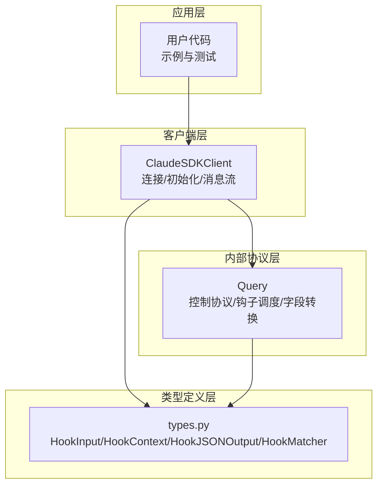
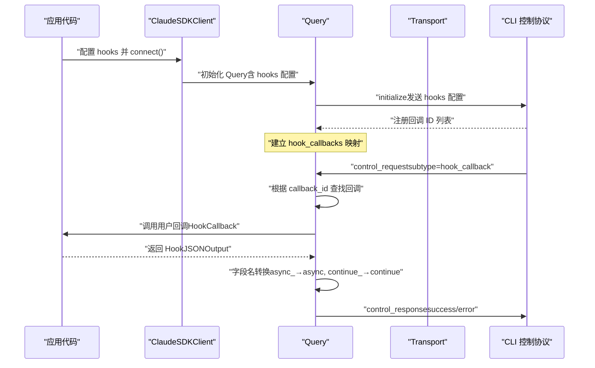
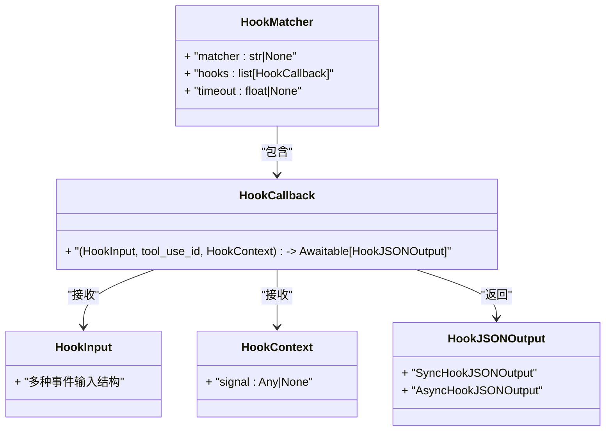

# 钩子回调实现

<cite>
**本文引用的文件列表**
- [types.py](file://src/claude_agent_sdk/types.py)
- [client.py](file://src/claude_agent_sdk/client.py)
- [query.py](file://src/claude_agent_sdk/_internal/query.py)
- [hooks.py](file://examples/hooks.py)
- [test_hooks.py](file://e2e-tests/test_hooks.py)
- [test_hook_events.py](file://e2e-tests/test_hook_events.py)
- [test_tool_callbacks.py](file://tests/test_tool_callbacks.py)
</cite>

## 目录
1. [简介](#简介)
2. [项目结构](#项目结构)
3. [核心组件](#核心组件)
4. [架构总览](#架构总览)
5. [详细组件分析](#详细组件分析)
6. [依赖关系分析](#依赖关系分析)
7. [性能考量](#性能考量)
8. [故障排查指南](#故障排查指南)
9. [结论](#结论)
10. [附录](#附录)

## 简介
本指南面向使用 Claude Agent SDK 的开发者，系统讲解钩子回调（Hook Callback）的实现方法与最佳实践。文档围绕以下核心类型展开：HookInput、HookContext、HookJSONOutput，并结合 HookMatcher、HookEvent 等配置类型，完整说明如何编写钩子回调函数，包括参数接收、业务逻辑处理与返回值构造；覆盖权限控制、输出审查、执行中断等常见场景；解释异步处理模式与错误处理机制；提供性能优化建议与调试测试方法。

## 项目结构
本项目采用分层设计：
- 类型定义层：在 types.py 中定义所有钩子相关的强类型结构（输入、上下文、输出、匹配器等）
- 客户端层：在 client.py 中对外暴露 ClaudeSDKClient，负责连接、初始化、消息收发与钩子配置转换
- 内部协议层：在 _internal/query.py 中实现双向控制协议、钩子回调调度、字段名转换与错误响应
- 示例与测试：examples/hooks.py 提供可运行的钩子示例；e2e-tests 与 tests 提供端到端与单元测试用例

图表来源
- [client.py:76-92](file://src/claude_agent_sdk/client.py#L76-L92)
- [query.py:129-147](file://src/claude_agent_sdk/_internal/query.py#L129-L147)
- [types.py:160-452](file://src/claude_agent_sdk/types.py#L160-L452)

章节来源
- [client.py:76-92](file://src/claude_agent_sdk/client.py#L76-L92)
- [query.py:129-147](file://src/claude_agent_sdk/_internal/query.py#L129-L147)
- [types.py:160-452](file://src/claude_agent_sdk/types.py#L160-L452)

## 核心组件
本节聚焦三个关键类型及其职责与交互方式。

- HookInput：强类型输入数据，按不同钩子事件派生出具体结构（如 PreToolUseHookInput、PostToolUseHookInput、UserPromptSubmitHookInput 等），用于向回调函数传递事件上下文与工具调用信息。
- HookContext：回调上下文，当前版本保留 signal 字段占位，未来可用于中止信号支持。
- HookJSONOutput：回调返回值结构，分为同步输出（SyncHookJSONOutput）与异步输出（AsyncHookJSONOutput）。同步输出支持 continue_、suppressOutput、stopReason、decision、systemMessage、reason、hookSpecificOutput 等字段；异步输出支持 async_ 与 asyncTimeout 字段。

章节来源
- [types.py:175-310](file://src/claude_agent_sdk/types.py#L175-L310)
- [types.py:455-472](file://src/claude_agent_sdk/types.py#L455-L472)
- [types.py:393-452](file://src/claude_agent_sdk/types.py#L393-L452)

## 架构总览
下图展示从客户端到内部查询再到控制协议的钩子回调调用链路，以及字段名转换的关键步骤。

图表来源
- [client.py:166-176](file://src/claude_agent_sdk/client.py#L166-L176)
- [query.py:129-147](file://src/claude_agent_sdk/_internal/query.py#L129-L147)
- [query.py:288-303](file://src/claude_agent_sdk/_internal/query.py#L288-L303)
- [query.py:34-50](file://src/claude_agent_sdk/_internal/query.py#L34-L50)

章节来源
- [client.py:166-176](file://src/claude_agent_sdk/client.py#L166-L176)
- [query.py:129-147](file://src/claude_agent_sdk/_internal/query.py#L129-L147)
- [query.py:288-303](file://src/claude_agent_sdk/_internal/query.py#L288-L303)
- [query.py:34-50](file://src/claude_agent_sdk/_internal/query.py#L34-L50)

## 详细组件分析

### HookInput 结构族
- 基类 BaseHookInput：包含 session_id、transcript_path、cwd、permission_mode 等通用字段
- 工具生命周期相关：PreToolUseHookInput、PostToolUseHookInput、PostToolUseFailureHookInput
- 用户交互相关：UserPromptSubmitHookInput、StopHookInput、SubagentStopHookInput
- 其他：PreCompactHookInput、NotificationHookInput、SubagentStartHookInput、PermissionRequestHookInput
- 子代理上下文混入 _SubagentContextMixin：agent_id、agent_type（可选），用于区分并行子代理产生的钩子事件

章节来源
- [types.py:175-296](file://src/claude_agent_sdk/types.py#L175-L296)

### HookContext
- 当前仅包含 signal 字段（占位），未来可用于中止信号支持
- 回调签名中作为第三个参数传入，便于扩展

章节来源
- [types.py:455-463](file://src/claude_agent_sdk/types.py#L455-L463)

### HookJSONOutput 结构族
- 同步输出（SyncHookJSONOutput）：
  - 控制字段：continue_（默认 True）、suppressOutput（默认 False）、stopReason
  - 决策字段：decision（目前仅在非 PreToolUse 事件中有效，如 "block"）、systemMessage、reason
  - 钩子特定输出：hookSpecificOutput（按事件类型选择对应 HookSpecificOutput）
- 异步输出（AsyncHookJSONOutput）：
  - async_（必须为 True，表示延迟执行）、asyncTimeout（毫秒级超时）

字段名转换规则：
- Python 使用 async_ 与 continue_ 避免关键字冲突
- 发送给 CLI 之前由 _convert_hook_output_for_cli 转换为 async 与 continue

章节来源
- [types.py:393-452](file://src/claude_agent_sdk/types.py#L393-L452)
- [query.py:34-50](file://src/claude_agent_sdk/_internal/query.py#L34-L50)

### HookMatcher 与 HookEvent
- HookMatcher：包含 matcher（匹配器字符串或 None）、hooks（回调函数列表）、timeout（可选）
- HookEvent：枚举所有可用钩子事件名称（如 PreToolUse、PostToolUse、UserPromptSubmit 等）

章节来源
- [types.py:475-491](file://src/claude_agent_sdk/types.py#L475-L491)
- [types.py:160-172](file://src/claude_agent_sdk/types.py#L160-L172)

### HookCallback 签名
- 参数：HookInput、tool_use_id（可选）、HookContext
- 返回：Awaitable[HookJSONOutput]
- 在 Query 初始化时，将 HookMatcher 中的 hooks 注册为回调 ID，并保存在 hook_callbacks 映射中

章节来源
- [types.py:465-472](file://src/claude_agent_sdk/types.py#L465-L472)
- [query.py:135-147](file://src/claude_agent_sdk/_internal/query.py#L135-L147)

### 回调调用流程
- 初始化：客户端将 hooks 配置转换为内部格式后传给 Query.initialize
- 触发：CLI 发送 control_request（subtype=hook_callback），携带 callback_id、input、tool_use_id
- 执行：Query 根据 callback_id 查找回调并调用
- 返回：回调返回 HookJSONOutput，Query 进行字段名转换并回传 CLI

章节来源
- [client.py:76-92](file://src/claude_agent_sdk/client.py#L76-L92)
- [query.py:129-147](file://src/claude_agent_sdk/_internal/query.py#L129-L147)
- [query.py:288-303](file://src/claude_agent_sdk/_internal/query.py#L288-L303)

### 权限控制场景
- PreToolUse 钩子通过 permissionDecision 与 permissionDecisionReason 控制是否允许工具执行
- 可结合 reason 与 systemMessage 提供反馈
- 可通过 updatedInput 对工具输入进行修改（需配合 CLI 支持）

章节来源
- [hooks.py:46-71](file://examples/hooks.py#L46-L71)
- [hooks.py:105-135](file://examples/hooks.py#L105-L135)
- [test_hooks.py:17-48](file://e2e-tests/test_hooks.py#L17-L48)

### 输出审查与上下文增强
- PostToolUse 钩子可读取 tool_response，基于结果提供额外上下文或警告
- 可设置 systemMessage 与 reason，以及 hookSpecificOutput 中的 additionalContext 或 updatedMCPToolOutput

章节来源
- [hooks.py:85-103](file://examples/hooks.py#L85-L103)
- [hooks.py:218-240](file://examples/hooks.py#L218-L240)
- [test_tool_callbacks.py:649-687](file://tests/test_tool_callbacks.py#L649-L687)

### 执行中断与继续控制
- 通过 PostToolUse 钩子返回 continue_=False 与 stopReason 实现安全中断
- 适用于检测到严重错误或异常情况时立即停止

章节来源
- [hooks.py:138-154](file://examples/hooks.py#L138-L154)
- [test_hooks.py:74-91](file://e2e-tests/test_hooks.py#L74-L91)

### 异步钩子模式
- 使用 AsyncHookJSONOutput（async_=True, asyncTimeout=毫秒）延迟钩子执行
- 适用于需要外部系统确认或长时间处理的场景

章节来源
- [types.py:393-406](file://src/claude_agent_sdk/types.py#L393-L406)
- [test_tool_callbacks.py:350-370](file://tests/test_tool_callbacks.py#L350-L370)

### 错误处理机制
- 回调抛出异常会被捕获并转换为 control_response（subtype="error"）
- Query 层对字段名转换失败、回调未找到等情况进行统一处理
- CLI 层收到错误响应后会记录日志并终止相应流程

章节来源
- [query.py:335-345](file://src/claude_agent_sdk/_internal/query.py#L335-L345)
- [query.py:292-294](file://src/claude_agent_sdk/_internal/query.py#L292-L294)

## 依赖关系分析
- ClaudeSDKClient 将用户提供的 hooks 配置转换为内部格式，再传给 Query
- Query 负责注册回调、路由控制请求、调用回调、字段名转换与错误响应
- types.py 提供强类型约束，确保输入输出结构正确

图表来源
- [types.py:160-491](file://src/claude_agent_sdk/types.py#L160-L491)

章节来源
- [types.py:160-491](file://src/claude_agent_sdk/types.py#L160-L491)

## 性能考量
- 钩子回调应保持轻量与快速：避免阻塞操作，优先使用异步 I/O
- 合理设置 HookMatcher.timeout，防止单个钩子影响整体会话
- 使用 AsyncHookJSONOutput 延迟执行耗时任务，减少阻塞
- 在 PostToolUse 钩子中尽量避免对大体量 tool_response 的深度拷贝
- 注意 CLI 字段名转换开销极小，但频繁转换仍应避免不必要的重复

[本节为通用指导，无需列出具体文件来源]

## 故障排查指南
- 回调未触发
  - 检查 HookMatcher.matcher 是否与工具名称匹配
  - 确认 Query.initialize 是否成功注册回调 ID
- 返回字段不生效
  - 确认使用了正确的字段名（Python 使用 async_ 与 continue_，最终会转换为 async 与 continue）
  - 检查事件类型对应的 hookSpecificOutput 字段是否正确
- 执行被意外中断
  - 检查 PostToolUse 钩子是否设置了 continue_=False
- 超时问题
  - 调整 HookMatcher.timeout 或在回调中使用 AsyncHookJSONOutput
- 错误日志
  - 查看 CLI 控制协议错误响应，定位回调异常位置

章节来源
- [query.py:335-345](file://src/claude_agent_sdk/_internal/query.py#L335-L345)
- [query.py:34-50](file://src/claude_agent_sdk/_internal/query.py#L34-L50)
- [test_tool_callbacks.py:403-440](file://tests/test_tool_callbacks.py#L403-L440)

## 结论
通过强类型的 HookInput、HookContext、HookJSONOutput 与 HookMatcher/HookEvent 配置，Claude Agent SDK 提供了灵活且可控的钩子回调机制。开发者可在 PreToolUse、PostToolUse、UserPromptSubmit 等事件上实现权限控制、输出审查与执行中断等能力；借助异步钩子与字段名自动转换，既能保证与 CLI 的兼容性，又能获得良好的开发体验。建议在实际工程中遵循轻量回调、合理超时与清晰日志的原则，以获得稳定可靠的钩子行为。

[本节为总结性内容，无需列出具体文件来源]

## 附录

### 完整回调实现示例（路径指引）
- 权限控制（PreToolUse）：[hooks.py:46-71](file://examples/hooks.py#L46-L71)
- 上下文增强（UserPromptSubmit）：[hooks.py:73-82](file://examples/hooks.py#L73-L82)
- 输出审查（PostToolUse）：[hooks.py:85-103](file://examples/hooks.py#L85-L103)
- 严格审批（PreToolUse）：[hooks.py:105-135](file://examples/hooks.py#L105-L135)
- 执行中断（PostToolUse）：[hooks.py:138-154](file://examples/hooks.py#L138-L154)

### 端到端测试（路径指引）
- 权限决策与 reason 字段：[test_hooks.py:17-48](file://e2e-tests/test_hooks.py#L17-L48)
- continue 与 stopReason 字段：[test_hooks.py:74-91](file://e2e-tests/test_hooks.py#L74-L91)
- hookSpecificOutput 字段：[test_hooks.py:117-135](file://e2e-tests/test_hooks.py#L117-L135)
- 多事件组合：[test_hook_events.py:161-197](file://e2e-tests/test_hook_events.py#L161-L197)

### 单元测试（路径指引）
- 回调调用与参数传递：[test_tool_callbacks.py:220-257](file://tests/test_tool_callbacks.py#L220-L257)
- 决策字段与 hookSpecificOutput：[test_tool_callbacks.py:320-348](file://tests/test_tool_callbacks.py#L320-L348)
- 异步钩子字段转换：[test_tool_callbacks.py:403-440](file://tests/test_tool_callbacks.py#L403-L440)
- PermissionRequest 钩子输出：[test_tool_callbacks.py:551-596](file://tests/test_tool_callbacks.py#L551-L596)
- PostToolUse MCP 输出更新：[test_tool_callbacks.py:649-687](file://tests/test_tool_callbacks.py#L649-L687)