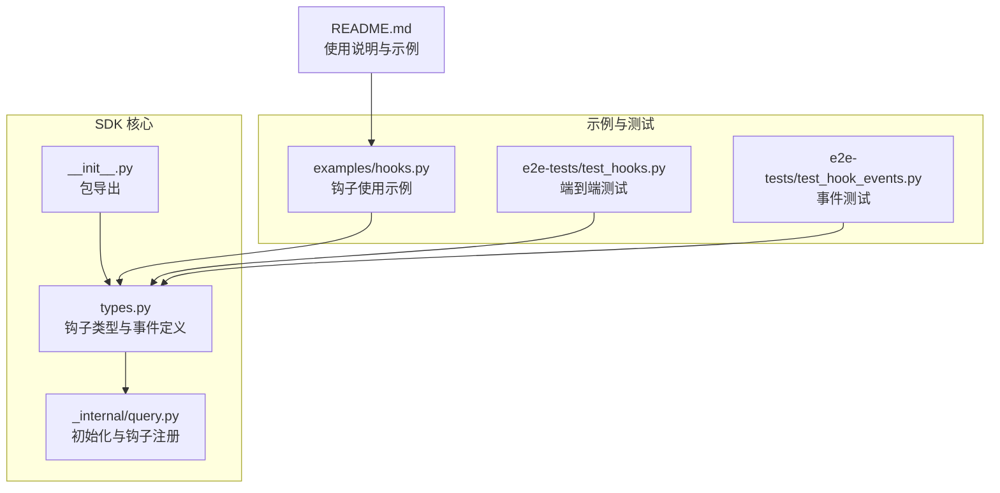
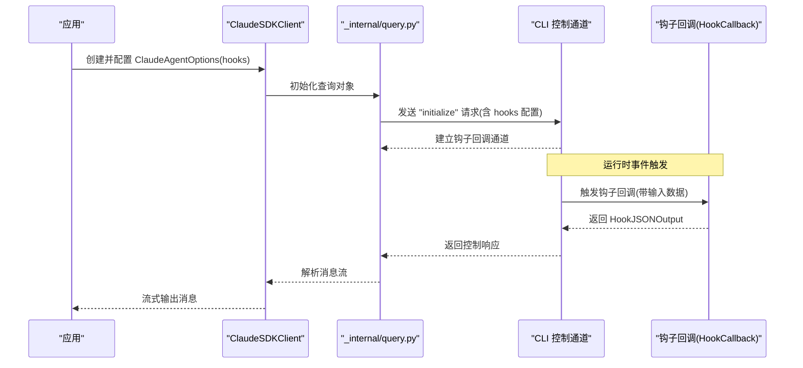
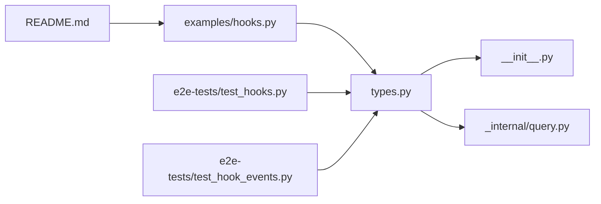

# 钩子类型与事件

<cite>
**本文引用的文件列表**
- [types.py](file://src/claude_agent_sdk/types.py)
- [hooks.py](file://examples/hooks.py)
- [test_hooks.py](file://e2e-tests/test_hooks.py)
- [test_hook_events.py](file://e2e-tests/test_hook_events.py)
- [README.md](file://README.md)
- [__init__.py](file://src/claude_agent_sdk/__init__.py)
- [_internal/query.py](file://src/claude_agent_sdk/_internal/query.py)
</cite>

## 目录
1. [简介](#简介)
2. [项目结构](#项目结构)
3. [核心组件](#核心组件)
4. [架构总览](#架构总览)
5. [详细组件分析](#详细组件分析)
6. [依赖关系分析](#依赖关系分析)
7. [性能考量](#性能考量)
8. [故障排查指南](#故障排查指南)
9. [结论](#结论)
10. [附录](#附录)

## 简介
本文件系统性梳理 Claude SDK 中“钩子（Hook）”类型与事件，覆盖所有可用的钩子事件类型及其触发时机、输入输出结构、执行上下文、执行顺序与相互影响，并提供可直接参考的代码示例路径与最佳实践建议。读者无需深入底层即可理解如何在不同场景中使用钩子进行行为拦截与控制。

## 项目结构
与钩子相关的核心代码集中在以下位置：
- 类型定义与钩子事件：src/claude_agent_sdk/types.py
- 示例用法：examples/hooks.py
- 端到端测试：e2e-tests/test_hooks.py、e2e-tests/test_hook_events.py
- 初始化与钩子注册流程：src/claude_agent_sdk/_internal/query.py
- 包导出与文档入口：src/claude_agent_sdk/__init__.py、README.md



图表来源
- [types.py:160-383](file://src/claude_agent_sdk/types.py#L160-L383)
- [_internal/query.py:128-155](file://src/claude_agent_sdk/_internal/query.py#L128-L155)
- [__init__.py:22-93](file://src/claude_agent_sdk/__init__.py#L22-L93)
- [hooks.py:1-351](file://examples/hooks.py#L1-L351)
- [test_hooks.py:1-157](file://e2e-tests/test_hooks.py#L1-L157)
- [test_hook_events.py:1-197](file://e2e-tests/test_hook_events.py#L1-L197)

章节来源
- [types.py:160-383](file://src/claude_agent_sdk/types.py#L160-L383)
- [hooks.py:1-351](file://examples/hooks.py#L1-L351)
- [test_hooks.py:1-157](file://e2e-tests/test_hooks.py#L1-L157)
- [test_hook_events.py:1-197](file://e2e-tests/test_hook_events.py#L1-L197)
- [README.md:187-238](file://README.md#L187-L238)
- [__init__.py:22-93](file://src/claude_agent_sdk/__init__.py#L22-L93)
- [_internal/query.py:128-155](file://src/claude_agent_sdk/_internal/query.py#L128-L155)

## 核心组件
- 钩子事件枚举：定义了全部可用的钩子事件名称集合，用于在初始化阶段声明需要监听的事件。
- 钩子输入类型：为每个事件提供强类型输入结构，包含会话标识、工作目录、工具名、工具输入、工具使用标识等。
- 钩子输出类型：统一的同步输出结构，支持控制字段（如继续执行、抑制输出、停止原因）、决策字段（如阻断）、以及事件特定的输出字段。
- 钩子匹配器：通过 HookMatcher 将事件与回调函数关联，并可设置超时时间。
- 钩子回调签名：HookCallback 接受强类型输入、可选的工具使用标识、上下文对象，返回异步输出。

章节来源
- [types.py:160-472](file://src/claude_agent_sdk/types.py#L160-L472)
- [__init__.py:393-413](file://src/claude_agent_sdk/__init__.py#L393-L413)

## 架构总览
钩子在 SDK 中的生命周期如下：
- 初始化阶段：客户端将钩子配置序列化为控制协议请求发送给 CLI。
- 运行阶段：当满足事件条件时，CLI 触发钩子回调，SDK 调用注册的 Python 回调函数。
- 输出阶段：回调返回统一的 HookJSONOutput 结构，SDK 将其转换为 CLI 可识别的响应。



图表来源
- [_internal/query.py:128-155](file://src/claude_agent_sdk/_internal/query.py#L128-L155)
- [types.py:465-472](file://src/claude_agent_sdk/types.py#L465-L472)

章节来源
- [_internal/query.py:128-155](file://src/claude_agent_sdk/_internal/query.py#L128-L155)
- [types.py:465-472](file://src/claude_agent_sdk/types.py#L465-L472)

## 详细组件分析

### 钩子事件总览与触发时机
- PreToolUse（工具使用前）
  - 触发时机：在工具调用前，允许基于工具名与输入进行决策或修改输入。
  - 典型用途：安全策略、输入校验、权限决策、注入上下文。
  - 输入字段要点：工具名、工具输入、工具使用标识、会话信息、子代理上下文（可选）。
  - 输出要点：可设置 permissionDecision、permissionDecisionReason、updatedInput、additionalContext。
  - 参考示例路径：[hooks.py:46-71](file://examples/hooks.py#L46-L71)、[test_hook_events.py:19-62](file://e2e-tests/test_hook_events.py#L19-L62)

- PostToolUse（工具使用后）
  - 触发时机：工具调用完成后，允许对结果进行审查、补充上下文或调整输出。
  - 典型用途：错误检测与反馈、结果增强、审计日志。
  - 输入字段要点：工具名、工具输入、工具响应、工具使用标识、会话信息。
  - 输出要点：additionalContext、updatedMCPToolOutput。
  - 参考示例路径：[hooks.py:85-103](file://examples/hooks.py#L85-L103)、[test_hooks.py:117-157](file://e2e-tests/test_hooks.py#L117-L157)

- PostToolUseFailure（工具使用失败后）
  - 触发时机：工具调用失败时，允许记录错误、附加上下文或中断后续流程。
  - 输入字段要点：工具名、工具输入、工具使用标识、错误信息、是否中断（可选）。
  - 输出要点：additionalContext。
  - 参考示例路径：[types.py:229-238](file://src/claude_agent_sdk/types.py#L229-L238)

- UserPromptSubmit（用户提交提示时）
  - 触发时机：用户提交提示时，允许注入上下文或修改提示。
  - 输入字段要点：提示文本、会话信息。
  - 输出要点：additionalContext。
  - 参考示例路径：[hooks.py:73-83](file://examples/hooks.py#L73-L83)、[test_hook_events.py:114-157](file://e2e-tests/test_hook_events.py#L114-L157)

- Stop（会话停止）
  - 触发时机：会话被停止时，允许记录状态或清理资源。
  - 输入字段要点：会话信息、停止钩子是否激活。
  - 参考示例路径：[types.py:247-252](file://src/claude_agent_sdk/types.py#L247-L252)

- SubagentStop（子代理停止）
  - 触发时机：子代理任务结束时，允许记录子代理状态与转录路径。
  - 输入字段要点：会话信息、停止钩子是否激活、子代理标识、转录路径、子代理类型。
  - 参考示例路径：[types.py:254-262](file://src/claude_agent_sdk/types.py#L254-L262)

- PreCompact（压缩前）
  - 触发时机：会话压缩前，允许注入自定义指令或记录触发来源。
  - 输入字段要点：触发来源（手动/自动）、自定义指令（可选）。
  - 参考示例路径：[types.py:264-270](file://src/claude_agent_sdk/types.py#L264-L270)

- Notification（通知）
  - 触发时机：CLI 发出通知时，允许记录或处理通知内容。
  - 输入字段要点：消息、标题（可选）、通知类型。
  - 输出要点：additionalContext。
  - 参考示例路径：[hooks.py:117-136](file://examples/hooks.py#L117-L136)、[test_hook_events.py:114-157](file://e2e-tests/test_hook_events.py#L114-L157)

- SubagentStart（子代理启动）
  - 触发时机：子代理任务开始时，允许注入上下文或记录启动信息。
  - 输入字段要点：子代理标识、子代理类型、会话信息。
  - 输出要点：additionalContext。
  - 参考示例路径：[__init__.py:600-601](file://src/claude_agent_sdk/__init__.py#L600-L601)、[test_tool_callbacks.py:598-611](file://tests/test_tool_callbacks.py#L598-L611)

- PermissionRequest（权限请求）
  - 触发时机：需要权限决策时，允许给出决策结果与理由。
  - 输入字段要点：工具名、工具输入、权限建议（可选）。
  - 输出要点：decision（字典形式）。
  - 参考示例路径：[test_tool_callbacks.py:591-597](file://tests/test_tool_callbacks.py#L591-L597)

章节来源
- [types.py:160-310](file://src/claude_agent_sdk/types.py#L160-L310)
- [hooks.py:46-136](file://examples/hooks.py#L46-L136)
- [test_hook_events.py:19-157](file://e2e-tests/test_hook_events.py#L19-L157)
- [test_hooks.py:17-157](file://e2e-tests/test_hooks.py#L17-L157)
- [test_tool_callbacks.py:591-611](file://tests/test_tool_callbacks.py#L591-L611)
- [__init__.py:600-601](file://src/claude_agent_sdk/__init__.py#L600-L601)

### 钩子输入与输出结构
- 统一输入结构（BaseHookInput）
  - 字段：会话标识、转录路径、工作目录、权限模式（可选）。
  - 子代理上下文混入：agent_id、agent_type（仅在子代理场景出现）。
  - 参考路径：[types.py:176-208](file://src/claude_agent_sdk/types.py#L176-L208)

- 同步输出结构（SyncHookJSONOutput）
  - 控制字段：continue_（默认继续）、suppressOutput（抑制输出）、stopReason（停止原因）。
  - 决策字段：decision（当前仅在部分事件有意义）、systemMessage（系统消息）、reason（原因说明）。
  - 事件特定输出：hookSpecificOutput（包含各事件的专用字段）。
  - 参考路径：[types.py:408-452](file://src/claude_agent_sdk/types.py#L408-L452)

- 异步输出结构（AsyncHookJSONOutput）
  - 字段：async_（标记异步）、asyncTimeout（异步超时毫秒数）。
  - 参考路径：[types.py:393-406](file://src/claude_agent_sdk/types.py#L393-L406)

- 钩子匹配器（HookMatcher）
  - 字段：matcher（匹配规则字符串，如工具名或组合）、hooks（回调函数列表）、timeout（超时秒数）。
  - 参考路径：[types.py:476-491](file://src/claude_agent_sdk/types.py#L476-L491)

章节来源
- [types.py:176-491](file://src/claude_agent_sdk/types.py#L176-L491)

### 执行顺序与相互影响
- 事件触发顺序
  - 用户提交提示：UserPromptSubmit
  - 工具使用前：PreToolUse
  - 工具使用后：PostToolUse 或 PostToolUseFailure
  - 会话停止：Stop（可选）
  - 子代理相关：SubagentStart、SubagentStop（可选）
  - 权限请求：PermissionRequest（可选）
  - 通知：Notification（可选）
- 影响关系
  - PreToolUse 可以决定是否允许工具执行（permissionDecision），从而影响 PostToolUse 是否触发。
  - PostToolUse 可以通过 continue_ 控制后续流程是否继续。
  - Notification 与 PreCompact 通常作为辅助事件存在，不直接影响主流程。
- 并发与交错
  - 多个子代理并行运行时，同一事件可能交错触发，需通过 agent_id/agent_type 进行区分。
  - 参考路径：[types.py:191-208](file://src/claude_agent_sdk/types.py#L191-L208)

章节来源
- [types.py:191-208](file://src/claude_agent_sdk/types.py#L191-L208)
- [test_hook_events.py:161-197](file://e2e-tests/test_hook_events.py#L161-L197)

### 实际使用示例（代码示例路径）
- PreToolUse：阻止特定命令、注入额外上下文
  - 示例路径：[hooks.py:46-71](file://examples/hooks.py#L46-L71)
  - 端到端验证：[test_hooks.py:17-70](file://e2e-tests/test_hooks.py#L17-L70)
- PostToolUse：审查工具输出、提供原因与系统消息
  - 示例路径：[hooks.py:85-103](file://examples/hooks.py#L85-L103)
  - 端到端验证：[test_hooks.py:74-113](file://e2e-tests/test_hooks.py#L74-L113)
- UserPromptSubmit：添加自定义上下文
  - 示例路径：[hooks.py:73-83](file://examples/hooks.py#L73-L83)
  - 端到端验证：[test_hook_events.py:114-157](file://e2e-tests/test_hook_events.py#L114-L157)
- Stop/SubagentStop：记录停止状态
  - 示例路径：[types.py:247-262](file://src/claude_agent_sdk/types.py#L247-L262)
- Notification：接收通知并记录
  - 示例路径：[hooks.py:117-136](file://examples/hooks.py#L117-L136)
  - 端到端验证：[test_hook_events.py:114-157](file://e2e-tests/test_hook_events.py#L114-L157)
- PermissionRequest：给出决策
  - 示例路径：[test_tool_callbacks.py:591-597](file://tests/test_tool_callbacks.py#L591-L597)

章节来源
- [hooks.py:46-136](file://examples/hooks.py#L46-L136)
- [test_hooks.py:17-157](file://e2e-tests/test_hooks.py#L17-L157)
- [test_hook_events.py:19-157](file://e2e-tests/test_hook_events.py#L19-L157)
- [test_tool_callbacks.py:591-597](file://tests/test_tool_callbacks.py#L591-L597)

### 钩子类图（代码级）
```mermaid
classDiagram
class HookEvent {
<<union>>
"PreToolUse"
"PostToolUse"
"PostToolUseFailure"
"UserPromptSubmit"
"Stop"
"SubagentStop"
"PreCompact"
"Notification"
"SubagentStart"
"PermissionRequest"
}
class BaseHookInput {
+string session_id
+string transcript_path
+string cwd
+string permission_mode
}
class PreToolUseHookInput {
+string hook_event_name
+string tool_name
+dict tool_input
+string tool_use_id
}
class PostToolUseHookInput {
+string hook_event_name
+string tool_name
+dict tool_input
+any tool_response
+string tool_use_id
}
class PostToolUseFailureHookInput {
+string hook_event_name
+string tool_name
+dict tool_input
+string tool_use_id
+string error
+bool is_interrupt
}
class UserPromptSubmitHookInput {
+string hook_event_name
+string prompt
}
class StopHookInput {
+string hook_event_name
+bool stop_hook_active
}
class SubagentStopHookInput {
+string hook_event_name
+bool stop_hook_active
+string agent_id
+string agent_transcript_path
+string agent_type
}
class PreCompactHookInput {
+string hook_event_name
+string trigger
+string custom_instructions
}
class NotificationHookInput {
+string hook_event_name
+string message
+string title
+string notification_type
}
class SubagentStartHookInput {
+string hook_event_name
+string agent_id
+string agent_type
}
class PermissionRequestHookInput {
+string hook_event_name
+string tool_name
+dict tool_input
+list permission_suggestions
}
class SyncHookJSONOutput {
+bool continue_
+bool suppressOutput
+string stopReason
+string decision
+string systemMessage
+string reason
+dict hookSpecificOutput
}
class AsyncHookJSONOutput {
+bool async_
+int asyncTimeout
}
class HookMatcher {
+string matcher
+list hooks
+float timeout
}
class HookCallback {
<<callable>>
}
BaseHookInput <|-- PreToolUseHookInput
BaseHookInput <|-- PostToolUseHookInput
BaseHookInput <|-- PostToolUseFailureHookInput
BaseHookInput <|-- UserPromptSubmitHookInput
BaseHookInput <|-- StopHookInput
BaseHookInput <|-- SubagentStopHookInput
BaseHookInput <|-- PreCompactHookInput
BaseHookInput <|-- NotificationHookInput
BaseHookInput <|-- SubagentStartHookInput
BaseHookInput <|-- PermissionRequestHookInput
HookEvent --> HookMatcher : "键"
HookMatcher --> HookCallback : "绑定"
HookCallback --> SyncHookJSONOutput : "返回"
HookCallback --> AsyncHookJSONOutput : "返回"
```

图表来源
- [types.py:160-491](file://src/claude_agent_sdk/types.py#L160-L491)

章节来源
- [types.py:160-491](file://src/claude_agent_sdk/types.py#L160-L491)

## 依赖关系分析
- 钩子类型与事件定义集中于 types.py，是所有钩子功能的基础。
- 初始化与注册流程由 _internal/query.py 完成，负责将用户配置转换为 CLI 控制协议。
- 包导出通过 __init__.py 暴露给外部使用。
- 示例与测试文件验证了钩子在真实场景中的行为。



图表来源
- [types.py:160-491](file://src/claude_agent_sdk/types.py#L160-L491)
- [__init__.py:22-93](file://src/claude_agent_sdk/__init__.py#L22-L93)
- [_internal/query.py:128-155](file://src/claude_agent_sdk/_internal/query.py#L128-L155)
- [hooks.py:1-351](file://examples/hooks.py#L1-L351)
- [test_hooks.py:1-157](file://e2e-tests/test_hooks.py#L1-L157)
- [test_hook_events.py:1-197](file://e2e-tests/test_hook_events.py#L1-L197)
- [README.md:187-238](file://README.md#L187-L238)

章节来源
- [types.py:160-491](file://src/claude_agent_sdk/types.py#L160-L491)
- [__init__.py:22-93](file://src/claude_agent_sdk/__init__.py#L22-L93)
- [_internal/query.py:128-155](file://src/claude_agent_sdk/_internal/query.py#L128-L155)
- [hooks.py:1-351](file://examples/hooks.py#L1-L351)
- [test_hooks.py:1-157](file://e2e-tests/test_hooks.py#L1-L157)
- [test_hook_events.py:1-197](file://e2e-tests/test_hook_events.py#L1-L197)
- [README.md:187-238](file://README.md#L187-L238)

## 性能考量
- 钩子回调应保持轻量，避免长时间阻塞；必要时使用异步输出（async_）延迟执行。
- 合理设置 HookMatcher.timeout，防止单个钩子阻塞整体流程。
- 在多子代理场景下，注意 agent_id/agent_type 的区分，避免误判。
- 对频繁触发的通知与工具使用事件，建议在钩子中做必要的去重与缓存。

## 故障排查指南
- 钩子未触发
  - 检查事件名称是否正确、HookMatcher.matcher 是否匹配目标工具。
  - 参考：[types.py:160-172](file://src/claude_agent_sdk/types.py#L160-L172)、[_internal/query.py:128-155](file://src/claude_agent_sdk/_internal/query.py#L128-L155)
- 权限决策无效
  - 确认 PreToolUse 输出中 permissionDecision 与 permissionDecisionReason 字段正确设置。
  - 参考：[hooks.py:46-71](file://examples/hooks.py#L46-L71)、[test_hooks.py:17-70](file://e2e-tests/test_hooks.py#L17-L70)
- 执行被意外中断
  - 检查 PostToolUse 中 continue_ 与 stopReason 的设置。
  - 参考：[hooks.py:138-154](file://examples/hooks.py#L138-L154)、[test_hooks.py:74-113](file://e2e-tests/test_hooks.py#L74-L113)
- 通知未出现
  - Notification 钩子可能根据 CLI 行为而触发与否，确保注册无误。
  - 参考：[test_hook_events.py:114-157](file://e2e-tests/test_hook_events.py#L114-L157)

章节来源
- [types.py:160-172](file://src/claude_agent_sdk/types.py#L160-L172)
- [_internal/query.py:128-155](file://src/claude_agent_sdk/_internal/query.py#L128-L155)
- [hooks.py:46-154](file://examples/hooks.py#L46-L154)
- [test_hooks.py:17-113](file://e2e-tests/test_hooks.py#L17-L113)
- [test_hook_events.py:114-157](file://e2e-tests/test_hook_events.py#L114-L157)

## 结论
通过统一的钩子事件模型与强类型输入输出，Claude SDK 为开发者提供了可控、可观测且可扩展的行为拦截能力。合理选择与组合钩子事件，配合 HookMatcher 的匹配与超时机制，可以在保证安全性的同时提升自动化程度与用户体验。

## 附录
- 使用入口与示例
  - 文档入口与示例：[README.md:187-238](file://README.md#L187-L238)
  - 钩子示例脚本：[hooks.py:1-351](file://examples/hooks.py#L1-L351)