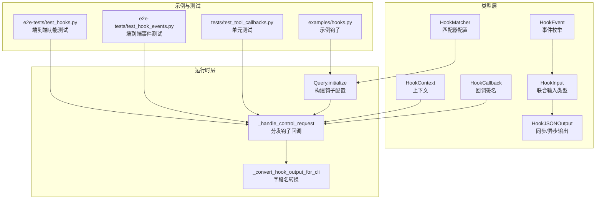
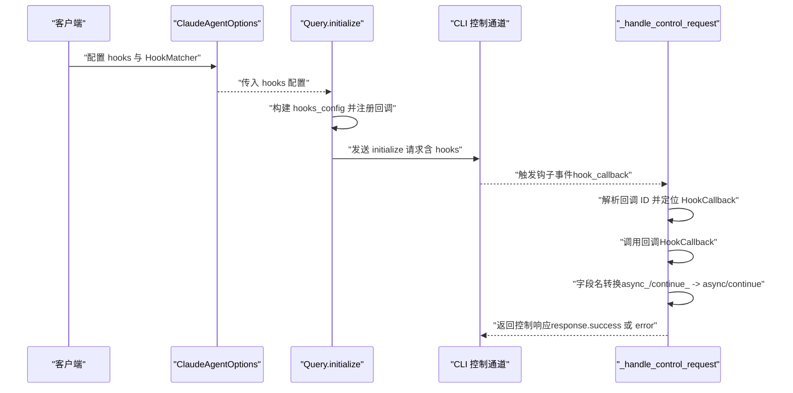
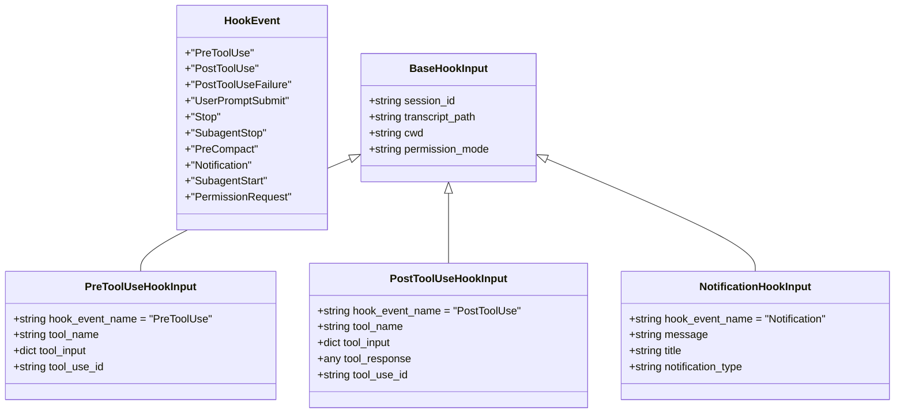
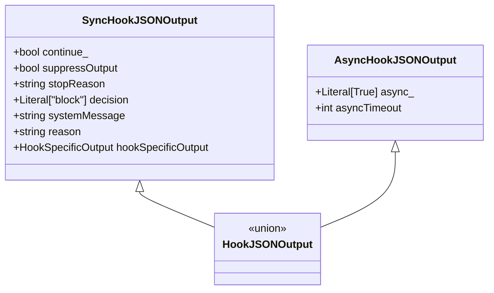
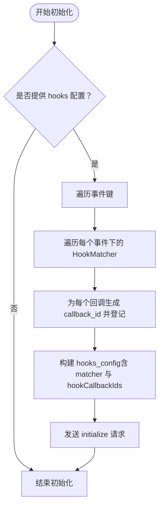
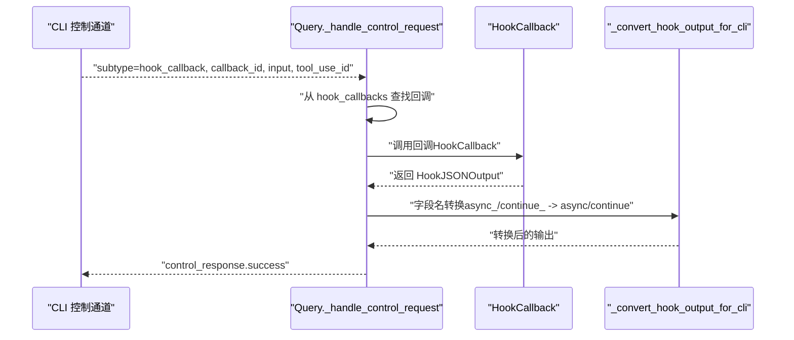
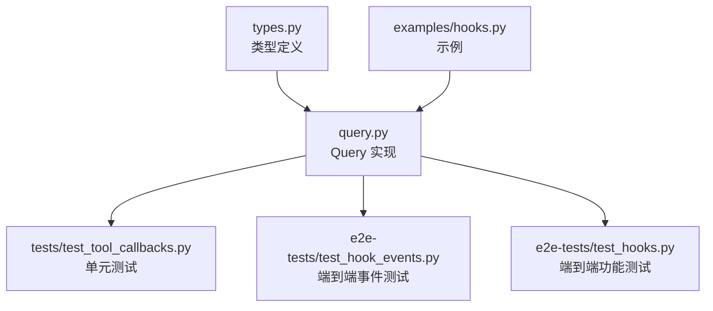

# 钩子系统

<cite>
**本文引用的文件**
- [src/claude_agent_sdk/types.py](file://src/claude_agent_sdk/types.py)
- [src/claude_agent_sdk/_internal/query.py](file://src/claude_agent_sdk/_internal/query.py)
- [examples/hooks.py](file://examples/hooks.py)
- [tests/test_tool_callbacks.py](file://tests/test_tool_callbacks.py)
- [e2e-tests/test_hook_events.py](file://e2e-tests/test_hook_events.py)
- [e2e-tests/test_hooks.py](file://e2e-tests/test_hooks.py)
</cite>

## 目录
1. [简介](#简介)
2. [项目结构](#项目结构)
3. [核心组件](#核心组件)
4. [架构总览](#架构总览)
5. [详细组件分析](#详细组件分析)
6. [依赖分析](#依赖分析)
7. [性能考虑](#性能考虑)
8. [故障排查指南](#故障排查指南)
9. [结论](#结论)
10. [附录](#附录)

## 简介
本文件面向开发者，系统化阐述 Claude Agent SDK 的钩子系统（Hooks），包括事件驱动机制、钩子事件类型、匹配器 HookMatcher 的使用与配置、回调函数 HookCallback 的实现模式、上下文 HookContext 的作用、钩子链的执行顺序与事件传播、输出类型 HookJSONOutput 及其具体变体、典型应用场景（日志记录、监控告警、权限审计、调试支持）、自定义钩子处理器与复杂组合实践，以及性能优化与错误处理策略。目标是帮助你在不深入底层实现的前提下，快速掌握钩子系统的完整用法与最佳实践。

## 项目结构
钩子系统主要由以下模块构成：
- 类型定义：在类型文件中定义了所有钩子事件、输入输出类型、匹配器与回调签名等。
- 控制协议与钩子调度：在内部查询类中负责初始化钩子配置、接收来自 CLI 的控制请求、分发到已注册的钩子回调，并进行字段名转换与响应封装。
- 示例与测试：示例展示了常见钩子用法；单元测试与端到端测试验证了事件类型、输出结构、字段转换、异步钩子与错误处理等行为。

图表来源
- [src/claude_agent_sdk/types.py](file://src/claude_agent_sdk/types.py)
- [src/claude_agent_sdk/_internal/query.py](file://src/claude_agent_sdk/_internal/query.py)
- [examples/hooks.py](file://examples/hooks.py)
- [tests/test_tool_callbacks.py](file://tests/test_tool_callbacks.py)
- [e2e-tests/test_hook_events.py](file://e2e-tests/test_hook_events.py)
- [e2e-tests/test_hooks.py](file://e2e-tests/test_hooks.py)

章节来源
- [src/claude_agent_sdk/types.py](file://src/claude_agent_sdk/types.py)
- [src/claude_agent_sdk/_internal/query.py](file://src/claude_agent_sdk/_internal/query.py)

## 核心组件
- 钩子事件类型（HookEvent）：涵盖工具生命周期（PreToolUse、PostToolUse、PostToolUseFailure、UserPromptSubmit、Stop、SubagentStop、PreCompact）、通知（Notification）、子代理（SubagentStart）、权限请求（PermissionRequest）等。
- 钩子输入类型（HookInput）：基于事件类型构建的强类型输入联合体，包含会话、工作目录、当前工具名称与输入、工具使用标识等通用字段，以及各事件特有的字段。
- 钩子输出类型（HookJSONOutput）：统一的输出接口，分为同步输出（SyncHookJSONOutput）与异步输出（AsyncHookJSONOutput），用于控制继续执行、屏蔽输出、设置停止原因、决策阻断、以及事件特定的输出。
- 匹配器（HookMatcher）：用于声明性地过滤事件，支持字符串或字典形式的匹配规则、超时时间等。
- 回调签名（HookCallback）：定义钩子回调函数的参数与返回值类型，入参为强类型输入、可选工具使用标识、上下文；返回值为钩子输出。
- 上下文（HookContext）：当前版本保留字段，未来可用于中断信号等能力。
- 初始化与分发（Query）：在初始化阶段将用户配置转换为 CLI 可识别的钩子配置，运行时接收控制请求并分发给对应钩子回调，同时进行字段名转换与错误处理。

章节来源
- [src/claude_agent_sdk/types.py](file://src/claude_agent_sdk/types.py)
- [src/claude_agent_sdk/_internal/query.py](file://src/claude_agent_sdk/_internal/query.py)

## 架构总览
钩子系统采用“事件驱动 + 声明式匹配”的架构。客户端通过 ClaudeAgentOptions 提供钩子配置，Query 在初始化时将这些配置转换为 CLI 所需格式并注册回调；当 CLI 触发钩子事件时，Query 接收控制请求，根据回调 ID 定位到已注册的 HookCallback，执行后将结果按 CLI 字段命名规范返回。

图表来源
- [src/claude_agent_sdk/_internal/query.py](file://src/claude_agent_sdk/_internal/query.py)

章节来源
- [src/claude_agent_sdk/_internal/query.py](file://src/claude_agent_sdk/_internal/query.py)

## 详细组件分析

### 钩子事件类型与输入模型
- 事件枚举（HookEvent）：包含 PreToolUse、PostToolUse、PostToolUseFailure、UserPromptSubmit、Stop、SubagentStop、PreCompact、Notification、SubagentStart、PermissionRequest 等。
- 输入联合体（HookInput）：根据事件类型选择对应的输入结构，例如 PreToolUseHookInput、PostToolUseHookInput、NotificationHookInput 等，均继承基础字段（会话、转录路径、工作目录、权限模式等）。
- 子代理上下文混合（_SubagentContextMixin）：在工具生命周期类输入中可选地携带 agent_id 与 agent_type，用于区分并行子代理场景。

图表来源
- [src/claude_agent_sdk/types.py](file://src/claude_agent_sdk/types.py)

章节来源
- [src/claude_agent_sdk/types.py](file://src/claude_agent_sdk/types.py)

### 钩子输出类型与字段语义
- 同步输出（SyncHookJSONOutput）：用于立即响应，支持控制字段（continue_、suppressOutput、stopReason）、决策字段（decision、systemMessage、reason）与事件特定输出（hookSpecificOutput）。
- 异步输出（AsyncHookJSONOutput）：用于延迟执行，仅包含 async_ 与 asyncTimeout 字段。
- 字段名转换：Python 使用 async_ 与 continue_ 避免关键字冲突，SDK 会在发送给 CLI 前自动转换为 async 与 continue。

图表来源
- [src/claude_agent_sdk/types.py](file://src/claude_agent_sdk/types.py)

章节来源
- [src/claude_agent_sdk/types.py](file://src/claude_agent_sdk/types.py)

### HookMatcher 与事件过滤
- 结构：包含 matcher（字符串或字典）、hooks（回调列表）、timeout（秒）。
- 匹配规则：matcher 支持字符串形式（如工具名或工具组合），也支持字典形式（测试用例显示了字典匹配结构）。
- 初始化映射：Query.initialize 将用户提供的 hooks 配置转换为 CLI 所需的 hooks_config，为每个回调生成唯一 callback_id 并登记到 hook_callbacks 映射表。

图表来源
- [src/claude_agent_sdk/_internal/query.py](file://src/claude_agent_sdk/_internal/query.py)

章节来源
- [src/claude_agent_sdk/_internal/query.py](file://src/claude_agent_sdk/_internal/query.py)

### 钩子回调与上下文
- 回调签名（HookCallback）：接收强类型 HookInput、可选工具使用标识、HookContext，返回 HookJSONOutput。
- 上下文（HookContext）：当前保留字段，未来可用于中断信号等。
- 运行时分发：Query._handle_control_request 根据回调 ID 获取已注册的回调，执行后进行字段名转换并返回响应；异常会被捕获并以错误响应返回。

图表来源
- [src/claude_agent_sdk/_internal/query.py](file://src/claude_agent_sdk/_internal/query.py)

章节来源
- [src/claude_agent_sdk/_internal/query.py](file://src/claude_agent_sdk/_internal/query.py)

### 钩子链执行顺序与事件传播
- 事件触发：CLI 在相应生命周期点触发钩子事件（如 PreToolUse、PostToolUse、Notification 等）。
- 匹配与分发：Query 按事件类型与 HookMatcher 的匹配规则，将事件分发给匹配的回调集合。
- 顺序保证：同一事件下的多个 HookMatcher 与回调的执行顺序遵循注册顺序；单个 HookMatcher 内部的多个回调也按注册顺序依次执行。
- 传播机制：每个钩子可选择继续执行（continue_=True）、阻止后续（continue_=False）、或异步延迟（async_=True），并可通过 systemMessage、reason 等字段向用户与系统反馈。

章节来源
- [src/claude_agent_sdk/_internal/query.py](file://src/claude_agent_sdk/_internal/query.py)
- [tests/test_tool_callbacks.py](file://tests/test_tool_callbacks.py)
- [e2e-tests/test_hook_events.py](file://e2e-tests/test_hook_events.py)
- [e2e-tests/test_hooks.py](file://e2e-tests/test_hooks.py)

### 钩子输出类型详解
- PreToolUse：支持 permissionDecision（allow/deny/ask）、permissionDecisionReason、updatedInput、additionalContext 等。
- PostToolUse：支持 additionalContext、updatedMCPToolOutput 等。
- PostToolUseFailure：支持 additionalContext。
- UserPromptSubmit：支持 additionalContext。
- SessionStart：支持 additionalContext。
- Notification：支持 additionalContext。
- SubagentStart：支持 additionalContext。
- PermissionRequest：支持 decision（结构化决策）。
- 公共控制字段：continue_、suppressOutput、stopReason。
- 决策字段：decision（目前仅在非 PreToolUse 事件中建议使用 block），systemMessage、reason。

章节来源
- [src/claude_agent_sdk/types.py](file://src/claude_agent_sdk/types.py)

### 实际应用场景与示例
- 日志记录：在 Notification、PreToolUse、PostToolUse 等事件中记录工具调用与输出，便于审计与回溯。
- 监控告警：在 PostToolUse 中检查工具输出，若发现异常则通过 systemMessage 与 reason 提示用户，并可结合 continue_=False 阻止继续执行。
- 权限审计：在 PreToolUse 中基于 permissionDecision 与 permissionDecisionReason 控制工具执行，结合 updatedInput 动态调整输入参数。
- 调试支持：在 PostToolUseFailure 中收集错误信息与 is_interrupt 标记，辅助问题定位。

示例参考
- [examples/hooks.py](file://examples/hooks.py)
- [e2e-tests/test_hooks.py](file://e2e-tests/test_hooks.py)
- [e2e-tests/test_hook_events.py](file://e2e-tests/test_hook_events.py)

章节来源
- [examples/hooks.py](file://examples/hooks.py)
- [e2e-tests/test_hooks.py](file://e2e-tests/test_hooks.py)
- [e2e-tests/test_hook_events.py](file://e2e-tests/test_hook_events.py)

### 自定义钩子处理器与复杂组合
- 单事件多处理器：同一事件可注册多个 HookMatcher，每个 HookMatcher 可包含多个回调，形成“事件 -> 多匹配器 -> 多回调”的链式结构。
- 多事件组合：可在不同事件上注册处理器，实现跨生命周期的联动控制（如 PreToolUse 审计 + PostToolUse 监控 + Notification 通知）。
- 条件匹配：通过 HookMatcher 的 matcher 字段实现工具名、命令模式等条件过滤，减少不必要的回调开销。
- 异步钩子：对于耗时操作，使用 AsyncHookJSONOutput 的 async_ 与 asyncTimeout 字段延迟执行，避免阻塞主流程。

章节来源
- [src/claude_agent_sdk/_internal/query.py](file://src/claude_agent_sdk/_internal/query.py)
- [src/claude_agent_sdk/types.py](file://src/claude_agent_sdk/types.py)
- [tests/test_tool_callbacks.py](file://tests/test_tool_callbacks.py)

## 依赖分析
- 类型依赖：所有钩子事件、输入输出、匹配器与回调签名均在类型文件中集中定义，确保强类型约束与一致性。
- 运行时依赖：Query 依赖类型定义完成初始化与回调分发；字段名转换逻辑独立于业务回调，降低耦合。
- 测试覆盖：单元测试覆盖字段转换、异步输出、权限请求、子代理启动、PostToolUse 更新 MCP 输出等关键路径；端到端测试覆盖真实 API 场景下的事件触发与工具使用标识传递。

图表来源
- [src/claude_agent_sdk/types.py](file://src/claude_agent_sdk/types.py)
- [src/claude_agent_sdk/_internal/query.py](file://src/claude_agent_sdk/_internal/query.py)
- [tests/test_tool_callbacks.py](file://tests/test_tool_callbacks.py)
- [e2e-tests/test_hook_events.py](file://e2e-tests/test_hook_events.py)
- [e2e-tests/test_hooks.py](file://e2e-tests/test_hooks.py)
- [examples/hooks.py](file://examples/hooks.py)

章节来源
- [src/claude_agent_sdk/types.py](file://src/claude_agent_sdk/types.py)
- [src/claude_agent_sdk/_internal/query.py](file://src/claude_agent_sdk/_internal/query.py)
- [tests/test_tool_callbacks.py](file://tests/test_tool_callbacks.py)
- [e2e-tests/test_hook_events.py](file://e2e-tests/test_hook_events.py)
- [e2e-tests/test_hooks.py](file://e2e-tests/test_hooks.py)
- [examples/hooks.py](file://examples/hooks.py)

## 性能考虑
- 匹配器粒度：合理使用 HookMatcher 的 matcher 字段缩小事件范围，避免对无关工具触发回调。
- 异步钩子：对可能阻塞的外部调用（网络、IO）使用异步钩子，设置合理的 asyncTimeout，防止长时间阻塞主流程。
- 回调数量：同一事件下的回调数量应适度，过多回调会增加串行开销；必要时拆分为多个事件或合并逻辑。
- 字段转换成本：字段名转换为常量时间操作，影响可忽略；但频繁的 JSON 序列化/反序列化与大对象传输可能成为瓶颈，建议精简 hookSpecificOutput。
- 超时管理：为 HookMatcher 设置合适的 timeout，避免个别回调卡死整个链路。

## 故障排查指南
- 回调未触发：确认事件名称与 HookMatcher 的 matcher 是否匹配；检查 Query.initialize 是否正确注册了 hooks。
- 字段名不生效：确保使用 Python 版本的字段名（async_、continue_），SDK 会自动转换为 CLI 所需格式；若仍异常，检查响应 JSON 中字段是否被转换。
- 决策无效：PreToolUse 事件建议使用 permissionDecision 而非旧版 approve；其他事件仅在需要时使用 decision="block"。
- 异步钩子未执行：确认返回了 async_=True 且设置了 asyncTimeout；检查 CLI 是否支持异步钩子。
- 错误处理：Query 对回调异常进行捕获并返回错误响应；在测试中可观察到 "subtype":"error" 的响应。

章节来源
- [src/claude_agent_sdk/_internal/query.py](file://src/claude_agent_sdk/_internal/query.py)
- [tests/test_tool_callbacks.py](file://tests/test_tool_callbacks.py)

## 结论
Claude Agent SDK 的钩子系统通过强类型事件模型、声明式匹配器与统一的输出接口，提供了灵活而强大的扩展能力。开发者可以基于此在工具生命周期的关键节点插入审计、监控、权限控制与调试增强等功能，同时借助异步钩子与超时控制保障系统稳定性与性能。建议在实际项目中结合业务需求，合理设计钩子链与匹配规则，充分利用事件特定输出与公共控制字段，实现可观测、可审计、可控制的智能代理系统。

## 附录
- 快速清单
  - 使用 HookMatcher 的 matcher 字段精确过滤事件
  - 在 PreToolUse 中使用 permissionDecision 与 permissionDecisionReason
  - 在 PostToolUse 中使用 additionalContext 与 updatedMCPToolOutput
  - 对耗时操作使用 AsyncHookJSONOutput 并设置 asyncTimeout
  - 使用 continue_=False 与 stopReason 实现安全阻断
  - 通过 systemMessage 与 reason 提供清晰的用户提示