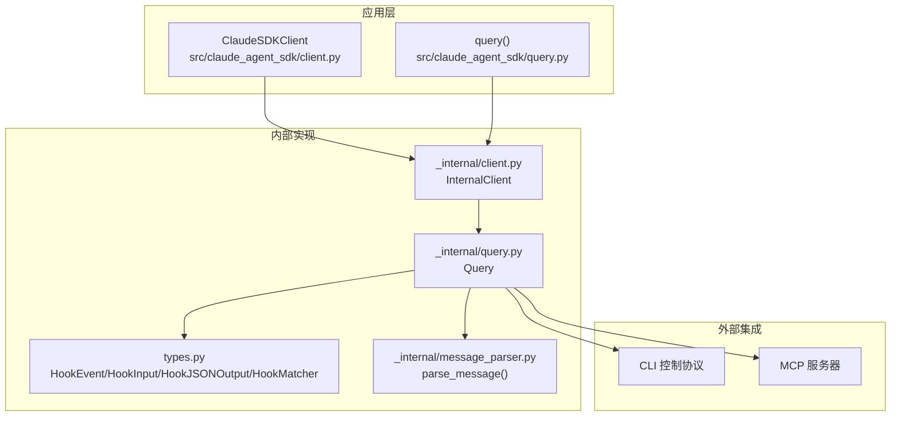
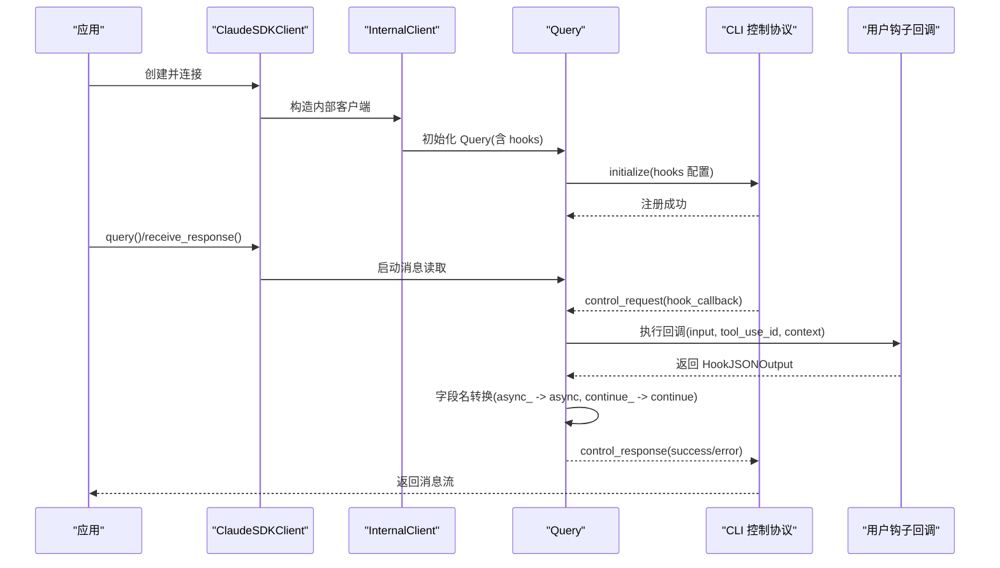
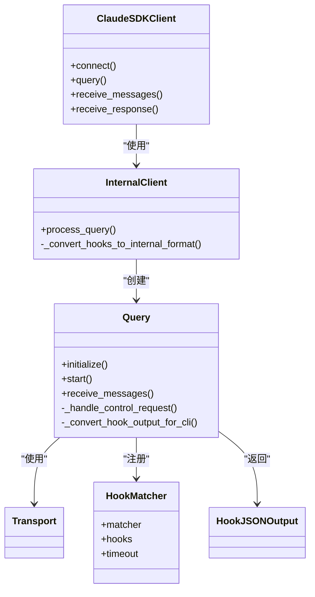

# 钩子系统

<cite>
**本文引用的文件列表**
- [examples/hooks.py](file://examples/hooks.py)
- [src/claude_agent_sdk/client.py](file://src/claude_agent_sdk/client.py)
- [src/claude_agent_sdk/query.py](file://src/claude_agent_sdk/query.py)
- [src/claude_agent_sdk/types.py](file://src/claude_agent_sdk/types.py)
- [src/claude_agent_sdk/_internal/query.py](file://src/claude_agent_sdk/_internal/query.py)
- [src/claude_agent_sdk/_internal/client.py](file://src/claude_agent_sdk/_internal/client.py)
- [src/claude_agent_sdk/_internal/message_parser.py](file://src/claude_agent_sdk/_internal/message_parser.py)
- [tests/test_tool_callbacks.py](file://tests/test_tool_callbacks.py)
- [e2e-tests/test_hooks.py](file://e2e-tests/test_hooks.py)
- [e2e-tests/test_hook_events.py](file://e2e-tests/test_hook_events.py)
- [README.md](file://README.md)
</cite>

## 目录
1. [简介](#简介)
2. [项目结构](#项目结构)
3. [核心组件](#核心组件)
4. [架构总览](#架构总览)
5. [详细组件分析](#详细组件分析)
6. [依赖关系分析](#依赖关系分析)
7. [性能考量](#性能考量)
8. [故障排查指南](#故障排查指南)
9. [结论](#结论)
10. [附录](#附录)

## 简介
本文件系统性阐述 Claude Agent SDK 的钩子（Hooks）机制，涵盖事件驱动编程模式、典型应用场景、三类钩子（预工具使用、后工具使用、权限请求）的实现与触发时机、钩子匹配器的使用方法与条件判断逻辑、完整回调实现示例、执行顺序与错误处理机制，并提供性能优化建议与调试技巧。内容基于仓库中的类型定义、客户端封装、内部查询与控制协议处理、测试与端到端示例进行归纳总结。

## 项目结构
围绕钩子系统的关键模块与文件如下：
- 类型与接口：types.py 定义了 HookEvent、HookInput、HookJSONOutput、HookMatcher 等核心类型
- 客户端入口：client.py 提供 ClaudeSDKClient，支持交互式会话与钩子注册
- 查询与控制协议：_internal/query.py 负责初始化、控制请求分发、钩子回调执行与字段转换
- 内部客户端：_internal/client.py 将外部 options 转换为内部 Query 格式
- 示例与测试：examples/hooks.py 展示多种钩子用法；tests 与 e2e-tests 验证行为与字段转换
- 消息解析：_internal/message_parser.py 将 CLI 输出解析为 SDK 消息对象

图表来源
- [src/claude_agent_sdk/client.py:1-500](file://src/claude_agent_sdk/client.py#L1-L500)
- [src/claude_agent_sdk/query.py:1-127](file://src/claude_agent_sdk/query.py#L1-L127)
- [src/claude_agent_sdk/_internal/client.py:1-146](file://src/claude_agent_sdk/_internal/client.py#L1-L146)
- [src/claude_agent_sdk/_internal/query.py:1-679](file://src/claude_agent_sdk/_internal/query.py#L1-L679)
- [src/claude_agent_sdk/_internal/message_parser.py:1-251](file://src/claude_agent_sdk/_internal/message_parser.py#L1-L251)
- [src/claude_agent_sdk/types.py:1-800](file://src/claude_agent_sdk/types.py#L1-L800)

章节来源
- [src/claude_agent_sdk/client.py:1-500](file://src/claude_agent_sdk/client.py#L1-L500)
- [src/claude_agent_sdk/query.py:1-127](file://src/claude_agent_sdk/query.py#L1-L127)
- [src/claude_agent_sdk/_internal/client.py:1-146](file://src/claude_agent_sdk/_internal/client.py#L1-L146)
- [src/claude_agent_sdk/_internal/query.py:1-679](file://src/claude_agent_sdk/_internal/query.py#L1-L679)
- [src/claude_agent_sdk/_internal/message_parser.py:1-251](file://src/claude_agent_sdk/_internal/message_parser.py#L1-L251)
- [src/claude_agent_sdk/types.py:1-800](file://src/claude_agent_sdk/types.py#L1-L800)

## 核心组件
- 钩子事件类型（HookEvent）：包括 PreToolUse、PostToolUse、PostToolUseFailure、UserPromptSubmit、Stop、SubagentStop、PreCompact、Notification、SubagentStart、PermissionRequest 等
- 钩子输入类型（HookInput）：按事件类型细分，如 PreToolUseHookInput、PostToolUseHookInput、PermissionRequestHookInput 等，携带会话上下文、工作目录、工具名、输入、响应等
- 钩子输出类型（HookJSONOutput）：同步输出（SyncHookJSONOutput）支持 continue_、stopReason、decision、systemMessage、reason、hookSpecificOutput 等；异步输出（AsyncHookJSONOutput）支持 async_、asyncTimeout
- 钩子匹配器（HookMatcher）：配置 matcher（工具名或组合）、hooks 回调列表、timeout
- 客户端与查询：ClaudeSDKClient 在连接时将 options.hooks 转换为内部格式并传入 Query.initialize；Query 负责注册回调、路由控制请求、执行钩子并转换字段名

章节来源
- [src/claude_agent_sdk/types.py:160-453](file://src/claude_agent_sdk/types.py#L160-L453)
- [src/claude_agent_sdk/client.py:76-92](file://src/claude_agent_sdk/client.py#L76-L92)
- [src/claude_agent_sdk/_internal/query.py:119-163](file://src/claude_agent_sdk/_internal/query.py#L119-L163)

## 架构总览
钩子系统通过“事件驱动 + 匹配器 + 回调”的模式在 Claude Agent 生命周期的关键节点注入行为。控制协议负责在合适时机向 SDK 发起钩子回调请求，SDK 将回调结果转换为 CLI 可识别的字段并返回。

图表来源
- [src/claude_agent_sdk/client.py:94-180](file://src/claude_agent_sdk/client.py#L94-L180)
- [src/claude_agent_sdk/_internal/client.py:44-146](file://src/claude_agent_sdk/_internal/client.py#L44-L146)
- [src/claude_agent_sdk/_internal/query.py:119-163](file://src/claude_agent_sdk/_internal/query.py#L119-L163)
- [src/claude_agent_sdk/_internal/query.py:236-346](file://src/claude_agent_sdk/_internal/query.py#L236-L346)

## 详细组件分析

### 钩子事件与生命周期
- PreToolUse：工具调用前，可决定允许/拒绝、附加上下文、更新输入
- PostToolUse：工具调用后，可提供反馈、补充上下文、修改 MCP 工具输出
- PostToolUseFailure：工具调用失败时，可提供额外上下文
- UserPromptSubmit：用户提交提示时，可注入额外上下文
- PermissionRequest：权限请求时，可直接给出决策
- 其他事件：Stop、SubagentStop、PreCompact、Notification、SubagentStart 等

章节来源
- [src/claude_agent_sdk/types.py:160-296](file://src/claude_agent_sdk/types.py#L160-L296)

### 钩子匹配器与条件判断
- matcher 支持工具名或工具名组合（如 "Write|MultiEdit|Edit"）
- hooks 是回调函数列表，每个回调接收强类型 HookInput、可选 tool_use_id、HookContext
- timeout 可为单个匹配器设置超时
- SDK 将 HookMatcher 转换为内部 dict 结构，包含 matcher、hooks、timeout

章节来源
- [src/claude_agent_sdk/types.py:475-491](file://src/claude_agent_sdk/types.py#L475-L491)
- [src/claude_agent_sdk/client.py:76-92](file://src/claude_agent_sdk/client.py#L76-L92)
- [src/claude_agent_sdk/_internal/client.py:26-42](file://src/claude_agent_sdk/_internal/client.py#L26-L42)

### 钩子回调实现要点
- 输入类型严格区分事件类型，确保只访问对应字段
- 输出支持多类控制字段：continue_、stopReason、decision、systemMessage、reason、hookSpecificOutput
- 字段名自动转换：async_ 转为 async，continue_ 转为 continue，便于与 CLI 协议兼容
- 可通过 permissionDecision/permissionDecisionReason 控制工具执行
- 可通过 additionalContext、updatedMCPToolOutput 等扩展行为

章节来源
- [src/claude_agent_sdk/types.py:386-453](file://src/claude_agent_sdk/types.py#L386-L453)
- [src/claude_agent_sdk/_internal/query.py:34-50](file://src/claude_agent_sdk/_internal/query.py#L34-L50)

### 预工具使用钩子（PreToolUse）
- 触发时机：工具调用前
- 常见用途：安全策略（阻断危险命令）、输入增强（附加上下文）、动态输入修改
- 关键字段：permissionDecision、permissionDecisionReason、updatedInput、additionalContext
- 示例参考：examples/hooks.py 中的 check_bash_command、strict_approval_hook

章节来源
- [examples/hooks.py:46-135](file://examples/hooks.py#L46-L135)
- [src/claude_agent_sdk/types.py:314-322](file://src/claude_agent_sdk/types.py#L314-L322)

### 后工具使用钩子（PostToolUse）
- 触发时机：工具调用后
- 常见用途：错误检测与反馈、输出改写、补充上下文
- 关键字段：additionalContext、updatedMCPToolOutput
- 示例参考：examples/hooks.py 中的 review_tool_output、post_tool_use 示例

章节来源
- [examples/hooks.py:85-102](file://examples/hooks.py#L85-L102)
- [src/claude_agent_sdk/types.py:324-330](file://src/claude_agent_sdk/types.py#L324-L330)

### 权限请求钩子（PermissionRequest）
- 触发时机：需要权限决策时
- 常见用途：直接给出 allow/deny 决策，减少交互
- 关键字段：hookSpecificOutput.decision
- 示例参考：e2e 测试中对 PermissionRequest 的验证

章节来源
- [tests/test_tool_callbacks.py:552-596](file://tests/test_tool_callbacks.py#L552-L596)
- [src/claude_agent_sdk/types.py:367-372](file://src/claude_agent_sdk/types.py#L367-L372)

### 用户提示提交钩子（UserPromptSubmit）
- 触发时机：用户提交提示时
- 常见用途：注入系统提示或上下文
- 示例参考：examples/hooks.py 中的 add_custom_instructions

章节来源
- [examples/hooks.py:73-82](file://examples/hooks.py#L73-L82)
- [src/claude_agent_sdk/types.py:339-344](file://src/claude_agent_sdk/types.py#L339-L344)

### 异步与同步钩子输出
- 同步输出：支持 continue_、stopReason、decision、systemMessage、reason、hookSpecificOutput
- 异步输出：async_、asyncTimeout，用于延迟钩子执行
- 字段名转换：Python SDK 使用 async_ 和 continue_，发送给 CLI 时自动转为 async 和 continue

章节来源
- [src/claude_agent_sdk/types.py:386-453](file://src/claude_agent_sdk/types.py#L386-L453)
- [src/claude_agent_sdk/_internal/query.py:34-50](file://src/claude_agent_sdk/_internal/query.py#L34-L50)
- [tests/test_tool_callbacks.py:350-459](file://tests/test_tool_callbacks.py#L350-L459)

### 客户端与内部流程
- ClaudeSDKClient.connect 时将 options.hooks 转换为内部格式并传入 Query.initialize
- InternalClient.process_query 同样将 hooks 转换为内部格式
- Query.initialize 注册钩子回调，生成回调 ID 并保存至 hook_callbacks 映射
- _handle_control_request 接收 CLI 的 hook_callback 请求，调用对应回调并返回结果

章节来源
- [src/claude_agent_sdk/client.py:76-176](file://src/claude_agent_sdk/client.py#L76-L176)
- [src/claude_agent_sdk/_internal/client.py:26-42](file://src/claude_agent_sdk/_internal/client.py#L26-L42)
- [src/claude_agent_sdk/_internal/query.py:119-163](file://src/claude_agent_sdk/_internal/query.py#L119-L163)
- [src/claude_agent_sdk/_internal/query.py:288-303](file://src/claude_agent_sdk/_internal/query.py#L288-L303)

### 执行顺序与控制流
- 初始化阶段：Query.initialize 将 hooks 配置发送给 CLI，CLI 注册回调
- 运行阶段：CLI 在合适时机发起 control_request(subtype="hook_callback")，Query 分发到对应回调
- 输出阶段：回调返回 HookJSONOutput，Query 转换字段名并返回 control_response
- 终止阶段：消息流由 message_parser 解析为 SDK 对象，ClaudeSDKClient.receive_messages/yield

章节来源
- [src/claude_agent_sdk/_internal/query.py:119-163](file://src/claude_agent_sdk/_internal/query.py#L119-L163)
- [src/claude_agent_sdk/_internal/query.py:236-346](file://src/claude_agent_sdk/_internal/query.py#L236-L346)
- [src/claude_agent_sdk/_internal/message_parser.py:29-251](file://src/claude_agent_sdk/_internal/message_parser.py#L29-L251)

### 错误处理机制
- 控制请求异常：_handle_control_request 捕获异常并返回 control_response(subtype="error")
- 字段名转换异常：确保 async_、continue_ 正确转换，避免 CLI 不识别
- 超时处理：_send_control_request 使用 anyio.fail_after(timeout)，超时抛出异常
- 未知消息类型：message_parser 对未知类型消息跳过，保证向前兼容

章节来源
- [src/claude_agent_sdk/_internal/query.py:335-346](file://src/claude_agent_sdk/_internal/query.py#L335-L346)
- [src/claude_agent_sdk/_internal/query.py:378-393](file://src/claude_agent_sdk/_internal/query.py#L378-L393)
- [src/claude_agent_sdk/_internal/message_parser.py:246-251](file://src/claude_agent_sdk/_internal/message_parser.py#L246-L251)

### 实现示例与最佳实践
- 阻断危险命令：PreToolUse 中检查工具名与输入，返回 permissionDecision="deny"
- 安全审批：PreToolUse 中根据规则返回 permissionDecision="allow"/"deny" 与 reason/systemMessage
- 错误监控：PostToolUse 中检测 tool_response，返回 systemMessage/reason/stopReason/continue_
- 上下文注入：UserPromptSubmit 中返回 additionalContext
- 直接决策：PermissionRequest 中返回 hookSpecificOutput.decision

章节来源
- [examples/hooks.py:46-154](file://examples/hooks.py#L46-L154)
- [tests/test_tool_callbacks.py:215-459](file://tests/test_tool_callbacks.py#L215-L459)
- [e2e-tests/test_hooks.py:17-157](file://e2e-tests/test_hooks.py#L17-L157)
- [e2e-tests/test_hook_events.py:17-197](file://e2e-tests/test_hook_events.py#L17-L197)

## 依赖关系分析
- ClaudeSDKClient 依赖 InternalClient 与 Query
- InternalClient 依赖 Query 与 Transport
- Query 依赖 Transport、HookMatcher、HookCallback、HookJSONOutput
- types.py 提供所有钩子相关的类型定义
- message_parser 依赖 types 中的消息类型

图表来源
- [src/claude_agent_sdk/client.py:21-500](file://src/claude_agent_sdk/client.py#L21-L500)
- [src/claude_agent_sdk/_internal/client.py:20-146](file://src/claude_agent_sdk/_internal/client.py#L20-L146)
- [src/claude_agent_sdk/_internal/query.py:53-679](file://src/claude_agent_sdk/_internal/query.py#L53-L679)
- [src/claude_agent_sdk/types.py:475-491](file://src/claude_agent_sdk/types.py#L475-L491)

章节来源
- [src/claude_agent_sdk/client.py:1-500](file://src/claude_agent_sdk/client.py#L1-L500)
- [src/claude_agent_sdk/_internal/client.py:1-146](file://src/claude_agent_sdk/_internal/client.py#L1-L146)
- [src/claude_agent_sdk/_internal/query.py:1-679](file://src/claude_agent_sdk/_internal/query.py#L1-L679)
- [src/claude_agent_sdk/types.py:1-800](file://src/claude_agent_sdk/types.py#L1-L800)

## 性能考量
- 钩子回调应保持轻量与快速，避免阻塞控制通道
- 合理设置 HookMatcher.timeout，防止长时间阻塞
- 复杂逻辑建议异步化（async_），并设置合理 asyncTimeout
- 减少不必要的系统消息与上下文注入，降低消息体积
- 使用工具名匹配器精确限定触发范围，避免过多回调被调用
- 在高并发场景下，注意回调幂等性与状态一致性

## 故障排查指南
- 回调未触发
  - 检查 HookMatcher.matcher 是否正确匹配工具名
  - 确认 Query.initialize 成功注册
- 字段名不生效
  - 确保使用 async_ 与 continue_，SDK 会自动转换为 async 与 continue
- 超时问题
  - 调整 HookMatcher.timeout 或回调内部逻辑
  - 检查 CLI 端是否正确处理控制请求
- 错误返回
  - 查看 control_response.error，定位回调异常
  - 确认回调返回值符合 HookJSONOutput 结构
- 端到端验证
  - 使用 e2e-tests 中的测试用例验证 permissionDecision、continue_、stopReason、additionalContext 等字段

章节来源
- [tests/test_tool_callbacks.py:215-459](file://tests/test_tool_callbacks.py#L215-L459)
- [e2e-tests/test_hooks.py:17-157](file://e2e-tests/test_hooks.py#L17-L157)
- [e2e-tests/test_hook_events.py:17-197](file://e2e-tests/test_hook_events.py#L17-L197)

## 结论
钩子系统通过严格的类型约束与清晰的生命周期管理，为 Claude Agent 的工具调用与会话过程提供了强大的可编程扩展能力。借助 HookMatcher 的精确匹配与 HookJSONOutput 的丰富控制字段，开发者可以在多个关键节点拦截与修改行为，实现安全策略、上下文增强、错误处理与直接决策等多样化场景。配合合理的超时与错误处理机制，可在复杂交互中保持稳定与高性能。

## 附录
- 快速开始与示例：参阅 examples/hooks.py 与 README 中的钩子示例链接
- 更多类型定义：参阅 src/claude_agent_sdk/types.py 中的 HookEvent、HookInput、HookJSONOutput、HookMatcher

章节来源
- [README.md:187-238](file://README.md#L187-L238)
- [examples/hooks.py:1-351](file://examples/hooks.py#L1-L351)
- [src/claude_agent_sdk/types.py:160-453](file://src/claude_agent_sdk/types.py#L160-L453)