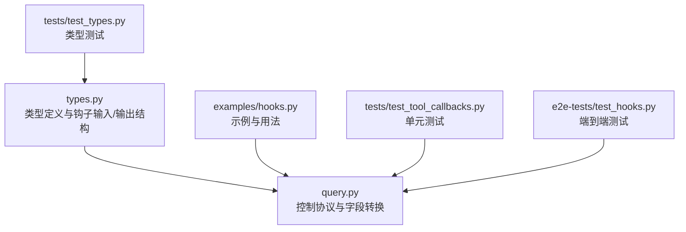
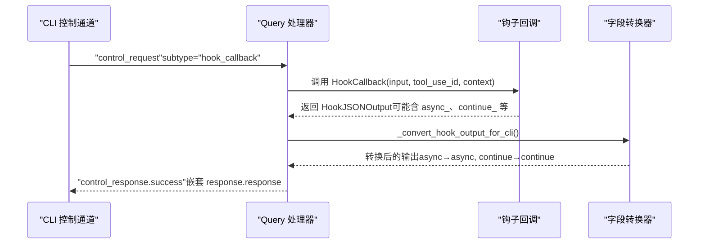
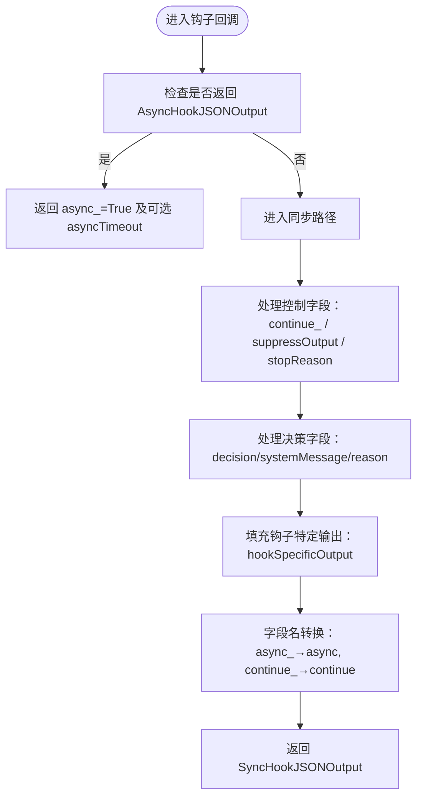
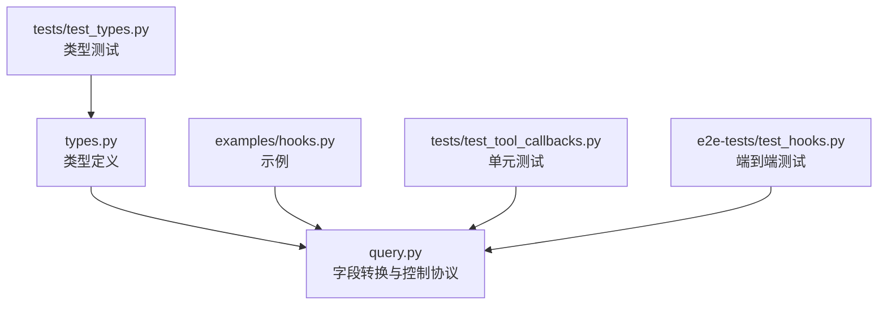

# 钩子输出类型

<cite>
**本文引用的文件**
- [types.py](file://src/claude_agent_sdk/types.py)
- [query.py](file://src/claude_agent_sdk/_internal/query.py)
- [hooks.py](file://examples/hooks.py)
- [test_tool_callbacks.py](file://tests/test_tool_callbacks.py)
- [test_types.py](file://tests/test_types.py)
- [test_hooks.py](file://e2e-tests/test_hooks.py)
</cite>

## 目录
1. [简介](#简介)
2. [项目结构](#项目结构)
3. [核心组件](#核心组件)
4. [架构总览](#架构总览)
5. [详细组件分析](#详细组件分析)
6. [依赖分析](#依赖分析)
7. [性能考虑](#性能考虑)
8. [故障排查指南](#故障排查指南)
9. [结论](#结论)
10. [附录](#附录)

## 简介
本文件系统性地介绍 Claude Agent SDK 中的钩子输出类型，重点覆盖两类 HookJSONOutput 输出结构：AsyncHookJSONOutput（异步输出）与 SyncHookJSONOutput（同步输出）。我们将深入解释同步输出中的控制字段（continue_、suppressOutput、stopReason）与决策字段（decision、systemMessage、reason），以及钩子特定输出类型（HookSpecificOutput）的结构与用途（如权限决策、额外上下文、工具输出更新等）。同时提供字段自动转换机制（async_ → async、continue_ → continue）的工作原理，并给出多种使用场景示例与最佳实践。

## 项目结构
围绕钩子输出类型的相关代码主要分布在以下模块：
- 类型定义与钩子输入/输出结构：src/claude_agent_sdk/types.py
- 控制协议与字段转换逻辑：src/claude_agent_sdk/_internal/query.py
- 示例与用法演示：examples/hooks.py
- 单元测试与端到端测试：tests/test_tool_callbacks.py、tests/test_types.py、e2e-tests/test_hooks.py

**图表来源**
- [types.py:388-472](file://src/claude_agent_sdk/types.py#L388-L472)
- [query.py:34-51](file://src/claude_agent_sdk/_internal/query.py#L34-L51)
- [hooks.py:53-110](file://examples/hooks.py#L53-L110)

**章节来源**
- [types.py:388-472](file://src/claude_agent_sdk/types.py#L388-L472)
- [query.py:34-51](file://src/claude_agent_sdk/_internal/query.py#L34-L51)

## 核心组件
- AsyncHookJSONOutput：用于延迟执行的异步钩子输出，包含 async_（必须为 True）与可选的 asyncTimeout（毫秒）。
- SyncHookJSONOutput：用于同步钩子输出，包含三类字段：
  - 控制字段：continue_（默认 True）、suppressOutput（默认 False）、stopReason（当 continue_=False 时显示）
  - 决策字段：decision（当前仅在非 PreToolUse 钩子中“block”有意义；PreToolUse 使用 permissionDecision 替代 approve）、systemMessage（用户可见警告）、reason（对 Claude 的反馈）
  - 钩子特定输出：hookSpecificOutput（事件特定控制，如 PreToolUse 的 permissionDecision、PostToolUse 的 additionalContext 等）
- HookJSONOutput：AsyncHookJSONOutput 与 SyncHookJSONOutput 的联合类型。
- HookSpecificOutput：按事件类型划分的具体输出结构集合，涵盖 PreToolUse、PostToolUse、PostToolUseFailure、UserPromptSubmit、SessionStart、Notification、SubagentStart、PermissionRequest 等。

**章节来源**
- [types.py:388-472](file://src/claude_agent_sdk/types.py#L388-L472)
- [types.py:313-383](file://src/claude_agent_sdk/types.py#L313-L383)

## 架构总览
下图展示了钩子回调在 SDK 中的调用链与字段转换流程：

**图表来源**
- [query.py:290-333](file://src/claude_agent_sdk/_internal/query.py#L290-L333)
- [query.py:34-51](file://src/claude_agent_sdk/_internal/query.py#L34-L51)

## 详细组件分析

### AsyncHookJSONOutput（异步输出）
- 字段
  - async_：必须为 True，表示延迟钩子执行
  - asyncTimeout：可选，毫秒级超时时间
- 使用要点
  - 在需要外部异步处理（如网络请求、长耗时任务）后再决定是否继续执行时使用
  - 返回该结构后，CLI 将等待异步处理完成再继续后续流程
- 测试验证
  - 单元测试验证 async_ 与 asyncTimeout 字段被正确识别与转换

**章节来源**
- [types.py:393-406](file://src/claude_agent_sdk/types.py#L393-L406)
- [test_tool_callbacks.py:350-398](file://tests/test_tool_callbacks.py#L350-L398)

### SyncHookJSONOutput（同步输出）
- 控制字段
  - continue_：默认 True，表示钩子处理完成后是否继续执行；若设为 False，则结合 stopReason 提供停止原因
  - suppressOutput：默认 False，用于在转录模式下隐藏 stdout 输出
  - stopReason：当 continue_=False 时向用户展示的停止原因
- 决策字段
  - decision：当前仅在非 PreToolUse 钩子中“block”有意义；PreToolUse 使用 permissionDecision 替代 approve
  - systemMessage：对用户的警告或提示信息
  - reason：对 Claude 的反馈说明（为何 block 或如何处理）
- 钩子特定输出（hookSpecificOutput）
  - 事件特定控制，如：
    - PreToolUse：permissionDecision（allow/deny/ask）、permissionDecisionReason、updatedInput、additionalContext
    - PostToolUse：additionalContext、updatedMCPToolOutput
    - 其他事件：如 Notification、SubagentStart 的 additionalContext
- 字段自动转换机制
  - Python 侧使用 async_ 与 continue_ 避免关键字冲突
  - SDK 在发送给 CLI 前自动转换为 async 与 continue
  - 单元测试覆盖了字段名转换行为

**图表来源**
- [types.py:408-452](file://src/claude_agent_sdk/types.py#L408-L452)
- [query.py:34-51](file://src/claude_agent_sdk/_internal/query.py#L34-L51)

**章节来源**
- [types.py:408-452](file://src/claude_agent_sdk/types.py#L408-L452)
- [test_tool_callbacks.py:266-348](file://tests/test_tool_callbacks.py#L266-L348)
- [test_tool_callbacks.py:400-443](file://tests/test_tool_callbacks.py#L400-L443)

### HookSpecificOutput（钩子特定输出）
- 结构与用途
  - 按事件类型提供专用字段，增强对特定钩子的控制与反馈能力
  - 例如：PreToolUse 的 permissionDecision 与 updatedInput；PostToolUse 的 additionalContext 与 updatedMCPToolOutput
- 类型集合
  - PreToolUseHookSpecificOutput、PostToolUseHookSpecificOutput、PostToolUseFailureHookSpecificOutput、UserPromptSubmitHookSpecificOutput、SessionStartHookSpecificOutput、NotificationHookSpecificOutput、SubagentStartHookSpecificOutput、PermissionRequestHookSpecificOutput
- 测试验证
  - 类型测试覆盖了多个事件的 hookSpecificOutput 构造与字段校验

**章节来源**
- [types.py:313-383](file://src/claude_agent_sdk/types.py#L313-L383)
- [test_types.py:290-308](file://tests/test_types.py#L290-L308)

### 同步输出字段详解
- continue_ 与 stopReason
  - 当 continue_=False 且提供了 stopReason 时，CLI 将根据 stopReason 显示停止原因
  - 示例：在 PostToolUse 钩子中检测到严重错误时，返回 continue_=False 并设置 stopReason
- suppressOutput
  - 在转录模式下隐藏 stdout 输出，避免噪声干扰
- decision、systemMessage、reason
  - decision 用于指示阻断行为（非 PreToolUse 钩子）
  - systemMessage 对用户可见，reason 用于向 Claude 提供反馈
  - PreToolUse 钩子应使用 permissionDecision（allow/deny/ask）替代 approve

**章节来源**
- [types.py:414-447](file://src/claude_agent_sdk/types.py#L414-L447)
- [hooks.py:140-154](file://examples/hooks.py#L140-L154)
- [test_tool_callbacks.py:335-348](file://tests/test_tool_callbacks.py#L335-L348)

### 字段自动转换机制
- 实现位置
  - _convert_hook_output_for_cli 函数负责将 Python 侧安全字段名转换为 CLI 期望格式
- 转换规则
  - async_ → async
  - continue_ → continue
- 行为验证
  - 单元测试覆盖 async_ 与 continue_ 的转换，确保 CLI 接收的是无下划线的字段名

**章节来源**
- [query.py:34-51](file://src/claude_agent_sdk/_internal/query.py#L34-L51)
- [test_tool_callbacks.py:394-397](file://tests/test_tool_callbacks.py#L394-L397)
- [test_tool_callbacks.py:400-443](file://tests/test_tool_callbacks.py#L400-L443)

## 依赖分析
- 类型层
  - types.py 定义了 HookJSONOutput、SyncHookJSONOutput、AsyncHookJSONOutput、HookSpecificOutput 及各事件的 HookInput
- 运行时层
  - query.py 在处理钩子回调时调用 _convert_hook_output_for_cli 完成字段转换，并通过控制协议返回结果
- 示例与测试
  - examples/hooks.py 展示了典型用法（PreToolUse 权限控制、PostToolUse 输出审查、UserPromptSubmit 上下文注入等）
  - tests/test_tool_callbacks.py 与 e2e-tests/test_hooks.py 验证字段转换、决策字段与 hookSpecificOutput 的行为

**图表来源**
- [types.py:388-472](file://src/claude_agent_sdk/types.py#L388-L472)
- [query.py:34-51](file://src/claude_agent_sdk/_internal/query.py#L34-L51)
- [hooks.py:53-110](file://examples/hooks.py#L53-L110)
- [test_tool_callbacks.py:266-348](file://tests/test_tool_callbacks.py#L266-L348)
- [test_hooks.py:70-157](file://e2e-tests/test_hooks.py#L70-L157)
- [test_types.py:290-308](file://tests/test_types.py#L290-L308)

**章节来源**
- [types.py:388-472](file://src/claude_agent_sdk/types.py#L388-L472)
- [query.py:34-51](file://src/claude_agent_sdk/_internal/query.py#L34-L51)

## 性能考虑
- 异步钩子（AsyncHookJSONOutput）
  - 适合长耗时或外部依赖场景，避免阻塞主流程
  - 建议合理设置 asyncTimeout，防止长时间挂起
- 同步钩子（SyncHookJSONOutput）
  - 控制字段与决策字段应尽量轻量计算，避免影响响应时间
  - 若需复杂判断，优先考虑异步化
- 字段转换开销
  - 字典遍历与键映射开销极低，通常可忽略不计

## 故障排查指南
- 字段名错误
  - 症状：CLI 报告未知字段或未生效
  - 原因：使用了 CLI 期望的无下划线字段名（async、continue）
  - 解决：在 Python 侧使用 async_ 与 continue_，SDK 会自动转换
- 决策字段误用
  - 症状：PreToolUse 中使用 approve 导致无效
  - 原因：approve 已弃用，请改用 permissionDecision（allow/deny/ask）
- 组合字段冲突
  - 症状：continue_=False 但未提供 stopReason
  - 建议：在 continue_=False 时提供明确的 stopReason，便于用户理解
- hookSpecificOutput 缺失
  - 症状：事件特定控制未生效
  - 建议：确保设置 hookEventName 与对应事件的专用字段

**章节来源**
- [query.py:34-51](file://src/claude_agent_sdk/_internal/query.py#L34-L51)
- [types.py:442-443](file://src/claude_agent_sdk/types.py#L442-L443)
- [test_tool_callbacks.py:394-397](file://tests/test_tool_callbacks.py#L394-L397)

## 结论
- AsyncHookJSONOutput 与 SyncHookJSONOutput 分别适用于异步与同步场景，前者强调延迟执行，后者强调即时控制与反馈
- 同步输出的控制字段与决策字段为运行时控制提供了强大能力，配合 hookSpecificOutput 可实现细粒度的事件定制
- SDK 自动完成 async_ 与 continue_ 到 CLI 期望格式的转换，开发者只需关注业务逻辑
- 建议在权限控制、工具拦截、输出审查、状态反馈等场景中合理选择与组合这些输出类型

## 附录

### 使用示例索引
- 工具拦截（PreToolUse）
  - 使用 permissionDecision 与 permissionDecisionReason 控制工具执行
  - 示例参考：[hooks.py:53-71](file://examples/hooks.py#L53-L71)
- 权限控制与策略
  - 使用 permissionDecision（allow/deny/ask）与 updatedInput 动态调整工具输入
  - 示例参考：[hooks.py:105-110](file://examples/hooks.py#L105-L110)
- 输出修改与状态反馈
  - PostToolUse 中通过 additionalContext 与 systemMessage/reason 提供反馈
  - 示例参考：[hooks.py:85-102](file://examples/hooks.py#L85-L102)
- 执行控制（continue_/stopReason）
  - PostToolUse 中检测到严重错误时返回 continue_=False 与 stopReason
  - 示例参考：[hooks.py:140-154](file://examples/hooks.py#L140-L154)
- 钩子特定输出（additionalContext）
  - 在 PostToolUse 中添加监控上下文
  - 示例参考：[hooks.py:118-136](file://examples/hooks.py#L118-L136)
- 端到端验证
  - 测试覆盖 continue_/stopReason、hookSpecificOutput、字段转换等关键行为
  - 参考：[test_hooks.py:70-157](file://e2e-tests/test_hooks.py#L70-L157)、[test_tool_callbacks.py:266-348](file://tests/test_tool_callbacks.py#L266-L348)