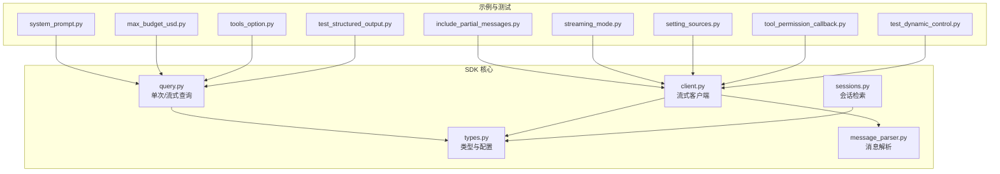
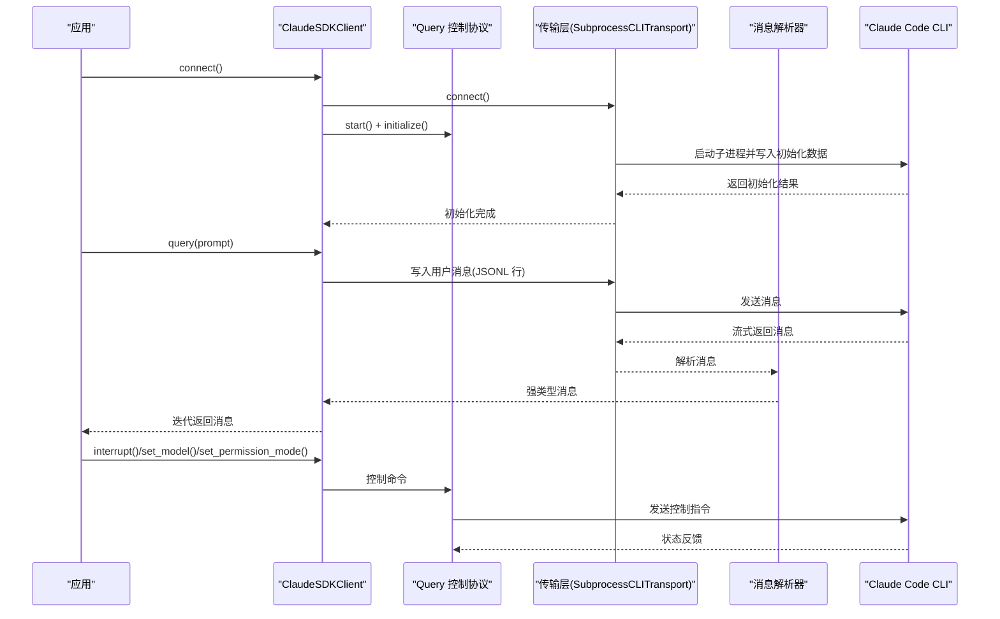
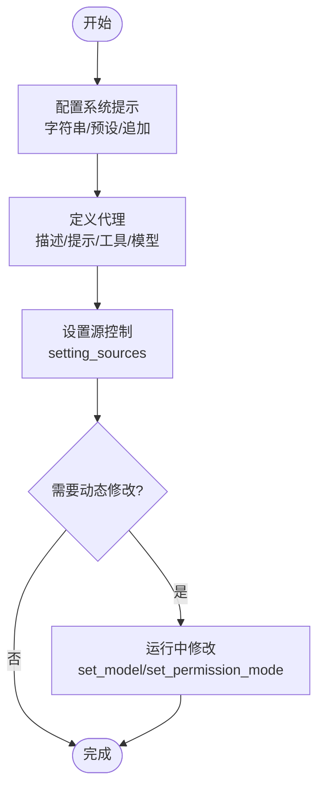
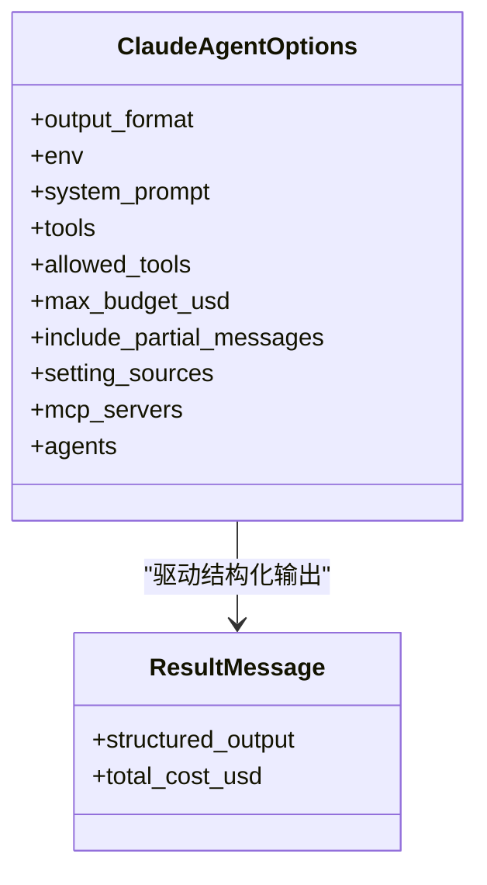
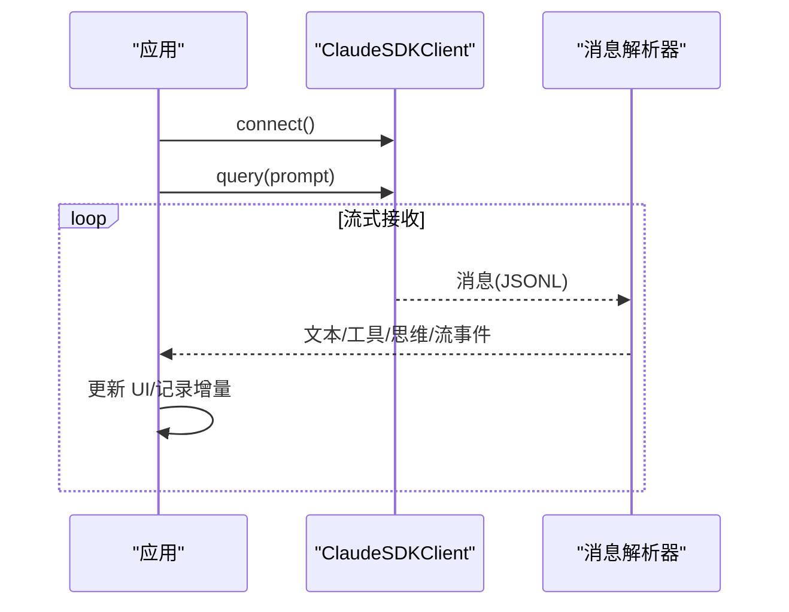
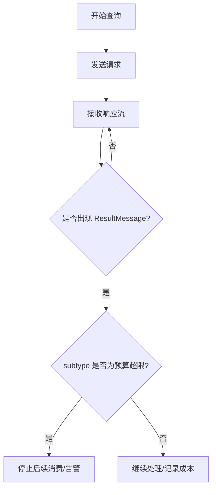
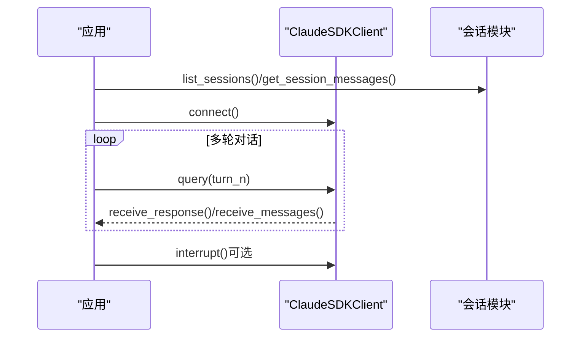
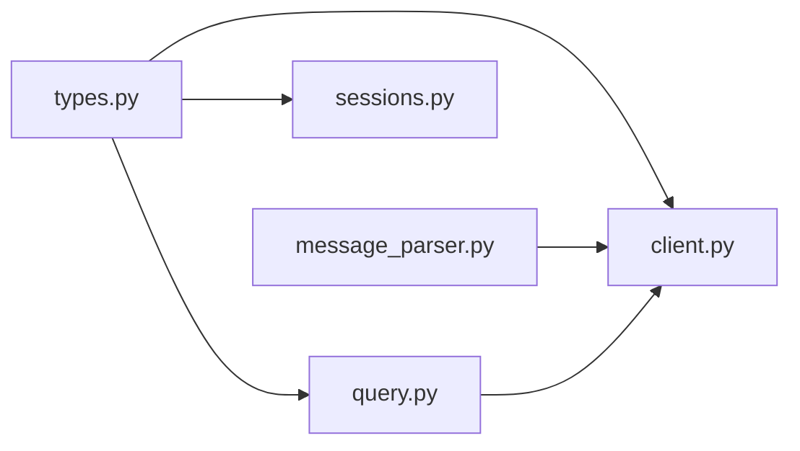

# 高级功能

<cite>
**本文引用的文件**
- [client.py](file://src/claude_agent_sdk/client.py)
- [query.py](file://src/claude_agent_sdk/query.py)
- [types.py](file://src/claude_agent_sdk/types.py)
- [message_parser.py](file://src/claude_agent_sdk/_internal/message_parser.py)
- [sessions.py](file://src/claude_agent_sdk/_internal/sessions.py)
- [system_prompt.py](file://examples/system_prompt.py)
- [include_partial_messages.py](file://examples/include_partial_messages.py)
- [max_budget_usd.py](file://examples/max_budget_usd.py)
- [tools_option.py](file://examples/tools_option.py)
- [streaming_mode.py](file://examples/streaming_mode.py)
- [setting_sources.py](file://examples/setting_sources.py)
- [tool_permission_callback.py](file://examples/tool_permission_callback.py)
- [test_structured_output.py](file://e2e-tests/test_structured_output.py)
- [test_dynamic_control.py](file://e2e-tests/test_dynamic_control.py)
</cite>

## 目录
1. [简介](#简介)
2. [项目结构](#项目结构)
3. [核心组件](#核心组件)
4. [架构总览](#架构总览)
5. [详细组件分析](#详细组件分析)
6. [依赖分析](#依赖分析)
7. [性能考虑](#性能考虑)
8. [故障排查指南](#故障排查指南)
9. [结论](#结论)
10. [附录](#附录)

## 简介
本文件面向高级用户与工程团队，系统化梳理 Claude Agent SDK 的高级能力与最佳实践，覆盖以下主题：
- 系统提示与代理配置：动态修改、代理定义、设置源控制
- 输出格式控制：JSON 模式输出、思维令牌配置、输出样式定制
- 部分消息与流式更新：partial.json 支持、增量流式体验
- 预算控制与成本管理：最大预算阈值、错误类型识别
- 高级配置：性能调优、资源限制、权限与沙箱策略
- 多轮对话：上下文管理、状态保持、中断与任务控制
- 专家级模式：权限回调、MCP 服务器控制、会话检索与回放
- 性能监控与调试：速率限制事件、日志与解析器行为
- 与其他 AI 框架与工具的集成模式

## 项目结构
该 SDK 提供两类交互入口：
- 单次查询接口：适合一次性、无状态任务
- 流式客户端：适合多轮对话、实时交互、中断与动态控制

图表来源
- [query.py:12-127](file://src/claude_agent_sdk/query.py#L12-L127)
- [client.py:21-500](file://src/claude_agent_sdk/client.py#L21-L500)
- [types.py:1-1199](file://src/claude_agent_sdk/types.py#L1-L1199)
- [message_parser.py:29-251](file://src/claude_agent_sdk/_internal/message_parser.py#L29-L251)
- [sessions.py:593-635](file://src/claude_agent_sdk/_internal/sessions.py#L593-L635)

章节来源
- [query.py:12-127](file://src/claude_agent_sdk/query.py#L12-L127)
- [client.py:21-500](file://src/claude_agent_sdk/client.py#L21-L500)
- [types.py:1-1199](file://src/claude_agent_sdk/types.py#L1-L1199)

## 核心组件
- 单次查询函数：支持字符串或异步可迭代输入，内部通过内部客户端封装传输与协议控制。
- 流式客户端：提供连接、消息接收、查询发送、中断、模型切换、权限模式切换、MCP 服务器控制等能力。
- 类型系统：统一的消息类型、内容块、Hook 输入输出、MCP 服务器配置与状态、权限规则与更新、会话信息等。
- 消息解析器：将 CLI 输出映射为强类型消息对象，兼容未知类型以向前兼容。

章节来源
- [query.py:12-127](file://src/claude_agent_sdk/query.py#L12-L127)
- [client.py:21-500](file://src/claude_agent_sdk/client.py#L21-L500)
- [types.py:766-800](file://src/claude_agent_sdk/types.py#L766-L800)
- [message_parser.py:29-251](file://src/claude_agent_sdk/_internal/message_parser.py#L29-L251)

## 架构总览
SDK 在运行时通过子进程与 CLI 通信，采用“控制协议 + 流式消息”的方式实现双向交互。流式客户端在连接后启动读取任务组，持续消费消息并解析为强类型对象；单次查询在完成一次请求后关闭。

图表来源
- [client.py:94-185](file://src/claude_agent_sdk/client.py#L94-L185)
- [query.py:12-127](file://src/claude_agent_sdk/query.py#L12-L127)
- [message_parser.py:29-251](file://src/claude_agent_sdk/_internal/message_parser.py#L29-L251)

## 详细组件分析

### 系统提示与代理配置
- 系统提示配置
  - 字符串系统提示：直接传入字符串，影响模型初始行为。
  - 预设系统提示：使用预设类型与可选追加文本，便于复用默认 Claude Code 行为。
  - 示例路径：[system_prompt.py:14-87](file://examples/system_prompt.py#L14-L87)
- 代理定义与设置源控制
  - 代理定义：描述、提示词、工具集、模型选择等字段构成。
  - 设置源控制：通过 setting_sources 明确加载 user、project、local 等来源，避免意外加载项目自定义命令。
  - 示例路径：[setting_sources.py:47-134](file://examples/setting_sources.py#L47-L134)
- 动态修改能力
  - 运行中可通过 set_model、set_permission_mode 实时调整模型与权限模式（需处于流式模式）。
  - 示例路径：[test_dynamic_control.py:13-98](file://e2e-tests/test_dynamic_control.py#L13-L98)

图表来源
- [types.py:42-50](file://src/claude_agent_sdk/types.py#L42-L50)
- [types.py:27-40](file://src/claude_agent_sdk/types.py#L27-L40)
- [client.py:258-280](file://src/claude_agent_sdk/client.py#L258-L280)
- [client.py:234-256](file://src/claude_agent_sdk/client.py#L234-L256)

章节来源
- [system_prompt.py:14-87](file://examples/system_prompt.py#L14-L87)
- [setting_sources.py:47-134](file://examples/setting_sources.py#L47-L134)
- [test_dynamic_control.py:13-98](file://e2e-tests/test_dynamic_control.py#L13-L98)
- [types.py:42-50](file://src/claude_agent_sdk/types.py#L42-L50)
- [types.py:27-40](file://src/claude_agent_sdk/types.py#L27-L40)
- [client.py:234-280](file://src/claude_agent_sdk/client.py#L234-L280)

### 输出格式控制（JSON 模式、思维令牌、样式）
- JSON 模式输出
  - 使用 output_format 指定 JSON Schema，确保结果符合结构化要求，便于下游解析与校验。
  - 示例路径：[test_structured_output.py:20-207](file://e2e-tests/test_structured_output.py#L20-L207)
- 思维令牌配置
  - 通过环境变量 MAX_THINKING_TOKENS 控制思考块长度，结合 partial 消息流实现实时思维进度。
  - 示例路径：[include_partial_messages.py:28-57](file://examples/include_partial_messages.py#L28-L57)
- 输出样式定制
  - 通过 get_server_info 获取可用命令与输出样式列表，按需调整交互风格。
  - 示例路径：[streaming_mode.py:342-419](file://examples/streaming_mode.py#L342-L419)

图表来源
- [types.py:1-1199](file://src/claude_agent_sdk/types.py#L1-L1199)
- [test_structured_output.py:20-207](file://e2e-tests/test_structured_output.py#L20-L207)
- [include_partial_messages.py:28-57](file://examples/include_partial_messages.py#L28-L57)
- [streaming_mode.py:342-419](file://examples/streaming_mode.py#L342-L419)

章节来源
- [test_structured_output.py:20-207](file://e2e-tests/test_structured_output.py#L20-L207)
- [include_partial_messages.py:28-57](file://examples/include_partial_messages.py#L28-L57)
- [streaming_mode.py:342-419](file://examples/streaming_mode.py#L342-L419)
- [types.py:1-1199](file://src/claude_agent_sdk/types.py#L1-L1199)

### 部分消息与流式更新（partial.json 与增量流）
- 开启部分消息流
  - include_partial_messages=True 时，消息流中会穿插 StreamEvent，用于展示增量文本与工具进度。
  - 示例路径：[include_partial_messages.py:28-57](file://examples/include_partial_messages.py#L28-L57)
- 增量消费与 UI 实时渲染
  - 结合 receive_messages 或 receive_response，逐条处理消息，优先展示文本块与工具使用块。
  - 示例路径：[streaming_mode.py:176-211](file://examples/streaming_mode.py#L176-L211)

图表来源
- [include_partial_messages.py:28-57](file://examples/include_partial_messages.py#L28-L57)
- [streaming_mode.py:176-211](file://examples/streaming_mode.py#L176-L211)
- [message_parser.py:211-223](file://src/claude_agent_sdk/_internal/message_parser.py#L211-L223)

章节来源
- [include_partial_messages.py:28-57](file://examples/include_partial_messages.py#L28-L57)
- [streaming_mode.py:176-211](file://examples/streaming_mode.py#L176-L211)
- [message_parser.py:211-223](file://src/claude_agent_sdk/_internal/message_parser.py#L211-L223)

### 预算控制与成本管理
- 最大预算阈值
  - max_budget_usd 用于限制累计消费，超过阈值时返回特定错误 subtype（如 error_max_budget_usd）。
  - 示例路径：[max_budget_usd.py:15-96](file://examples/max_budget_usd.py#L15-L96)
- 成本追踪
  - ResultMessage 中包含 total_cost_usd，可用于统计与告警。

图表来源
- [max_budget_usd.py:15-96](file://examples/max_budget_usd.py#L15-L96)
- [types.py:191-205](file://src/claude_agent_sdk/types.py#L191-L205)

章节来源
- [max_budget_usd.py:15-96](file://examples/max_budget_usd.py#L15-L96)
- [types.py:191-205](file://src/claude_agent_sdk/types.py#L191-L205)

### 高级配置选项（性能调优与资源限制）
- 工具与权限
  - tools/allowed_tools 控制可用工具集合；can_use_tool 回调用于细粒度权限决策与输入改写。
  - 示例路径：[tools_option.py:16-112](file://examples/tools_option.py#L16-L112)，[tool_permission_callback.py:26-94](file://examples/tool_permission_callback.py#L26-L94)
- 环境变量与模型
  - env 可注入模型名称等参数；set_model 运行时切换模型。
  - 示例路径：[streaming_mode.py:213-245](file://examples/streaming_mode.py#L213-L245)，[test_dynamic_control.py:44-74](file://e2e-tests/test_dynamic_control.py#L44-L74)
- 沙箱与网络隔离
  - 通过 SandboxSettings 控制 bash 沙箱、排除命令、网络代理端口等，提升安全性。
  - 示例路径：[types.py:683-727](file://src/claude_agent_sdk/types.py#L683-L727)

章节来源
- [tools_option.py:16-112](file://examples/tools_option.py#L16-L112)
- [tool_permission_callback.py:26-94](file://examples/tool_permission_callback.py#L26-L94)
- [streaming_mode.py:213-245](file://examples/streaming_mode.py#L213-L245)
- [test_dynamic_control.py:44-74](file://e2e-tests/test_dynamic_control.py#L44-L74)
- [types.py:683-727](file://src/claude_agent_sdk/types.py#L683-L727)

### 多轮对话与上下文管理
- 会话检索与重建
  - list_sessions 支持跨项目目录扫描、Git worktree 支持、去重与排序，提取摘要、首提示、分支等元信息。
  - get_session_messages 可重建完整对话链，基于 uuid 与 parentUuid 关系。
  - 示例路径：[sessions.py:593-635](file://src/claude_agent_sdk/_internal/sessions.py#L593-L635)，[sessions.py:660-800](file://src/claude_agent_sdk/_internal/sessions.py#L660-L800)
- 状态保持与中断
  - 流式客户端维持会话上下文，receive_messages/receive_response 提供不同粒度的消费策略；interrupt 支持在活跃消费时中断。
  - 示例路径：[streaming_mode.py:133-174](file://examples/streaming_mode.py#L133-L174)

图表来源
- [sessions.py:593-635](file://src/claude_agent_sdk/_internal/sessions.py#L593-L635)
- [sessions.py:660-800](file://src/claude_agent_sdk/_internal/sessions.py#L660-L800)
- [streaming_mode.py:133-174](file://examples/streaming_mode.py#L133-L174)

章节来源
- [sessions.py:593-635](file://src/claude_agent_sdk/_internal/sessions.py#L593-L635)
- [sessions.py:660-800](file://src/claude_agent_sdk/_internal/sessions.py#L660-L800)
- [streaming_mode.py:133-174](file://examples/streaming_mode.py#L133-L174)

### 专家级使用模式与最佳实践
- 权限回调与安全
  - 使用 can_use_tool 对工具进行白名单/黑名单、输入改写与危险命令拦截，结合 PermissionResultAllow/Deny 返回。
  - 示例路径：[tool_permission_callback.py:26-94](file://examples/tool_permission_callback.py#L26-L94)
- MCP 服务器控制
  - get_mcp_status 查看连接状态；toggle_mcp_server 启停；reconnect_mcp_server 重连失败实例。
  - 示例路径：[client.py:385-416](file://src/claude_agent_sdk/client.py#L385-L416)，[client.py:336-360](file://src/claude_agent_sdk/client.py#L336-L360)，[client.py:314-335](file://src/claude_agent_sdk/client.py#L314-L335)
- 文件回放与检查点
  - enable_file_checkpointing + replay-user-messages 配置下，rewind_files 可回滚到指定用户消息的文件状态。
  - 示例路径：[client.py:282-313](file://src/claude_agent_sdk/client.py#L282-L313)

章节来源
- [tool_permission_callback.py:26-94](file://examples/tool_permission_callback.py#L26-L94)
- [client.py:282-335](file://src/claude_agent_sdk/client.py#L282-L335)
- [client.py:314-416](file://src/claude_agent_sdk/client.py#L314-L416)

### 性能监控与调试工具
- 速率限制事件
  - 解析 rate_limit_event，获取状态、重置时间、利用率等，辅助节流与重试策略。
  - 示例路径：[message_parser.py:224-244](file://src/claude_agent_sdk/_internal/message_parser.py#L224-L244)
- 日志与解析容错
  - 解析器对未知消息类型进行跳过并记录日志，保证新版本 CLI 不破坏旧版 SDK。
  - 示例路径：[message_parser.py:246-251](file://src/claude_agent_sdk/_internal/message_parser.py#L246-L251)

章节来源
- [message_parser.py:224-251](file://src/claude_agent_sdk/_internal/message_parser.py#L224-L251)

### 与其他 AI 框架与工具的集成模式
- MCP 服务器
  - 支持 stdio、sse、http、sdk、claudeai-proxy 等多种配置，动态启停与状态查询满足多生态集成。
  - 示例路径：[types.py:494-569](file://src/claude_agent_sdk/types.py#L494-L569)，[client.py:385-416](file://src/claude_agent_sdk/client.py#L385-L416)
- 插件与本地扩展
  - 通过 setting_sources 与 .claude 目录配合，加载本地插件与自定义命令，实现领域增强。
  - 示例路径：[setting_sources.py:47-134](file://examples/setting_sources.py#L47-L134)

章节来源
- [types.py:494-569](file://src/claude_agent_sdk/types.py#L494-L569)
- [client.py:385-416](file://src/claude_agent_sdk/client.py#L385-L416)
- [setting_sources.py:47-134](file://examples/setting_sources.py#L47-L134)

## 依赖分析
SDK 组件间耦合清晰，职责分离：
- query.py 与 client.py 共同依赖 types.py 的配置与消息类型
- client.py 依赖 message_parser.py 将原始消息转为强类型对象
- sessions.py 独立于运行时控制协议，提供离线会话元数据与重建能力

图表来源
- [types.py:1-1199](file://src/claude_agent_sdk/types.py#L1-L1199)
- [query.py:12-127](file://src/claude_agent_sdk/query.py#L12-L127)
- [client.py:21-500](file://src/claude_agent_sdk/client.py#L21-L500)
- [message_parser.py:29-251](file://src/claude_agent_sdk/_internal/message_parser.py#L29-L251)
- [sessions.py:593-635](file://src/claude_agent_sdk/_internal/sessions.py#L593-L635)

章节来源
- [types.py:1-1199](file://src/claude_agent_sdk/types.py#L1-L1199)
- [query.py:12-127](file://src/claude_agent_sdk/query.py#L12-L127)
- [client.py:21-500](file://src/claude_agent_sdk/client.py#L21-L500)
- [message_parser.py:29-251](file://src/claude_agent_sdk/_internal/message_parser.py#L29-L251)
- [sessions.py:593-635](file://src/claude_agent_sdk/_internal/sessions.py#L593-L635)

## 性能考虑
- 流式消费与并发
  - 使用 receive_messages 并发消费消息，避免阻塞；在高吞吐场景下建议后台任务持续消费。
  - 示例路径：[streaming_mode.py:97-131](file://examples/streaming_mode.py#L97-L131)
- 资源限制与沙箱
  - 合理配置 SandboxSettings，减少不必要的网络与文件操作，降低风险与资源消耗。
  - 示例路径：[types.py:683-727](file://src/claude_agent_sdk/types.py#L683-L727)
- 模型与令牌
  - 通过 set_model 与 MAX_THINKING_TOKENS 调整模型与思考长度，平衡质量与延迟。
  - 示例路径：[test_dynamic_control.py:44-74](file://e2e-tests/test_dynamic_control.py#L44-L74)，[include_partial_messages.py:28-57](file://examples/include_partial_messages.py#L28-L57)

## 故障排查指南
- 连接与协议
  - 未连接即调用：抛出 CLIConnectionError，确保先调用 connect()。
  - 示例路径：[client.py:186-197](file://src/claude_agent_sdk/client.py#L186-L197)，[client.py:484-499](file://src/claude_agent_sdk/client.py#L484-L499)
- 解析异常
  - MessageParseError：当消息结构缺失或类型不匹配时触发，检查 CLI 版本与消息格式。
  - 示例路径：[message_parser.py:42-51](file://src/claude_agent_sdk/_internal/message_parser.py#L42-L51)，[message_parser.py:94-97](file://src/claude_agent_sdk/_internal/message_parser.py#L94-L97)
- 速率限制
  - 订阅 rate_limit_event，根据重置时间与利用率调整请求节奏。
  - 示例路径：[message_parser.py:224-244](file://src/claude_agent_sdk/_internal/message_parser.py#L224-L244)
- 预算超限
  - 监控 ResultMessage.subtype 与 total_cost_usd，及时终止或降级任务。
  - 示例路径：[max_budget_usd.py:51-77](file://examples/max_budget_usd.py#L51-L77)

章节来源
- [client.py:186-197](file://src/claude_agent_sdk/client.py#L186-L197)
- [client.py:484-499](file://src/claude_agent_sdk/client.py#L484-L499)
- [message_parser.py:42-51](file://src/claude_agent_sdk/_internal/message_parser.py#L42-L51)
- [message_parser.py:224-244](file://src/claude_agent_sdk/_internal/message_parser.py#L224-L244)
- [max_budget_usd.py:51-77](file://examples/max_budget_usd.py#L51-L77)

## 结论
本 SDK 提供从基础查询到复杂多轮对话与动态控制的全栈能力。通过系统提示与代理配置、结构化输出、部分消息流、预算控制与权限回调，以及 MCP 与会话管理，能够支撑企业级与研究级的高级应用场景。建议在生产环境中结合速率限制监控、沙箱策略与权限回调，确保安全与稳定。

## 附录
- 快速参考
  - 系统提示：字符串/预设/追加
  - 代理定义：描述/提示/工具/模型
  - 设置源：user/project/local
  - 结构化输出：JSON Schema
  - 部分消息：include_partial_messages + StreamEvent
  - 预算控制：max_budget_usd + ResultMessage.cost
  - 权限回调：can_use_tool + PermissionResult
  - MCP 控制：get_mcp_status/toggle/reconnect
  - 会话管理：list_sessions/get_session_messages