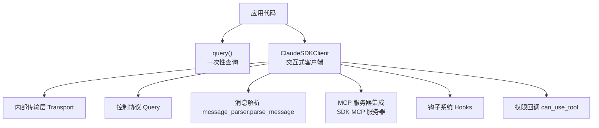
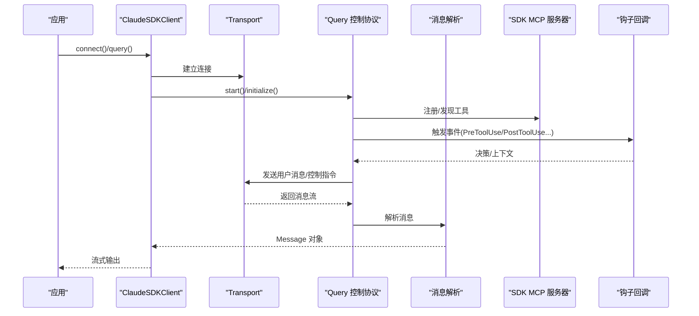
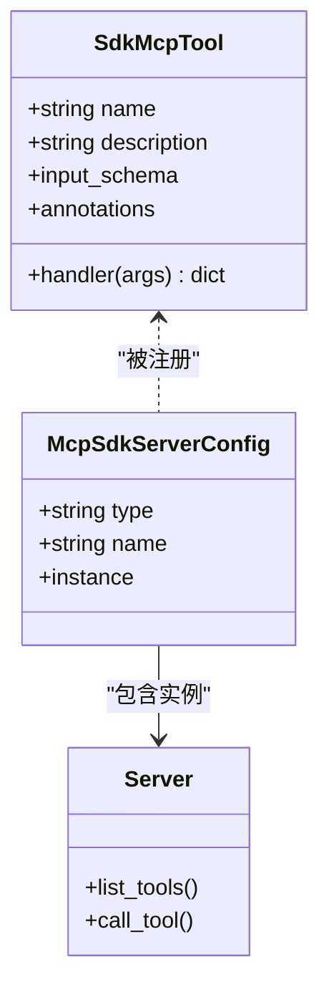
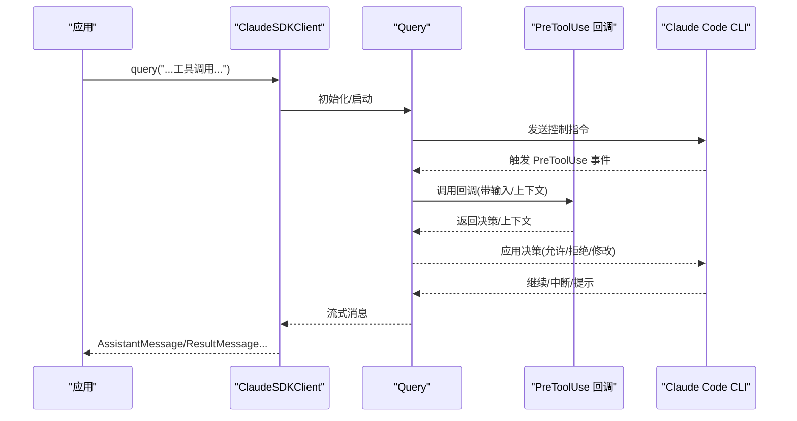
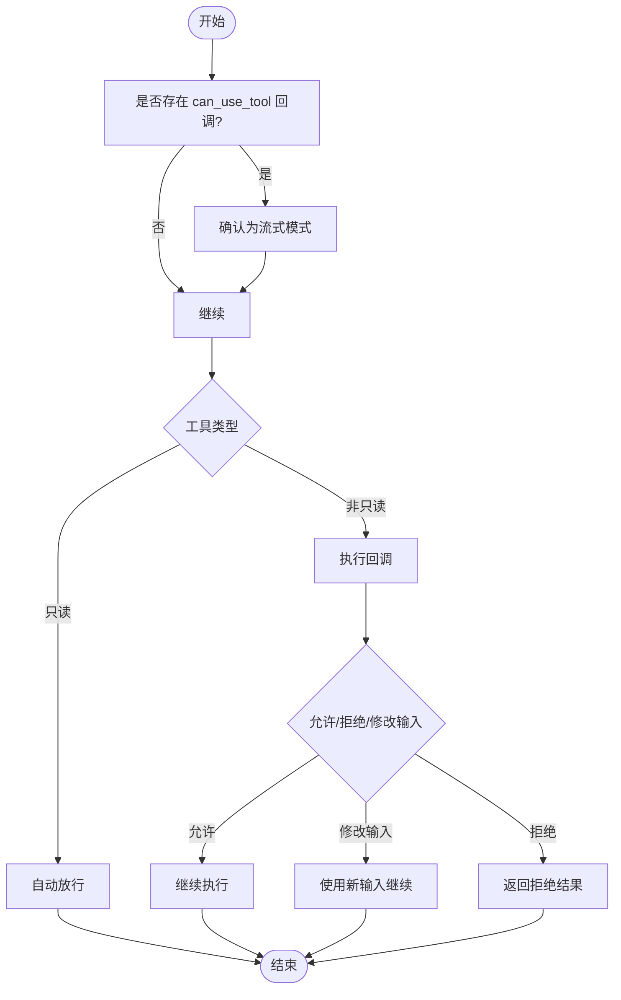
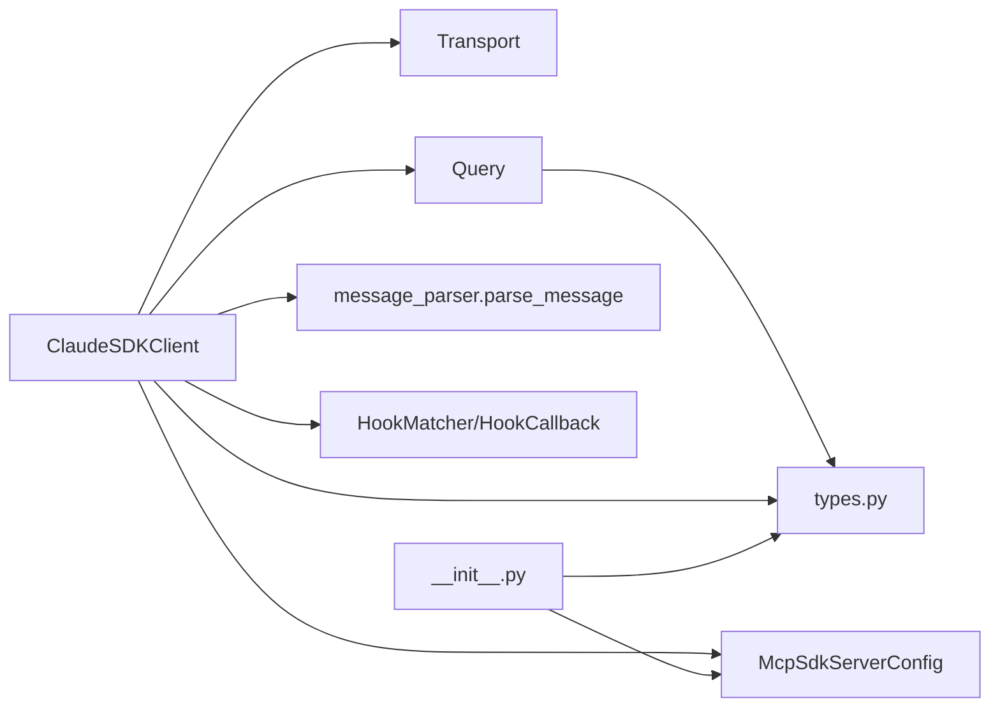

# 高级功能

<cite>
**本文引用的文件**
- [README.md](file://README.md)
- [__init__.py](file://src/claude_agent_sdk/__init__.py)
- [client.py](file://src/claude_agent_sdk/client.py)
- [query.py](file://src/claude_agent_sdk/query.py)
- [types.py](file://src/claude_agent_sdk/types.py)
- [_errors.py](file://src/claude_agent_sdk/_errors.py)
- [hooks.py](file://examples/hooks.py)
- [tool_permission_callback.py](file://examples/tool_permission_callback.py)
- [mcp_calculator.py](file://examples/mcp_calculator.py)
- [test_hooks.py](file://e2e-tests/test_hooks.py)
- [test_tool_permissions.py](file://e2e-tests/test_tool_permissions.py)
- [test_sdk_mcp_tools.py](file://e2e-tests/test_sdk_mcp_tools.py)
</cite>

## 目录
1. [简介](#简介)
2. [项目结构](#项目结构)
3. [核心组件](#核心组件)
4. [架构总览](#架构总览)
5. [详细组件分析](#详细组件分析)
6. [依赖分析](#依赖分析)
7. [性能考虑](#性能考虑)
8. [故障排查指南](#故障排查指南)
9. [结论](#结论)
10. [附录](#附录)

## 简介
本文件面向希望深入使用 Claude Agent SDK 的开发者，系统性讲解高级功能：自定义工具系统（SDK MCP 服务器）、钩子机制（事件驱动编程与行为拦截）、权限管理（工具许可与输入修改）、代理设置与会话能力，并结合端到端示例与测试用例，帮助你构建安全、可控且高性能的智能体应用。

## 项目结构
SDK 提供两类入口：
- query()：一次性查询，适合无状态、单轮对话或批处理。
- ClaudeSDKClient：交互式客户端，支持流式输入、中断、动态切换模型/权限模式、MCP 服务器启停与状态查询等高级能力。

图表来源
- [query.py:12-127](file://src/claude_agent_sdk/query.py#L12-L127)
- [client.py:21-500](file://src/claude_agent_sdk/client.py#L21-L500)

章节来源
- [README.md:1-360](file://README.md#L1-L360)
- [query.py:12-127](file://src/claude_agent_sdk/query.py#L12-L127)
- [client.py:21-500](file://src/claude_agent_sdk/client.py#L21-L500)

## 核心组件
- 自定义工具系统（SDK MCP 服务器）
  - 使用装饰器定义工具，通过 create_sdk_mcp_server 创建内嵌于进程的 MCP 服务器，避免外部进程 IPC 开销。
  - 工具注册时自动暴露 list_tools/call_tool 处理器，返回标准化内容块。
- 钩子机制（事件驱动）
  - 支持 PreToolUse、PostToolUse、PostToolUseFailure、UserPromptSubmit、Stop、SubagentStop、PreCompact、Notification、SubagentStart、PermissionRequest 等事件。
  - 通过 HookMatcher 将匹配规则与回调函数绑定，支持超时控制。
- 权限管理
  - allowed_tools/disallowed_tools 与 permission_mode 控制工具可用性与默认决策。
  - can_use_tool 回调可动态决定是否允许、拒绝或修改工具输入。
- 代理与会话
  - 支持多代理定义、会话列表与消息查询、重命名与打标签等操作。
- 错误处理
  - 统一的错误类型体系，便于在上层进行差异化处理。

章节来源
- [__init__.py:100-341](file://src/claude_agent_sdk/__init__.py#L100-L341)
- [types.py:160-453](file://src/claude_agent_sdk/types.py#L160-L453)
- [types.py:60-121](file://src/claude_agent_sdk/types.py#L60-L121)
- [client.py:62-500](file://src/claude_agent_sdk/client.py#L62-L500)
- [_errors.py:6-57](file://src/claude_agent_sdk/_errors.py#L6-L57)

## 架构总览
下图展示 SDK 在交互式场景下的关键模块与数据流：

图表来源
- [client.py:94-185](file://src/claude_agent_sdk/client.py#L94-L185)
- [client.py:186-483](file://src/claude_agent_sdk/client.py#L186-L483)
- [types.py:475-491](file://src/claude_agent_sdk/types.py#L475-L491)

## 详细组件分析

### 自定义工具系统（SDK MCP 服务器）
- 工具定义
  - 使用装饰器为异步函数标注名称、描述与输入模式，支持字典/TypedDict/JSON Schema。
  - 装饰器返回 SdkMcpTool 实例，供 create_sdk_mcp_server 注册。
- 服务器创建
  - create_sdk_mcp_server 内部创建 MCP Server 实例，注册 list_tools/call_tool 处理器。
  - list_tools 将工具输入模式转换为 JSON Schema；call_tool 按名称路由到对应处理器并返回内容块。
- 集成方式
  - 在 ClaudeAgentOptions.mcp_servers 中以字典形式注入，键名为服务器别名，值为 create_sdk_mcp_server 返回的配置对象。
  - 通过 allowed_tools 指定具体工具标识（格式为 mcp__<server>__<tool>），即可直接调用。

图表来源
- [__init__.py:100-109](file://src/claude_agent_sdk/__init__.py#L100-L109)
- [__init__.py:178-341](file://src/claude_agent_sdk/__init__.py#L178-L341)
- [types.py:519-529](file://src/claude_agent_sdk/types.py#L519-L529)

章节来源
- [__init__.py:100-341](file://src/claude_agent_sdk/__init__.py#L100-L341)
- [mcp_calculator.py:24-98](file://examples/mcp_calculator.py#L24-L98)
- [mcp_calculator.py:142-168](file://examples/mcp_calculator.py#L142-L168)

### 钩子机制（事件驱动编程）
- 事件类型
  - 包括 PreToolUse、PostToolUse、PostToolUseFailure、UserPromptSubmit、Stop、SubagentStop、PreCompact、Notification、SubagentStart、PermissionRequest 等。
- 回调签名
  - HookCallback 接受强类型 HookInput、可选 tool_use_id、HookContext，返回 HookJSONOutput。
- 匹配与执行
  - HookMatcher 定义 matcher（如工具名正则）与 hooks 列表，支持超时控制。
  - 客户端在 connect 时将 HookMatcher 转换为内部格式并传递给控制协议。
- 输出结构
  - 同步输出支持 continue_/suppressOutput/stopReason 等字段；异步输出支持 async_ 与 asyncTimeout。
  - 钩子特定输出包含 permissionDecision、additionalContext、decision 等。

图表来源
- [client.py:76-92](file://src/claude_agent_sdk/client.py#L76-L92)
- [types.py:160-453](file://src/claude_agent_sdk/types.py#L160-L453)
- [hooks.py:46-136](file://examples/hooks.py#L46-L136)

章节来源
- [types.py:160-453](file://src/claude_agent_sdk/types.py#L160-L453)
- [client.py:76-92](file://src/claude_agent_sdk/client.py#L76-L92)
- [hooks.py:46-136](file://examples/hooks.py#L46-L136)
- [test_hooks.py:17-70](file://e2e-tests/test_hooks.py#L17-L70)

### 权限管理（工具许可与输入修改）
- 允许/禁止清单
  - allowed_tools：白名单，命中即自动放行；permission_mode 影响未命中工具的决策流程。
  - disallowed_tools：黑名单，优先于允许清单。
- 动态权限回调
  - can_use_tool：在每次非只读工具调用前触发，返回允许/拒绝，或提供更新后的输入。
  - ToolPermissionContext 可携带 CLI 建议与信号占位符。
- 端到端验证
  - 测试覆盖了回调被调用、对危险命令的拒绝、路径重定向与输入修改等场景。

图表来源
- [client.py:112-131](file://src/claude_agent_sdk/client.py#L112-L131)
- [types.py:124-157](file://src/claude_agent_sdk/types.py#L124-L157)
- [tool_permission_callback.py:26-94](file://examples/tool_permission_callback.py#L26-L94)

章节来源
- [types.py:124-157](file://src/claude_agent_sdk/types.py#L124-L157)
- [client.py:112-131](file://src/claude_agent_sdk/client.py#L112-L131)
- [tool_permission_callback.py:26-94](file://examples/tool_permission_callback.py#L26-L94)
- [test_tool_permissions.py:19-61](file://e2e-tests/test_tool_permissions.py#L19-L61)

### 代理设置与会话能力
- 代理定义
  - AgentDefinition 支持描述、提示词、工具集与模型选择，可通过 ClaudeAgentOptions.agents 注入。
- 会话管理
  - 列表与消息查询、重命名与打标签等能力由内部模块提供，便于在长会话中维护上下文与审计。
- 与客户端集成
  - 客户端 connect 时将 agents 转换为字典并随初始化请求发送，确保服务端侧正确加载。

章节来源
- [types.py:42-50](file://src/claude_agent_sdk/types.py#L42-L50)
- [client.py:158-163](file://src/claude_agent_sdk/client.py#L158-L163)
- [__init__.py:16-17](file://src/claude_agent_sdk/__init__.py#L16-L17)

### MCP（Model Context Protocol）工作原理与实现
- 协议角色
  - MCP 服务器向 Claude 暴露工具清单与调用接口；Claude 根据上下文选择合适工具并发起调用。
- SDK MCP 服务器
  - 内置 list_tools/call_tool 处理器，自动将工具输入模式转为 JSON Schema 并执行对应异步处理器。
  - 工具返回内容需为标准化内容块列表，SDK 自动封装为 MCP 格式。
- 与外部服务器混合
  - mcp_servers 支持同时配置 SDK 与外部（stdio/sse/http）服务器，按名称路由。

章节来源
- [__init__.py:250-341](file://src/claude_agent_sdk/__init__.py#L250-L341)
- [types.py:493-529](file://src/claude_agent_sdk/types.py#L493-L529)
- [README.md:92-185](file://README.md#L92-L185)

## 依赖分析
- 模块耦合
  - ClaudeSDKClient 依赖 Transport、Query、消息解析器与 MCP 服务器配置。
  - query() 通过 InternalClient 封装 Transport 与 Query，简化一次性场景。
- 外部依赖
  - 使用 mcp.server 作为 MCP 服务器框架，提供 list_tools/call_tool 装饰器。
- 类型与协议
  - types.py 定义了钩子输入/输出、权限结构、MCP 状态与工具注解等强类型结构，保证与 CLI 控制协议一致。

图表来源
- [client.py:94-185](file://src/claude_agent_sdk/client.py#L94-L185)
- [query.py:12-127](file://src/claude_agent_sdk/query.py#L12-L127)
- [types.py:160-453](file://src/claude_agent_sdk/types.py#L160-L453)
- [__init__.py:250-341](file://src/claude_agent_sdk/__init__.py#L250-L341)

章节来源
- [client.py:94-185](file://src/claude_agent_sdk/client.py#L94-L185)
- [query.py:12-127](file://src/claude_agent_sdk/query.py#L12-L127)
- [types.py:160-453](file://src/claude_agent_sdk/types.py#L160-L453)
- [__init__.py:250-341](file://src/claude_agent_sdk/__init__.py#L250-L341)

## 性能考虑
- SDK MCP 服务器优势
  - 进程内运行，避免 IPC 开销，提升工具调用延迟与吞吐。
  - 直接访问应用状态，减少序列化/反序列化成本。
- 流式模式
  - ClaudeSDKClient 默认使用流式模式，支持实时中断与动态参数调整，适合交互式场景。
- 传输与初始化
  - 通过环境变量控制初始化超时，合理设置可避免长时间阻塞。
- 最佳实践
  - 将高频率工具迁移至 SDK MCP 服务器。
  - 使用 allowed_tools 明确白名单，减少不必要的权限提示与回退逻辑。
  - 在 can_use_tool 中缓存策略判断，降低重复计算开销。

[本节为通用建议，无需特定文件引用]

## 故障排查指南
- 常见错误类型
  - CLIConnectionError/CLINotFoundError：检查 CLI 是否安装与可执行路径。
  - ProcessError：查看退出码与标准错误输出，定位工具执行失败原因。
  - CLIJSONDecodeError：检查 CLI 输出是否为合法 JSON。
- 钩子与权限问题
  - 若 can_use_tool 未生效，确认传入的是流式 AsyncIterable 而非字符串，并且未与 permission_prompt_tool_name 同时使用。
  - 钩子未触发：检查 HookMatcher 的 matcher 是否与工具名匹配，以及事件类型是否正确。
- MCP 服务器问题
  - 使用 get_mcp_status 获取服务器连接状态与错误信息，必要时调用 reconnect_mcp_server 或 toggle_mcp_server 进行恢复。

章节来源
- [_errors.py:6-57](file://src/claude_agent_sdk/_errors.py#L6-L57)
- [client.py:112-131](file://src/claude_agent_sdk/client.py#L112-L131)
- [client.py:385-416](file://src/claude_agent_sdk/client.py#L385-L416)

## 结论
通过 SDK 的自定义工具系统、钩子机制与权限管理，你可以将业务逻辑深度嵌入到 Claude 的执行链路中，实现从“行为拦截”到“输入修改”的全链路控制。配合 MCP 服务器的内嵌部署与流式交互能力，可在保证安全性的同时获得更优的性能与可维护性。

[本节为总结，无需特定文件引用]

## 附录

### 复杂使用场景示例索引
- 自定义工具开发（计算器）
  - 示例路径：[mcp_calculator.py:1-194](file://examples/mcp_calculator.py#L1-L194)
  - 关键点：装饰器定义工具、创建 SDK 服务器、配置 allowed_tools、交互式查询与消息展示。
- 钩子机制（PreToolUse/PostToolUse/Decision/Continue 控制）
  - 示例路径：[hooks.py:1-351](file://examples/hooks.py#L1-L351)
  - 关键点：HookMatcher 匹配规则、回调返回结构、权限决策与执行控制。
- 权限回调（动态许可与输入修改）
  - 示例路径：[tool_permission_callback.py:1-159](file://examples/tool_permission_callback.py#L1-L159)
  - 关键点：can_use_tool 回调、ToolPermissionContext、危险命令拦截与路径重定向。
- 端到端验证（钩子/权限/MCP）
  - 测试路径：[test_hooks.py:1-157](file://e2e-tests/test_hooks.py#L1-L157)、[test_tool_permissions.py:1-66](file://e2e-tests/test_tool_permissions.py#L1-L66)、[test_sdk_mcp_tools.py:1-169](file://e2e-tests/test_sdk_mcp_tools.py#L1-L169)

章节来源
- [mcp_calculator.py:138-194](file://examples/mcp_calculator.py#L138-L194)
- [hooks.py:156-301](file://examples/hooks.py#L156-301)
- [tool_permission_callback.py:96-159](file://examples/tool_permission_callback.py#L96-L159)
- [test_hooks.py:17-157](file://e2e-tests/test_hooks.py#L17-L157)
- [test_tool_permissions.py:19-66](file://e2e-tests/test_tool_permissions.py#L19-L66)
- [test_sdk_mcp_tools.py:19-169](file://e2e-tests/test_sdk_mcp_tools.py#L19-L169)