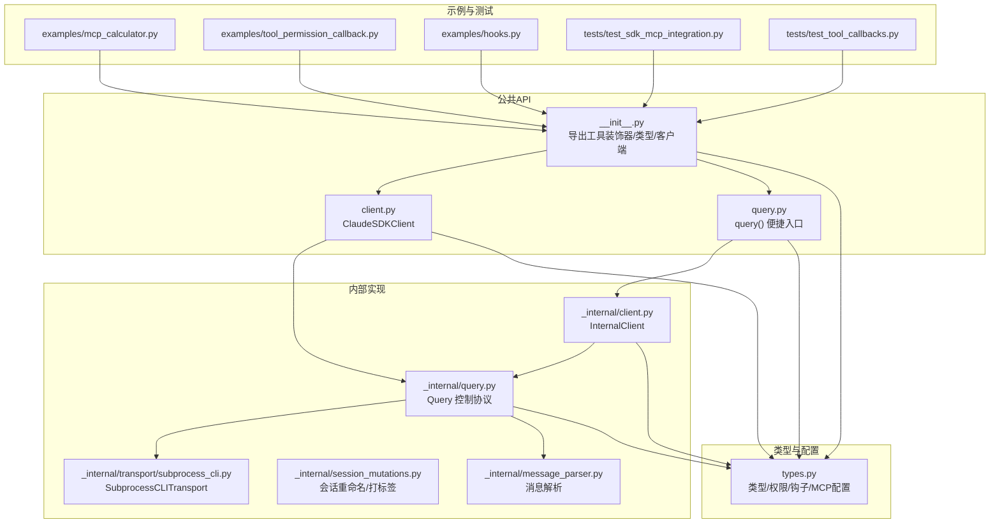
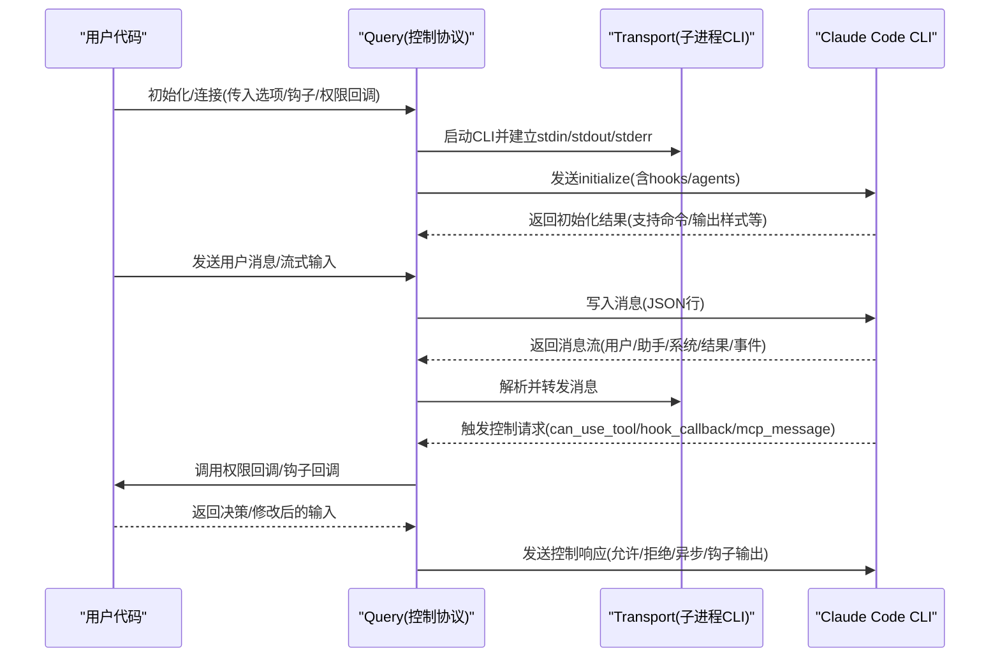
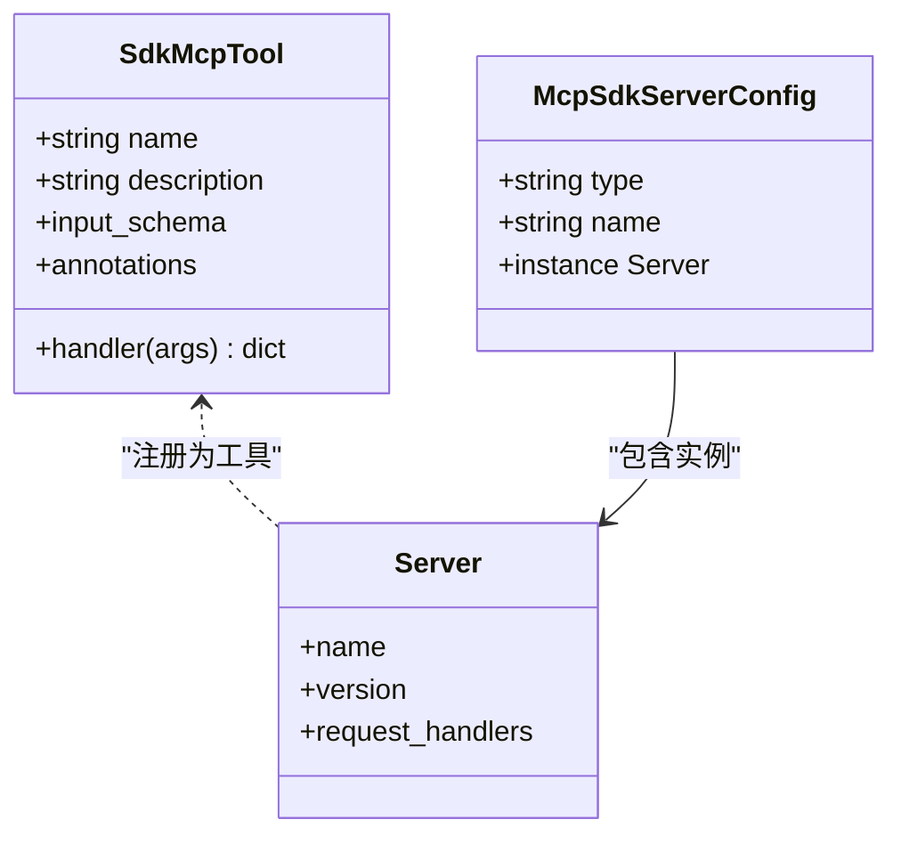
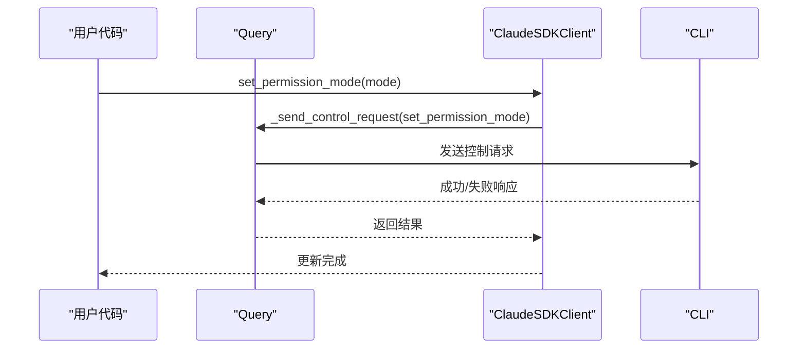
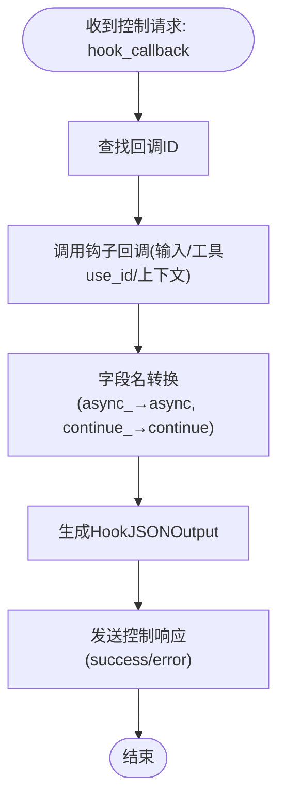
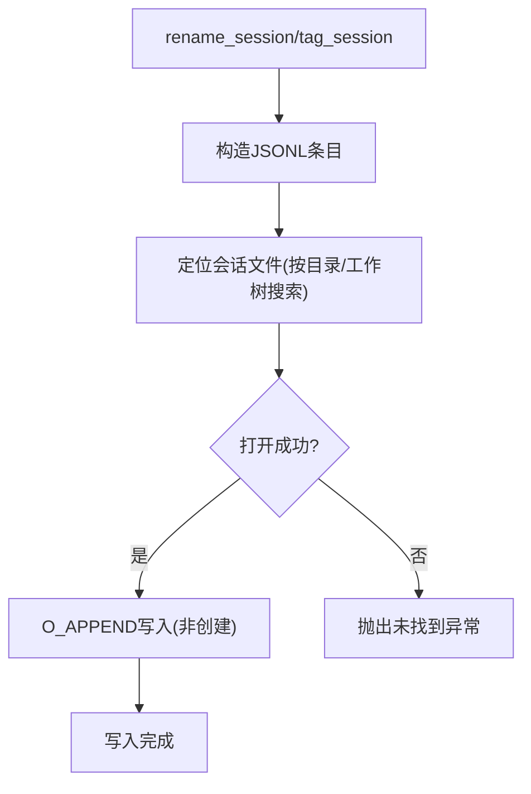
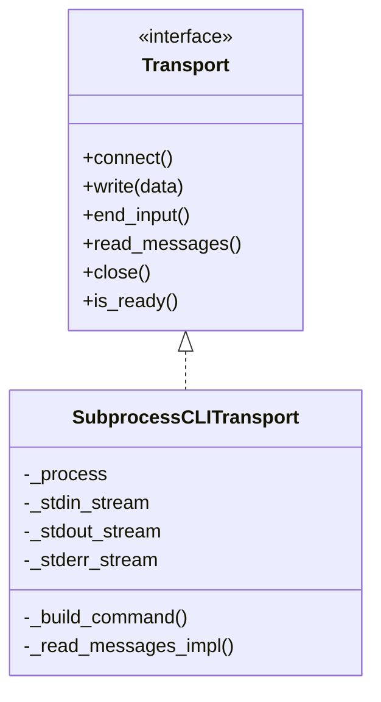
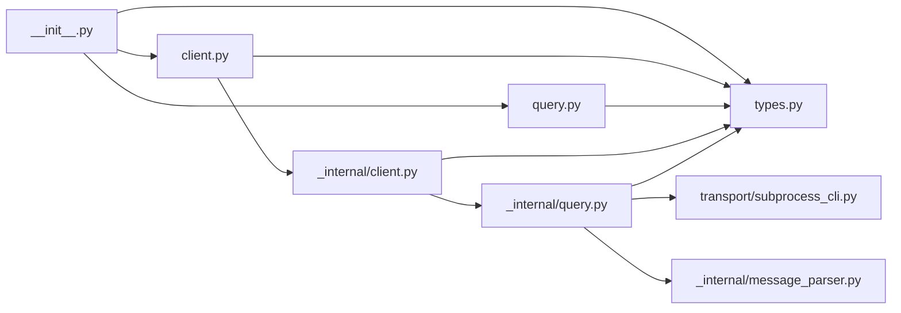

# 高级功能

<cite>
**本文引用的文件**
- [src/claude_agent_sdk/__init__.py](file://src/claude_agent_sdk/__init__.py)
- [src/claude_agent_sdk/client.py](file://src/claude_agent_sdk/client.py)
- [src/claude_agent_sdk/query.py](file://src/claude_agent_sdk/query.py)
- [src/claude_agent_sdk/types.py](file://src/claude_agent_sdk/types.py)
- [src/claude_agent_sdk/_internal/client.py](file://src/claude_agent_sdk/_internal/client.py)
- [_internal/query.py](file://src/claude_agent_sdk/_internal/query.py)
- [src/claude_agent_sdk/_internal/transport/subprocess_cli.py](file://src/claude_agent_sdk/_internal/transport/subprocess_cli.py)
- [src/claude_agent_sdk/_internal/message_parser.py](file://src/claude_agent_sdk/_internal/message_parser.py)
- [src/claude_agent_sdk/_internal/session_mutations.py](file://src/claude_agent_sdk/_internal/session_mutations.py)
- [examples/mcp_calculator.py](file://examples/mcp_calculator.py)
- [examples/tool_permission_callback.py](file://examples/tool_permission_callback.py)
- [examples/hooks.py](file://examples/hooks.py)
- [tests/test_sdk_mcp_integration.py](file://tests/test_sdk_mcp_integration.py)
- [tests/test_tool_callbacks.py](file://tests/test_tool_callbacks.py)
</cite>

## 目录
1. [简介](#简介)
2. [项目结构](#项目结构)
3. [核心组件](#核心组件)
4. [架构总览](#架构总览)
5. [详细组件分析](#详细组件分析)
6. [依赖分析](#依赖分析)
7. [性能考虑](#性能考虑)
8. [故障排查指南](#故障排查指南)
9. [结论](#结论)
10. [附录](#附录)

## 简介
本文件面向有经验的开发者，系统性阐述 Claude Agent SDK 的高级功能与实现细节，重点覆盖：
- MCP 服务器的高级用法：SDK MCP 服务器的创建、工具装饰器的使用、自定义工具开发流程
- 权限系统的高级配置：工具权限回调函数、权限决策逻辑、动态权限控制
- 钩子系统的高级应用：复杂钩子匹配器、多钩子组合、钩子链与控制协议交互
- 会话操作与子代理：会话重命名/打标签、子代理生命周期事件
- 传输层的自定义实现与底层通信机制
- 高级配置选项与性能优化技巧
- 复杂场景实战案例与最佳实践

## 项目结构
SDK 采用分层设计：公共 API 暴露在顶层模块，内部通过 Query 控制协议桥接 CLI，通过 Transport 抽象与 CLI 进程通信；消息解析与类型系统位于 types 模块；示例与测试验证高级能力。

图示来源
- [src/claude_agent_sdk/__init__.py:1-445](file://src/claude_agent_sdk/__init__.py#L1-L445)
- [src/claude_agent_sdk/client.py:1-500](file://src/claude_agent_sdk/client.py#L1-L500)
- [src/claude_agent_sdk/query.py:1-127](file://src/claude_agent_sdk/query.py#L1-L127)
- [src/claude_agent_sdk/_internal/client.py:1-146](file://src/claude_agent_sdk/_internal/client.py#L1-L146)
- [_internal/query.py:1-679](file://src/claude_agent_sdk/_internal/query.py#L1-L679)
- [src/claude_agent_sdk/_internal/transport/subprocess_cli.py:1-630](file://src/claude_agent_sdk/_internal/transport/subprocess_cli.py#L1-L630)
- [src/claude_agent_sdk/_internal/message_parser.py:1-251](file://src/claude_agent_sdk/_internal/message_parser.py#L1-L251)
- [src/claude_agent_sdk/_internal/session_mutations.py:1-302](file://src/claude_agent_sdk/_internal/session_mutations.py#L1-L302)
- [src/claude_agent_sdk/types.py:1-1199](file://src/claude_agent_sdk/types.py#L1-L1199)

章节来源
- [src/claude_agent_sdk/__init__.py:1-445](file://src/claude_agent_sdk/__init__.py#L1-L445)
- [src/claude_agent_sdk/_internal/query.py:1-679](file://src/claude_agent_sdk/_internal/query.py#L1-L679)

## 核心组件
- 工具装饰器与 SDK MCP 服务器
  - 使用装饰器定义工具，自动注册到 SDK MCP 服务器，支持输入模式（字典/TypedDict/JSON Schema）、注解传递、错误返回格式
  - 通过工厂方法创建 SDK MCP 服务器，注入工具列表，返回可直接用于 ClaudeAgentOptions 的配置对象
- 权限系统
  - 工具权限回调：在工具调用前拦截，允许/拒绝或修改输入，并可更新权限规则
  - 权限模式切换：运行时调整权限策略（默认/接受编辑/计划/绕过）
- 钩子系统
  - 事件驱动：PreToolUse/PostToolUse/PostToolUseFailure/UserPromptSubmit/Stop/SubagentStop/PreCompact/Notification/SubagentStart/PermissionRequest
  - 匹配器与超时：基于正则/工具名组合的匹配器，支持为一组钩子设置超时
  - 输出结构：同步输出（控制字段/决策字段/钩子特定输出）与异步输出（延后执行）
- 传输层与控制协议
  - SubprocessCLITransport：封装 CLI 子进程，负责命令构建、环境变量、stderr 回调、缓冲区与读写锁
  - Query：双向控制协议处理，路由 can_use_tool、hook_callback、mcp_message 请求，桥接 SDK MCP 与 CLI
- 会话与子代理
  - 会话重命名/打标签：安全地向会话元数据追加条目，避免并发写入冲突
  - 子代理事件：在子代理启动/停止时触发钩子，便于审计与追踪

章节来源
- [src/claude_agent_sdk/__init__.py:100-341](file://src/claude_agent_sdk/__init__.py#L100-L341)
- [src/claude_agent_sdk/types.py:17-121](file://src/claude_agent_sdk/types.py#L17-L121)
- [src/claude_agent_sdk/types.py:160-453](file://src/claude_agent_sdk/types.py#L160-L453)
- [src/claude_agent_sdk/_internal/query.py:53-346](file://src/claude_agent_sdk/_internal/query.py#L53-L346)
- [src/claude_agent_sdk/_internal/transport/subprocess_cli.py:33-630](file://src/claude_agent_sdk/_internal/transport/subprocess_cli.py#L33-L630)
- [src/claude_agent_sdk/_internal/session_mutations.py:42-161](file://src/claude_agent_sdk/_internal/session_mutations.py#L42-L161)

## 架构总览
SDK 在用户代码与 Claude Code CLI 之间建立“控制协议 + 传输层”的桥梁。Query 负责控制请求/响应、钩子回调、SDK MCP 桥接；Transport 负责与 CLI 子进程的双向流式通信；消息解析器将 CLI 输出转换为强类型消息对象。

图示来源
- [_internal/query.py:119-163](file://src/claude_agent_sdk/_internal/query.py#L119-L163)
- [_internal/query.py:172-235](file://src/claude_agent_sdk/_internal/query.py#L172-L235)
- [_internal/query.py:236-346](file://src/claude_agent_sdk/_internal/query.py#L236-L346)
- [src/claude_agent_sdk/_internal/transport/subprocess_cli.py:335-411](file://src/claude_agent_sdk/_internal/transport/subprocess_cli.py#L335-L411)

## 详细组件分析

### MCP 服务器与工具装饰器
- 工具装饰器
  - 支持多种输入模式：简单字典映射、TypedDict、JSON Schema
  - 注解透传：将工具注解（只读/破坏性/开放世界）随工具列表返回
  - 错误处理：通过返回字段指示错误，SDK 将其映射为 MCP 错误响应
- SDK MCP 服务器
  - 自动注册 list_tools/call_tool 处理器
  - 将工具 handler 的返回值转换为 MCP 内容列表（文本/图像）
  - 通过 McpSdkServerConfig 暴露实例与名称，供 Query 桥接

图示来源
- [src/claude_agent_sdk/__init__.py:100-176](file://src/claude_agent_sdk/__init__.py#L100-L176)
- [src/claude_agent_sdk/__init__.py:178-341](file://src/claude_agent_sdk/__init__.py#L178-L341)

章节来源
- [src/claude_agent_sdk/__init__.py:100-341](file://src/claude_agent_sdk/__init__.py#L100-L341)
- [tests/test_sdk_mcp_integration.py:21-98](file://tests/test_sdk_mcp_integration.py#L21-L98)
- [tests/test_sdk_mcp_integration.py:200-267](file://tests/test_sdk_mcp_integration.py#L200-L267)
- [tests/test_sdk_mcp_integration.py:269-382](file://tests/test_sdk_mcp_integration.py#L269-L382)
- [examples/mcp_calculator.py:1-194](file://examples/mcp_calculator.py#L1-L194)

### 权限系统与动态控制
- 工具权限回调
  - 输入：工具名、原始输入、上下文（建议/信号）
  - 输出：允许（可选更新输入/权限规则）或拒绝（可选中断）
  - 与 can_use_tool 回调配合，强制在流式模式下使用
- 运行时权限模式切换
  - 支持在会话中动态切换权限模式（默认/接受编辑/计划/绕过）
  - 可通过客户端接口发送控制请求

图示来源
- [src/claude_agent_sdk/client.py:234-256](file://src/claude_agent_sdk/client.py#L234-L256)
- [_internal/query.py:540-547](file://src/claude_agent_sdk/_internal/query.py#L540-L547)

章节来源
- [src/claude_agent_sdk/types.py:124-157](file://src/claude_agent_sdk/types.py#L124-L157)
- [src/claude_agent_sdk/types.py:60-121](file://src/claude_agent_sdk/types.py#L60-L121)
- [src/claude_agent_sdk/client.py:113-131](file://src/claude_agent_sdk/client.py#L113-L131)
- [_internal/query.py:245-286](file://src/claude_agent_sdk/_internal/query.py#L245-L286)

### 钩子系统与复杂匹配器
- 钩子事件与输出
  - 事件覆盖：PreToolUse/PostToolUse/PostToolUseFailure/UserPromptSubmit/Stop/SubagentStop/PreCompact/Notification/SubagentStart/PermissionRequest
  - 输出结构：同步输出（continue_/suppressOutput/stopReason/decision/systemMessage/reason/hookSpecificOutput）与异步输出（async_）
- 匹配器与超时
  - matcher 支持工具名正则/组合（如 "Bash|Write"）
  - timeout 控制该组钩子的执行时限
- 钩子链与控制协议
  - Query 在 initialize 时注册钩子；在控制请求到来时调用对应回调，转换字段名（async_/continue_ → async/continue），并返回统一格式

图示来源
- [_internal/query.py:288-346](file://src/claude_agent_sdk/_internal/query.py#L288-L346)
- [src/claude_agent_sdk/types.py:393-452](file://src/claude_agent_sdk/types.py#L393-L452)

章节来源
- [src/claude_agent_sdk/types.py:160-453](file://src/claude_agent_sdk/types.py#L160-L453)
- [examples/hooks.py:1-351](file://examples/hooks.py#L1-L351)
- [tests/test_tool_callbacks.py:212-460](file://tests/test_tool_callbacks.py#L212-L460)

### 会话操作与子代理
- 会话重命名/打标签
  - 安全追加元数据条目至会话 JSONL 文件尾部，避免并发写入冲突
  - 标题/标签进行 Unicode 清洗，保证过滤兼容性
- 子代理事件
  - SubagentStart/SubagentStop 钩子可用于审计与追踪子代理生命周期

图示来源
- [src/claude_agent_sdk/_internal/session_mutations.py:168-256](file://src/claude_agent_sdk/_internal/session_mutations.py#L168-L256)

章节来源
- [src/claude_agent_sdk/_internal/session_mutations.py:42-161](file://src/claude_agent_sdk/_internal/session_mutations.py#L42-L161)

### 传输层与底层通信
- SubprocessCLITransport
  - 命令构建：系统提示、工具集、权限模式、模型、思考令牌预算、插件、MCP 配置等
  - 流式读写：stdin/stdout/stderr，带缓冲区大小限制与 JSON 行解析
  - 版本检查与错误处理：CLI 可执行文件定位、版本警告、进程退出码处理
- Query 与 Transport 协作
  - Query 统一封装控制协议与消息流；Transport 提供平台无关的子进程 I/O

图示来源
- [src/claude_agent_sdk/_internal/transport/subprocess_cli.py:33-630](file://src/claude_agent_sdk/_internal/transport/subprocess_cli.py#L33-L630)

章节来源
- [src/claude_agent_sdk/_internal/transport/subprocess_cli.py:166-333](file://src/claude_agent_sdk/_internal/transport/subprocess_cli.py#L166-L333)
- [src/claude_agent_sdk/_internal/transport/subprocess_cli.py:515-586](file://src/claude_agent_sdk/_internal/transport/subprocess_cli.py#L515-L586)

## 依赖分析
- 模块耦合
  - Query 依赖 Transport、types、mcp.types；与 CLI 的控制协议强耦合
  - Client/InternalClient 依赖 Query 与 Transport，暴露高层 API
  - 示例与测试对公共 API 的使用验证了高级功能的可用性
- 外部依赖
  - mcp.server/mcp.types：SDK MCP 服务器与 JSON-RPC 工具调用
  - anyio：异步任务组、内存流、进程管理
  - json：消息编解码与 MCP JSON-RPC 映射

图示来源
- [src/claude_agent_sdk/__init__.py:1-445](file://src/claude_agent_sdk/__init__.py#L1-L445)
- [src/claude_agent_sdk/client.py:1-500](file://src/claude_agent_sdk/client.py#L1-L500)
- [src/claude_agent_sdk/query.py:1-127](file://src/claude_agent_sdk/query.py#L1-L127)
- [src/claude_agent_sdk/_internal/client.py:1-146](file://src/claude_agent_sdk/_internal/client.py#L1-L146)
- [_internal/query.py:1-679](file://src/claude_agent_sdk/_internal/query.py#L1-L679)
- [src/claude_agent_sdk/_internal/transport/subprocess_cli.py:1-630](file://src/claude_agent_sdk/_internal/transport/subprocess_cli.py#L1-L630)
- [src/claude_agent_sdk/_internal/message_parser.py:1-251](file://src/claude_agent_sdk/_internal/message_parser.py#L1-L251)

章节来源
- [src/claude_agent_sdk/__init__.py:1-445](file://src/claude_agent_sdk/__init__.py#L1-L445)
- [_internal/query.py:1-679](file://src/claude_agent_sdk/_internal/query.py#L1-L679)

## 性能考虑
- SDK MCP 服务器优势
  - 进程内执行，避免 IPC 开销，提升工具调用延迟与吞吐
  - 直接访问应用状态，减少序列化/反序列化成本
- 流式模式与输入关闭策略
  - Query 在存在 SDK MCP 或钩子时等待首条结果后再关闭 stdin，保障双向控制协议交互
  - 可通过环境变量控制流关闭超时，平衡资源占用与响应速度
- 传输层优化
  - 缓冲区大小限制防止内存膨胀
  - 写入锁避免竞态与半包问题
  - stderr 异步读取，避免阻塞主消息流
- 权限与钩子的开销
  - 权限回调与钩子回调在控制协议路径上执行，应尽量保持轻量
  - 合理设置超时，避免阻塞后续消息处理

章节来源
- [src/claude_agent_sdk/__init__.py:178-250](file://src/claude_agent_sdk/__init__.py#L178-L250)
- [_internal/query.py:614-631](file://src/claude_agent_sdk/_internal/query.py#L614-L631)
- [src/claude_agent_sdk/_internal/transport/subprocess_cli.py:58-63](file://src/claude_agent_sdk/_internal/transport/subprocess_cli.py#L58-L63)
- [src/claude_agent_sdk/_internal/transport/subprocess_cli.py:481-514](file://src/claude_agent_sdk/_internal/transport/subprocess_cli.py#L481-L514)

## 故障排查指南
- CLI 找不到或版本过低
  - 现象：启动失败/报错
  - 排查：确认 CLI 路径、版本最低要求；查看版本检查日志
- 进程已退出或 stdin 不可用
  - 现象：写入时报错/进程返回码非零
  - 排查：检查进程是否被外部终止；确认连接状态与写入锁
- JSON 消息过大或截断
  - 现象：解析失败/缓冲区超限
  - 排查：增大缓冲区上限或拆分消息
- 权限回调异常
  - 现象：控制请求超时/错误响应
  - 排查：捕获回调异常并返回错误响应；确保回调在流式模式下使用
- 钩子字段名不匹配
  - 现象：CLI 未识别 async_/continue_
  - 排查：SDK 会自动转换为 async/continue，确认输出结构正确

章节来源
- [src/claude_agent_sdk/_internal/transport/subprocess_cli.py:386-411](file://src/claude_agent_sdk/_internal/transport/subprocess_cli.py#L386-L411)
- [src/claude_agent_sdk/_internal/transport/subprocess_cli.py:546-565](file://src/claude_agent_sdk/_internal/transport/subprocess_cli.py#L546-L565)
- [_internal/query.py:34-51](file://src/claude_agent_sdk/_internal/query.py#L34-L51)
- [tests/test_tool_callbacks.py:176-210](file://tests/test_tool_callbacks.py#L176-L210)

## 结论
本文件从架构与实现层面系统梳理了 Claude Agent SDK 的高级能力：SDK MCP 服务器以装饰器与工厂模式简化工具开发；权限系统通过回调与模式切换实现细粒度控制；钩子系统以事件驱动与匹配器实现复杂业务编排；会话与子代理增强可观测性与可审计性；传输层与控制协议保障跨进程稳定通信。结合示例与测试，开发者可在此基础上构建高性能、可扩展、可审计的智能体系统。

## 附录

### 实战案例与最佳实践
- 计算器 MCP 服务器
  - 使用装饰器定义多工具，创建 SDK 服务器并预授权工具名，演示流式客户端交互
  - 参考：[examples/mcp_calculator.py:1-194](file://examples/mcp_calculator.py#L1-L194)
- 工具权限回调
  - 基于工具类型与输入内容进行允许/拒绝/输入改写，记录使用日志
  - 参考：[examples/tool_permission_callback.py:1-159](file://examples/tool_permission_callback.py#L1-L159)
- 钩子系统综合示例
  - PreToolUse/PostToolUse/DecisionFields/ContinueControl 等场景演示
  - 参考：[examples/hooks.py:1-351](file://examples/hooks.py#L1-L351)
- 集成测试验证
  - SDK MCP 服务器处理器注册、错误处理、混合服务器、图像内容、工具注解传播
  - 参考：[tests/test_sdk_mcp_integration.py:1-382](file://tests/test_sdk_mcp_integration.py#L1-L382)
  - 钩子/权限回调字段转换与异常处理
  - 参考：[tests/test_tool_callbacks.py:1-773](file://tests/test_tool_callbacks.py#L1-L773)